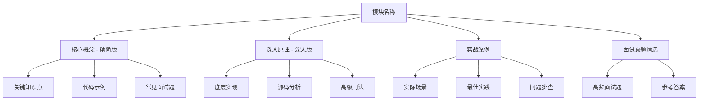

# Go 全栈技术知识库

> 面试准备 · 学习复习 · 工作参考 · 团队分享

本知识库采用模块化组织，每个模块分为**核心概念（精简版）**和**深入原理（深入版）**两层，适合不同深度的学习需求。

## 📚 模块索引

### Go 语言核心

| 模块 | 描述 | 状态 |
|:-----|:-----|:-----:|
| [Go 基础](./go-basics.md) | 基础类型、编码规范、RBAC 权限设计 | ✅ |
| [Go 并发底层](./go-concurrency.md) | GMP 模型、Channel 原理、调度器 | 🚧 |
| [Go GC](./go-gc.md) | 垃圾回收机制、三色标记、写屏障 | 🚧 |

### 数据库

| 模块 | 描述 | 状态 |
|:-----|:-----|:-----:|
| [MySQL 深度](./mysql.md) | InnoDB、锁、事务、索引、主从复制、分库分表 | 🚧 |
| [Redis 高级](./redis.md) | 底层数据结构、集群模式、缓存架构、性能优化 | 🚧 |
| [MongoDB](./mongo.md) | NoSQL 基础、文档模型、聚合管道 | ✅ |

### 前端技术

| 模块 | 描述 | 状态 |
|:-----|:-----|:-----:|
| [JavaScript Promise](./js-promise.md) | async/await、事件循环、Promise 原理 | ✅ |

### 系统设计

| 模块 | 描述 | 状态 |
|:-----|:-----|:-----:|
| [系统设计](./system-design.md) | 短链接、秒杀、推送、IM、支付系统设计 | ✅ |

### 消息队列

| 模块 | 描述 | 状态 |
|:-----|:-----|:-----:|
| [Kafka](./kafka.md) | 分布式消息队列、分区副本、消费组 | 🚧 |

### 架构与部署

| 模块 | 描述 | 状态 |
|:-----|:-----|:-----:|
| [微服务架构](./microservices.md) | 服务通信、节点发现、服务网关、负载均衡 | 🚧 |
| [Docker & CI/CD](./docker-cicd.md) | 容器化部署、持续集成/部署 | 🚧 |

### 网络与工具

| 模块 | 描述 | 状态 |
|:-----|:-----|:-----:|
| [网络协议](./network.md) | HTTP/HTTPS 发展、TCP/IP、WebSocket | 🚧 |
| [ELK 技术栈](./elk.md) | Elasticsearch、Logstash、Kibana | 🚧 |

---

## 🗂️ 每个模块的内容结构

## 📖 使用指南

- **快速复习/面试准备** → 专注阅读「核心概念」和「面试真题精选」
- **深入学习/原理掌握** → 完整阅读所有章节
- **工作参考/问题排查** → 查看「实战案例」章节

## 🔗 参考来源

本知识库内容整理自以下权威来源：
- Go 官方文档
- MySQL 官方文档
- Redis 官方文档
- 各技术领域权威博客与书籍
- 互联网常见面试题库

---

> 最后更新：2026-02-13
