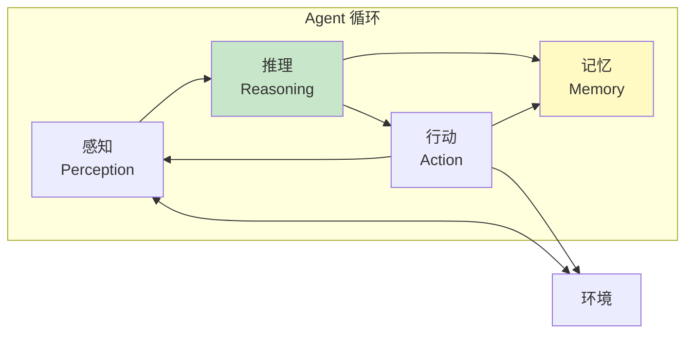
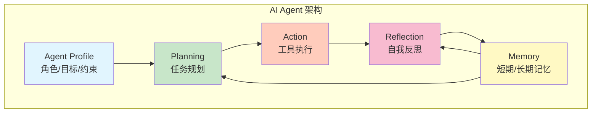
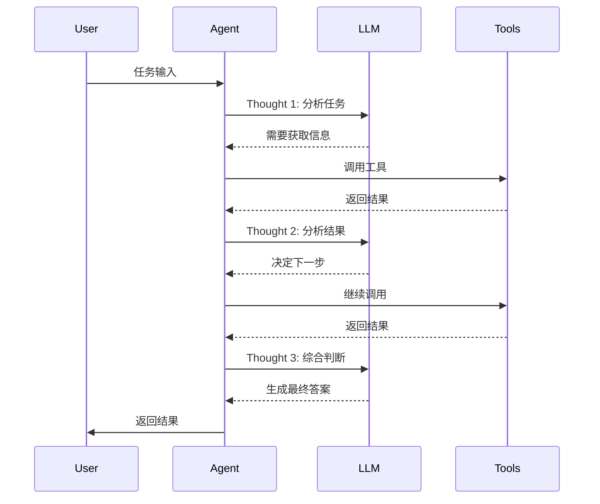
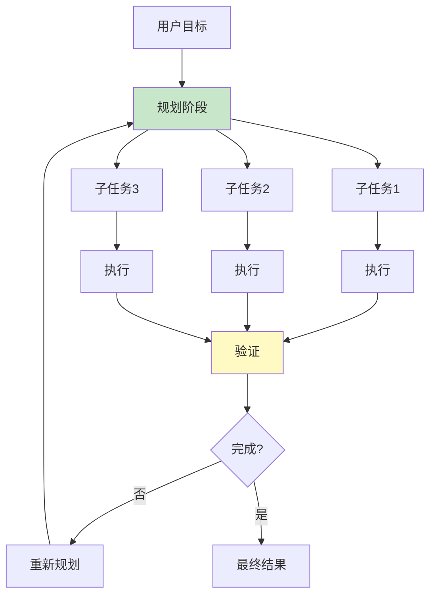
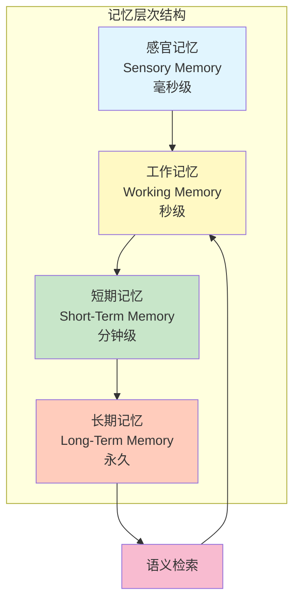
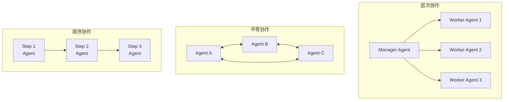
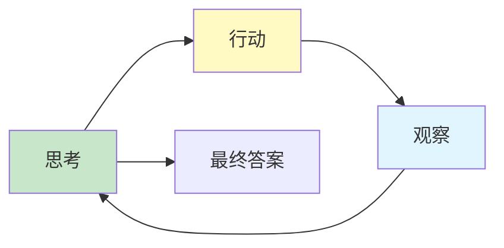

# AI Agent 体系架构

> 自主代理 · 工具调用 · 多Agent协作 · 规划与执行

---

## 核心概念（精简版）

### 什么是 AI Agent？

**AI Agent** 是能够自主感知环境、做出决策并执行行动的智能系统：



### Agent vs 传统 LLM

| 特性 | 传统 LLM | AI Agent |
|:-----|:---------|:---------|
| **交互方式** | 单轮/多轮对话 | 自主循环 |
| **能力** | 生成文本 | 调用工具、规划任务 |
| **状态** | 无状态 | 持久记忆 |
| **自主性** | 被动响应 | 主动执行 |
| **环境** | 封闭 | 可操作外部系统 |

### Agent 核心组件



### Agent 类型分类

| 类型 | 特点 | 示例 |
|:-----|:-----|:-----|
| **Reactive** | 无状态，响应式 | 简单问答机器人 |
| **Deliberative** | 有状态，可规划 | 任务规划 Agent |
| **Hybrid** | 结合反应和规划 | 大多数现代 Agent |
| **Multi-Agent** | 多个 Agent 协作 | 团队协作系统 |
| **Hierarchical** | 层级结构 | 管理-执行 Agent |

### 常见 Agent 框架

| 框架 | 语言 | 特点 |
|:-----|:-----|:-----|
| **LangChain** | Python/JS | 功能全面，生态丰富 |
| **AutoGen** | Python | 多 Agent 协作 |
| **CrewAI** | Python | 角色扮演团队 |
| **AgentScope** | Python/JS | 分布式多 Agent |
| **Semantic Kernel** | Python/C#/Java | 企业级集成 |

---

## 深入原理（深入版）

### Agent 核心循环

#### ReAct 模式（Reasoning + Acting）



**ReAct Prompt 模板**：
```
Answer the following question as best you can. You have access to the following tools:

{tools}

Use the following format:

Question: the input question you must answer
Thought: you should always think about what to do
Action: the action to take, should be one of [{tool_names}]
Action Input: the input to the action
Observation: the result of the action
... (this Thought/Action/Action Input/Observation can repeat N times)
Thought: I now know the final answer
Final Answer: the final answer to the original input question

Begin!

Question: {input}
Thought: {agent_scratchpad}
```

#### 自主循环实现

```go
package agent

import (
    "context"
    "fmt"
)

type Agent struct {
    llm      LLM
    tools    map[string]Tool
    memory   Memory
    maxSteps int
}

type Tool interface {
    Name() string
    Description() string
    Execute(ctx context.Context, args map[string]interface{}) (string, error)
}

// Run 执行 Agent 循环
func (a *Agent) Run(ctx context.Context, query string) (string, error) {
    observation := ""

    for step := 0; step < a.maxSteps; step++ {
        // 1. 构建 Prompt
        prompt := a.buildPrompt(query, observation)

        // 2. LLM 推理
        response, err := a.llm.Complete(ctx, prompt)
        if err != nil {
            return "", err
        }

        // 3. 解析响应
        thought, action, actionInput, finalAnswer, err := parseResponse(response)
        if err != nil {
            return "", err
        }

        // 4. 检查是否完成
        if finalAnswer != "" {
            // 更新记忆
            a.memory.Add(query, finalAnswer)
            return finalAnswer, nil
        }

        // 5. 执行 Action
        tool, ok := a.tools[action]
        if !ok {
            observation = fmt.Sprintf("Error: Tool '%s' not found", action)
            continue
        }

        result, err := tool.Execute(ctx, actionInput)
        if err != nil {
            observation = fmt.Sprintf("Error: %v", err)
        } else {
            observation = result
        }

        // 6. 更新上下文
        a.memory.AddStep(thought, action, actionInput, observation)
    }

    return "", fmt.Errorf("max steps exceeded")
}

func (a *Agent) buildPrompt(query string, observation string) string {
    tools := a.listTools()

    prompt := fmt.Sprintf(`Answer the following question as best you can. You have access to the following tools:

%s

Use the following format:

Question: the input question you must answer
Thought: you should always think about what to do
Action: the action to take
Action Input: the input to the action
Observation: the result of the action
... (repeat N times)
Thought: I now know the final answer
Final Answer: the final answer

Begin!

Question: %s
%s`, tools, query, observation)

    return prompt
}
```

### 规划与推理

#### 任务分解



**规划算法实现**：

```go
type Planner interface {
    Plan(ctx context.Context, goal string) (*Plan, error)
    Refine(ctx context.Context, plan *Plan, feedback string) (*Plan, error)
}

type Plan struct {
    Steps    []PlanStep
    Dependencies map[string][]string // step -> dependencies
}

type PlanStep struct {
    ID          string
    Description string
    Tool        string
    Arguments   map[string]interface{}
    Status      string // pending, in_progress, completed, failed
}

// 层级任务网络（HTN）规划器
type HTNPlanner struct {
    llm     LLM
    methods map[string][]Method // task -> methods
}

type Method struct {
    Name     string
    Precond  func(ctx context.Context, state State) bool
    Subtasks []string
    Operator func(ctx context.Context, state State) (State, error)
}

func (p *HTNPlanner) Plan(ctx context.Context, goal string) (*Plan, error) {
    // 1. 分解目标为任务
    tasks, err := p.decomposeGoal(ctx, goal)
    if err != nil {
        return nil, err
    }

    // 2. 选择方法实现每个任务
    plan := &Plan{Steps: make([]PlanStep, 0)}
    for _, task := range tasks {
        method, err := p.selectMethod(ctx, task)
        if err != nil {
            return nil, err
        }

        // 3. 递归分解子任务
        for _, subtask := range method.Subtasks {
            step := PlanStep{
                ID:          generateID(),
                Description: subtask,
                Status:      "pending",
            }
            plan.Steps = append(plan.Steps, step)
        }
    }

    return plan, nil
}

// 思维链（CoT）规划器
type ChainOfThoughtPlanner struct {
    llm LLM
}

func (p *ChainOfThoughtPlanner) Plan(ctx context.Context, goal string) (*Plan, error) {
    prompt := fmt.Sprintf(`分解以下目标为具体的执行步骤：

目标：%s

请按照以下格式输出：
1. [步骤1描述]
2. [步骤2描述]
...

考虑：
- 每个步骤的前置条件
- 步骤之间的依赖关系
- 可能的失败点和备选方案
`, goal)

    response, err := p.llm.Complete(ctx, prompt)
    if err != nil {
        return nil, err
    }

    return p.parsePlan(response)
}

// 思维树（ToT）规划器
type TreeOfThoughtPlanner struct {
    llm          LLM
    maxDepth     int
    branchingFactor int
}

type ThoughtNode struct {
    Content string
    Value   float32  // 评估分数
    Children []*ThoughtNode
}

func (p *TreeOfThoughtPlanner) Plan(ctx context.Context, goal string) (*Plan, error) {
    root := &ThoughtNode{Content: goal}

    // BFS/DFS 探索思路空间
    queue := []*ThoughtNode{root}
    for len(queue) > 0 {
        current := queue[0]
        queue = queue[1:]

        // 生成多个可能的下一步
        thoughts := p.generateThoughts(ctx, current.Content, p.branchingFactor)

        for _, thought := range thoughts {
            // 评估思路质量
            value := p.evaluateThought(ctx, thought)
            node := &ThoughtNode{
                Content: thought,
                Value:   value,
            }

            current.Children = append(current.Children, node)
            queue = append(queue, node)
        }
    }

    // 选择最优路径
    bestPath := p.selectBestPath(root)

    return p.buildPlanFromPath(bestPath)
}

// 自我反思与优化
type ReActLoop struct {
    llm      LLM
    tools    map[string]Tool
    maxIterations int
}

func (r *ReActLoop) Run(ctx context.Context, goal string) (string, error) {
    currentState := ""

    for i := 0; i < r.maxIterations; i++ {
        // 1. 思考
        thought, err := r.think(ctx, goal, currentState)
        if err != nil {
            return "", err
        }

        // 2. 行动
        action, actionInput, err := r.decideAction(ctx, thought)
        if err != nil {
            return "", err
        }

        // 3. 观察
        observation, err := r.observe(ctx, action, actionInput)
        if err != nil {
            // 反思并调整
            adjustedThought, err := r.reflect(ctx, thought, err)
            if err != nil {
                return "", err
            }
            thought = adjustedThought
            continue
        }

        currentState = observation

        // 4. 判断是否完成
        if r.isComplete(ctx, goal, currentState) {
            return currentState, nil
        }

        // 5. 反思下一步
        nextThought, err := r.reflectNext(ctx, thought, observation)
        if err != nil {
            return "", err
        }
    }

    return currentState, nil
}
```

### 记忆系统

#### 记忆架构



#### 记忆实现

```go
package memory

import (
    "context"
    "time"
)

// 记忆条目
type MemoryEntry struct {
    ID        string
    Content   string
    Embedding []float32
    Metadata  map[string]interface{}
    Timestamp time.Time
    Importance float32  // 0-1
    AccessCount int
}

// 记忆接口
type Memory interface {
    // 工作记忆
    AddWorking(content string, metadata map[string]interface{}) error
    GetWorking(key string) (string, bool)

    // 短期记忆
    AddShortTerm(entry *MemoryEntry) error
    GetShortTerm(limit int) ([]*MemoryEntry, error)

    // 长期记忆
    AddLongTerm(entry *MemoryEntry) error
    SearchLongTerm(query []float32, topK int) ([]*MemoryEntry, error)

    // 重要性评估
    EvaluateImportance(content string) (float32, error)

    // 记忆 Consolidation
    Consolidate() error
}

// 分层记忆实现
type TieredMemory struct {
    working    *WorkingMemory
    shortTerm  *ShortTermMemory
    longTerm   *LongTermMemory
    embedding  *EmbeddingClient
}

type WorkingMemory struct {
    data     map[string]string
    capacity int
}

type ShortTermMemory struct {
    entries  []*MemoryEntry
    capacity int
    ttl      time.Duration
}

type LongTermMemory struct {
    vectorDB *VectorDatabase
    kvStore  *KVStore
}

// 工作记忆：当前会话上下文
func (wm *WorkingMemory) Add(key, content string) error {
    if len(wm.data) >= wm.capacity {
        // 驱逐最旧的条目
        wm.evict()
    }
    wm.data[key] = content
    return nil
}

// 短期记忆：近期交互历史
func (stm *ShortTermMemory) Add(entry *MemoryEntry) error {
    entry.Timestamp = time.Now()

    // 评估重要性
    importance, _ := stm.evaluateImportance(entry.Content)
    entry.Importance = importance

    stm.entries = append(stm.entries, entry)

    // 过期清理
    stm.cleanup()

    return nil
}

func (stm *ShortTermMemory) cleanup() {
    now := time.Now()
    filtered := make([]*MemoryEntry, 0)

    for _, entry := range stm.entries {
        if now.Sub(entry.Timestamp) < stm.ttl {
            filtered = append(filtered, entry)
        }
    }

    stm.entries = filtered
}

// 长期记忆：持久化存储
func (ltm *LongTermMemory) Add(entry *MemoryEntry) error {
    // 存储向量
    ltm.vectorDB.Insert(entry.ID, entry.Embedding, entry.Metadata)

    // 存储原始内容
    return ltm.kvStore.Set(entry.ID, entry.Content)
}

func (ltm *LongTermMemory) Search(query []float32, topK int) ([]*MemoryEntry, error) {
    // 向量检索
    results := ltm.vectorDB.Search(query, topK)

    // 获取完整内容
    entries := make([]*MemoryEntry, len(results))
    for i, result := range results {
        content, _ := ltm.kvStore.Get(result.ID)
        entries[i] = &MemoryEntry{
            ID:      result.ID,
            Content: content,
            Metadata: result.Metadata,
        }
    }

    return entries, nil
}

// 记忆 Consolidation：短期 → 长期
func (tm *TieredMemory) Consolidate(ctx context.Context) error {
    // 获取短期记忆中的重要条目
    entries, _ := tm.shortTerm.Get(ctx, 100)

    for _, entry := range entries {
        // 只保留重要的记忆
        if entry.Importance > 0.7 {
            // 生成嵌入
            embedding, _ := tm.embedding.Embed(ctx, entry.Content)
            entry.Embedding = embedding

            // 存入长期记忆
            tm.longTerm.Add(entry)
        }
    }

    // 清空短期记忆
    tm.shortTerm.Clear()

    return nil
}

// 语义记忆检索
func (tm *TieredMemory) Retrieve(ctx context.Context, query string, topK int) ([]*MemoryEntry, error) {
    // 1. 生成查询向量
    queryEmbedding, err := tm.embedding.Embed(ctx, query)
    if err != nil {
        return nil, err
    }

    // 2. 向量检索
    results, err := tm.longTerm.Search(queryEmbedding, topK)
    if err != nil {
        return nil, err
    }

    // 3. 重排序（可选）
    results = tm.rerank(ctx, query, results)

    return results, nil
}

// 情景记忆（Episodic Memory）
type EpisodicMemory struct {
    episodes []*Episode
}

type Episode struct {
    ID          string
    StartTime   time.Time
    EndTime     time.Time
    Context     string
    Actions     []Action
    Outcome     string
    Reward      float32
    Embedding   []float32
}

// 语义记忆（Semantic Memory）
type SemanticMemory struct {
    knowledge []*Knowledge
}

type Knowledge struct {
    ID        string
    Fact      string
    Relations []Relation
    Embedding []float32
}

type Relation struct {
    Type     string
    Target   string
    Weight   float32
}
```

### 多 Agent 协作

#### 协作模式



#### AutoGen 风格多 Agent

```go
package multiagent

import (
    "context"
    "fmt"
)

// Agent 接口
type Agent interface {
    Name() string
    Send(ctx context.Context, message *Message) (*Message, error)
    Receive(ctx context.Context, message *Message) error
}

type Message struct {
    From      string
    To        string
    Content   string
    Metadata  map[string]interface{}
    Timestamp time.Time
}

// 对话 Agent
type ConversableAgent struct {
    name        string
    systemMessage string
    llm         LLM
    tools       map[string]Tool
    history     []*Message
    humanInput  bool
}

func (a *ConversableAgent) Send(ctx context.Context, message *Message) (*Message, error) {
    // 添加到历史
    a.history = append(a.history, message)

    // 构建对话上下文
    messages := a.buildMessages()

    // LLM 生成响应
    response, err := a.llm.Chat(ctx, messages)
    if err != nil {
        return nil, err
    }

    reply := &Message{
        From:      a.name,
        To:        message.From,
        Content:   response,
        Timestamp: time.Now(),
    }

    a.history = append(a.history, reply)

    return reply, nil
}

// 用户代理 Agent
type UserProxyAgent struct {
    name    string
    codeExecution bool
}

func (a *UserProxyAgent) Send(ctx context.Context, message *Message) (*Message, error) {
    // 等待用户输入
    fmt.Printf("[%s]: %s\n", message.From, message.Content)

    var userInput string
    fmt.Scanln(&userInput)

    reply := &Message{
        From:      a.name,
        To:        message.From,
        Content:   userInput,
        Timestamp: time.Now(),
    }

    return reply, nil
}

// Agent 管理器
type AgentManager struct {
    agents map[string]Agent
}

func (am *AgentManager) Register(agent Agent) {
    am.agents[agent.Name()] = agent
}

// 群聊
func (am *AgentManager) GroupChat(ctx context.Context, initiator string, message string, maxRounds int) (string, error) {
    // 广播消息
    currentMessage := &Message{
        From:      initiator,
        Content:   message,
        Timestamp: time.Now(),
    }

    for round := 0; round < maxRounds; round++ {
        // 选择下一个发言者
        nextSpeaker := am.selectNextSpeaker(currentMessage)

        // 发送消息
        reply, err := am.agents[nextSpeaker].Send(ctx, currentMessage)
        if err != nil {
            return "", err
        }

        // 检查是否终止
        if am.shouldTerminate(reply) {
            return reply.Content, nil
        }

        currentMessage = reply
    }

    return currentMessage.Content, nil
}

// 两 Agent 对话
func (am *AgentManager) TwoAgentChat(ctx context.Context, agent1, agent2 string, initialMessage string) (string, error) {
    a1 := am.agents[agent1]
    a2 := am.agents[agent2]

    current := &Message{
        From:      agent1,
        To:        agent2,
        Content:   initialMessage,
        Timestamp: time.Now(),
    }

    for i := 0; i < 10; i++ {
        // Agent 2 回复
        reply, err := a2.Send(ctx, current)
        if err != nil {
            return "", err
        }

        // 检查终止
        if am.shouldTerminate(reply) {
            return reply.Content, nil
        }

        // Agent 1 回复
        current = &Message{
            From:      agent2,
            To:        agent1,
            Content:   reply.Content,
            Timestamp: time.Now(),
        }

        reply, err = a1.Send(ctx, current)
        if err != nil {
            return "", err
        }

        if am.shouldTerminate(reply) {
            return reply.Content, nil
        }

        current.Content = reply.Content
    }

    return current.Content, nil
}

// 角色定义 Agent
type RolePlayAgent struct {
    name        string
    role        string
    goals       []string
    constraints []string
    llm         LLM
}

func (a *RolePlayAgent) Send(ctx context.Context, message *Message) (*Message, error) {
    systemPrompt := fmt.Sprintf(`You are a %s.
Your goals are:
%s

Your constraints are:
%s
`, a.role,
        joinWith(a.goals, "\n"),
        joinWith(a.constraints, "\n"))

    response, err := a.llm.ChatWithSystem(ctx, systemPrompt, message.Content)
    if err != nil {
        return nil, err
    }

    return &Message{
        From:      a.name,
        To:        message.From,
        Content:   response,
        Timestamp: time.Now(),
    }, nil
}
```

---

## 实战案例

### 案例 1：代码审查 Agent

```go
package main

type CodeReviewAgent struct {
    llm       LLM
    git       GitClient
    knowledge *KnowledgeBase
}

func (a *CodeReviewAgent) ReviewPR(ctx context.Context, prURL string) (*ReviewReport, error) {
    // 1. 获取 PR 变更
    diff, err := a.git.GetPRDiff(prURL)
    if err != nil {
        return nil, err
    }

    // 2. 代码安全分析
    securityIssues, _ := a.analyzeSecurity(ctx, diff)

    // 3. 性能分析
    performanceIssues, _ := a.analyzePerformance(ctx, diff)

    // 4. 代码风格检查
    styleIssues, _ := a.analyzeStyle(ctx, diff)

    // 5. 最佳实践检查
    practiceIssues, _ := a.analyzeBestPractices(ctx, diff)

    // 6. 生成报告
    report := &ReviewReport{
        URL:             prURL,
        SecurityIssues:  securityIssues,
        PerformanceIssues: performanceIssues,
        StyleIssues:     styleIssues,
        PracticeIssues:  practiceIssues,
    }

    return report, nil
}

func (a *CodeReviewAgent) analyzeSecurity(ctx context.Context, diff string) ([]Issue, error) {
    prompt := fmt.Sprintf(`分析以下代码变更中的安全问题：

%s

关注：
- SQL 注入
- XSS 漏洞
- 认证/授权问题
- 敏感数据泄露
`, diff)

    response, err := a.llm.Complete(ctx, prompt)
    if err != nil {
        return nil, err
    }

    return a.parseSecurityIssues(response)
}
```

### 案例 2：研究助手 Agent

```go
package main

type ResearchAssistantAgent struct {
    llm        LLM
    search     SearchTool
    vectorDB   *VectorDatabase
    browser    *BrowserTool
}

func (a *ResearchAssistantAgent) Research(ctx context.Context, topic string) (*ResearchReport, error) {
    plan := &ResearchPlan{
        Topic: topic,
    }

    // 步骤1：关键词搜索
    searchResults := a.search.Search(topic, 10)

    // 步骤2：筛选相关来源
    relevantSources := a.filterRelevant(ctx, searchResults)

    // 步骤3：深度阅读
    articles := make([]*Article, 0)
    for _, source := range relevantSources {
        article := a.browser.ReadURL(source.URL)
        articles = append(articles, article)
    }

    // 步骤4：提取关键信息
    findings := make([]*Finding, 0)
    for _, article := range articles {
        finding := a.extractFindings(ctx, article)
        findings = append(findings, finding...)
    }

    // 步骤5：综合分析
    summary := a.synthesize(ctx, topic, findings)

    // 步骤6：生成报告
    report := &ResearchReport{
        Topic:      topic,
        Findings:   findings,
        Summary:    summary,
        Sources:    relevantSources,
        Timestamp:  time.Now(),
    }

    return report, nil
}

func (a *ResearchAssistantAgent) filterRelevant(ctx context.Context, results []*SearchResult) []*Source {
    relevant := make([]*Source, 0)

    for _, result := range results {
        // LLM 判断相关性
        prompt := fmt.Sprintf("判断以下搜索结果与'%s'的相关性（高/中/低）：\n%s", topic, result.Snippet)

        response, _ := a.llm.Complete(ctx, prompt)

        if strings.Contains(response, "高") {
            relevant = append(relevant, result.Source)
        }
    }

    return relevant
}
```

### 案例 3：客服 Agent 系统

```go
package main

type CustomerServiceAgent struct {
    llm         LLM
    knowledge   *KnowledgeBase
    orderSystem *OrderSystem
    ticketSystem *TicketSystem
    conversationMemory *ConversationMemory
}

func (a *CustomerServiceAgent) HandleMessage(ctx context.Context, sessionID, message string) (string, error) {
    // 1. 加载对话历史
    history, _ := a.conversationMemory.GetHistory(sessionID)

    // 2. 意图识别
    intent := a.detectIntent(ctx, message)

    // 3. 实体提取
    entities := a.extractEntities(ctx, message)

    switch intent {
    case "query_order":
        return a.handleQueryOrder(ctx, entities)

    case "refund":
        return a.handleRefund(ctx, sessionID, entities)

    case "complaint":
        return a.handleComplaint(ctx, sessionID, message)

    case "general_inquiry":
        return a.handleGeneralInquiry(ctx, message)

    default:
        return a.handleFallback(ctx, message)
    }
}

func (a *CustomerServiceAgent) handleQueryOrder(ctx context.Context, entities map[string]string) (string, error) {
    orderID, ok := entities["order_id"]
    if !ok {
        return "请提供订单号", nil
    }

    order, err := a.orderSystem.GetOrder(orderID)
    if err != nil {
        return fmt.Sprintf("查询订单失败: %v", err), nil
    }

    prompt := fmt.Sprintf(`客户查询订单状态：
订单号：%s
商品：%s
状态：%s
物流：%s

请生成友好的回复。
`, order.ID, order.Items, order.Status, order.Shipping)

    response, _ := a.llm.Complete(ctx, prompt)
    return response, nil
}

func (a *CustomerServiceAgent) detectIntent(ctx context.Context, message string) string {
    prompt := fmt.Sprintf(`识别以下消息的意图（query_order/refund/complaint/general_inquiry）：

%s

只返回意图名称。
`, message)

    response, _ := a.llm.Complete(ctx, prompt)
    return strings.TrimSpace(response)
}
```

---

## 面试真题精选

### Q1: 解释 ReAct 模式的工作原理

**参考答案**：

**ReAct = Reasoning + Acting**



**工作流程**：
1. **Thought**: 分析当前情况，决定下一步
2. **Action**: 执行具体工具调用
3. **Observe**: 观察执行结果
4. **循环**: 重复直到获得最终答案

**与传统 LLM 的区别**：
- 传统 LLM：单次生成，无法中途调整
- ReAct：多轮推理，根据观察结果动态调整

### Q2: Agent 记忆系统有哪些层次？如何实现 Consolidation？

**参考答案**：

**记忆层次**：

| 层次 | 容量 | 持久时间 | 作用 |
|:-----|:-----|:---------|:-----|
| **感官记忆** | 极小 | 毫秒级 | 原始信息暂存 |
| **工作记忆** | 7±2 项 | 秒级 | 当前处理的信息 |
| **短期记忆** | 有限 | 分钟-小时 | 近期交互历史 |
| **长期记忆** | 海量 | 永久 | 知识和经验 |

**Consolidation 实现**：
```go
func (m *MemorySystem) Consolidate(ctx context.Context) error {
    // 1. 从短期记忆获取候选
    candidates := m.shortTerm.GetRecent(time.Hour)

    // 2. 评估重要性
    for _, candidate := range candidates {
        importance := m.evaluateImportance(ctx, candidate)

        // 只保留重要记忆
        if importance > 0.7 {
            // 生成嵌入
            embedding := m.embedding.Embed(ctx, candidate.Content)

            // 存入长期记忆
            m.longTerm.Store(&MemoryEntry{
                ID:        generateID(),
                Content:   candidate.Content,
                Embedding: embedding,
                Metadata: map[string]interface{}{
                    "importance": importance,
                    "timestamp": time.Now(),
                },
            })
        }
    }

    // 3. 清理短期记忆
    m.shortTerm.Clear()

    return nil
}
```

### Q3: 多 Agent 协作有哪些模式？如何选择？

**参考答案**：

| 模式 | 描述 | 适用场景 | 优点 | 缺点 |
|:-----|:-----|:---------|:-----|:-----|
| **层次式** | Manager 分配任务 | 复杂任务分解 | 清晰的责任 | Manager 瓶颈 |
| **平等式** | Agent 平等协商 | 需要共识的场景 | 去中心化 | 决策慢 |
| **顺序式** | 管道式处理 | 流程化任务 | 简单高效 | 缺乏灵活性 |
| **竞争式** | 多 Agent 竞争 | 需要最优解 | 质量高 | 资源消耗大 |

**选择建议**：
- 任务需要分解 → 层次式
- 需要集体决策 → 平等式
- 固定流程 → 顺序式
- 需要最优解 → 竞争式

### Q4: 如何设计 Agent 的自我反思能力？

**参考答案**：

**自我反思三要素**：

1. **评估标准**
```go
type EvaluationCriteria struct {
    Correctness float32  // 正确性
    Completeness float32 // 完整性
    Efficiency float32   // 效率
    Safety float32       // 安全性
}

func (a *Agent) SelfEvaluate(ctx context.Context, result string) *EvaluationCriteria {
    prompt := fmt.Sprintf(`评估以下结果的：
- 正确性（0-1）
- 完整性（0-1）
- 效率（0-1）
- 安全性（0-1）

结果：%s

返回JSON格式。
`, result)

    response, _ := a.llm.Complete(ctx, prompt)
    // 解析 JSON
    return criteria
}
```

2. **失败归因**
```go
func (a *Agent) AnalyzeFailure(ctx context.Context, task string, error error) string {
    prompt := fmt.Sprintf(`分析任务失败的原因：

任务：%s
错误：%v

可能原因：
- 理解错误
- 工具选择错误
- 参数错误
- 外部限制

分析并给出改进建议。
`, task, error)

    return a.llm.Complete(ctx, prompt)
}
```

3. **经验学习**
```go
func (a *Agent) LearnFromExperience(ctx context.Context, episode *Episode) error {
    // 成功经验
    if episode.Success {
        a.memory.StoreSuccess(episode)
    }

    // 失败教训
    if episode.Failure {
        lesson := a.analyzeFailure(ctx, episode.Task, episode.Error)
        a.memory.StoreLesson(lesson)
    }

    return nil
}
```

---

## 参考资料

### 学术论文
- [ReAct: Synergizing Reasoning and Acting in Language Models (Yao et al., 2022)](https://arxiv.org/abs/2210.03629)
- [Reflexion: Language Agents with Verbal Reinforcement Learning (Shinn et al., 2023)](https://arxiv.org/abs/2303.11366)
- [MetaGPT: Meta Programming for A Multi-Agent Collaborative Framework (Zheng et al., 2023)](https://arxiv.org/abs/2308.00352)
- [AutoGen: Enabling Next-Gen LLM Applications (Wu et al., 2023)](https://arxiv.org/abs/2308.08155)

### 框架文档
- [LangChain Agents](https://python.langchain.com/docs/modules/agents/)
- [AutoGen Documentation](https://microsoft.github.io/autogen/)
- [CrewAI Documentation](https://docs.crewai.com/)
- [Semantic Kernel](https://learn.microsoft.com/en-us/semantic-kernel/)

### 在线资源
- [Agent Engineering Patterns](https://e2b.dev/blog/ai-agents-patterns)
- [Building Multi-Agent Systems](https://www.anthropic.com/index/building-agents)
- [AI Agent Architecture Survey](https://lilianweng.github.io/posts/2023-06-23-agent/)
