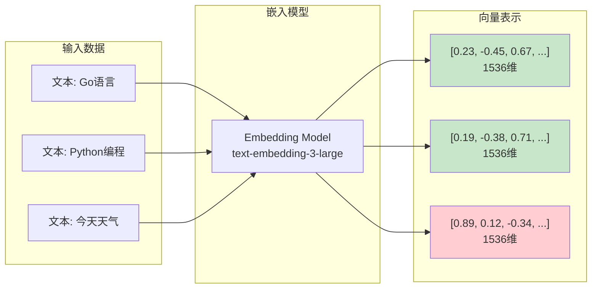
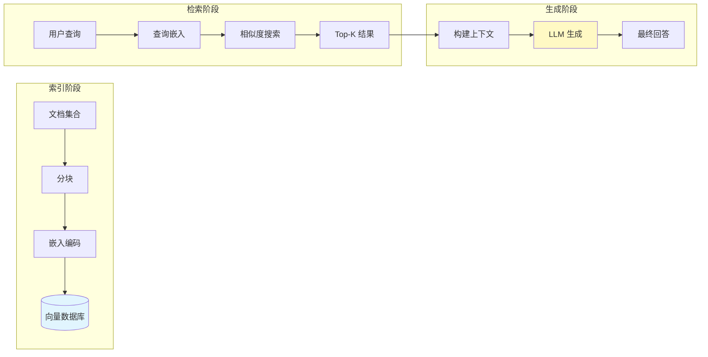
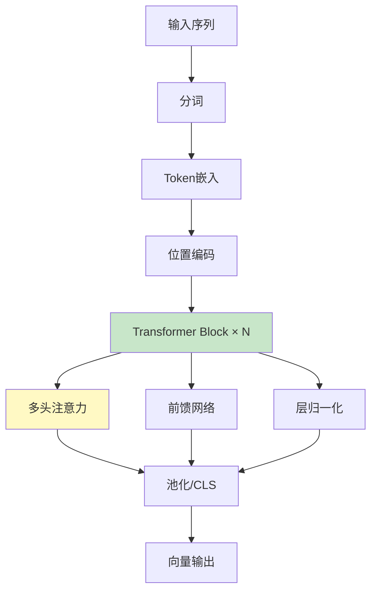
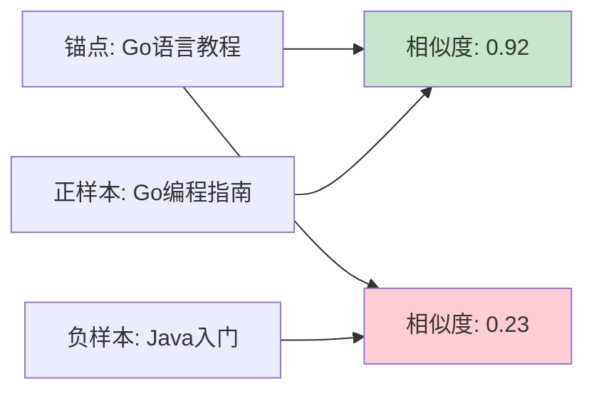
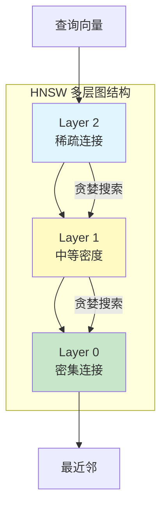
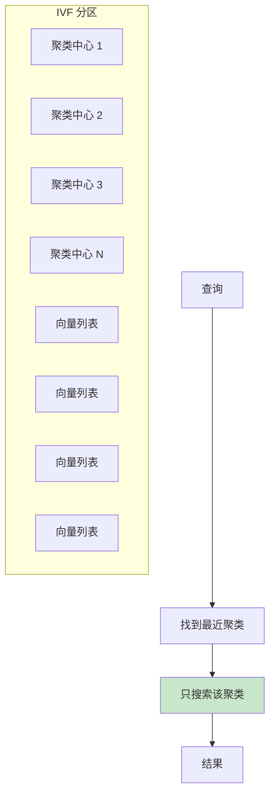
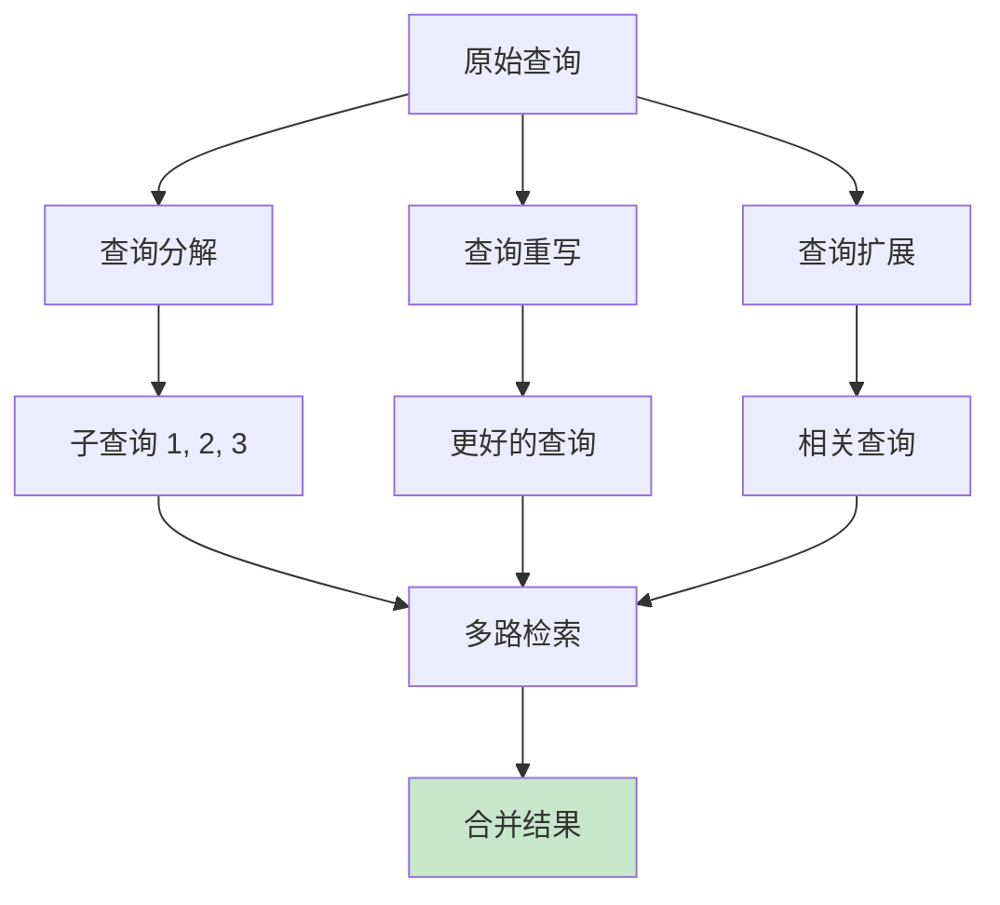
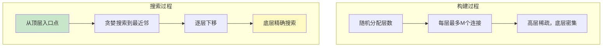

# AI 向量检索与语义搜索

> 向量嵌入 · 相似度计算 · 向量数据库 · RAG 架构

---

## 核心概念（精简版）

### 什么是向量嵌入？

向量嵌入（Embedding）是将文本、图像等非结构化数据转换为固定维度的数值向量的过程：



### 为什么需要向量嵌入？

| 传统文本搜索 | 向量语义搜索 |
|:------------|:-------------|
| 基于关键词匹配 | 基于语义相似度 |
| 无法理解同义词 | 理解语义关联 |
| "car" ≠ "automobile" | "car" ≈ "automobile" |
| 精确匹配 | 模糊匹配 |

### 常见嵌入模型

| 模型 | 提供商 | 维度 | 特点 |
|:-----|:-------|:-----|:-----|
| **text-embedding-3-large** | OpenAI | 3072 | 最新，多语言支持 |
| **text-embedding-3-small** | OpenAI | 1536 | 性价比高 |
| **text-embedding-ada-002** | OpenAI | 1536 | 经典模型 |
| **bge-large-zh** | BAAI | 1024 | 中文优化 |
| **m3e-base** | moka-ai | 768 | 中文轻量级 |

### 向量相似度计算

```go
// 余弦相似度（最常用）
func CosineSimilarity(a, b []float32) float32 {
    var dotProduct, normA, normB float32
    for i := range a {
        dotProduct += a[i] * b[i]
        normA += a[i] * a[i]
        normB += b[i] * b[i]
    }
    return dotProduct / (float32(math.Sqrt(float64(normA))) * float32(math.Sqrt(float64(normB))))
}

// 欧氏距离
func EuclideanDistance(a, b []float32) float32 {
    var sum float32
    for i := range a {
        diff := a[i] - b[i]
        sum += diff * diff
    }
    return float32(math.Sqrt(float64(sum)))
}

// 点积（归一化向量）
func DotProduct(a, b []float32) float32 {
    var sum float32
    for i := range a {
        sum += a[i] * b[i]
    }
    return sum
}
```

### RAG 架构概述



---

## 深入原理（深入版）

### 嵌入模型原理

#### Transformer 架构

现代嵌入模型基于 Transformer 架构：



#### 自注意力机制

```go
// 简化的自注意力计算
// Attention(Q, K, V) = softmax(QK^T / √d_k) V

type Attention struct {
    Q, K, V *linear.Linear
    scale   float32
}

func (a *Attention) Forward(x *tensor.Tensor) *tensor.Tensor {
    B, T, C := x.Dims[0], x.Dims[1], x.Dims[2]

    Q := a.Q.Forward(x) // (B, T, C)
    K := a.K.Forward(x) // (B, T, C)
    V := a.V.Forward(x) // (B, T, C)

    // 计算注意力分数
    scores := matmul(Q, K.Transpose()) / math.Sqrt(float32(C))

    // Softmax
    attnWeights := softmax(scores, -1)

    // 加权求和
    return matmul(attnWeights, V)
}
```

### 训练目标

#### 1. 对比学习（Contrastive Learning）



**损失函数**：InfoNCE Loss

```
L = -log(exp(sim(z_i, z_j) / τ) / Σ exp(sim(z_i, z_k) / τ))
```

- `z_i, z_j`: 正样本对
- `z_k`: 所有样本（包括正负样本）
- `τ`: 温度参数

#### 2. Matryoshka Representations

OpenAI 的 text-embedding-3 采用嵌套式表示：

```python
# 允许截断向量而保持语义信息
embedding = model.encode("Hello, world!")

# 可使用不同维度
small = embedding[:256]    # 256 维
medium = embedding[:512]   # 512 维
large = embedding[:1024]   # 1024 维
full = embedding[:3072]    # 3072 维（完整）

# 较短维度仍保持语义质量
```

### 向量数据库核心

#### HNSW 算法（分层导航小世界图）



**HNSW 构建过程**：

```go
type HNSW struct {
    graphs []*Graph      // 每层一个图
    maxM   int           // 每层最大连接数
    ef     int           // 搜索时的候选队列大小
}

func (h *HNSW) Insert(point *Point) {
    // 1. 随机确定节点的最高层
    level := h.randomLevel()

    // 2. 从顶层开始，寻找每层的插入位置
    for l := h.maxLevel; l >= 0; l-- {
        candidates := h.searchLayer(point, l, h.ef)
        // 在该层插入连接
        h.connect(point, candidates, l)
    }
}

func (h *HNSW) Search(query *Point, k int) []*Point {
    // 1. 从顶层开始贪婪搜索
    entry := h.entryPoint

    for l := h.maxLevel; l > 0; l-- {
        entry = h.searchLayer(query, entry, 1)
    }

    // 2. 在底层精确搜索
    candidates := h.searchLayer(query, entry, h.ef)

    // 3. 返回 top-k
    return topK(candidates, k)
}
```

#### IVF（倒排文件索引）



**IVF + PQ（乘积量化）组合**：

| 技术 | 作用 | 加速比 |
|:-----|:-----|:-------|
| IVF | 减少搜索空间 | ~10x |
| PQ | 压缩向量，加速距离计算 | ~5x |
| HNSW | 图索引，精确搜索 | ~100x |

### 向量数据库对比

| 数据库 | 索引算法 | 特点 | 适用场景 |
|:-------|:---------|:-----|:---------|
| **Pinecone** | HNSW | 全托管，易用 | 快速原型 |
| **Weaviate** | HNSW | 开源，多模态 | 自建服务 |
| **Milvus** | HNSW/IVF | 开源，可扩展 | 大规模部署 |
| **Qdrant** | HNSW | Rust 实现，高性能 | 高性能需求 |
| **pgvector** | IVF/HNSW | PostgreSQL 扩展 | 与现有 DB 集成 |
| **Chroma** | HNSW | 简单 API | 嵌入式应用 |

### RAG 深度解析

#### 文档分块策略

```go
// 1. 固定大小分块
func FixedSizeChunk(text string, size int) []string {
    chunks := make([]string, 0)
    for i := 0; i < len(text); i += size {
        end := min(i+size, len(text))
        chunks = append(chunks, text[i:end])
    }
    return chunks
}

// 2. 语义分块（按段落/句子）
func SemanticChunk(text string) []string {
    sentences := sentences(text)
    paragraphs := make([]string, 0)

    current := sentences[0]
    for _, sent := range sentences[1:] {
        // 如果语义相似，合并
        if similarity(current, sent) > 0.8 {
            current += " " + sent
        } else {
            paragraphs = append(paragraphs, current)
            current = sent
        }
    }
    return paragraphs
}

// 3. 递归字符分块（推荐）
type RecursiveSplitter struct {
    separators []string  // ["\n\n", "\n", " ", ""]
    chunkSize  int
    overlap    int
}

func (s *RecursiveSplitter) Split(text string) []string {
    for _, sep := range s.separators {
        if strings.Contains(text, sep) {
            return s.splitBySeparator(text, sep)
        }
    }
    return []string{text}
}
```

#### 检索策略

| 策略 | 描述 | 复杂度 | 效果 |
|:-----|:-----|:-------|:-----|
| **Naive RAG** | 简单 top-k 检索 | 低 | 基础 |
| **Hybrid Search** | 向量 + 关键词混合 | 中 | 更好 |
| **Re-ranking** | 检索后重新排序 | 高 | 最佳 |
| **Query Expansion** | 查询扩展/改写 | 中 | 改善召回 |
| **Recursive Retrieval** | 递归检索子文档 | 高 | 深度理解 |

```go
// 混合检索（向量 + BM25）
type HybridRetriever struct {
    vectorRetriever *VectorRetriever
    bm25Retriever   *BM25Retriever
    alpha          float32  // 向量权重
}

func (h *HybridRetriever) Retrieve(query string, k int) []Document {
    // 向量检索
    vecResults := h.vectorRetriever.Search(query, k*2)

    // BM25 检索
    bm25Results := h.bm25Retriever.Search(query, k*2)

    // 分数融合
    scores := make(map[string]float32)
    for _, r := range vecResults {
        scores[r.ID] += h.alpha * r.Score
    }
    for _, r := range bm25Results {
        scores[r.ID] += (1 - h.alpha) * r.Score
    }

    // 排序返回 top-k
    return topKByScore(scores, k)
}
```

#### Re-ranking

```go
// 交叉编码器重排序
type CrossEncoderReranker struct {
    model *CrossEncoderModel
}

func (r *CrossEncoderReranker) Rerank(query string, docs []Document) []Document {
    // 计算查询与每个文档的相关性分数
    scores := make([]float32, len(docs))
    for i, doc := range docs {
        scores[i] = r.model.Score(query, doc.Content)
    }

    // 按分数排序
    sort.Slice(docs, func(i, j int) bool {
        return scores[i] > scores[j]
    })

    return docs
}
```

### Advanced RAG 技术

#### 1. 查询理解与改写



#### 2. 融合检索

```go
type FusionRetriever struct {
    retrievers []Retriever
    weights    []float32
}

func (f *FusionRetriever) Retrieve(query string, k int) []Document {
    // 收集所有结果
    allResults := make(map[string]*Document)

    for i, retriever := range f.retrievers {
        results := retriever.Retrieve(query, k*3)
        weight := f.weights[i]

        for _, doc := range results {
            if existing, ok := allResults[doc.ID]; ok {
                existing.Score += doc.Score * weight
                existing.Rank += doc.Rank
            } else {
                allResults[doc.ID] = doc
            }
        }
    }

    // RRF（Reciprocal Rank Fusion）
    for _, doc := range allResults {
        doc.RRF = 1.0 / float32(doc.Rank+1)
    }

    return topKByRRF(allResults, k)
}
```

#### 3. Self-RAG（自我反思）

```go
type SelfRAG struct {
    llm       LLM
    retriever Retriever
}

func (s *SelfRAG) Generate(query string) string {
    // 1. 生成初始回答
    context := s.retriever.Retrieve(query, 5)
    answer := s.llm.Generate(query, context)

    // 2. 自我评估
    for i := 0; i < 3; i++ {
        critique := s.llm.Critique(query, answer, context)

        if critique.Score > 0.9 {
            break
        }

        // 根据反馈改进
        if critique.NeedsMoreInfo {
            context = append(context, s.retriever.Retrieve(critique.AddQuery, 3)...)
        }

        answer = s.llm.Revise(answer, critique)
    }

    return answer
}
```

---

## 实战案例

### 案例 1：基础向量检索系统

```go
package main

import (
    "encoding/json"
    "fmt"
    "math"
    "net/http"
    "sync"
)

// 向量存储
type VectorStore struct {
    mu       sync.RWMutex
    vectors  map[string][]float32
    metadata map[string]map[string]interface{}
}

func NewVectorStore() *VectorStore {
    return &VectorStore{
        vectors:  make(map[string][]float32),
        metadata: make(map[string]map[string]interface{}),
    }
}

func (vs *VectorStore) Insert(id string, vector []float32, meta map[string]interface{}) {
    vs.mu.Lock()
    defer vs.mu.Unlock()
    vs.vectors[id] = vector
    vs.metadata[id] = meta
}

func (vs *VectorStore) Search(query []float32, topK int) []Result {
    vs.mu.RLock()
    defer vs.mu.RUnlock()

    results := make([]Result, 0, len(vs.vectors))

    for id, vector := range vs.vectors {
        score := cosineSimilarity(query, vector)
        results = append(results, Result{
            ID:       id,
            Score:    score,
            Metadata: vs.metadata[id],
        })
    }

    sort.Slice(results, func(i, j int) bool {
        return results[i].Score > results[j].Score
    })

    if len(results) > topK {
        results = results[:topK]
    }

    return results
}

type Result struct {
    ID       string
    Score    float32
    Metadata map[string]interface{}
}

func cosineSimilarity(a, b []float32) float32 {
    var dot, normA, normB float32
    for i := range a {
        dot += a[i] * b[i]
        normA += a[i] * a[i]
        normB += b[i] * b[i]
    }
    return dot / (float32(math.Sqrt(float64(normA))) * float32(math.Sqrt(float64(normB))))
}

// OpenAI Embedding API 客户端
type EmbeddingClient struct {
    apiKey string
    client *http.Client
}

func NewEmbeddingClient(apiKey string) *EmbeddingClient {
    return &EmbeddingClient{
        apiKey: apiKey,
        client: &http.Client{},
    }
}

func (c *EmbeddingClient) Embed(text string) ([]float32, error) {
    body := map[string]interface{}{
        "input": text,
        "model": "text-embedding-3-small",
    }

    jsonBody, _ := json.Marshal(body)
    req, _ := http.NewRequest("POST", "https://api.openai.com/v1/embeddings", bytes.NewReader(jsonBody))
    req.Header.Set("Content-Type", "application/json")
    req.Header.Set("Authorization", "Bearer "+c.apiKey)

    resp, err := c.client.Do(req)
    if err != nil {
        return nil, err
    }
    defer resp.Body.Close()

    var result struct {
        Data []struct {
            Embedding []float32 `json:"embedding"`
        } `json:"data"`
    }

    json.NewDecoder(resp.Body).Decode(&result)

    if len(result.Data) == 0 {
        return nil, fmt.Errorf("no embedding returned")
    }

    return result.Data[0].Embedding, nil
}

// RAG 服务
type RAGService struct {
    store           *VectorStore
    embeddingClient *EmbeddingClient
    llmClient       *http.Client
}

func NewRAGService(apiKey string) *RAGService {
    return &RAGService{
        store:           NewVectorStore(),
        embeddingClient: NewEmbeddingClient(apiKey),
        llmClient:       &http.Client{},
    }
}

func (rag *RAGService) IndexDocuments(docs []Document) error {
    for _, doc := range docs {
        embedding, err := rag.embeddingClient.Embed(doc.Content)
        if err != nil {
            return err
        }

        rag.store.Insert(doc.ID, embedding, map[string]interface{}{
            "content":  doc.Content,
            "title":    doc.Title,
            "source":   doc.Source,
        })
    }
    return nil
}

func (rag *RAGService) Query(query string, topK int) (string, error) {
    // 1. 嵌入查询
    queryEmbedding, err := rag.embeddingClient.Embed(query)
    if err != nil {
        return "", err
    }

    // 2. 检索相关文档
    results := rag.store.Search(queryEmbedding, topK)

    // 3. 构建上下文
    context := ""
    for _, r := range results {
        context += r.Metadata["content"].(string) + "\n\n"
    }

    // 4. 调用 LLM 生成回答
    prompt := fmt.Sprintf("基于以下内容回答问题：\n\n%s\n\n问题：%s", context, query)

    // ... 调用 LLM API
    return answer, nil
}

type Document struct {
    ID      string
    Content string
    Title   string
    Source  string
}

// 使用示例
func main() {
    apiKey := os.Getenv("OPENAI_API_KEY")
    rag := NewRAGService(apiKey)

    // 索引文档
    docs := []Document{
        {ID: "1", Content: "Go语言由Google开发，是一种静态类型、编译型语言", Title: "Go简介"},
        {ID: "2", Content: "Python是一种解释型、面向对象的高级编程语言", Title: "Python简介"},
    }

    rag.IndexDocuments(docs)

    // 查询
    answer, err := rag.Query("Go语言有什么特点？", 3)
    if err != nil {
        log.Fatal(err)
    }

    fmt.Println(answer)
}
```

### 案例 2：使用 pgvector

```sql
-- 安装 pgvector 扩展
CREATE EXTENSION vector;

-- 创建表
CREATE TABLE documents (
    id SERIAL PRIMARY KEY,
    content TEXT,
    metadata JSONB,
    embedding vector(1536)
);

-- 创建 HNSW 索引
CREATE INDEX ON documents
USING hnsw (embedding vector_cosine_ops)
WITH (m = 16, ef_construction = 64);

-- 插入文档
INSERT INTO documents (content, embedding)
VALUES ('Go语言是Google开发的', '[0.1, 0.2, ...]');

-- 向量相似度搜索
SELECT
    id,
    content,
    1 - (embedding <=> '[0.1, 0.2, ...]') as similarity
FROM documents
ORDER BY embedding <=> '[0.1, 0.2, ...]'
LIMIT 5;

-- 混合搜索（向量 + 全文）
SELECT
    id,
    content,
    (1 - (embedding <=> '[...]')) * 0.7 +
    (ts_rank(to_tsvector('english', content), query) * 0.3) as combined_score
FROM documents,
     plainto_tsquery('english', 'Go language') as query
WHERE to_tsvector('english', content) @@ query
ORDER BY combined_score DESC
LIMIT 10;
```

### 案例 3：RAG 查询优化

```go
// 查询重写
func (rag *RAGService) RewriteQuery(query string) ([]string, error) {
    prompt := fmt.Sprintf(`将以下查询重写为3个更好的搜索查询，返回JSON数组：
原始查询：%s

返回格式：["查询1", "查询2", "查询3"]`, query)

    response := rag.llmComplete(prompt)

    var queries []string
    json.Unmarshal([]byte(response), &queries)
    return queries, nil
}

// 多路查询
func (rag *RAGService) MultiQueryRetrieval(query string, topK int) ([]Result, error) {
    // 1. 查询重写
    queries, _ := rag.RewriteQuery(query)
    queries = append([]string{query}, queries...)

    // 2. 多路检索
    allResults := make(map[string]*Result)
    for _, q := range queries {
        embedding, _ := rag.embeddingClient.Embed(q)
        results := rag.store.Search(embedding, topK)

        for _, r := range results {
            if existing, ok := allResults[r.ID]; ok {
                existing.Score += r.Score
            } else {
                allResults[r.ID] = &r
            }
        }
    }

    // 3. 排序
    sorted := make([]*Result, 0, len(allResults))
    for _, r := range allResults {
        sorted = append(sorted, r)
    }

    sort.Slice(sorted, func(i, j int) bool {
        return sorted[i].Score > sorted[j].Score
    })

    return sorted[:min(topK, len(sorted))], nil
}
```

---

## 面试真题精选

### Q1: 解释向量嵌入的原理和应用场景

**参考答案**：

**原理**：
向量嵌入通过神经网络将离散的符号（词、token）映射到连续的向量空间，使得语义相似的对象在向量空间中距离更近。

**核心过程**：
1. **分词**：将文本转换为 token 序列
2. **编码**：通过 Transformer 等模型编码
3. **池化**：将序列向量聚合为单一向量
4. **归一化**：将向量归一化到单位超球面

**应用场景**：
- **语义搜索**：理解查询意图，而非关键词匹配
- **推荐系统**：基于用户历史向量推荐相似内容
- **聚类分析**：将相似文档分组
- **去重**：检测内容相似的文档
- **RAG**：检索增强生成

### Q2: HNSW 算法的原理是什么？为什么比 IVF 快？

**参考答案**：

**HNSW (Hierarchical Navigable Small World)** 是基于图的近似最近邻搜索算法：



**相比 IVF 的优势**：

| 特性 | HNSW | IVF |
|:-----|:-----|:-----|
| 查询复杂度 | O(log N) | O(√N) |
| 构建复杂度 | O(N log N) | O(N) |
| 内存占用 | 较高 | 较低 |
| 动态更新 | 支持 | 需要重建索引 |
| 精度 | 更高 | 较低 |

**为什么更快**：
1. **对数级搜索**：多层结构实现快速导航
2. **贪婪路由**：每层只走少量边
3. **无需聚类**：不需要预先计算聚类中心

### Q3: 如何评估向量检索的质量？

**参考答案**：

**评估指标**：

1. **召回率 (Recall@K)**
```go
// 检索到的真实相关文档数 / 真实相关文档总数
recallK := len(retrievedAndRelevant) / totalRelevant
```

2. **精确率 (Precision@K)**
```go
// 检索到的真实相关文档数 / K
precisionK := len(retrievedAndRelevant) / K
```

3. **平均精度 (AP)**
```go
// 考虑排序位置的精确率
ap := sum(precisionAtK * isRelevantK) / totalRelevant
```

4. **NDCG (Normalized DCG)**
```go
// 考虑相关度分级和位置
dcg := rel1 / log2(1) + rel2 / log2(2) + ...
ndcg := dcg / idcg
```

**离线评估**：
```go
// 使用标注数据集
type EvaluationSet struct {
    Queries     []Query
    GroundTruth map[string][]string  // query -> relevant doc IDs
}

func Evaluate(store *VectorStore, eval *EvaluationSet) Metrics {
    totalRecall := 0.0
    totalPrecision := 0.0

    for _, query := range eval.Queries {
        results := store.Search(query.Embedding, 10)
        relevant := eval.GroundTruth[query.ID]

        recallK := calculateRecall(results, relevant)
        precisionK := calculatePrecision(results, relevant)

        totalRecall += recallK
        totalPrecision += precisionK
    }

    return Metrics{
        Recall:    totalRecall / float64(len(eval.Queries)),
        Precision: totalPrecision / float64(len(eval.Queries)),
    }
}
```

### Q4: RAG 系统的常见问题及解决方案

**参考答案**：

| 问题 | 原因 | 解决方案 |
|:-----|:-----|:---------|
| **检索不相关** | 查询理解偏差 | 查询重写、Hybrid Search |
| **信息丢失** | 分块策略不当 | 语义分块、滑动窗口 |
| **上下文过长** | 检索文档过多 | Re-ranking、压缩 |
| **幻觉问题** | LLM 生成不受控 | 引用来源、事实核查 |
| **更新延迟** | 向量索引未更新 | 增量更新、实时索引 |

**解决方案代码**：
```go
// 1. 查询重写
func RewriteQuery(llm LLM, query string) []string {
    prompt := fmt.Sprintf("改写为3个更好的搜索查询：%s", query)
    // ...
}

// 2. Re-ranking
func Rerank(crossEncoder *Model, query string, docs []Document) []Document {
    scores := crossEncoder.ScoreBatch(query, docs)
    // 重新排序
}

// 3. 上下文压缩
func CompressContext(docs []Document, maxTokens int) string {
    // 提取关键句子
    // 去除冗余信息
    // 保持 maxTokens 限制
}
```

### Q5: 向量数据库和传统数据库的区别

**参考答案**：

| 特性 | 传统数据库 | 向量数据库 |
|:-----|:-----------|:-----------|
| **数据类型** | 结构化数据 | 向量 + 元数据 |
| **索引** | B-Tree、Hash | HNSW、IVF、PQ |
| **查询** | 精确匹配 | 近似最近邻（ANN） |
| **距离度量** | 等值比较 | 余弦、欧氏、点积 |
| **扩展性** | 垂直扩展优先 | 水平扩展优化 |

**选择建议**：
- 需要精确匹配 → 传统数据库
- 需要语义搜索 → 向量数据库
- 混合需求 → 使用 pgvector 或混合架构

---

## 参考资料

### 学术论文
- [Attention Is All You Need (Vaswani et al., 2017)](https://arxiv.org/abs/1706.03762) - Transformer 原论文
- [Sentence-BERT (Reimers & Gurevych, 2019)](https://arxiv.org/abs/1908.10084) - 句子嵌入
- [Efficient Approximate Nearest Neighbor Search (Malkov & Yashunin, 2018)](https://arxiv.org/abs/1603.09320) - HNSW 算法
- [Retrieval-Augmented Generation for Knowledge-Intensive NLP (Lewis et al., 2020)](https://arxiv.org/abs/2005.11401) - RAG 原论文

### 技术文档
- [OpenAI Embeddings API](https://platform.openai.com/docs/guides/embeddings)
- [Pinecone Documentation](https://docs.pinecone.io/)
- [Weaviate Documentation](https://weaviate.io/developers/weaviate)
- [pgvector GitHub](https://github.com/pgvector/pgvector)
- [LangChain RAG Tutorial](https://python.langchain.com/docs/tutorials/rag)

### 在线资源
- [Vector Database Comparison](https://zilliz.com/learn/what-is-vector-database)
- [Embedding Models Guide](https://huggingface.co/blog/mteb)
- [RAG Techniques Survey](https://lilianweng.github.io/posts/2023-06-23-agent/)
