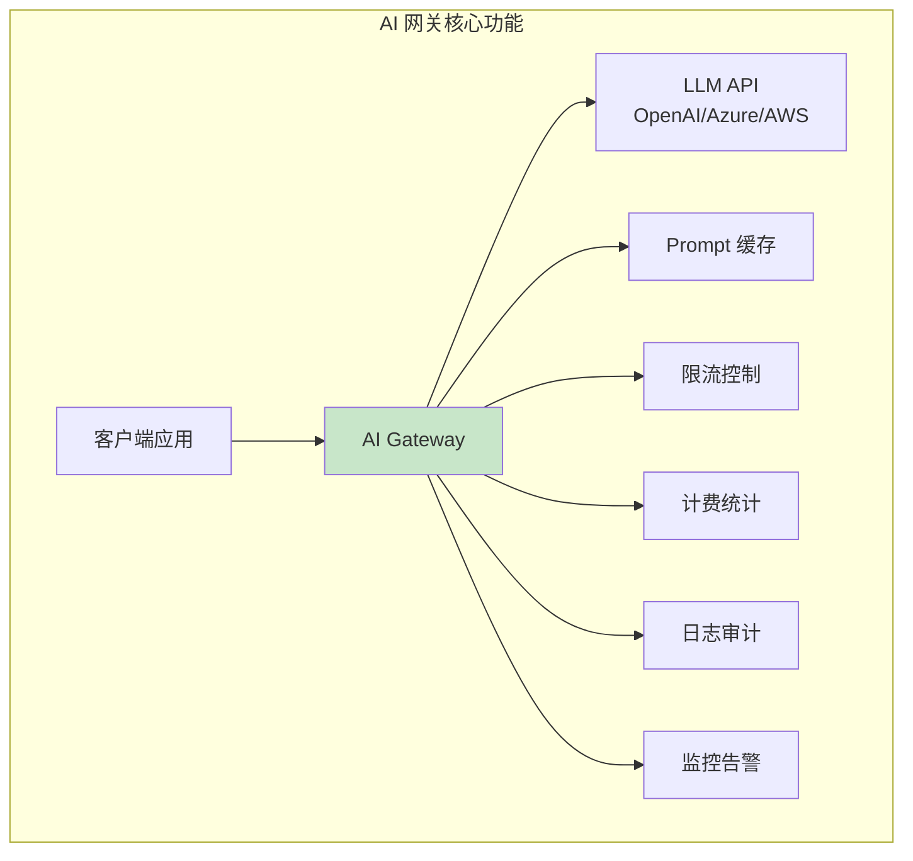
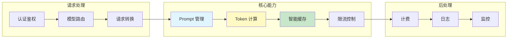
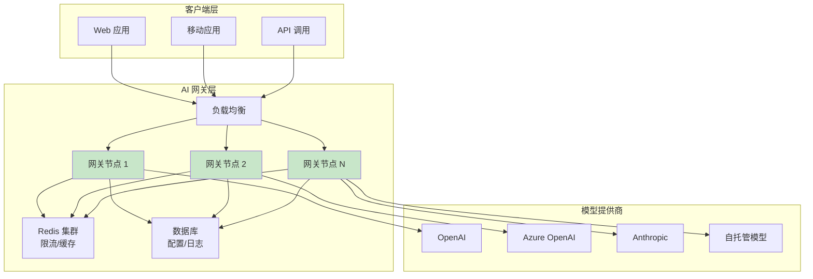
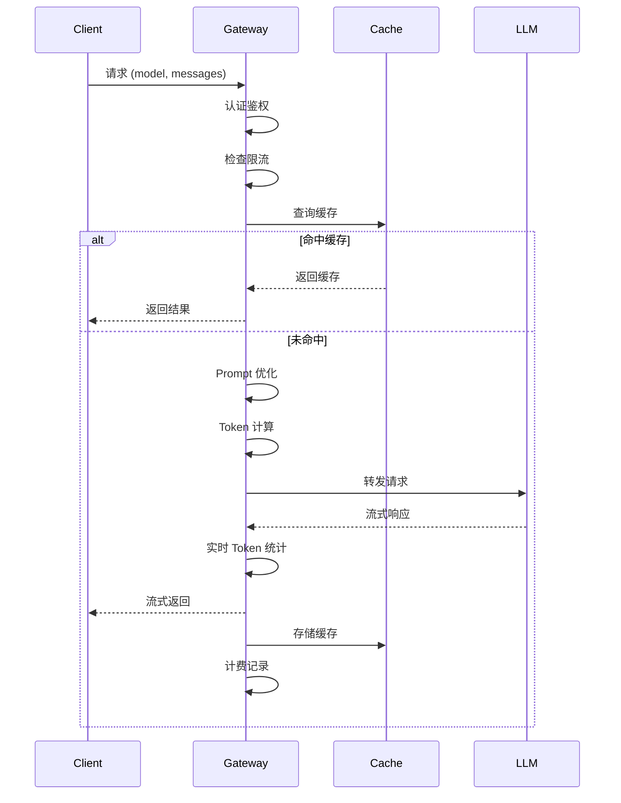
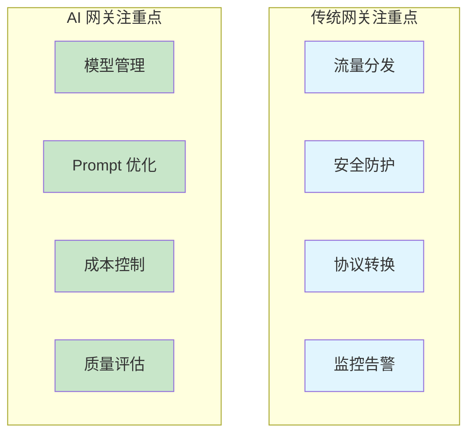
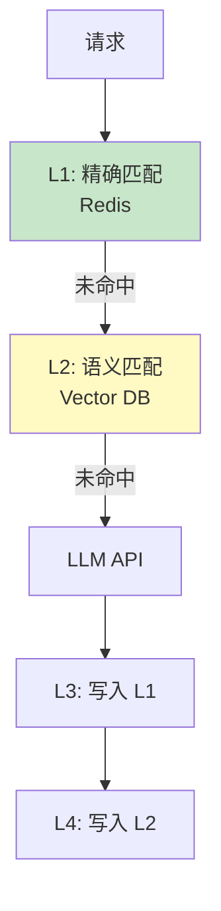

# AI 网关架构与实现

> AI 专用网关 · Prompt 管理 · Token 计费 · 流量控制 · 与传统网关对比

---

## 核心概念（精简版）

### 什么是 AI 网关？

**AI 网关** 是专为 AI 应用设计的 API 网关，提供 LLM 调用、Prompt 管理、Token 计费等核心能力：



### AI 网关 vs 传统网关

| 特性 | 传统网关 | AI 网关 |
|:-----|:---------|:--------|
| **协议** | REST/gRPC | REST + Streaming (SSE) |
| **计费** | 请求次数 | Token 数量 |
| **缓存** | 响应缓存 | Prompt/Response 缓存 |
| **限流** | QPS/RPS | TPM (Tokens Per Minute) |
| **可观测** | 延迟/状态码 | Token 使用/成本/模型 |
| **路由** | 负载均衡 | 模型/版本路由 |

### AI 网关核心组件



### 主流 AI 网关方案

| 方案 | 类型 | 特点 |
|:-----|:-----|:-----|
| **Portkey** | SaaS | 全功能 AI 网关 |
| **Kong AI Gateway** | 开源 | 基于 Kong 扩展 |
| **AWS API Gateway** | 云服务 | 集成 Bedrock |
| **Azure API Management** | 云服务 | 集成 OpenAI |
| **自研方案** | 定制 | 企业级定制 |

---

## 深入原理（深入版）

### 架构设计

#### 整体架构



#### 数据流



### 核心功能实现

#### 1. 模型路由

```go
package gateway

import (
    "context"
    "fmt"
)

// 模型定义
type Model struct {
    ID          string
    Provider    string
    Name        string
    Version     string
    ContextSize int
    CostPer1K   float64 // Input cost per 1K tokens
    CostPer1KOutput float64 // Output cost per 1K tokens
}

// 路由规则
type RouteRule struct {
    Name      string
    Condition RouteCondition
    Target    ModelTarget
}

type RouteCondition struct {
    UserID      *string
    APIKey      *string
    ModelName   *string
    MinTokens   *int
    MaxTokens   *int
    Tier        *string // free, pro, enterprise
}

type ModelTarget struct {
    Provider string
    Model    string
    Weight   int // 用于负载均衡
}

// 路由器
type ModelRouter struct {
    routes  []RouteRule
    models  map[string]*Model
    metrics *RouterMetrics
}

func (r *ModelRouter) Route(ctx context.Context, req *LLMRequest) (*Model, error) {
    // 1. 提取上下文
    userID := getUserID(ctx)
    apiKey := getAPIKey(ctx)
    tier := getUserTier(ctx)

    // 2. 匹配路由规则
    for _, rule := range r.routes {
        if r.matchCondition(&rule.Condition, userID, apiKey, req, tier) {
            // 3. 选择模型
            model := r.selectModel(&rule.Target)
            return model, nil
        }
    }

    // 默认模型
    return r.models["gpt-3.5-turbo"], nil
}

func (r *ModelRouter) matchCondition(cond *RouteCondition, userID, apiKey string, req *LLMRequest, tier string) bool {
    if cond.UserID != nil && *cond.UserID != userID {
        return false
    }

    if cond.APIKey != nil && *cond.APIKey != apiKey {
        return false
    }

    if cond.ModelName != nil && *cond.ModelName != req.Model {
        return false
    }

    if cond.MinTokens != nil && req.EstimatedTokens < *cond.MinTokens {
        return false
    }

    if cond.MaxTokens != nil && req.EstimatedTokens > *cond.MaxTokens {
        return false
    }

    if cond.Tier != nil && *cond.Tier != tier {
        return false
    }

    return true
}

// A/B 测试路由
type ABTestRouter struct {
    routerA *ModelRouter
    routerB *ModelRouter
    ratio   int // A:B 比例
}

func (r *ABTestRouter) Route(ctx context.Context, req *LLMRequest) (*Model, error) {
    // 基于用户 ID 哈希分配
    userID := getUserID(ctx)
    hash := fnv.New32()
    hash.Write([]byte(userID))
    bucket := int(hash.Sum32()) % 100

    if bucket < r.ratio {
        return r.routerA.Route(ctx, req)
    }
    return r.routerB.Route(ctx, req)
}
```

#### 2. Prompt 管理

```go
package prompt

import (
    "context"
    "text/template"
)

// Prompt 模板
type PromptTemplate struct {
    ID       string
    Name     string
    Template string
    Variables []string
    Version  int
    Tags     []string
}

// Prompt 管理器
type PromptManager struct {
    templates map[string]*PromptTemplate
    versions  map[string][]*PromptTemplate // name -> versions
    store     TemplateStore
}

func (pm *PromptManager) GetTemplate(ctx context.Context, id string) (*PromptTemplate, error) {
    // 缓存获取
    if tpl, ok := pm.templates[id]; ok {
        return tpl, nil
    }

    // 数据库获取
    tpl, err := pm.store.Get(ctx, id)
    if err != nil {
        return nil, err
    }

    pm.templates[id] = tpl
    return tpl, nil
}

func (pm *PromptManager) Render(ctx context.Context, id string, vars map[string]interface{}) (string, error) {
    tpl, err := pm.GetTemplate(ctx, id)
    if err != nil {
        return "", err
    }

    // 检查必需变量
    for _, v := range tpl.Variables {
        if _, ok := vars[v]; !ok {
            return "", fmt.Errorf("missing variable: %s", v)
        }
    }

    // 渲染模板
    t, err := template.New(tpl.Name).Parse(tpl.Template)
    if err != nil {
        return "", err
    }

    var buf bytes.Buffer
    err = t.Execute(&buf, vars)
    if err != nil {
        return "", err
    }

    return buf.String(), nil
}

// Prompt 优化
type PromptOptimizer struct {
    llm LLMClient
}

func (po *PromptOptimizer) Optimize(ctx context.Context, prompt string, goal string) (string, error) {
    optPrompt := fmt.Sprintf(`优化以下 Prompt，目标：%s

原始 Prompt：
%s

要求：
1. 更清晰
2. 减少歧义
3. 添加必要约束
4. 提高输出质量

只返回优化后的 Prompt。
`, goal, prompt)

    response, err := po.llm.Complete(ctx, optPrompt)
    if err != nil {
        return "", err
    }

    return response, nil
}

// Prompt A/B 测试
type PromptExperiment struct {
    ID       string
    Name     string
    Baseline string
    Variants []string
    Metrics  []string
}

func (pe *PromptExperiment) Run(ctx context.Context, pm *PromptManager, vars map[string]interface{}) map[string]string {
    results := make(map[string]string)

    // 渲染 baseline
    baseline, _ := pm.Render(ctx, pe.Baseline, vars)
    results["baseline"] = baseline

    // 渲染 variants
    for i, variant := range pe.Variants {
        rendered, _ := pm.Render(ctx, variant, vars)
        results[fmt.Sprintf("variant_%d", i)] = rendered
    }

    return results
}
```

#### 3. Token 计算与计费

```go
package billing

import (
    "context"
    "github.com/pkoukk/tiktoken-go"
)

// Token 计数器
type TokenCounter struct {
    encodings map[string]*tiktoken.Tiktoken
}

func NewTokenCounter() *TokenCounter {
    tc := &TokenCounter{
        encodings: make(map[string]*tiktoken.Tiktoken),
    }

    // 预加载常用编码
    tc.encodings["gpt-3.5-turbo"] = tiktoken.GetEncoding("cl100k_base")
    tc.encodings["gpt-4"] = tiktoken.GetEncoding("cl100k_base")

    return tc
}

func (tc *TokenCounter) CountTokens(model string, text string) (int, error) {
    encoding, ok := tc.encodings[model]
    if !ok {
        encoding = tiktoken.GetEncoding("cl100k_base")
    }

    tokens := encoding.Encode(text, nil, nil)
    return len(tokens), nil
}

func (tc *TokenCounter) CountMessages(model string, messages []Message) (int, error) {
    // 参考 OpenAI 的 token 计算逻辑
    tokensPerMessage := 3
    tokensPerName := 1

    numTokens := 0
    for _, message := range messages {
        numTokens += tokensPerMessage
        numTokens += tc.CountTokens(model, message.Content)
        numTokens += tc.CountTokens(model, message.Role)
        if message.Name != "" {
            numTokens += tokensPerName
            numTokens += tc.CountTokens(model, message.Name)
        }
    }

    numTokens += 3 // Reply

    return numTokens, nil
}

// 计费管理
type BillingManager struct {
    counter    *TokenCounter
    pricing    map[string]ModelPricing
    repository BillingRepository
}

type ModelPricing struct {
    InputPricePer1K  float64
    OutputPricePer1K float64
}

type UsageRecord struct {
    UserID      string
    APIKey      string
    Model       string
    InputTokens int
    OutputTokens int
    Cost        float64
    Timestamp   time.Time
}

func (bm *BillingManager) CalculateCost(model string, inputTokens, outputTokens int) (float64, error) {
    pricing, ok := bm.pricing[model]
    if !ok {
        pricing = ModelPricing{
            InputPricePer1K:  0.0015, // 默认 GPT-3.5 价格
            OutputPricePer1K: 0.002,
        }
    }

    inputCost := float64(inputTokens) / 1000 * pricing.InputPricePer1K
    outputCost := float64(outputTokens) / 1000 * pricing.OutputPricePer1K

    return inputCost + outputCost, nil
}

func (bm *BillingManager) RecordUsage(ctx context.Context, userID, apiKey, model string, inputTokens, outputTokens int) error {
    cost, err := bm.CalculateCost(model, inputTokens, outputTokens)
    if err != nil {
        return err
    }

    record := &UsageRecord{
        UserID:      userID,
        APIKey:      apiKey,
        Model:       model,
        InputTokens: inputTokens,
        OutputTokens: outputTokens,
        Cost:        cost,
        Timestamp:   time.Now(),
    }

    return bm.repository.Save(ctx, record)
}

// 预算控制
type BudgetController struct {
    billing    *BillingManager
    budgets    map[string]*Budget
}

type Budget struct {
    UserID      string
    DailyLimit  float64
    MonthlyLimit float64
}

func (bc *BudgetController) CheckBudget(ctx context.Context, userID string, estimatedCost float64) error {
    budget, ok := bc.budgets[userID]
    if !ok {
        return nil // 无限制
    }

    // 获取今日使用量
    dailyUsage, _ := bc.billing.GetDailyUsage(ctx, userID)

    if dailyUsage+estimatedCost > budget.DailyLimit {
        return fmt.Errorf("daily budget exceeded: %.2f/%.2f", dailyUsage, budget.DailyLimit)
    }

    // 获取本月使用量
    monthlyUsage, _ := bc.billing.GetMonthlyUsage(ctx, userID)

    if monthlyUsage+estimatedCost > budget.MonthlyLimit {
        return fmt.Errorf("monthly budget exceeded: %.2f/%.2f", monthlyUsage, budget.MonthlyLimit)
    }

    return nil
}
```

#### 4. 流量控制

```go
package ratelimit

import (
    "context"
    "time"

    "golang.org/x/time/rate"
)

// 限流器
type RateLimiter struct {
    limiters map[string]*rate.Limiter
    mu       sync.RWMutex
}

type LimitConfig struct {
    RPM     int // Requests per minute
    TPM     int // Tokens per minute
    RPD     int // Requests per day
}

func NewRateLimiter() *RateLimiter {
    return &RateLimiter{
        limiters: make(map[string]*rate.Limiter),
    }
}

func (rl *RateLimiter) getLimiter(key string, config LimitConfig) *rate.Limiter {
    rl.mu.Lock()
    defer rl.mu.Unlock()

    if limiter, ok := rl.limiters[key]; ok {
        return limiter
    }

    // 使用 RPM 限制
    limiter := rate.NewLimiter(rate.Every(time.Minute/time.Duration(config.RPM)), config.RPM)
    rl.limiters[key] = limiter

    return limiter
}

func (rl *RateLimiter) Allow(ctx context.Context, key string, config LimitConfig) bool {
    limiter := rl.getLimiter(key, config)
    return limiter.Allow()
}

// Token 级别限流
type TokenRateLimiter struct {
    limiters map[string]*tokenBucket
}

type tokenBucket struct {
    capacity int
    tokens   int
    rate     int // tokens per second
    lastRefill time.Time
    mu       sync.Mutex
}

func NewTokenRateLimiter() *TokenRateLimiter {
    return &TokenRateLimiter{
        limiters: make(map[string]*tokenBucket),
    }
}

func (trl *TokenRateLimiter) Allow(key string, tokens int, capacity, rate int) bool {
    trl.mu.Lock()
    bucket, ok := trl.limiters[key]
    if !ok {
        bucket = &tokenBucket{
            capacity: capacity,
            tokens:   capacity,
            rate:     rate,
            lastRefill: time.Now(),
        }
        trl.limiters[key] = bucket
    }
    trl.mu.Unlock()

    bucket.mu.Lock()
    defer bucket.mu.Unlock()

    // 补充 token
    now := time.Now()
    elapsed := now.Sub(bucket.lastRefill)
    refill := int(elapsed.Seconds()) * bucket.rate

    bucket.tokens = min(bucket.capacity, bucket.tokens+refill)
    bucket.lastRefill = now

    // 检查是否有足够 token
    if bucket.tokens >= tokens {
        bucket.tokens -= tokens
        return true
    }

    return false
}

// 分层限流
type TieredRateLimiter struct {
    globalLimit  LimitConfig
    userLimit    LimitConfig
    apiKeyLimit  LimitConfig
}

func (trl *TieredRateLimiter) Allow(ctx context.Context, userID, apiKey string, tokens int) bool {
    // 1. 全局限流
    if !trl.globalLimiter.Allow(ctx, "global", trl.globalLimit) {
        return false
    }

    // 2. 用户限流
    if !trl.userLimiter.Allow(ctx, userID, trl.userLimit) {
        return false
    }

    // 3. API Key 限流
    if !trl.apiKeyLimiter.Allow(ctx, apiKey, trl.apiKeyLimit) {
        return false
    }

    // 4. Token 限流
    if !trl.tokenLimiter.Allow(userID, tokens, 100000, 1000) {
        return false
    }

    return true
}
```

#### 5. 缓存策略

```go
package cache

import (
    "context"
    "crypto/sha256"
    "encoding/hex"
    "encoding/json"
    "time"

    "github.com/redis/go-redis/v9"
)

// 缓存键生成
func CacheKey(model string, messages []Message, params map[string]interface{}) string {
    data := map[string]interface{}{
        "model":    model,
        "messages": messages,
        "params":   params,
    }

    bytes, _ := json.Marshal(data)
    hash := sha256.Sum256(bytes)
    return "llm:cache:" + hex.EncodeToString(hash[:])
}

// LLM 响应缓存
type LLMCache struct {
    redis      *redis.Client
    ttl        time.Duration
    semcache   *SemanticCache
}

type CacheEntry struct {
    Key       string
    Model     string
    Request   []Message
    Response  string
    Tokens    int
    Timestamp time.Time
}

func (lc *LLMCache) Get(ctx context.Context, key string) (*CacheEntry, error) {
    // 1. Redis 缓存
    data, err := lc.redis.Get(ctx, key).Bytes()
    if err == nil {
        var entry CacheEntry
        json.Unmarshal(data, &entry)
        return &entry, nil
    }

    // 2. 语义缓存（近似匹配）
    if lc.semcache != nil {
        return lc.semcache.Find(ctx, key)
    }

    return nil, err
}

func (lc *LLMCache) Set(ctx context.Context, entry *CacheEntry) error {
    // 只缓存成功响应
    if entry.Response == "" {
        return nil
    }

    data, err := json.Marshal(entry)
    if err != nil {
        return err
    }

    return lc.redis.Set(ctx, entry.Key, data, lc.ttl).Err()
}

// 语义缓存
type SemanticCache struct {
    vectorDB *VectorDatabase
    embedding *EmbeddingClient
    threshold float32
}

func (sc *SemanticCache) Find(ctx context.Context, queryKey string) (*CacheEntry, error) {
    // 生成查询向量
    queryEmbedding, err := sc.embedding.Embed(ctx, queryKey)
    if err != nil {
        return nil, err
    }

    // 向量检索
    results, err := sc.vectorDB.Search(ctx, queryEmbedding, 5)
    if err != nil {
        return nil, err
    }

    // 检查相似度阈值
    for _, result := range results {
        if result.Score >= sc.threshold {
            return sc.getEntry(ctx, result.ID)
        }
    }

    return nil, nil
}

func (sc *SemanticCache) Store(ctx context.Context, entry *CacheEntry) error {
    // 生成缓存键的嵌入
    embedding, err := sc.embedding.Embed(ctx, entry.Key)
    if err != nil {
        return err
    }

    // 存储向量
    return sc.vectorDB.Insert(ctx, entry.Key, embedding, map[string]interface{}{
        "model":     entry.Model,
        "timestamp": entry.Timestamp,
    })
}

// 智能缓存策略
type SmartCache struct {
    cache *LLMCache
    policy *CachePolicy
}

type CachePolicy struct {
    EnableExactMatch    bool
    EnableSemanticMatch bool
    MinTokensToCache    int
    MaxCacheSize        int64
    CacheHighTraffic    bool
}

func (sc *SmartCache) ShouldCache(request *LLMRequest, response *LLMResponse) bool {
    // 1. 检查响应质量
    if response.FinishReason != "stop" {
        return false // 不缓存错误或截断的响应
    }

    // 2. 检查 token 数量
    if request.EstimatedTokens < sc.policy.MinTokensToCache {
        return false // 小请求不值得缓存
    }

    // 3. 检查是否是高流量请求
    if sc.policy.CacheHighTraffic {
        // 检查过去 5 分钟的请求频率
        // ...
    }

    return true
}
```

#### 6. 流式响应处理

```go
package streaming

import (
    "bufio"
    "context"
    "encoding/json"
    "fmt"
    "io"
    "net/http"
)

// SSE 流式处理器
type StreamingHandler struct {
    upstream  *http.Client
    tokenCounter *TokenCounter
    billing   *BillingManager
}

func (sh *StreamingHandler) Stream(ctx context.Context, req *LLMRequest) (<-chan StreamChunk, <-chan error) {
    chunks := make(chan StreamChunk, 10)
    errors := make(chan error, 1)

    go func() {
        defer close(chunks)
        defer close(errors)

        // 转发上游请求
        httpReq := sh.buildRequest(req)
        httpResp, err := sh.upstream.Do(httpReq)
        if err != nil {
            errors <- err
            return
        }
        defer httpResp.Body.Close()

        // 读取 SSE 流
        reader := bufio.NewReader(httpResp.Body)
        totalTokens := 0

        for {
            line, err := reader.ReadString('\n')
            if err != nil {
                if err == io.EOF {
                    break
                }
                errors <- err
                return
            }

            // 解析 SSE 数据
            if len(line) > 6 && line[:6] == "data: " {
                data := line[6:]

                // 检查 [DONE]
                if data == "[DONE]\n" {
                    break
                }

                // 解析 JSON
                var chunk StreamChunk
                if err := json.Unmarshal([]byte(data), &chunk); err != nil {
                    continue
                }

                // 统计 tokens
                if len(chunk.Choices) > 0 {
                    content := chunk.Choices[0].Delta.Content
                    tokens, _ := sh.tokenCounter.CountTokens(req.Model, content)
                    totalTokens += tokens
                    chunk.Usage = &Usage{
                        TotalTokens: totalTokens,
                    }
                }

                // 发送 chunk
                select {
                case chunks <- chunk:
                case <-ctx.Done():
                    errors <- ctx.Err()
                    return
                }
            }
        }

        // 记录使用量
        sh.billing.RecordUsage(ctx, req.UserID, req.APIKey, req.Model, req.EstimatedTokens, totalTokens)
    }()

    return chunks, errors
}

type StreamChunk struct {
    ID      string   `json:"id"`
    Object  string   `json:"object"`
    Created int64    `json:"created"`
    Model   string   `json:"model"`
    Choices []Choice `json:"choices"`
    Usage   *Usage   `json:"usage,omitempty"`
}

type Choice struct {
    Index        int   `json:"index"`
    Delta        Delta `json:"delta"`
    FinishReason string `json:"finish_reason"`
}

type Delta struct {
    Role    string `json:"role,omitempty"`
    Content string `json:"content,omitempty"`
}

// 聚合流式响应
func (sh *StreamingHandler) AggregateStream(ctx context.Context, req *LLMRequest) (*LLMResponse, error) {
    chunks, errors := sh.Stream(ctx, req)

    var fullContent string
    var totalTokens int

    for {
        select {
        case chunk := <-chunks:
            if len(chunk.Choices) > 0 {
                fullContent += chunk.Choices[0].Delta.Content
            }
            if chunk.Usage != nil {
                totalTokens = chunk.Usage.TotalTokens
            }

        case err := <-errors:
            if err != nil {
                return nil, err
            }

            return &LLMResponse{
                Content:   fullContent,
                Usage: Usage{
                    TotalTokens: totalTokens,
                },
            }, nil

        case <-ctx.Done():
            return nil, ctx.Err()
        }
    }
}
```

### 与传统网关对比

#### 功能对比

| 功能类别 | 传统网关 | AI 网关 |
|:---------|:---------|:--------|
| **协议支持** | HTTP/HTTPS/gRPC | HTTP/SSE/WebSocket |
| **认证方式** | JWT/OAuth2/API Key | API Key + 额外验证 |
| **路由策略** | 基于路径/头部 | 基于模型/用户/版本 |
| **负载均衡** | 轮询/一致性哈希 | 模型能力/成本最优 |
| **限流** | QPS/RPS | QPS + TPM + 预算 |
| **缓存** | 响应缓存 | Prompt/语义缓存 |
| **监控指标** | 延迟/吞吐量/错误率 | Token/成本/模型/质量 |
| **计费** | 请求次数 | Token 数量 |
| **日志** | 访问日志 | Prompt/Response/Token |

#### 性能对比

| 指标 | 传统网关 | AI 网关 | 说明 |
|:-----|:---------|:--------|:-----|
| **请求延迟** | < 10ms | 10-50ms | AI 网关需 Token 计算 |
| **吞吐量** | 100K+ QPS | 10-50K QPS | 受 LLM 限制 |
| **并发连接** | 长连接优化 | 流式连接 | SSE 长连接管理 |
| **内存占用** | 低 | 中 | 需缓存 Prompt/Embedding |
| **CPU 占用** | 低 | 中高 | Token 计算/Embedding |

#### 架构对比



---

## 实战案例

### 案例 1：基础 AI 网关实现

```go
package main

import (
    "context"
    "encoding/json"
    "log"
    "net/http"
    "strconv"
    "sync"
)

type AIGateway struct {
    config     *Config
    router     *ModelRouter
    cache      *LLMCache
    limiter    *RateLimiter
    billing    *BillingManager
    httpClient *http.Client
}

type Config struct {
    ListenAddr   string
    Models       []Model
    CacheEnabled bool
    RedisURL     string
}

type LLMRequest struct {
    Model       string    `json:"model"`
    Messages    []Message `json:"messages"`
    Stream      bool      `json:"stream"`
    Temperature float64   `json:"temperature"`
    MaxTokens   int       `json:"max_tokens"`
}

type Message struct {
    Role    string `json:"role"`
    Content string `json:"content"`
}

type LLMResponse struct {
    ID      string   `json:"id"`
    Object  string   `json:"object"`
    Created int64    `json:"created"`
    Model   string   `json:"model"`
    Choices []Choice `json:"choices"`
    Usage   Usage    `json:"usage"`
}

type Usage struct {
    PromptTokens     int `json:"prompt_tokens"`
    CompletionTokens int `json:"completion_tokens"`
    TotalTokens      int `json:"total_tokens"`
}

func NewAIGateway(config *Config) *AIGateway {
    gateway := &AIGateway{
        config:     config,
        router:     NewModelRouter(),
        cache:      NewLLMCache(config.RedisURL),
        limiter:    NewRateLimiter(),
        billing:    NewBillingManager(),
        httpClient: &http.Client{},
    }

    // 初始化模型路由
    for _, model := range config.Models {
        gateway.router.RegisterModel(model)
    }

    return gateway
}

func (g *AIGateway) ServeHTTP(w http.ResponseWriter, r *http.Request) {
    ctx := r.Context()

    // 1. 认证
    apiKey := g.extractAPIKey(r)
    if !g.authenticate(ctx, apiKey) {
        http.Error(w, "Unauthorized", 401)
        return
    }

    // 2. 解析请求
    var req LLMRequest
    if err := json.NewDecoder(r.Body).Decode(&req); err != nil {
        http.Error(w, "Invalid request", 400)
        return
    }

    // 3. 检查限流
    if !g.limiter.Allow(ctx, apiKey, 100) { // 100 RPM
        http.Error(w, "Rate limit exceeded", 429)
        return
    }

    // 4. 路由到具体模型
    model, err := g.router.Route(ctx, &req)
    if err != nil {
        http.Error(w, "Model not available", 503)
        return
    }

    // 5. 检查缓存
    if !req.Stream && g.config.CacheEnabled {
        cacheKey := g.cacheKey(&req)
        if cached, _ := g.cache.Get(ctx, cacheKey); cached != nil {
            g.respondWithCache(w, cached)
            return
        }
    }

    // 6. 转发请求
    if req.Stream {
        g.handleStream(ctx, w, &req, model, apiKey)
    } else {
        g.handleNonStream(ctx, w, &req, model, apiKey)
    }
}

func (g *AIGateway) handleNonStream(ctx context.Context, w http.ResponseWriter, req *LLMRequest, model *Model, apiKey string) {
    // 转发到上游
    upstreamResp, err := g.forwardRequest(ctx, req, model)
    if err != nil {
        http.Error(w, "Upstream error", 502)
        return
    }
    defer upstreamResp.Body.Close()

    // 解析响应
    var llmResp LLMResponse
    json.NewDecoder(upstreamResp.Body).Decode(&llmResp)

    // 记录使用量
    g.billing.RecordUsage(ctx, apiKey, llmResp.Model, llmResp.Usage.PromptTokens, llmResp.Usage.CompletionTokens)

    // 缓存响应
    if g.config.CacheEnabled {
        cacheKey := g.cacheKey(req)
        g.cache.Set(ctx, &CacheEntry{
            Key:      cacheKey,
            Model:    llmResp.Model,
            Request:  req.Messages,
            Response: llmResp.Choices[0].Message.Content,
            Tokens:   llmResp.Usage.TotalTokens,
        })
    }

    // 返回响应
    json.NewEncoder(w).Encode(llmResp)
}

func (g *AIGateway) handleStream(ctx context.Context, w http.ResponseWriter, req *LLMRequest, model *Model, apiKey string) {
    // 设置 SSE 响应头
    w.Header().Set("Content-Type", "text/event-stream")
    w.Header().Set("Cache-Control", "no-cache")
    w.Header().Set("Connection", "keep-alive")

    flusher, ok := w.(http.Flusher)
    if !ok {
        http.Error(w, "Streaming not supported", 500)
        return
    }

    // 创建上游请求
    upstreamReq, _ := http.NewRequestWithContext(ctx, "POST", model.Endpoint, nil)
    upstreamResp, err := g.httpClient.Do(upstreamReq)
    if err != nil {
        return
    }
    defer upstreamResp.Body.Close()

    // 流式转发
    reader := bufio.NewReader(upstreamResp.Body)
    totalTokens := 0

    for {
        line, err := reader.ReadString('\n')
        if err != nil {
            break
        }

        // 转发 SSE 数据
        fmt.Fprint(w, line)
        flusher.Flush()

        // 统计 tokens（简化）
        // ...
    }

    // 记录使用量
    g.billing.RecordUsage(ctx, apiKey, req.Model, req.EstimatedTokens, totalTokens)
}

func main() {
    config := &Config{
        ListenAddr: ":8080",
        Models: []Model{
            {ID: "gpt-3.5-turbo", Provider: "openai"},
            {ID: "gpt-4", Provider: "openai"},
        },
        CacheEnabled: true,
        RedisURL:     "redis://localhost:6379",
    }

    gateway := NewAIGateway(config)

    log.Println("AI Gateway listening on", config.ListenAddr)
    http.ListenAndServe(config.ListenAddr, gateway)
}
```

### 案例 2：模型回退策略

```go
package fallback

import (
    "context"
    "fmt"
)

type FallbackStrategy struct {
    primary    string
    fallbacks  []string
    maxRetries int
}

type FallbackHandler struct {
    strategies map[string]*FallbackStrategy
    gateway    *AIGateway
}

func (fh *FallbackHandler) InvokeWithFallback(ctx context.Context, req *LLMRequest) (*LLMResponse, error) {
    strategy, ok := fh.strategies[req.Model]
    if !ok {
        // 无回退策略，直接调用
        return fh.gateway.Invoke(ctx, req)
    }

    models := append([]string{strategy.primary}, strategy.fallbacks...)

    for i, modelID := range models {
        // 尝试调用模型
        req.Model = modelID
        resp, err := fh.gateway.Invoke(ctx, req)

        // 成功则返回
        if err == nil {
            if i > 0 {
                // 记录回退事件
                logFallback(strategy.primary, modelID)
            }
            return resp, nil
        }

        // 最后一次尝试失败
        if i == len(models)-1 {
            return nil, fmt.Errorf("all models failed: %w", err)
        }

        // 继续尝试下一个模型
        log.Printf("Model %s failed, trying %s", modelID, models[i+1])
    }

    return nil, fmt.Errorf("exhausted all fallback options")
}
```

---

## 面试真题精选

### Q1: AI 网关与传统网关的核心区别是什么？

**参考答案**：

**核心区别**：

| 维度 | 传统网关 | AI 网关 |
|:-----|:---------|:--------|
| **关注点** | 流量管理、安全 | 模型调用、成本、质量 |
| **计费粒度** | 请求次数 | Token 数量 |
| **缓存策略** | 响应缓存 | Prompt/语义缓存 |
| **限流维度** | QPS | QPS + TPM + 预算 |
| **可观测性** | 技术指标 | 业务 + 成本 + 质量 |

**AI 网关特有能力**：
1. **Prompt 管理**：模板化、版本控制、A/B 测试
2. **Token 计费**：精确计算、成本预测、预算控制
3. **模型路由**：智能选择、A/B 测试、回退策略
4. **语义缓存**：向量检索、近似匹配
5. **流式处理**：SSE 转发、实时 Token 统计

### Q2: 如何设计 AI 网关的缓存策略？

**参考答案**：

**多层缓存策略**：



**缓存决策**：
- **何时缓存**：成功响应、Token 数量适中、高重复度
- **缓存键**：模型 + Messages + 参数的哈希
- **TTL 策略**：根据内容动态设置（事实类长，对话类短）
- **失效策略**：LRU + 主动失效（知识更新时）

**代码示例**：
```go
func (c *SmartCache) ShouldCache(req *LLMRequest, resp *LLMResponse) bool {
    // 1. 响应成功
    if resp.FinishReason != "stop" {
        return false
    }

    // 2. Token 数量合理
    if resp.Usage.TotalTokens < 100 || resp.Usage.TotalTokens > 4000 {
        return false
    }

    // 3. 检查重复度
    if c.getHitRate(req) < 0.1 { // 重复度低
        return false
    }

    return true
}
```

### Q3: 如何实现 AI 网关的 Token 精确计算？

**参考答案**：

**Token 计算方法**：

1. **使用 tiktoken 库**
```go
import "github.com/pkoukk/tiktoken-go"

func CountTokens(model, text string) int {
    encoding := tiktoken.GetEncoding("cl100k_base")
    tokens := encoding.Encode(text, nil, nil)
    return len(tokens)
}
```

2. **Messages 格式 Token 计算**
```go
func CountMessagesTokens(model string, messages []Message) int {
    tokensPerMessage := 3
    tokensPerName := 1

    numTokens := 0
    for _, msg := range messages {
        numTokens += tokensPerMessage
        numTokens += CountTokens(model, msg.Content)
        numTokens += CountTokens(model, msg.Role)
        if msg.Name != "" {
            numTokens += tokensPerName
            numTokens += CountTokens(model, msg.Name)
        }
    }

    numTokens += 3 // Reply
    return numTokens
}
```

3. **流式响应实时统计**
```go
func (h *Handler) StreamWithTokenCount(ctx context.Context, req *LLMRequest) {
    chunks := h.upstream.Stream(ctx, req)
    totalTokens := 0

    for chunk := range chunks {
        content := chunk.Choices[0].Delta.Content
        tokens := h.tokenCounter.CountTokens(req.Model, content)
        totalTokens += tokens

        // 实时返回 token 数量
        chunk.Usage = &Usage{TotalTokens: totalTokens}
        sendToClient(chunk)
    }
}
```

### Q4: AI 网关如何支持多模型管理？

**参考答案**：

**模型管理架构**：

```go
type ModelRegistry struct {
    models    map[string]*Model
    aliases   map[string]string // 别名 -> 实际模型
    groups    map[string][]string // 模型组
    versioning bool
}

type Model struct {
    ID          string
    Provider    string
    Name        string
    Version     string
    Capabilities Capabilities
    Pricing     Pricing
    Status      string // available, degraded, unavailable
}

type Capabilities struct {
    MaxTokens    int
    Streaming    bool
    FunctionCall bool
    Vision       bool
}

// 模型选择策略
type SelectionStrategy interface {
    Select(ctx context.Context, candidates []*Model, req *LLMRequest) (*Model, error)
}

// 成本优先
type CostFirstStrategy struct{}

func (s *CostFirstStrategy) Select(ctx context.Context, candidates []*Model, req *LLMRequest) (*Model, error) {
    // 选择最便宜的模型
    cheapest := candidates[0]
    for _, m := range candidates[1:] {
        if m.Pricing.InputPrice < cheapest.Pricing.InputPrice {
            cheapest = m
        }
    }
    return cheapest, nil
}

// 质量优先
type QualityFirstStrategy struct{}

func (s *QualityFirstStrategy) Select(ctx context.Context, candidates []*Model, req *LLMRequest) (*Model, error) {
    // 选择能力最强的模型
    // ...
}

// 智能选择
type SmartSelectionStrategy struct {
    history *UsageHistory
}

func (s *SmartSelectionStrategy) Select(ctx context.Context, candidates []*Model, req *LLMRequest) (*Model, error) {
    // 根据历史数据选择
    // 1. 分析请求复杂度
    complexity := s.analyzeComplexity(req)

    // 2. 根据复杂度选择模型
    if complexity < 0.3 {
        return s.selectByCost(candidates)
    } else {
        return s.selectByQuality(candidates)
    }
}
```

---

## 参考资料

### 官方文档
- [Portkey Documentation](https://portkey.ai/docs)
- [Kong AI Gateway](https://konghq.com/products/kong-gateway-ai)
- [AWS API Gateway AI Integration](https://docs.aws.amazon.com/apigateway/)
- [Azure API Management OpenAI](https://learn.microsoft.com/en-us/azure/api-management/)

### 技术文章
- [Building an AI Gateway](https://platform.openai.com/docs/guides/production-best-practices)
- [LLM Gateway Architecture](https://github.com/Portkey-AI/gateway)
- [AI Gateway Design Patterns](https://thenewstack.io/llm-gateways-emerge-to-control-ai-costs-and-compliance)

### 开源项目
- [Portkey Gateway](https://github.com/Portkey-AI/gateway)
- [Kong AI Gateway](https://github.com/Kong/kong-ai-gateway)
- [LiteLLM Proxy](https://github.com/BerriAI/litellm)
