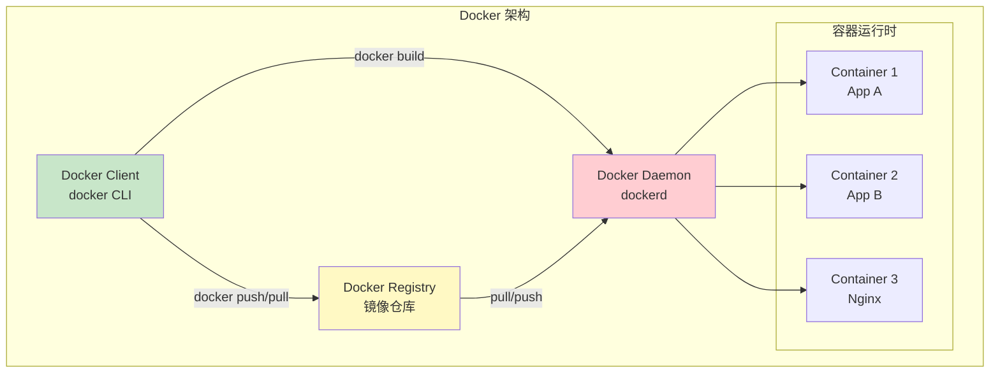
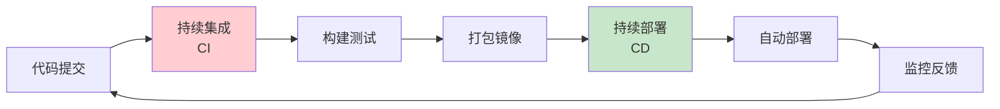
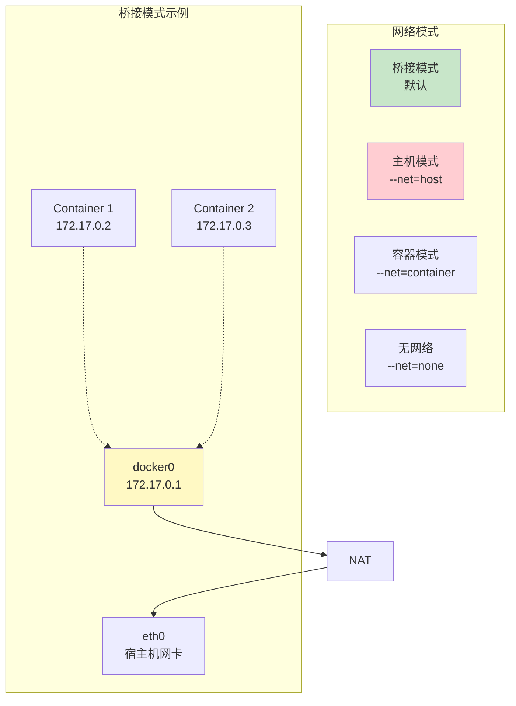
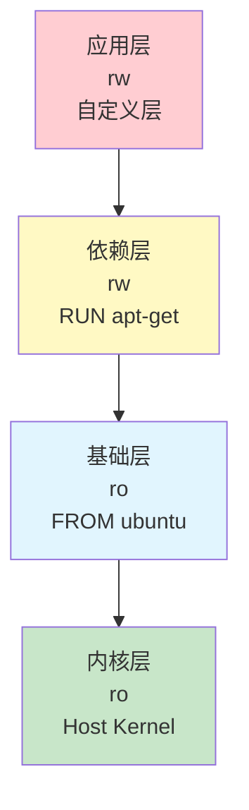
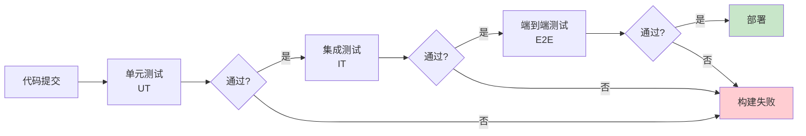

# Docker & CI/CD

> 容器化部署 · CI/CD 流水线 · 容器编排 · 最佳实践

---

## 核心概念（精简版）

### Docker 核心概念



### 核心组件对比

| 概念 | 说明 | 命令示例 |
|:-----|:-----|:---------|
| **Image** | 只读模板 | `docker build`, `docker pull` |
| **Container** | 运行实例 | `docker run`, `docker ps` |
| **Volume** | 数据持久化 | `-v`, `--mount` |
| **Network** | 容器网络 | `docker network create` |
| **Dockerfile** | 镜像构建脚本 | - |

### CI/CD 流水线



---

## 深入原理（深入版）

### Dockerfile 最佳实践

```dockerfile
# 1. 使用多阶段构建减小镜像体积
FROM golang:1.21-alpine AS builder

WORKDIR /app
COPY go.mod go.sum ./
RUN go mod download

COPY . .
RUN CGO_ENABLED=0 go build -o main

# 2. 运行阶段使用最小镜像
FROM alpine:latest

RUN apk --no-cache add ca-certificates
WORKDIR /root/

# 3. 使用非 root 用户运行
RUN addgroup -g 1000 app && \
    adduser -D -u 1000 -G app app
USER app

COPY --from=builder /app/main .
EXPOSE 8080

CMD ["./main"]
```

**最佳实践**：
- 使用 `.dockerignore` 排除不必要文件
- 合并 RUN 指令减少层数
- 利用构建缓存
- 使用多阶段构建
- 最小化镜像体积

### 容器网络模式



| 网络模式 | 隔离性 | 性能 | 使用场景 |
|:---------|:-------|:-----|:---------|
| **bridge** | 完全隔离 | 中等 | 默认，大多数场景 |
| **host** | 无隔离 | 最高 | 高性能网络需求 |
| **container** | 共享容器 | 高等 | Sidecar 模式 |
| **none** | 完全隔离 | 无法访问 | 离线任务 |

### 存储驱动

| 驱动 | 特点 | 适用场景 |
|:-----|:-----|:---------|
| **overlay2** | 联合文件系统，性能好 | 默认，生产环境 |
| **aufs** | 旧版驱动 | 兼容性 |
| **vfs** | 普通文件系统 | 调试 |
| **btrfs/zfs** | 写时复制 | 高性能需求 |

### CI/CD 平台对比

| 特性 | Jenkins | GitLab CI | GitHub Actions |
|:-----|:---------|:-----------|:-------------|
| **安装方式** | 自建 | SaaS / 自建 | SaaS |
| **配置方式** | GUI / Jenkinsfile | .gitlab-ci.yml | .github/workflows |
| **分布式构建** | 支持 | 支持 | 支持 |
| **插件生态** | 丰富 | 一般 | 集成市场 |
| **学习曲线** | 陡 | 中等 | 平缓 |

---

## 实战案例

### 案例 1：Go 应用 Dockerfile

```dockerfile
# 构建阶段
FROM golang:1.21 AS builder

WORKDIR /src
COPY go.* ./
RUN go mod download

COPY . .
RUN CGO_ENABLED=0 GOOS=linux go build -v -o app

# 运行阶段
FROM alpine:latest

RUN apk add --no-cache tzdata
ENV TZ=Asia/Shanghai

WORKDIR /app
COPY --from=builder /src/app .

# 健康检查
HEALTHCHECK --interval=30s --timeout=3s \
  CMD wget --quiet --tries=1 --spider http://localhost:8080/health || exit 1

EXPOSE 8080
CMD ["./app"]
```

### 案例 2：Docker Compose 编排

```yaml
version: '3.8'

services:
  # 应用服务
  app:
    build:
      context: .
      dockerfile: Dockerfile
    ports:
      - "8080:8080"
    environment:
      - DB_HOST=mysql
      - REDIS_HOST=redis
    depends_on:
      mysql:
        condition: service_healthy
      redis:
        condition: service_started
    networks:
      - app-network

  # MySQL
  mysql:
    image: mysql:8.0
    environment:
      MYSQL_ROOT_PASSWORD: rootpassword
      MYSQL_DATABASE: myapp
    volumes:
      - mysql-data:/var/lib/mysql
    healthcheck:
      test: ["CMD", "mysqladmin", "ping", "-h", "localhost"]
      interval: 10s
      timeout: 5s
      retries: 3
    networks:
      - app-network

  # Redis
  redis:
    image: redis:7-alpine
    volumes:
      - redis-data:/data
    networks:
      - app-network

networks:
  app-network:
    driver: bridge

volumes:
  mysql-data:
  redis-data:
```

### 案例 3：Jenkins Pipeline

```groovy
pipeline {
    agent any

    environment {
        DOCKER_REPO = 'registry.example.com'
        IMAGE_NAME = 'myapp'
        TAG = "${env.BUILD_NUMBER}"
    }

    stages {
        stage('Checkout') {
            steps {
                checkout scm
            }
        }

        stage('Build') {
            steps {
                sh 'docker build -t ${DOCKER_REPO}/${IMAGE_NAME}:${TAG} .'
            }
        }

        stage('Test') {
            steps {
                sh 'docker run --rm ${IMAGE_NAME}:${TAG} go test ./...'
            }
        }

        stage('Push') {
            steps {
                sh 'docker push ${DOCKER_REPO}/${IMAGE_NAME}:${TAG}'
                sh 'docker push ${DOCKER_REPO}/${IMAGE_NAME}:latest'
            }
        }

        stage('Deploy') {
            when {
                branch 'main'
            }
            steps {
                sh """
                    kubectl set image deployment/myapp \\
                        myapp=${DOCKER_REPO}/${IMAGE_NAME}:${TAG}
                """
            }
        }
    }

    post {
        always {
            cleanWs()
        }
    }
}
```

### 案例 4：GitLab CI/CD 配置

```yaml
# .gitlab-ci.yml
stages:
  - build
  - test
  - deploy

variables:
  DOCKER_DRIVER: overlay2
  DOCKER_TLS_CERTDIR: "/certs"

services:
  - docker:dind

# 缓存 Docker 镜像
cache:
  paths:
    - .docker-cache

build:
  stage: build
  image: docker:latest
  script:
    - docker login -u $CI_REGISTRY_USER -p $CI_REGISTRY_PASSWORD $CI_REGISTRY
    - docker build -t $CI_REGISTRY_IMAGE:$CI_COMMIT_SHA .
    - docker push $CI_REGISTRY_IMAGE:$CI_COMMIT_SHA
  only:
    - main
    - develop

test:
  stage: test
  image: golang:1.21
  script:
    - go fmt ./...
    - go vet ./...
    - go test -race -coverprofile=coverage.txt ./...
  coverage: '/coverage: \d+\.\d+% of statements/'
  artifacts:
    reports:
      coverage_report:
        path: coverage.txt

deploy:staging:
  stage: deploy
  image: bitnami/kubectl:latest
  script:
    - kubectl config use-context staging
    - kubectl set image deployment/myapp app=$CI_REGISTRY_IMAGE:$CI_COMMIT_SHA -n staging
  environment:
    name: staging
    url: https://staging.example.com
  only:
    - develop

deploy:production:
  stage: deploy
  image: bitnami/kubectl:latest
  script:
    - kubectl config use-context production
    - kubectl set image deployment/myapp app=$CI_REGISTRY_IMAGE:$CI_COMMIT_SHA -n production
  when: manual
  environment:
    name: production
    url: https://example.com
  only:
    - main
```

---

## 面试真题精选

### Q1: Docker 容器与虚拟机的区别？

**参考答案**：

| 特性 | 虚拟机 | 容器 |
|:-----|:-------|:-----|
| **架构** | 完整操作系统 | 共享宿主内核 |
| **启动速度** | 分钟级 | 秒级 |
| **资源占用** | GB 级别 | MB 级别 |
| **隔离性** | 强（硬件级） | 中（进程级） |
| **便携性** | 差 | 好 |

### Q2: Docker 镜像分层原理？

**参考答案**：



**Copy-on-Write**：
- 只读层共享，节省空间
- 写入时复制到可写层
- 镜像构建利用缓存

### Q3: CI/CD 中如何实现自动化测试？

**参考答案**：



**测试金字塔**：
- **单元测试**：快速、大量
- **集成测试**：模块间交互
- **E2E 测试**：用户场景覆盖

### Q4: 如何优化 Docker 镜像大小？

**参考答案**：

1. **使用轻量基础镜像**：`alpine` vs `ubuntu`
2. **多阶段构建**：只保留编译产物
3. **合并 RUN 指令**：减少层数
4. **清理缓存**：`rm -rf /var/cache/*`
5. **使用 `.dockerignore`**：排除无用文件

---

## 参考资料

- [CI/CD Pipelines with Jenkins and Docker in 2025 - Medium](https://utsavdesai26.medium.com/ci-cd-pipelines-with-jenkins-and-docker-in-2025-582d37c440eb)
- [服务器CI/CD架构部署：Jenkins+GitLab+Docker - CSDN](https://blog.csdn.net/2501_93877215/article/details/154154079)
- [Mastering Docker and Jenkins: Build Robust CI/CD Pipelines - Docker Blog](https://www.docker.com/blog/docker-and-jenkins-build-robust-ci-cd-pipelines/)
- [CI/CD Platform Guide: GitHub Actions vs GitLab vs Jenkins - sanj.dev](https://sanj.dev/post/github-actions-gitlab-ci-jenkins-comparison-2025)
- [How to Build a Real-World CI/CD Pipeline for Microservices with Jenkins and Kubernetes - Dev.to](https://dev.to/srinivasamcjf/how-to-build-a-real-world-cicd-pipeline-for-microservices-with-jenkins-and-kubernetes-3pab)
- [Containerized CI/CD: GitLab Pipelines with Docker Runners - DevOps Blog](https://blog.devops.dev/containerized-ci-cd-gitlab-pipelines-with-docker-runners-03b9411088ee)
- [Jenkins vs GitLab CI/CD: The Ultimate Comparison - Wallarm](https://www.wallarm.com/cloud-native-products-101/jenkins-vs-gitlab-ci-cd-automation-tools)
