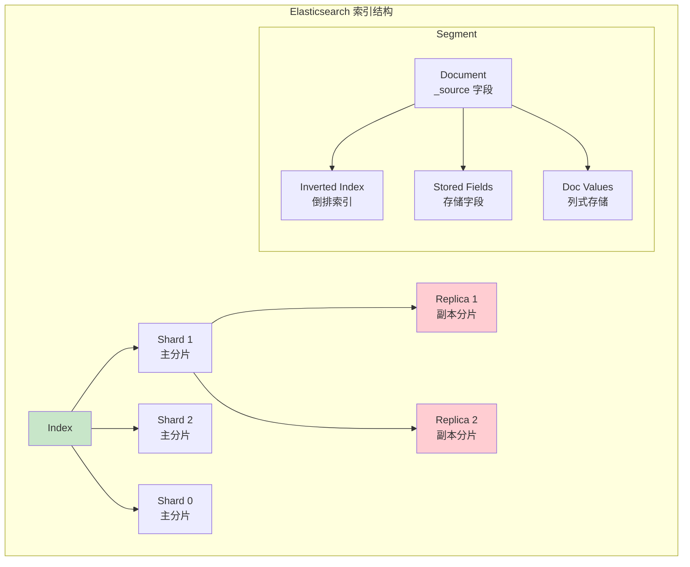
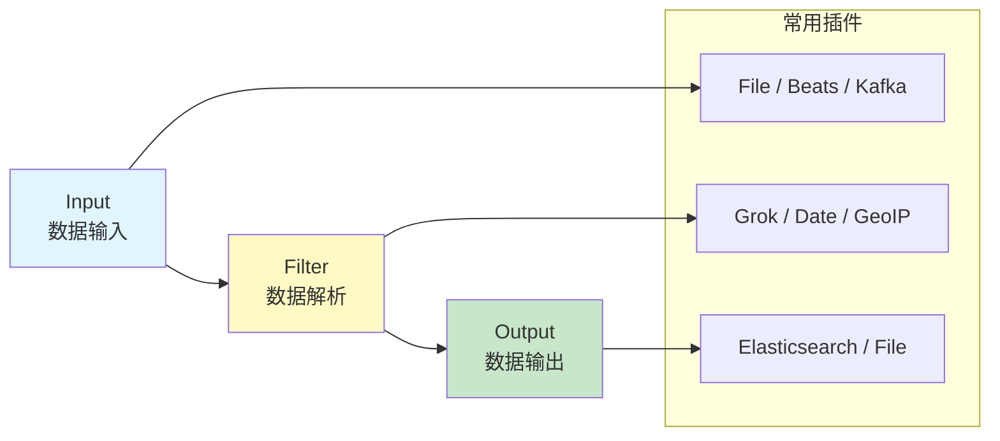
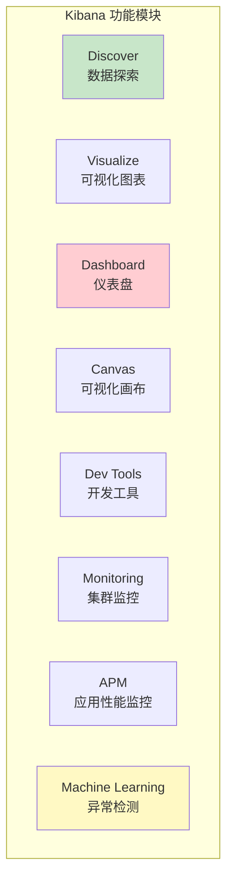

# ELK 技术栈

> Elasticsearch · Logstash · Kibana · Beats · 日志分析

---

## 核心概念（精简版）

### ELK 架构

```mermaid
graph TB
    subgraph "数据源"
        A1[应用日志]
        A2[系统日志]
        A3[网络日志]
        A4[数据库日志]
    end

    subgraph "采集层 Beats"
        F1[Filebeat<br/>文件日志]
        F2[Metricbeat<br/>指标]
        F3[Packetbeat<br/>网络数据]
        F4[Auditbeat<br/>审计日志]
    end

    subgraph "处理层"
        LS[Logstash<br/>数据处理管道]
    end

    subgraph "存储层"
        ES[Elasticsearch<br/>分布式搜索引擎]
    end

    subgraph "展示层"
        K[Kibana<br/>可视化平台]
    end

    A1 --> F1
    A2 --> F1
    A3 --> F3
    A4 --> F4

    F1 --> LS
    F2 --> LS
    F3 --> LS
    F4 --> LS

    LS --> ES
    F1 --> ES  // 可直连 ES
    F2 --> ES

    ES --> K

    style ES fill:#ffcdd2
    style K fill:#c8e6c9
    style LS fill:#fff9c4
```

### 核心组件功能

| 组件 | 功能 | 端口 |
|:-----|:-----|:-----|
| **Elasticsearch** | 分布式存储和搜索 | 9200 (HTTP), 9300 (TCP) |
| **Logstash** | 数据处理管道 | 5000 (TCP) |
| **Kibana** | 数据可视化 | 5601 (HTTP) |
| **Beats** | 轻量级数据采集器 | - |

### 常见 Beat 类型

| Beat | 用途 | 采集内容 |
|:-----|:-----|:---------|
| **Filebeat** | 文件日志 | 应用日志、访问日志 |
| **Metricbeat** | 系统指标 | CPU、内存、磁盘 |
| **Packetbeat** | 网络数据 | 数据包、协议分析 |
| **Heartbeat** | 可用性监控 | 服务探活 |
| **Auditbeat** | 审计数据 | 系统调用、文件变更 |

---

## 深入原理（深入版）

### Elasticsearch 数据结构



**核心概念**：

| 概念 | 说明 |
|:-----|:-----|
| **Index** | 类似数据库，包含多个文档 |
| **Type** (已废弃) | 文档类型，7.x+ 不再使用 |
| **Document** | JSON 格式的数据记录 |
| **Field** | 文档中的字段 |
| **Shard** | 索引分片，实现分布式 |
| **Replica** | 副本分片，实现高可用 |

### 倒排索引原理

```
文档内容：
├── Doc1: "Go is great"
├── Doc2: "Elasticsearch is fast"
└── Doc3: "Go并发编程"

倒排索引：
├── "Go": [Doc1, Doc3]
├── "is": [Doc1, Doc2]
├── "great": [Doc1]
├── "Elasticsearch": [Doc2]
├── "fast": [Doc2]
└── "并发编程": [Doc3]
```

### Logstash 处理流程



**Logstash 配置示例**：
```conf
input {
  beats {
    port => 5044
  }
}

filter {
  # 解析 Apache 日志
  grok {
    match => { "message" => "%{COMMONAPACHELOG}" }
  }

  # 解析时间戳
  date {
    match => ["timestamp", "dd/MMM/yyyy:HH:mm:ss"]
  }

  # 提取 GeoIP
  geoip {
    source => "clientip"
  }
}

output {
  elasticsearch {
    hosts => ["localhost:9200"]
    index => "apache-%{+YYYY.MM.dd}"
  }
}
```

### Kibana 可视化功能



---

## 实战案例

### 案例 1：Filebeat 配置

```yaml
# filebeat.yml
filebeat.inputs:
  - type: log
    enabled: true
    paths:
      - /var/log/*.log
    fields:
      app: myapp
      env: production
    multiline:
      pattern: '^\['
      negate: true
      match: after

output.elasticsearch:
  hosts: ["localhost:9200"]
  indices:
    - index: "myapp-%{+yyyy.MM.dd}"

# 模板加载
setup.template.name: "myapp"
setup.template.pattern: "myapp-*"
setup.template.enabled: true
```

### 案例 2：Elasticsearch 查询

```json
// bool 查询
GET /logs/_search
{
  "query": {
    "bool": {
      "must": [
        { "match": { "level": "ERROR" } }
      ],
      "filter": [
        { "range": { "@timestamp": { "gte": "now-1h" } } }
      ]
    }
  },
  "aggs": {
    "by_level": {
      "terms": { "field": "level.keyword" }
    },
    "over_time": {
      "date_histogram": {
        "field": "@timestamp",
        "calendar_interval": "1m"
      }
    }
  }
}

// 聚合查询
GET /logs/_search
{
  "size": 0,
  "aggs": {
    "top_urls": {
      "terms": {
        "field": "url.keyword",
        "size": 10
      }
    },
    "avg_response": {
      "avg": { "field": "response_time" }
    }
  }
}
```

### 案例 3：Kibana 仪表盘

```javascript
// Kibana Lens 可视化
{
  "type": "lens",
  "attributes": {
    "title": "API 监控",
    "visualizations": [
      {
        "type": "lnsMetric",
        "metric": { "field": "response_time", "aggregation": "avg" }
      },
      {
        "type": "lnsXY",
        "xAxis": { "field": "@timestamp", "aggregation": "date_histogram" },
        "yAxis": { "field": "count", "aggregation": "count" }
      }
    ]
  }
}
```

### 案例 4：完整 ELK 部署 (Docker Compose)

```yaml
version: '3.8'

services:
  elasticsearch:
    image: elasticsearch:8.0.0
    environment:
      - discovery.type=single-node
      - "ES_JAVA_OPTS=-Xms512m -Xmx512m"
    ports:
      - "9200:9200"
    volumes:
      - es-data:/usr/share/elasticsearch/data
    networks:
      - elk

  logstash:
    image: logstash:8.0.0
    volumes:
      - ./logstash/pipeline.logstash/pipeline/logstash
      - ./logstash/config/logstash.yml:/usr/share/logstash/config/logstash.yml:ro
    ports:
      - "5044:5044"
    networks:
      - elk
    depends_on:
      - elasticsearch

  kibana:
    image: kibana:8.0.0
    ports:
      - "5601:5601"
    environment:
      - ELASTICSEARCH_HOSTS=http://elasticsearch:9200
    networks:
      - elk
    depends_on:
      - elasticsearch

  filebeat:
    image: elastic/filebeat:8.0.0
    user: root
    volumes:
      - /var/log:/var/log:ro
      - ./filebeat/filebeat.yml:/usr/share/filebeat/filebeat.yml:ro
    networks:
      - elk
    depends_on:
      - logstash

networks:
  elk:
    driver: bridge

volumes:
  es-data:
```

---

## 面试真题精选

### Q1: ELK 各组件的作用和关系？

**参考答案**：

| 组件 | 作用 | 替代方案 |
|:-----|:-----|:---------|
| **Beats** | 轻量采集器 | Fluentd, Flume |
| **Logstash** | 数据处理、转换 | Fluentd, Kafka Streams |
| **Elasticsearch** | 存储和搜索 | Solr, ClickHouse |
| **Kibana** | 可视化展示 | Grafana |

### Q2: Elasticsearch 如何实现分布式？

**参考答案**：

1. **分片 (Sharding)**：数据按路由规则分散到各节点
2. **副本 (Replication)**：每个分片有多个副本
3. **Master 选举**：集群自动选举 Master 节点
4. **数据平衡**：自动在节点间重新平衡

### Q3: 如何优化 Elasticsearch 性能？

**参考答案**：

| 优化点 | 措施 |
|:-------|:-----|
| **硬件** | SSD、大内存 |
| **分片策略** | 合理设置分片数（通常 1-50GB/分片） |
| **副本** | 根据可用性需求设置（通常 1-2 个副本） |
| **索引** | 按时间/业务拆分索引 |
| **查询** | 使用 filter 上下文、避免深分页 |
| **刷新间隔** | 增加 refresh_interval 减少段合并 |

---

## 参考资料

- [Elasticsearch Official Documentation](https://www.elastic.co/guide/en/elasticsearch/reference/current/index.html)
- [Logstash Documentation](https://www.elastic.co/guide/en/logstash/current/index.html)
- [Kibana Guide](https://www.elastic.co/guide/en/kibana/current/index.html)
