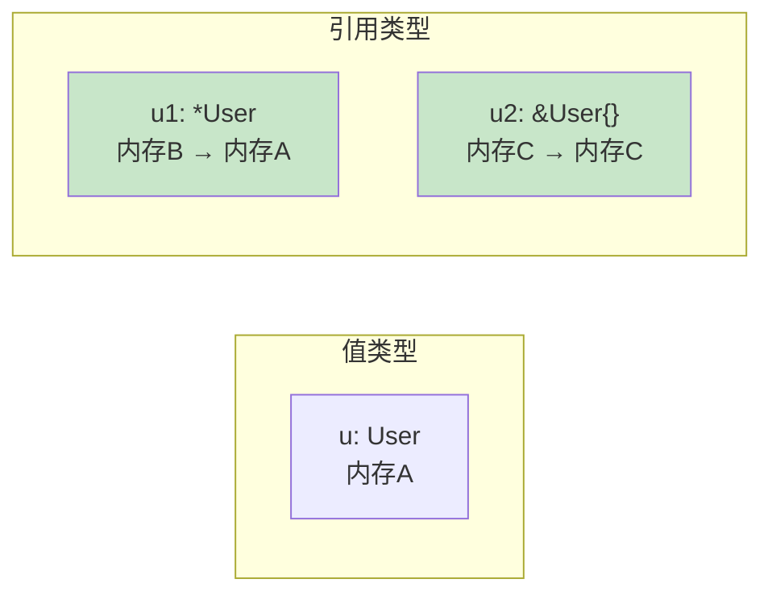
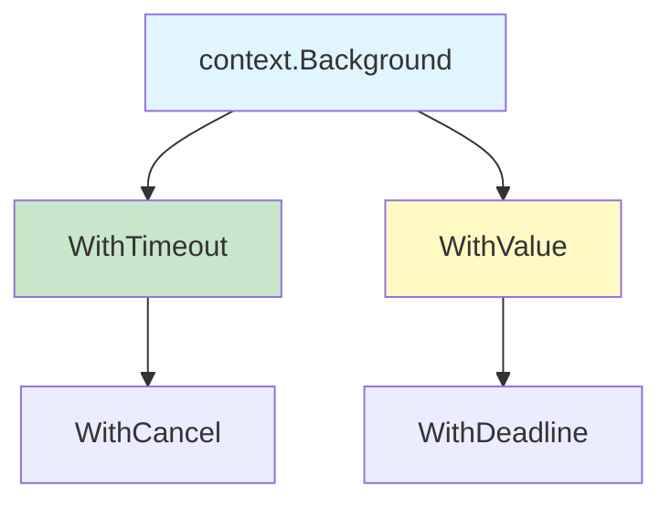
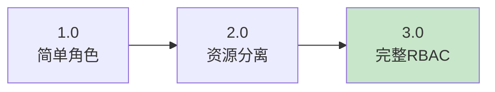
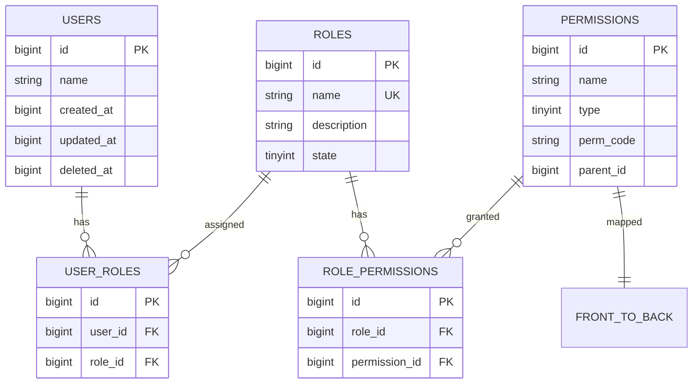

# Go 语言基础

> 基础类型 · 编码规范 · RBAC 权限设计

---

## 基础类型

### struct 结构体

```go
var u User      // 结构体实例，零值
var u1 *User    // 指针，nil
u1 = &u         // 指向 u 的内存地址
u2 := &User{}   // 新分配内存地址
u3 := new(User) // 等价于 u2
```

**内存布局**：


### slice 切片

```go
var l []int          // nil，len=0, cap=0
l1 := make([]int, 10) // len=10, cap=10，填充零值

// 头部插入（优化版本）
func prepend(slice []int, elems ...int) []int {
    return append(elems, slice...)
}

// 切片增长原理：cap 翻倍直到 1024，之后增长 25%
```

**切片内部结构**：
```go
type slice struct {
    ptr unsafe.Pointer  // 指向底层数组
    len int            // 长度
    cap int            // 容量
}
```

### map 映射

```go
// 开发规范：预分配容量
m := make(map[int]int, 10)  // 避免 runtime.grow

// 业务代码：简单初始化
m2 := map[string]int{}

// map 零值为 nil，访问不存在的 key 返回零值
if v, ok := m[1]; ok {
    fmt.Println("key exists:", v)
}
```

**底层实现**：
- Go 1.18+ 使用 Swiss Tables
- Hash 冲突：链表 + 迁移
- 负载因子：6.5 时触发扩容

### channel 通道

```go
c := make(chan int)       // 无缓冲 channel
c1 := make(chan int, 10)  // 缓冲 channel

// 遍历 channel
for v := range c {
    fmt.Println(v)
}

// 安全遍历（检查关闭）
for {
    select {
    case v, ok := <-c:
        if !ok {
            return // channel 已关闭
        }
        fmt.Println(v)
    }
}
```

**channel 操作**：

| 操作 | nil channel | 已关闭 | 正常 |
|:-----|:-----------|:-------|:-----|
| **发送** | 永久阻塞 | panic | 阻塞/发送 |
| **接收** | 永久阻塞 | 返回零值 | 阻塞/接收 |
| **关闭** | panic | panic | 成功 |

---

## 锁机制

```go
var mux sync.Mutex    // 互斥锁
var muxr sync.RWMutex // 读写锁

// 互斥锁使用
mux.Lock()
defer mux.Unlock()

// 尝试获取锁
if mux.TryLock() {
    defer mux.Unlock()
}

// 原子操作（更高效）
// "go.uber.org/atomic"
a := atomic.NewInt32(0)
a.Add(1)  // 原子加
a.Load()   // 原子读
```

**锁选择**：

| 场景 | 推荐方案 |
|:-----|:---------|
| 简单计数 | atomic |
| 读多写少 | RWMutex |
| 写多读少 | Mutex |
| 复杂同步 | Channel |

---

## 协程并发

### WaitGroup 等待组

```go
var w sync.WaitGroup
for i := 0; i < 20; i++ {
    w.Add(1)
    go func(i int) {
        defer w.Done()
        fmt.Println(i)  // 注意：传参避免闭包问题
    }(i)
}
w.Wait()
```

### Context 控制协程

```go
// 带超时的 context
ctx, cancel := context.WithTimeout(context.Background(), time.Second*10)
defer cancel()

select {
case <-ctx.Done():
    return ctx.Err()
default:
    // 继续执行
}
```

**Context 层级**：


### sync.Pool 对象池

```go
var wgPool = sync.Pool{
    New: func() interface{} {
        return &sync.WaitGroup{}
    },
}

func doWork() {
    wg := wgPool.Get().(*sync.WaitGroup)
    defer wgPool.Put(wg)  // 归还到池中

    wg.Add(1)
    go func() {
        defer wg.Done()
        // 工作逻辑
    }()
    wg.Wait()
}
```

### sync.Map 并发 Map

```go
var m sync.Map

// 存储
m.Store("key", "value")

// 读取
if v, ok := m.Load("key"); ok {
    fmt.Println(v)
}

// 遍历
m.Range(func(key, value interface{}) bool {
    fmt.Println(key, value)
    return true  // 继续遍历
    // return false  // 停止遍历
})
```

---

## defer 与 panic/recover

### defer 执行顺序

```go
func main() {
    defer func() {
        fmt.Println("2")  // 后执行
    }()
    defer func() {
        if err := recover(); err != nil {
            fmt.Println("recover:", err)
        }
        fmt.Println("1")  // 先执行
    }()
    panic("error")
}
// 输出：1 2
```

### 资源清理最佳实践

```go
// ❌ 不好的做法
file, _ := os.Open("file.txt")
defer file.Close()  // 如果 open 失败，file 为 nil

// ✅ 正确做法
file, err := os.Open("file.txt")
if err != nil {
    return err
}
defer file.Close()
```

---

## 时间处理

```go
import "time"

// 定时器（触发一次）
t1 := time.NewTimer(time.Second * 10)
defer t1.Stop()
<-t1.C  // 阻塞直到触发

// Ticker（周期触发）
t2 := time.NewTicker(2 * time.Second)
defer t2.Stop()
for range t2.C {
    // 每 2 秒执行一次
}

// 时区处理
location, _ := time.LoadLocation("Asia/Shanghai")
tm := time.Now()
tm.In(location).Format("2006-01-02 15:04:05")

// 时间计算
time.Since(tm)      // 距离现在多久
tm.Sub(time.Now())  // 时间差
tm.UnixMilli()     // 毫秒时间戳
```

---

## 字符串处理

```go
import (
    "strconv"
    "strings"
)

// 类型转换
strconv.Atoi("10")        // string → int
strconv.Itoa(10)         // int → string
strconv.ParseInt("10", 10, 64)  // 解析为 int64
strconv.FormatInt(10, 10)         // int64 → string

// 字符串操作
strings.Contains("hello", "ell")  // true
strings.HasPrefix("hello", "he")   // true
strings.Split("a,b,c", ",")       // ["a", "b", "c"]
```

### 字节与字符

```go
s := "hello"
// []byte(s)  = [104 101 108 108 111]  // 5 bytes
// []rune(s) = [104 101 108 108 111]  // 5 runes

s = "你好"
// []byte(s)  = [228 189 160 229 165 189]  // 6 bytes
// []rune(s) = [20320 22909]  // 2 runes
```

---

## 编码规范

### 1. 常量组织

```go
type Operation int

const (
    Add Operation = iota + 1  // 从 1 开始
    Subtract
    Multiply
    Divide
)

const (
    EnvVar = "MY_ENV"        // 独立常量单独声明
    Timeout = 30 * time.Second
)
```

### 2. 减少嵌套，尽早退出

```go
// ❌ 不好：深层嵌套
func process(data []Data) error {
    for _, v := range data {
        if v.F1 != 1 {
            if v.F2 != 2 {
                if v.F3 != 3 {
                    // 实际逻辑
                }
            }
        }
    }
}

// ✅ 好：尽早退出
func process(data []Data) error {
    for _, v := range data {
        if v.F1 != 1 {
            log.Printf("Invalid v: %v", v)
            continue
        }

        v = process(v)
        if err := v.Call(); err != nil {
            return err
        }

        v.Send()
    }
    return nil
}
```

### 3. 嵌入式类型

```go
type User struct{}

type Person struct {
    User  // 嵌入类型，匿名
    name string
}

// 可直接调用 Person.User 的方法
p := Person{}
p.UserMethod()  // 通过嵌入直接调用
```

### 4. 避免反斜杠转义

```go
// ❌ 不好
wantError := "unknown \nname:\"test\""

// ✅ 好：使用原始字符串
wantError := `unknown
name:"test"`
```

### 5. 指定字段省略零值

```go
// ❌ 不好
user := User{
    FirstName:  "John",
    LastName:   "Doe",
    MiddleName: "",      // 零值
    Admin:      false,  // 零值
}

// ✅ 好：省略零值
user := User{
    FirstName: "John",
    LastName:  "Doe",
}
```

### 6. 错误处理：不使用 panic

```go
// ❌ 业务代码不要 panic
if err != nil {
    panic("failed to open file")
}

// ✅ 返回错误
if err != nil {
    return fmt.Errorf("failed to open file: %w", err)
}
```

---

## Struct Tag

```go
type User struct {
    Name  string `json:"name,omitempty" yaml:"name"`
    Age   int    `json:"age" validate:"gte=0,lte=150"`
    Role  string `json:"-"`  // 忽略字段
}
```

**常用 Tag**：

| Tag | 说明 | 示例 |
|:-----|:-----|:-----|
| `json` | JSON 序列化 | `json:"name,omitempty"` |
| `yaml` | YAML 序列化 | `yaml:"name"` |
| `gorm` | ORM 映射 | `gorm:"primaryKey"` |
| `validate` | 参数校验 | `validate:"required"` |

---

## go mod 使用

```bash
# 初始化模块
go mod init github.com/user/project

# 整理依赖
go mod tidy

# 获取指定版本
go get github.com/pkg/errors@v0.9.1

# 获取指定 commit
go get github.com/pkg/errors@abc123

# 升级所有依赖
go get -u ./...

# 查看依赖图
go mod graph
```

---

## RBAC 权限设计

### 设计演进



### 3.0 数据库设计

#### 表关系



#### 核心表结构

**角色表 (roles)**：
| 字段 | 类型 | 说明 |
|:-----|:-----|:-----|
| id | BIGINT | 主键 |
| name | VARCHAR(50) | 角色名称，唯一 |
| description | VARCHAR(200) | 角色描述 |
| state | TINYINT | 状态：0-正常，1-禁用 |

**权限表 (permissions)**：
| 字段 | 类型 | 说明 |
|:-----|:-----|:-----|
| id | BIGINT | 主键 |
| name | VARCHAR(100) | 权限名称 |
| type | TINYINT | 类型：1-后端，2-前端 |
| perm_code | VARCHAR(200) | 权限标识（method:path） |
| parent_id | BIGINT | 父权限 ID |

### API 设计

```protobuf
// 角色管理
message ModelRole {
    uint64 id = 1;
    int64 created_at = 2;
    int64 updated_at = 3;
    int64 deleted_at = 4;
    string name = 11;
    string description = 13;
    State state = 15;

    enum State {
        Normal = 0;
        Disabled = 1;
    }
}

// 权限管理
message ModelPermission {
    uint64 id = 1;
    int64 created_at = 2;
    int64 updated_at = 3;
    int64 deleted_at = 4;
    string name = 11;
    Type type = 12;
    string perm_code = 13;
    uint64 parent_id = 14;

    enum Type {
        Nil = 0;
        Back = 1;
        Front = 2;
    }
}
```

### 缓存更新策略

| 操作 | 缓存更新 |
|:-----|:---------|
| 分配角色给用户 | 删除用户角色缓存 |
| 移除用户角色 | 删除用户角色缓存 |
| 分配权限给角色 | 删除角色权限缓存 |
| 移除角色权限 | 删除角色权限缓存 |

---

## 参考资料

- [Effective Go](https://go.dev/doc/effective_go)
- [Go Code Review Comments](https://github.com/golang/go/wiki/CodeReviewComments)
- [The Go Blog: Arrays, slices (and strings)](https://go.dev/blog/slices)
