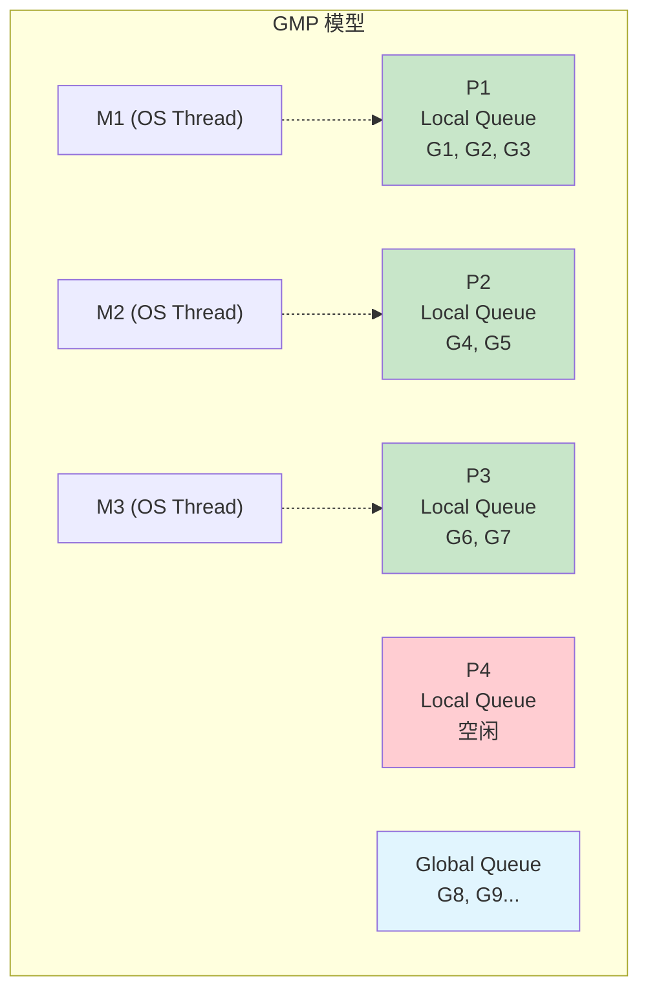
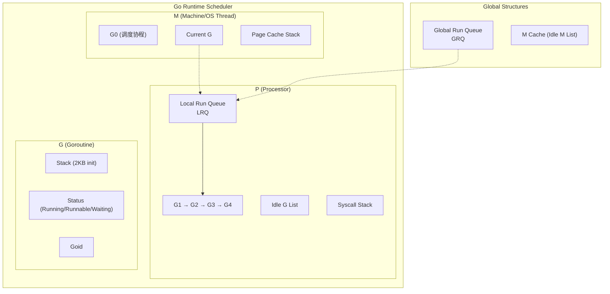
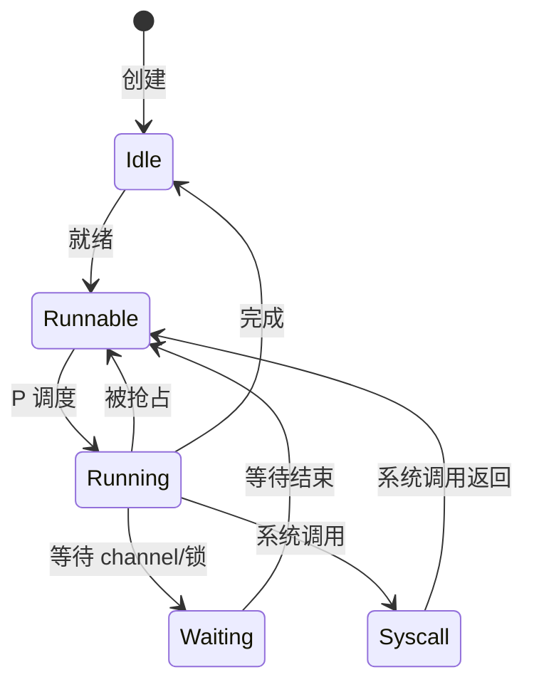
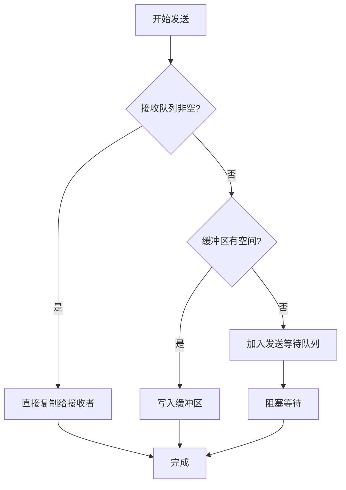
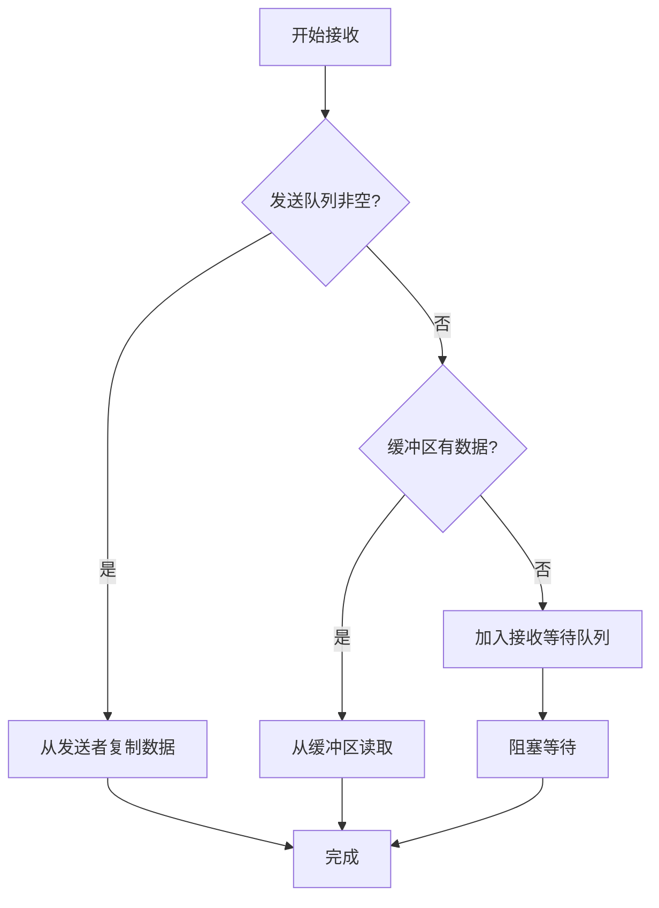
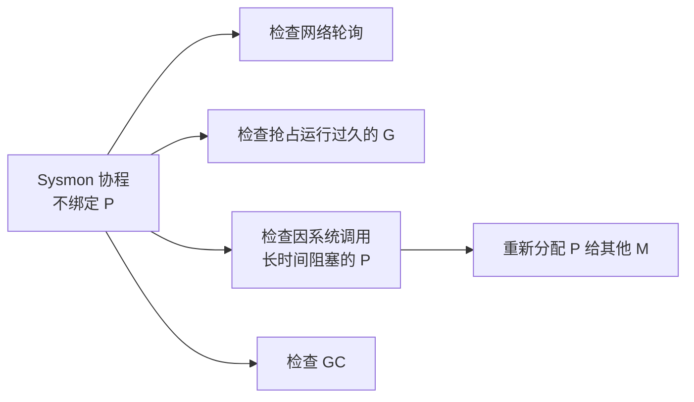

# Go 并发底层原理

> GMP 模型 · Channel 原理 · 调度器

---

## 核心概念（精简版）

### GMP 调度模型

Go 的调度器由三个核心组件构成：

| 组件 | 全称 | 描述 |
|:-----|:-----|:-----|
| **G** | Goroutine | 协程任务，包含执行栈、指令指针等 |
| **M** | Machine | 系统线程，与内核线程绑定 |
| **P** | Processor | 逻辑处理器，维护本地运行队列 |



### 调度策略

| 策略 | 说明 |
|:-----|:-----|
| **Work Stealing** | P 从其他 P 的本地队列窃取 G |
| **Hand Off** | M 因系统调用阻塞时，转移 P 给其他 M |
| **Preemptive** | 抢占式调度，防止 goroutine 饥饿 |

### Channel 底层结构

Channel 使用 `hchan` 结构体实现：

```go
// runtime/chan.go
type hchan struct {
    qcount   uint           // 当前队列中元素个数
    dataqsiz uint           // 环形队列容量
    buf      unsafe.Pointer // 环形队列指针
    elemsize uint16         // 元素大小
    closed   uint32         // 是否关闭
    elemtype *_type         // 元素类型
    sendx    uint           // 发送索引
    recvx    uint           // 接收索引
    recvq    waitq          // 接收等待队列
    sendq    waitq          // 发送等待队列
    lock     mutex          // 互斥锁
}
```

### 常见面试题

> Q: 为什么 Go 需要 P 而不是直接 M 调度 G？

**A**: P 的引入解决了几个关键问题：
1. **减少全局锁竞争**：每个 P 有本地队列，避免全局锁
2. **更好的缓存局部性**：G 在同一 P 上执行，CPU 缓存命中率更高
3. **控制并发度**：`GOMAXPROCS` 设置 P 的数量，避免过多线程竞争
4. **Work Stealing** 实现：P 之间可以窃取任务

---

## 深入原理（深入版）

### GMP 模型详细结构



### Goroutine 状态转换



### Goroutine 状态说明

| 状态 | 常量 | 描述 |
|:-----|:-----|:-----|
| 空闲 | `_Gidle` | 刚分配，尚未初始化 |
| 就绪 | `_Grunnable` | 在运行队列中，等待执行 |
| 运行中 | `_Grunning` | 正在执行 |
| 系统调用 | `_Gsyscall` | 正在执行系统调用 |
| 等待 | `_Gwaiting` | 阻塞状态（channel、锁等） |
| 已结束 | `_Gdead` | 已结束，可被复用 |

### Channel 操作详解

#### 发送操作流程



#### 接收操作流程



### Channel 数据结构深入

```go
type waitq struct {
    first *sudog
    last  *sudog
}

type sudog struct {
    g           *g
    next        *sudog
    prev        *sudog
    elem        unsafe.Pointer
    acquiretime int64
    releasetime int64
    ticket      uint32
    isSelect    bool
    success     bool
    parent      *sudog
    waitlink    *sudog
    c           *hchan
}
```

**关键点**：
- `recvq` 和 `sendq` 是等待队列，存储阻塞的 goroutine
- `sudog` 是 goroutine 在 channel 中的封装
- 环形队列大小为 2^n，利用位运算优化索引

### 调度器触发时机

| 触发场景 | 说明 |
|:---------|:-----|
| **函数调用** | 每次函数调用检查是否需要调度 |
| **GC** | 垃圾回收时触发调度 |
| **系统调用** | 长时间系统调用时让出 P |
| **时间片** | 一定时间后主动让出 CPU（Sysmon 监控） |

### Sysmon 系统监控



---

## 实战案例

### 案例 1：避免 goroutine 泄漏

```go
// ❌ 错误示例：goroutine 泄漏
func leak() {
    ch := make(chan int)
    go func() {
        val := <-ch  // 永远阻塞
        fmt.Println(val)
    }()
    // 如果 ch 永远不发送，goroutine 永远退出
}

// ✅ 正确示例：使用 context
func noLeak(ctx context.Context) error {
    ch := make(chan int)
    go func() {
        select {
        case val := <-ch:
            fmt.Println(val)
        case <-ctx.Done():
            fmt.Println("goroutine 退出")
            return
        }
    }()

    select {
    case ch <- 42:
        return nil
    case <-ctx.Done():
        return ctx.Err()
    }
}
```

### 案例 2：Work Stealing 验证

```go
package main

import (
    "fmt"
    "runtime"
    "sync"
    "time"
)

func main() {
    runtime.GOMAXPROCS(2)

    var wg sync.WaitGroup
    start := time.Now()

    // 创建大量任务，观察 work stealing
    for i := 0; i < 100; i++ {
        wg.Add(1)
        go func(n int) {
            defer wg.Done()
            // 模拟工作
            time.Sleep(10 * time.Millisecond)
        }(i)
    }

    wg.Wait()
    fmt.Printf("耗时: %v\n", time.Since(start))
}
```

### 案例 3：Channel 性能优化

```go
// ✅ 缓冲 channel 减少阻塞
// 根据生产-消费速度差异设置合适的缓冲大小
ch := make(chan int, 1000)

// ✅ 预分配 channel 容量避免扩容
// channel 创建后容量不可变，合理预估大小很重要

// ✅ 使用 select 实现 timeout
select {
case result := <-ch:
    return result
case <-time.After(time.Second * 5):
    return errors.New("timeout")
}
```

---

## 面试真题精选

### Q1: 详细解释 Go 调度器的 Work Stealing 机制

**参考答案**：

Work Stealing 是 Go 调度器优化负载均衡的核心机制：

1. **优先从本地队列获取**：每个 P 优先执行自己本地队列中的 G
2. **本地队列为空时窃取**：
   - 从全局队列获取：每隔 61 次调度检查一次全局队列
   - 从其他 P 窃取：从其他 P 的队列尾部窃取一半的 G
3. **窃取策略**：窃取队列的一半（平衡负载，减少竞争）

```go
// 简化伪代码
func run() {
    for {
        // 1. 从本地队列获取
        g := getLocalG()
        if g == nil {
            // 2. 从全局队列获取（每 61 次）
            if shouldCheckGlobal() {
                g = getGlobalG()
            }
        }
        if g == nil {
            // 3. 从其他 P 窃取
            g = stealG()
        }
        if g != nil {
            execute(g)
        }
    }
}
```

### Q2: Channel 的 send 和 recv 操作如何实现同步？

**参考答案**：

Channel 通过以下机制实现同步：

1. **无缓冲 channel**：
   - 发送方阻塞直到有接收方
   - 接收方阻塞直到有发送方
   - 数据直接从发送方复制到接收方（不经过缓冲区）

2. **有缓冲 channel**：
   - 缓冲区未满：发送方直接写入
   - 缓冲区已满：发送方加入 sendq 等待队列
   - 缓冲区有数据：接收方直接读取
   - 缓冲区为空：接收方加入 recvq 等待队列

3. **唤醒机制**：
   - 发送时如果有接收者在 recvq，直接复制数据并唤醒接收者
   - 接收时如果有发送者在 sendq，直接复制数据并唤醒发送者

### Q3: goroutine 与线程的区别是什么？

**参考答案**：

| 特性 | Goroutine | OS Thread |
|:-----|:----------|:-----------|
| 内存占用 | 初始 2KB，可动态增长 | 通常 1-8MB 固定 |
| 创建成本 | 极低（微秒级） | 较高（毫秒级） |
| 切换成本 | 低（用户态） | 高（内核态） |
| 调度方式 | Go runtime 调度器 | OS 调度器 |
| 数量限制 | 可轻松创建数万 | 受系统资源限制 |

### Q4: 什么是goroutine的抢占式调度？

**参考答案**：

Go 1.14 引入的抢占式调度机制：

1. **基于信号的抢占**：
   - 编译器在函数入口插入安全点检查
   - Sysmon 检测到 G 运行超过 10ms，发送信号
   - 收到信号后检查是否让出 CPU

2. **解决饥饿问题**：
   - 防止某个长时间运行的 goroutine 独占 P
   - 保证其他 goroutine 公平获得调度机会

### Q5: select 语句的实现原理？

**参考答案**：

1. **编译阶段**：
   - 收集所有 case 中的 channel
   - 生成 `scase` 结构体数组
   - 优化：如果只有一个非 default case，转为普通操作

2. **运行阶段**：
   - 加锁所有 channel
   - 按顺序检查是否有可操作的 channel
   - 如果有：解锁其他 channel，执行对应 case
   - 如果无且无 default：加入所有 channel 的等待队列，阻塞
   - 被唤醒后，从等待队列移除，执行对应 case

3. **随机顺序**：
   - 为避免饥饿，lockorder 使用洗牌算法随机化

---

## 参考资料

- [解构Go并发之核，与Dmitry Vyukov共探Go调度艺术](https://tonybai.com/2025/06/18/inside-goroutine-scheduler-column/)
- [GMP调度模型](https://marksuper.xyz/2025/03/15/gmp/)
- [Go Channel底层原理 - 知乎](https://zhuanlan.zhihu.com/p/496004953)
- [Go 语言Channel 实现原理精要 - 面向信仰编程](https://draven.co/golang/docs/part3-runtime/ch06-concurrency/golang-channel/)
- [Go语言的『餐厅革命』：基于GMP 模型的Goroutine 调度策略](https://www.jet-lab.site/blogs/go-gmp)
- [Go Scheduler 的GMP 模型 - 火山引擎](https://developer.volcengine.com/articles/7599493984361545766)
- [Golang 语言的goroutine 调度器模型GPM - 腾讯云](https://cloud.tencent.com/developer/article/1778063)
