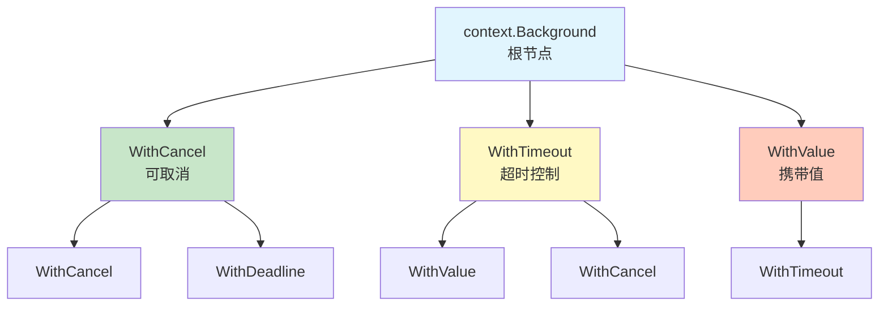
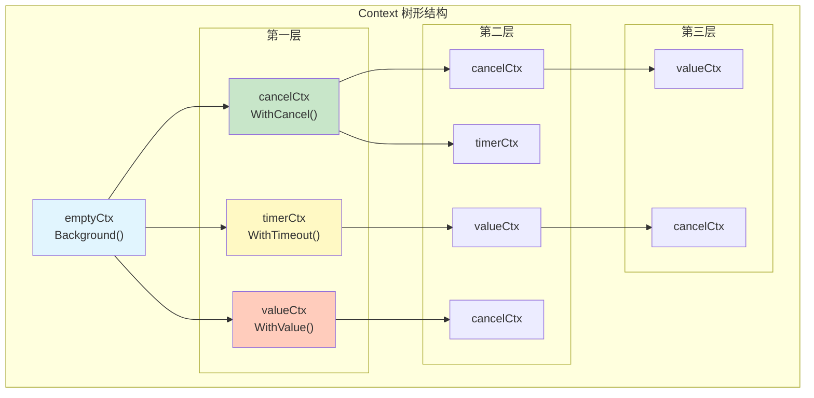
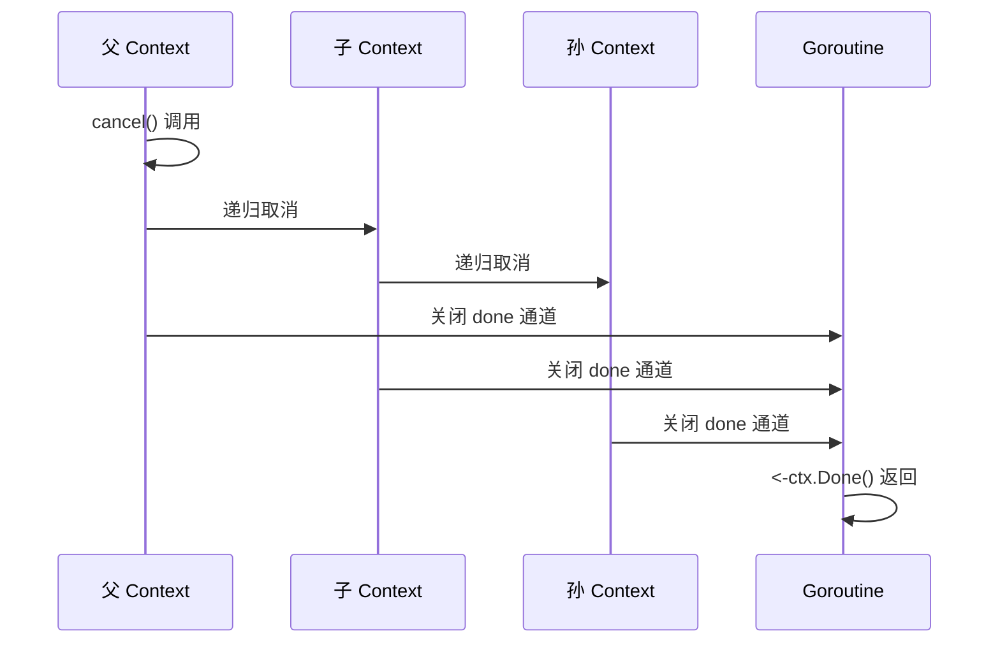
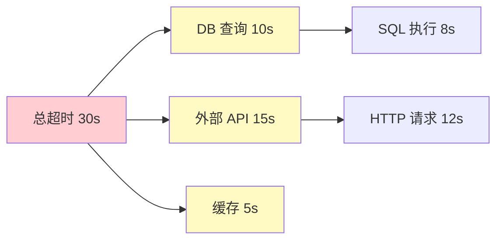
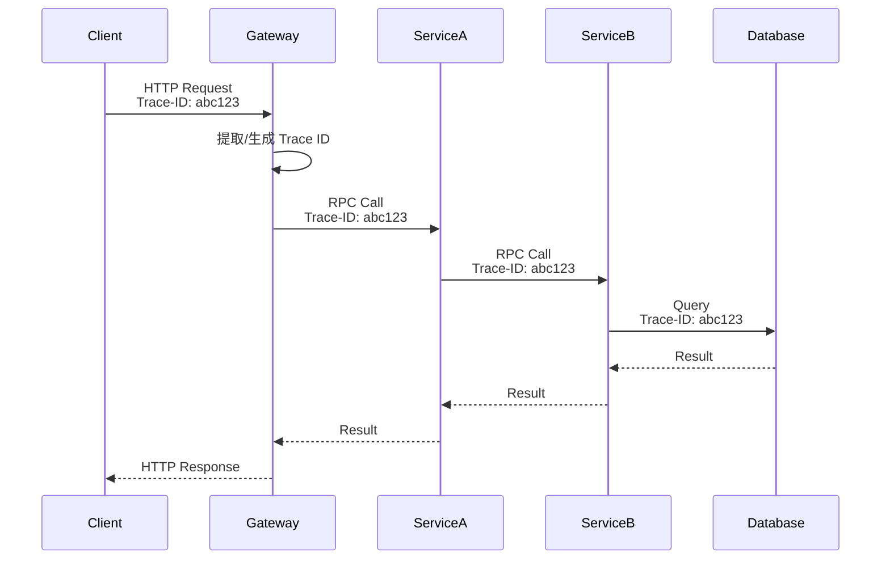
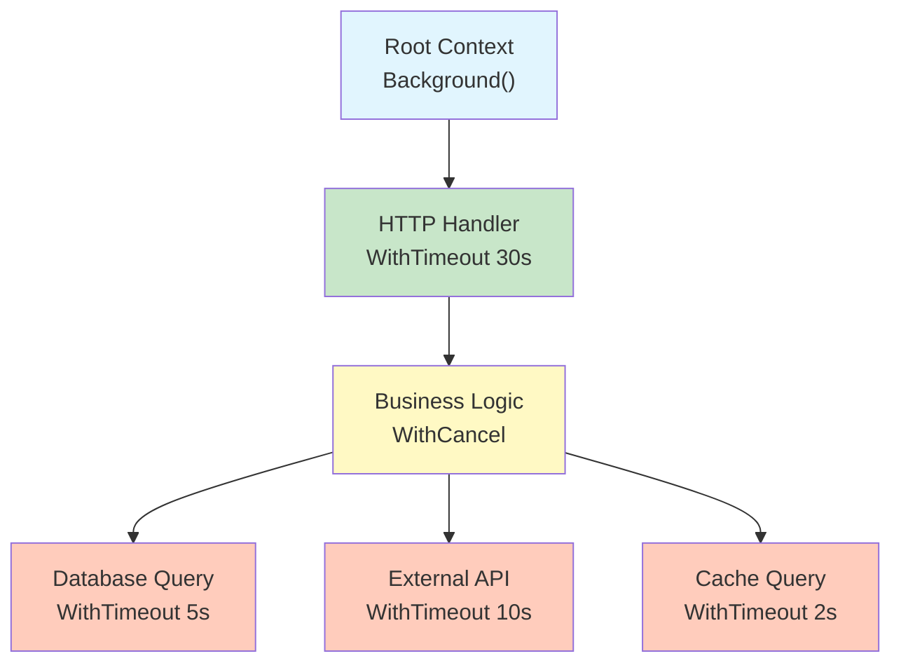

# Go Context 上下文

> 信号传播 · 超时控制 · 优雅关闭

---

## 核心概念（精简版）

### Context 接口定义

```go
type Context interface {
    Deadline() (deadline time.Time, ok bool)
    Done() <-chan struct{}
    Err() error
    Value(key interface{}) interface{}
}
```

**四大核心方法**：

| 方法 | 返回值 | 说明 |
|:-----|:-------|:-----|
| `Deadline()` | (time.Time, bool) | 获取截止时间，未设置则 ok=false |
| `Done()` | <-chan struct{} | 返回只读通道，取消或超时时关闭 |
| `Err()` | error | 返回取消原因，Done 未关闭时返回 nil |
| `Value()` | interface{} | 根据键检索上下文值 |

### Context 创建方式

```go
// 1. 根 Context（不可取消，无值，无截止时间）
ctx1 := context.Background()  // 主协程、初始化、测试
ctx2 := context.TODO()        // 未知使用场景

// 2. 可取消 Context
ctx, cancel := context.WithCancel(context.Background())
defer cancel()  // 避免资源泄漏

// 3. 超时 Context
ctx, cancel := context.WithTimeout(context.Background(), 3*time.Second)
defer cancel()

// 4. 截止时间 Context
deadline := time.Now().Add(24 * time.Hour)
ctx, cancel := context.WithDeadline(context.Background(), deadline)
defer cancel()

// 5. 值 Context
ctx := context.WithValue(context.Background(), "key", "value")
```


### Context 层级结构



**取消传播特性**：当父 Context 取消时，所有子 Context 自动取消。

---

## 深入原理（深入版）

### 四种 Context 实现类型

```go
// 1. emptyCtx：不可取消、无值、无截止时间
type emptyCtx int

func (*emptyCtx) Deadline() (deadline time.Time, ok bool) {
    return
}

func (*emptyCtx) Done() <-chan struct{} {
    return nil
}

func (*emptyCtx) Err() error {
    return nil
}

func (*emptyCtx) Value(key interface{}) interface{} {
    return nil
}

// 2. cancelCtx：可取消的 Context
type cancelCtx struct {
    Context
    mu       sync.Mutex
    done     atomic.Value  // chan struct{}
    children map[canceler]struct{}
    err      error
}

// 3. timerCtx：带超时的 Context
type timerCtx struct {
    cancelCtx
    timer    *time.Timer
    deadline time.Time
}

// 4. valueCtx：携带键值对的 Context
type valueCtx struct {
    Context
    key, val interface{}
}
```

### Context 树形结构详解



### 取消传播机制

```go
// cancelCtx 取消流程
func (c *cancelCtx) cancel(removeFromParent bool, err error) {
    c.mu.Lock()
    if c.err != nil {
        c.mu.Unlock()
        return  // 已取消
    }
    c.err = err
    d, _ := c.done.Load().(chan struct{})
    if d == nil {
        c.done.Store(closedchan)
    } else {
        close(d)
    }

    // 递归取消所有子 Context
    for child := range c.children {
        child.cancel(false, err)
    }
    c.children = nil
    c.mu.Unlock()

    if removeFromParent {
        removeFromParent(c)
    }
}
```

**传播流程图**：



### 内存泄漏风险

#### 1. 未调用 cancel 函数

```go
// ❌ 错误：泄漏
func leak() {
    ctx, _ := context.WithTimeout(context.Background(), time.Hour)
    // 忘记调用 cancel()
    // 即使超时，底层资源也不会立即释放
}

// ✅ 正确
func noLeak() {
    ctx, cancel := context.WithTimeout(context.Background(), time.Hour)
    defer cancel()  // 确保资源释放
}
```

#### 2. goroutine 泄漏

```go
// ❌ 错误：goroutine 永久阻塞
func leakyGoroutine() {
    ctx, cancel := context.WithCancel(context.Background())

    go func() {
        <-ctx.Done()  // 如果 cancel 永不调用，goroutine 泄漏
    }()
    // cancel() 未调用
}

// ✅ 正确
func properGoroutine() {
    ctx, cancel := context.WithCancel(context.Background())
    defer cancel()

    go func() {
        <-ctx.Done()
        // goroutine 正常退出
    }()
}
```

### 性能考量

| 操作 | 性能特点 | 优化建议 |
|:-----|:---------|:---------|
| 创建 Context | O(1) | 合理复用父 Context |
| 取消传播 | O(n)，n=子节点数 | 避免过深的 Context 树 |
| Value 查找 | O(h)，h=树高度 | 避免频繁 Value 查询 |
| Done() 读取 | O(1) | 缓存 done 通道 |

第一部分追加完成...


---

## 高级应用

### 1. HTTP 请求超时控制

```go
func httpClientWithTimeout(ctx context.Context) error {
    // 创建超时 Context
    ctx, cancel := context.WithTimeout(ctx, 5*time.Second)
    defer cancel()

    req, err := http.NewRequestWithContext(ctx, "GET", "https://api.example.com", nil)
    if err != nil {
        return err
    }

    client := &http.Client{}
    resp, err := client.Do(req)
    if err != nil {
        if errors.Is(err, context.DeadlineExceeded) {
            return fmt.Errorf("请求超时")
        }
        return err
    }
    defer resp.Body.Close()

    return nil
}
```

**多级超时控制**：



```go
func multiLevelTimeout(ctx context.Context) error {
    // 第一级：总超时
    ctx, cancel := context.WithTimeout(ctx, 30*time.Second)
    defer cancel()

    // 并行执行多个子任务
    var wg sync.WaitGroup
    errChan := make(chan error, 3)

    // 任务1：数据库查询
    wg.Add(1)
    go func() {
        defer wg.Done()
        dbCtx, dbCancel := context.WithTimeout(ctx, 10*time.Second)
        defer dbCancel()
        if err := queryDB(dbCtx); err != nil {
            errChan <- fmt.Errorf("DB error: %w", err)
        }
    }()

    // 任务2：外部 API 调用
    wg.Add(1)
    go func() {
        defer wg.Done()
        apiCtx, apiCancel := context.WithTimeout(ctx, 15*time.Second)
        defer apiCancel()
        if err := callAPI(apiCtx); err != nil {
            errChan <- fmt.Errorf("API error: %w", err)
        }
    }()

    // 任务3：缓存查询
    wg.Add(1)
    go func() {
        defer wg.Done()
        cacheCtx, cacheCancel := context.WithTimeout(ctx, 5*time.Second)
        defer cacheCancel()
        if err := queryCache(cacheCtx); err != nil {
            errChan <- fmt.Errorf("Cache error: %w", err)
        }
    }()

    // 等待所有任务完成或超时
    go func() {
        wg.Wait()
        close(errChan)
    }()

    // 收集错误
    var errors []error
    for err := range errChan {
        errors = append(errors, err)
    }

    if len(errors) > 0 {
        return fmt.Errorf("tasks failed: %v", errors)
    }
    return nil
}
```

### 2. 微服务链路追踪

```go
type traceIDKey struct{}

func withTraceID(ctx context.Context, traceID string) context.Context {
    return context.WithValue(ctx, traceIDKey{}, traceID)
}

func getTraceID(ctx context.Context) string {
    if traceID, ok := ctx.Value(traceIDKey{}).(string); ok {
        return traceID
    }
    return ""
}

func handleRequest(ctx context.Context) {
    // 从请求头获取 Trace ID
    traceID := getTraceIDFromHeader(ctx)

    // 设置到 Context
    ctx = withTraceID(ctx, traceID)

    // 传递给下游服务
    callDownstreamService(ctx)

    // 记录日志
    log.Printf("TraceID: %s, Request processed", getTraceID(ctx))
}

func callDownstreamService(ctx context.Context) error {
    traceID := getTraceID(ctx)
    req, _ := http.NewRequestWithContext(ctx, "GET", "http://downstream", nil)
    req.Header.Set("X-Trace-ID", traceID)

    resp, err := http.DefaultClient.Do(req)
    if err != nil {
        return err
    }
    defer resp.Body.Close()

    return nil
}
```

**链路追踪结构**：



第二部分追加完成...

### 3. 优雅关闭服务

```go
type Server struct {
    httpServer *http.Server
    db         *sql.DB
}

func (s *Server) Start() error {
    // HTTP 服务器
    go func() {
        if err := s.httpServer.ListenAndServe(); err != nil && err != http.ErrServerClosed {
            log.Printf("HTTP server error: %v", err)
        }
    }()

    return nil
}

func (s *Server) Shutdown(ctx context.Context) error {
    log.Println("Shutting down server...")

    var wg sync.WaitGroup
    errChan := make(chan error, 2)

    // 关闭 HTTP 服务器
    wg.Add(1)
    go func() {
        defer wg.Done()
        log.Println("Shutting down HTTP server...")
        if err := s.httpServer.Shutdown(ctx); err != nil {
            errChan <- fmt.Errorf("HTTP server shutdown error: %w", err)
        }
    }()

    // 关闭数据库连接
    wg.Add(1)
    go func() {
        defer wg.Done()
        log.Println("Closing database connections...")
        if err := s.db.Close(); err != nil {
            errChan <- fmt.Errorf("DB close error: %w", err)
        }
    }()

    // 等待所有关闭操作完成
    go func() {
        wg.Wait()
        close(errChan)
    }()

    // 收集错误
    var errors []error
    for err := range errChan {
        errors = append(errors, err)
    }

    if len(errors) > 0 {
        return fmt.Errorf("shutdown errors: %v", errors)
    }

    log.Println("Server shutdown complete")
    return nil
}

func main() {
    server := &Server{
        httpServer: &http.Server{Addr: ":8080"},
        db:         nil, // 初始化 DB
    }

    if err := server.Start(); err != nil {
        log.Fatal(err)
    }

    // 监听系统信号
    sigChan := make(chan os.Signal, 1)
    signal.Notify(sigChan, syscall.SIGINT, syscall.SIGTERM)

    <-sigChan
    log.Println("Received shutdown signal")

    // 创建超时 Context（10 秒）
    ctx, cancel := context.WithTimeout(context.Background(), 10*time.Second)
    defer cancel()

    if err := server.Shutdown(ctx); err != nil {
        log.Printf("Shutdown error: %v", err)
        os.Exit(1)
    }
}
```

### 4. 批量操作并发控制

```go
func batchProcess(ctx context.Context, items []int) error {
    const maxConcurrency = 10
    sem := make(chan struct{}, maxConcurrency)
    errChan := make(chan error, len(items))
    var wg sync.WaitGroup

    for _, item := range items {
        wg.Add(1)
        go func(item int) {
            defer wg.Done()

            select {
            case sem <- struct{}{}:
                defer func() { <-sem }()

                // 处理单个项目
                if err := processItem(ctx, item); err != nil {
                    errChan <- err
                }
            case <-ctx.Done():
                errChan <- ctx.Err()
            }
        }(item)
    }

    go func() {
        wg.Wait()
        close(errChan)
    }()

    // 收集第一个错误
    for err := range errChan {
        if err != nil {
            // 取消所有正在处理的任务
            return err
        }
    }

    return nil
}

func processItem(ctx context.Context, item int) error {
    // 模拟处理
    select {
    case <-time.After(100 * time.Millisecond):
        fmt.Printf("Processed item %d
", item)
        return nil
    case <-ctx.Done():
        return ctx.Err()
    }
}
```

### 5. 数据库连接池集成

```go
type DB struct {
    *sql.DB
}

func (db *DB) QueryWithContext(ctx context.Context, query string, args ...interface{}) (*sql.Rows, error) {
    // 设置查询超时
    queryCtx, cancel := context.WithTimeout(ctx, 5*time.Second)
    defer cancel()

    // 执行查询
    rows, err := db.DB.QueryContext(queryCtx, query, args...)
    if err != nil {
        if errors.Is(err, context.DeadlineExceeded) {
            return nil, fmt.Errorf("query timeout: %w", err)
        }
        return nil, err
    }

    return rows, nil
}

// 使用示例
func getUserData(ctx context.Context, db *DB, userID int) (*User, error) {
    query := `SELECT id, name, email FROM users WHERE id = ?`

    rows, err := db.QueryWithContext(ctx, query, userID)
    if err != nil {
        return nil, err
    }
    defer rows.Close()

    if !rows.Next() {
        return nil, fmt.Errorf("user not found")
    }

    var user User
    if err := rows.Scan(&user.ID, &user.Name, &user.Email); err != nil {
        return nil, err
    }

    return &user, nil
}
```

### 6. 分布式锁

```go
type DistributedLock struct {
    redis  *redis.Client
    key    string
    value  string
    expiry time.Duration
}

func (dl *DistributedLock) Lock(ctx context.Context) error {
    for {
        select {
        case <-ctx.Done():
            return ctx.Err()
        default:
            // 尝试获取锁
            acquired, err := dl.redis.SetNX(ctx, dl.key, dl.value, dl.expiry).Result()
            if err != nil {
                return err
            }

            if acquired {
                return nil
            }

            // 等待重试
            time.Sleep(100 * time.Millisecond)
        }
    }
}

func (dl *DistributedLock) Unlock(ctx context.Context) error {
    script := `
        if redis.call("get", KEYS[1]) == ARGV[1] then
            return redis.call("del", KEYS[1])
        else
            return 0
        end
    `

    return dl.redis.Eval(ctx, script, []string{dl.key}, dl.value).Err()
}

// 使用示例
func processWithLock(ctx context.Context) error {
    lock := &DistributedLock{
        redis:  redisClient,
        key:    "lock:critical_section",
        value:  uuid.New().String(),
        expiry: 10 * time.Second,
    }

    if err := lock.Lock(ctx); err != nil {
        return fmt.Errorf("failed to acquire lock: %w", err)
    }
    defer lock.Unlock(context.Background())

    // 执行临界区代码
    return doCriticalWork(ctx)
}
```

第三部分追加完成...


---

## 实战案例

### 案例 1：避免 goroutine 泄漏

```go
// ❌ 错误示例：goroutine 泄漏
func leakyWorker() {
    ch := make(chan int)

    go func() {
        for val := range ch {
            fmt.Println(val)
        }
    }()

    // 发送一些数据
    ch <- 1
    ch <- 2

    // 忘记关闭 ch，goroutine 永远阻塞
}

// ✅ 正确示例：使用 context 控制
func properWorker(ctx context.Context) error {
    ch := make(chan int)
    done := make(chan struct{})

    go func() {
        defer close(done)
        for {
            select {
            case val := <-ch:
                fmt.Println(val)
            case <-ctx.Done():
                return
            }
        }
    }()

    // 发送数据
    ch <- 1
    ch <- 2

    // 模拟工作完成后取消
    time.Sleep(100 * time.Millisecond)

    // 取消 context
    cancelCtx, cancel := context.WithCancel(ctx)
    defer cancel()

    // 等待 goroutine 退出
    select {
    case <-done:
        return nil
    case <-cancelCtx.Done():
        return fmt.Errorf("worker timeout")
    }
}
```

### 案例 2：Worker Pool with Context

```go
type WorkerPool struct {
    maxWorkers int
    taskChan   chan Task
    wg         sync.WaitGroup
    ctx        context.Context
    cancel     context.CancelFunc
}

type Task struct {
    ID   int
    Data interface{}
}

func NewWorkerPool(ctx context.Context, maxWorkers int) *WorkerPool {
    ctx, cancel := context.WithCancel(ctx)
    return &WorkerPool{
        maxWorkers: maxWorkers,
        taskChan:   make(chan Task, maxWorkers*2),
        ctx:        ctx,
        cancel:     cancel,
    }
}

func (wp *WorkerPool) Start() {
    for i := 0; i < wp.maxWorkers; i++ {
        wp.wg.Add(1)
        go wp.worker(i)
    }
}

func (wp *WorkerPool) worker(id int) {
    defer wp.wg.Done()

    for {
        select {
        case task := <-wp.taskChan:
            // 处理任务
            if err := wp.handleTask(task); err != nil {
                log.Printf("Worker %d: task %d failed: %v", id, task.ID, err)
            }
        case <-wp.ctx.Done():
            log.Printf("Worker %d: shutting down", id)
            return
        }
    }
}

func (wp *WorkerPool) handleTask(task Task) error {
    // 模拟任务处理
    select {
    case <-time.After(100 * time.Millisecond):
        log.Printf("Task %d processed", task.ID)
        return nil
    case <-wp.ctx.Done():
        return wp.ctx.Err()
    }
}

func (wp *WorkerPool) Submit(task Task) error {
    select {
    case wp.taskChan <- task:
        return nil
    case <-wp.ctx.Done():
        return wp.ctx.Err()
    }
}

func (wp *WorkerPool) Shutdown() {
    wp.cancel()
    wp.wg.Wait()
    close(wp.taskChan)
}

// 使用示例
func workerPoolExample() {
    ctx := context.Background()
    pool := NewWorkerPool(ctx, 5)
    pool.Start()

    // 提交任务
    for i := 0; i < 20; i++ {
        task := Task{ID: i, Data: fmt.Sprintf("data-%d", i)}
        if err := pool.Submit(task); err != nil {
            log.Printf("Failed to submit task %d: %v", i, err)
        }
    }

    // 等待处理完成
    time.Sleep(2 * time.Second)

    // 优雅关闭
    pool.Shutdown()
}
```

### 案例 3：级联取消



```go
func handleRequest(r *http.Request) error {
    // 第一级：HTTP 超时
    ctx, cancel := context.WithTimeout(r.Context(), 30*time.Second)
    defer cancel()

    // 第二级：业务逻辑
    businessCtx, businessCancel := context.WithCancel(ctx)
    defer businessCancel()

    // 第三级：并发执行多个子任务
    var wg sync.WaitGroup
    errChan := make(chan error, 3)

    // 子任务1：数据库查询
    wg.Add(1)
    go func() {
        defer wg.Done()
        dbCtx, dbCancel := context.WithTimeout(businessCtx, 5*time.Second)
        defer dbCancel()

        if err := queryDatabase(dbCtx); err != nil {
            errChan <- fmt.Errorf("DB error: %w", err)
            businessCancel()  // 取消其他任务
        }
    }()

    // 子任务2：外部 API
    wg.Add(1)
    go func() {
        defer wg.Done()
        apiCtx, apiCancel := context.WithTimeout(businessCtx, 10*time.Second)
        defer apiCancel()

        if err := callExternalAPI(apiCtx); err != nil {
            errChan <- fmt.Errorf("API error: %w", err)
            businessCancel()  // 取消其他任务
        }
    }()

    // 子任务3：缓存查询
    wg.Add(1)
    go func() {
        defer wg.Done()
        cacheCtx, cacheCancel := context.WithTimeout(businessCtx, 2*time.Second)
        defer cacheCancel()

        if err := queryCache(cacheCtx); err != nil {
            errChan <- fmt.Errorf("Cache error: %w", err)
            businessCancel()  // 取消其他任务
        }
    }()

    // 等待所有任务完成
    go func() {
        wg.Wait()
        close(errChan)
    }()

    // 收集错误
    var errors []error
    for err := range errChan {
        errors = append(errors, err)
    }

    if len(errors) > 0 {
        return fmt.Errorf("request failed: %v", errors)
    }

    return nil
}
```

第四部分追加完成...


---

## 面试真题精选

### Q1: Context 的实现原理是什么？如何实现取消传播？

**参考答案**：

Context 的实现基于四个核心类型：

1. **emptyCtx**：不可取消的根 Context（Background、TODO）
2. **cancelCtx**：可取消的 Context，维护子 Context 列表
3. **timerCtx**：带超时的 Context，内嵌 cancelCtx 和定时器
4. **valueCtx**：携带键值对的 Context

**取消传播机制**：

```go
// cancelCtx 的取消流程
func (c *cancelCtx) cancel(removeFromParent bool, err error) {
    // 1. 加锁，防止并发取消
    c.mu.Lock()
    defer c.mu.Unlock()

    // 2. 检查是否已取消
    if c.err != nil {
        return
    }
    c.err = err

    // 3. 关闭 done 通道
    close(c.done)

    // 4. 递归取消所有子 Context
    for child := range c.children {
        child.cancel(false, err)
    }
    c.children = nil

    // 5. 从父 Context 的子列表中移除
    if removeFromParent {
        removeFromParent(c)
    }
}
```

**关键点**：
- 每个 cancelCtx 维护一个 children map，存储所有子 Context
- 取消时递归调用所有子 Context 的 cancel 方法
- Done() 通道关闭后，所有监听 `<-ctx.Done()` 的 goroutine 被唤醒

### Q2: Context 的 Value 查找是 O(1) 还是 O(n)？为什么？

**参考答案**：

Context 的 Value 查找时间复杂度为 **O(h)**，其中 h 是 Context 树的高度。

**查找过程**：

```go
func (c *valueCtx) Value(key interface{}) interface{} {
    if c.key == key {
        return c.val
    }
    return c.Context.Value(key)  // 递归查找父 Context
}
```

**特点**：
1. **从当前 Context 开始向上查找**
2. **找到匹配的 key 即返回**
3. **最坏情况需要遍历到根节点**

**性能优化建议**：
- 避免使用频繁查询的 Value
- 将常用值存储在较浅的层级
- 使用自定义 key 类型（避免字符串冲突）

```go
// ✅ 好的做法：自定义 key 类型
type userIDKey struct{}
ctx = context.WithValue(ctx, userIDKey{}, 123)

// ❌ 不好的做法：使用字符串 key
ctx = context.WithValue(ctx, "userID", 123)
```

### Q3: 如何避免 Context 导致的 goroutine 泄漏？

**参考答案**：

常见的 goroutine 泄漏场景及解决方案：

**场景1：未监听 Done() 通道**

```go
// ❌ 错误
go func() {
    // 永远阻塞
    time.Sleep(time.Hour)
}()

// ✅ 正确
go func() {
    select {
    case <-time.After(time.Hour):
    case <-ctx.Done():
        return
    }
}()
```

**场景2：忘记调用 cancel 函数**

```go
// ❌ 错误
ctx, _ := context.WithTimeout(context.Background(), time.Hour)

// ✅ 正确
ctx, cancel := context.WithTimeout(context.Background(), time.Hour)
defer cancel()
```

**场景3：channel 阻塞**

```go
// ❌ 错误
go func() {
    <-ch  // 如果 ch 永远不发送数据，goroutine 泄漏
}()

// ✅ 正确
go func() {
    select {
    case v := <-ch:
        fmt.Println(v)
    case <-ctx.Done():
        return
    }
}()
```

**最佳实践**：
1. 所有 goroutine 都应该监听 ctx.Done()
2. 使用 defer 确保 cancel 被调用
3. 为阻塞操作设置超时
4. 使用 select 监听多个 channel

### Q4: WithTimeout 和 WithDeadline 的区别是什么？

**参考答案**：

| 特性 | WithTimeout | WithDeadline |
|:-----|:-----------|:-------------|
| 参数 | 超时时长 | 具体的截止时间 |
| 灵活性 | 相对时间 | 绝对时间 |
| 使用场景 | 短期操作 | 长期任务、定时任务 |
| 内部实现 | 基于 WithDeadline | 基于 timerCtx |

**代码示例**：

```go
// WithTimeout：相对时间
ctx, cancel := context.WithTimeout(context.Background(), 5*time.Second)
// 5 秒后超时

// WithDeadline：绝对时间
deadline := time.Date(2026, 12, 31, 23, 59, 59, 0, time.UTC)
ctx, cancel := context.WithDeadline(context.Background(), deadline)
// 在指定时间点超时
```

**注意事项**：
1. **无论是否超时，都应调用 cancel()** 释放资源
2. **WithTimeout 内部使用 WithDeadline 实现**：
   ```go
   func WithTimeout(parent Context, timeout time.Duration) (Context, CancelFunc) {
       return WithDeadline(parent, time.Now().Add(timeout))
   }
   ```
3. **提前取消不会影响定时器**，但会停止相关 goroutine

### Q5: 在 Web 服务中，如何正确使用 Context？

**参考答案**：

**最佳实践**：

1. **从 HTTP Request 继承 Context**

```go
func handler(w http.ResponseWriter, r *http.Request) {
    ctx := r.Context()

    // 添加超时控制
    ctx, cancel := context.WithTimeout(ctx, 5*time.Second)
    defer cancel()

    // 传递给下游
    data, err := fetchData(ctx)
    if err != nil {
        if errors.Is(err, context.DeadlineExceeded) {
            http.Error(w, "Request timeout", http.StatusRequestTimeout)
            return
        }
        http.Error(w, err.Error(), http.StatusInternalServerError)
        return
    }

    json.NewEncoder(w).Encode(data)
}
```

2. **传递给所有阻塞操作**

```go
func fetchData(ctx context.Context) ([]Data, error) {
    // 数据库查询
    rows, err := db.QueryContext(ctx, "SELECT * FROM data")
    if err != nil {
        return nil, err
    }
    defer rows.Close()

    // HTTP 请求
    req, _ := http.NewRequestWithContext(ctx, "GET", "http://api.example.com", nil)
    resp, err := http.DefaultClient.Do(req)
    if err != nil {
        return nil, err
    }
    defer resp.Body.Close()

    // 处理数据...
    return data, nil
}
```

3. **传递给下游服务和数据库**

```go
func callDownstreamService(ctx context.Context) error {
    // 添加 Trace ID
    ctx = context.WithValue(ctx, traceIDKey{}, getTraceID(ctx))

    // 调用下游服务
    req, _ := http.NewRequestWithContext(ctx, "POST", "http://downstream", nil)
    resp, err := http.DefaultClient.Do(req)
    if err != nil {
        return err
    }
    defer resp.Body.Close()

    return nil
}
```

4. **避免常见错误**

```go
// ❌ 错误：使用 Background() 而非 r.Context()
func handler(w http.ResponseWriter, r *http.Request) {
    ctx := context.Background()  // 错误！无法感知客户端断开
    // ...
}

// ✅ 正确：使用 r.Context()
func handler(w http.ResponseWriter, r *http.Request) {
    ctx := r.Context()  // 正确！客户端断开时自动取消
    // ...
}
```

第五部分追加完成...


---

## 最佳实践总结

### DO ✅

1. **始终调用 cancel 函数**
   ```go
   ctx, cancel := context.WithTimeout(ctx, time.Second)
   defer cancel()
   ```

2. **将 Context 作为第一个参数**
   ```go
   func fetchData(ctx context.Context, id int) (*Data, error) {
       // ...
   }
   ```

3. **监听 Done() 通道**
   ```go
   select {
   case <-ctx.Done():
       return ctx.Err()
   case result := <-ch:
       return result
   }
   ```

4. **使用自定义 key 类型**
   ```go
   type userIDKey struct{}
   ctx := context.WithValue(ctx, userIDKey{}, 123)
   ```

5. **为所有阻塞操作设置超时**
   ```go
   ctx, cancel := context.WithTimeout(ctx, 5*time.Second)
   defer cancel()
   ```

### DON'T ❌

1. **不要将 Context 存储在结构体中**
   ```go
   // ❌ 错误
   type Server struct {
       ctx context.Context
   }

   // ✅ 正确
   type Server struct {}
   func (s *Server) Handle(ctx context.Context) error {}
   ```

2. **不要传递 nil Context**
   ```go
   // ❌ 错误
   fetchData(nil, id)

   // ✅ 正确
   fetchData(context.Background(), id)
   ```

3. **不要在 Value 中存储敏感数据**
   ```go
   // ❌ 错误
   ctx := context.WithValue(ctx, "password", "secret123")

   // ✅ 正确：使用专门的安全机制
   ```

4. **不要过度使用 Value**
   ```go
   // ❌ 错误：频繁查询 Value
   userID := ctx.Value("userID")
   userName := ctx.Value("userName")
   userEmail := ctx.Value("userEmail")

   // ✅ 正确：使用结构体或函数参数
   type UserContext struct {
       ID    int
       Name  string
       Email string
   }
   ```

5. **不要忘记检查错误**
   ```go
   // ❌ 错误
   <-ctx.Done()

   // ✅ 正确
   select {
   case <-ctx.Done():
       return ctx.Err()
   }
   ```

---

## 参考资料

- [Go Context 官方文档](https://pkg.go.dev/context)
- [Go Context 最佳实践](https://go.dev/blog/context)
- [Context 包源码分析](https://github.com/golang/go/tree/master/src/context)
- [Go Context 使用指南](https://www.sohamkamani.com/golang/context/)
- [Understanding the context package in Go](https://www.digitalocean.com/community/tutorials/how-to-use-contexts-in-go)
