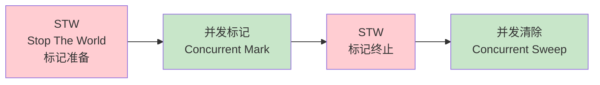
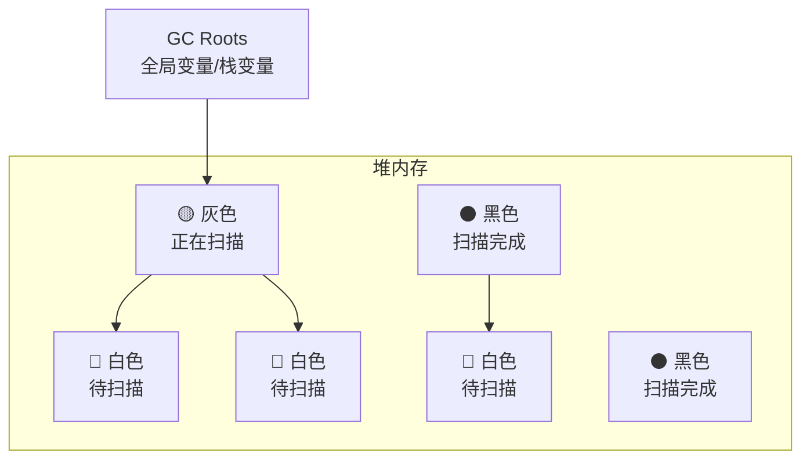
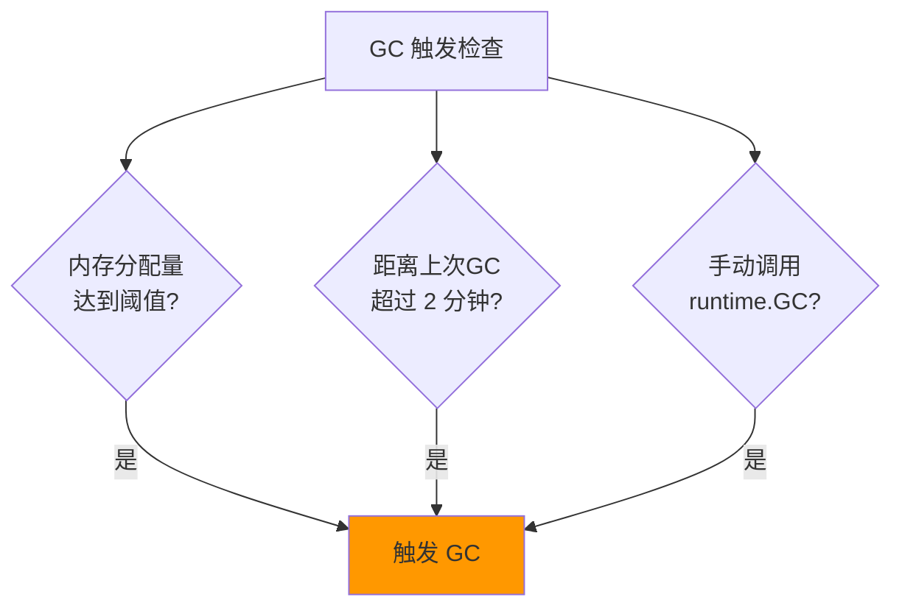
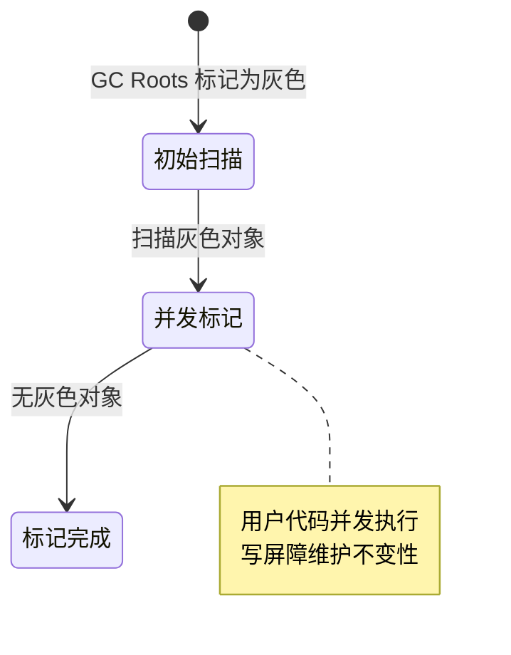
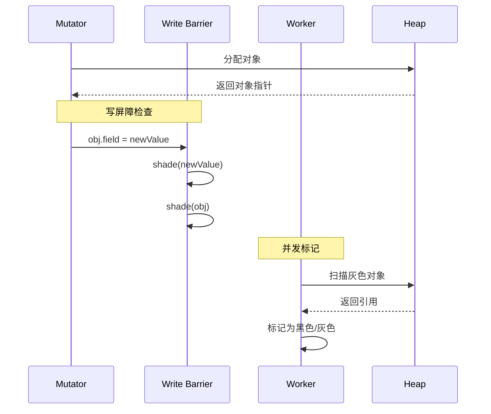
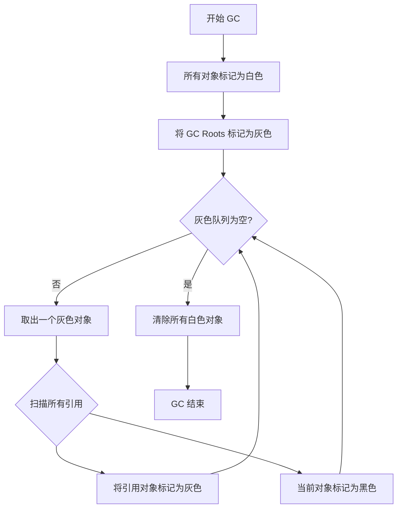

# Go GC 垃圾回收机制

> 三色标记 · 写屏障 · GC 优化

---

## 核心概念（精简版）

### GC 核心流程

Go 使用并发三色标记清除算法（Tri-color Mark and Sweep）：



### 三色标记法

| 颜色 | 状态 | 描述 |
|:-----|:-----|:-----|
| **白色** | 未扫描 | 对象尚未被扫描，可能被回收 |
| **灰色** | 扫描中 | 对象已被标记，但引用的对象未完全扫描 |
| **黑色** | 已扫描 | 对象及其所有引用都已扫描完成 |



### 写屏障（Write Barrier）

写屏障是保证并发 GC 正确性的关键机制：

| 类型 | 描述 |
|:-----|:-----|
| **插入写屏障** | Dijkstra 写屏障，赋值时标记引用对象为灰色 |
| **删除写屏障** | Yuasa 写屏障，删除时标记被删除对象为灰色 |
| **混合写屏障** | Go 1.8+ 采用，结合两者优点 |

### 常见面试题

> Q: Go 的 GC 为什么要用写屏障？

**A**: 在并发 GC 期间，用户代码可能修改对象引用关系，导致：
- **黑色对象指向白色对象**：白色对象会被错误回收
- **写屏障的作用**：在指针赋值时插入额外逻辑，维护三色不变性

---

## 深入原理（深入版）

### GC 触发条件



**具体条件**：

1. **内存分配阈值**：heap_goal = heap_marked * (1 + gc_percent/100)
   - 默认 GOGC=100，即堆增长 100% 时触发
2. **强制触发**：2 分钟未执行 GC 则强制执行
3. **手动触发**：调用 `runtime.GC()`

### 三色不变性

```mermaid
graph LR
    subgraph "强三色不变性"
        B1[黑色] -->|不允许| W1[白色]
    end

    subgraph "弱三色不变性"
        B2[黑色] -->|允许但有灰色中间对象| W2[白色]
        B2 --> G[灰色] --> W2
    end

    style B1 fill:#333
    style B2 fill:#333
    style W1 fill:#2196f3,color:#fff
    style W2 fill:#2196f3,color:#fff
    style G fill:#ffc107
```



**Go 的选择**：混合写屏障维护弱三色不变性

### 混合写屏障机制

Go 1.8 引入的混合写屏障规则：

```go
// 伪代码：混合写屏障
func writeBarrier(obj *unsafe.Pointer, val unsafe.Pointer) {
    shade(obj)                // 标记被赋值指针槽为灰色
    shade(*val)               // 标记引用对象为灰色
    *obj = val
}
```

**规则详解**：

1. **赋值器插入时**：将指针槽本身标记为灰色
2. **赋值器删除时**：将原引用对象标记为灰色



### GC Mark 阶段详细流程



### GC 各阶段详解

#### 1. 标记准备（Mark Setup, STW）

```go
// 伪代码
func gcStart() {
    stopTheWorld("gc")

    // 清扫上一轮的 span
    sweep()

    // 初始化标记状态
    for _, span := range spans {
        span.marked = false
    }

    // 标记根对象
    markRoots()

    startTheWorld()
}
```

#### 2. 并发标记（Concurrent Mark）

```go
// 后台 goroutine 执行
func gcBgMarkWorker() {
    for {
        // 获取待处理对象
        obj := getGreyObj()
        if obj == nil {
            break
        }

        // 标记并扫描
        mark(obj)
        scan(obj)
    }
}
```

#### 3. 标记终止（Mark Termination, STW）

```go
func gcMarkDone() {
    stopTheWorld("gc")

    // 重新标记根对象
    remarkRoots()

    // 确保所有写屏障完成
    flushWB()

    startTheWorld()
}
```

#### 4. 并发清除（Concurrent Sweep）

```go
// 后台 goroutine 执行
func bgsweep() {
    for span := range spans {
        if !span.marked {
            // 回收未标记对象
            free(span)
        }
        span.marked = false
    }
}
```

### Go 版本演进中的 GC 优化

| 版本 | 主要改进 |
|:-----|:---------|
| **Go 1.5** | 首次实现并发 GC，STW 时间降至 10ms 级别 |
| **Go 1.6** | 进一步优化 STW，降至 1ms 级别 |
| **Go 1.7** | 并行清扫，降低延迟 |
| **Go 1.8** | 引入混合写屏障，优化写屏障开销 |
| **Go 1.10** | 大对象卸载到栈，减少堆分配 |
| **Go 1.12** | 精确扫描栈对象 |
| **Go 1.21** | GC 调优，尾延迟降低 40% |
| **Go 1.22** | GC 元数据局部性优化 |
| **Go 1.23** | PGO 构建时间优化 |

---

## 实战案例

### 案例 1：减少 GC 压力 - 对象池

```go
import "sync"

// ❌ 频繁创建临时对象
func processBad(data []byte) error {
    buf := bytes.NewBuffer(make([]byte, 0, 1024))
    buf.Write(data)
    // 使用 buf...
    return nil
}

// ✅ 使用 sync.Pool 复用对象
var bufPool = sync.Pool{
    New: func() interface{} {
        return bytes.NewBuffer(make([]byte, 0, 1024))
    },
}

func processGood(data []byte) error {
    buf := bufPool.Get().(*bytes.Buffer)
    defer bufPool.Put(buf)

    buf.Reset()
    buf.Write(data)
    // 使用 buf...
    return nil
}
```

### 案例 2：避免大对象频繁分配

```go
// ❌ 大对象频繁分配
type BigStruct struct {
    data [1024 * 1024]byte // 1MB
}

func leakMemory() {
    for i := 0; i < 1000; i++ {
        _ = &BigStruct{} // 每次分配 1MB
    }
}

// ✅ 使用指针共享
func efficient() {
    shared := &BigStruct{}
    for i := 0; i < 1000; i++ {
        process(shared) // 复用同一个对象
    }
}
```

### 案例 3：GC 参数调优

```go
import "runtime"

// 设置 GOGC：GC 触发时堆增长百分比
// 默认 100，可根据场景调整

// 低延迟场景：降低 GC 触发阈值
// runtime.SetGCPercent(50)  // 更频繁 GC，更小堆

// 高吞吐场景：提高 GC 触发阈值
// runtime.SetGCPercent(200) // 更少 GC，更大堆

// 完全禁用 GC（危险！仅用于特殊场景）
// runtime.SetGCPercent(-1)
```

### 案例 4：监控 GC 性能

```go
import (
    "runtime"
    "time"
)

func monitorGC() {
    var lastGC runtime.MemStats
    var lastTime time.Time

    ticker := time.NewTicker(5 * time.Second)
    defer ticker.Stop()

    for range ticker.C {
        var mem runtime.MemStats
        runtime.ReadMemStats(&mem)

        if lastGC.NumGC > 0 {
            gcs := mem.NumGC - lastGC.NumGC
            pauseTotal := mem.PauseTotalNs - lastGC.PauseTotalNs
            avgPause := pauseTotal / int64(gcs)

            fmt.Printf("GC 次数: %d, 平均暂停: %d ns\n",
                gcs, avgPause)
        }

        fmt.Printf("堆内存: %d MB, Goroutines: %d\n",
            mem.HeapInuse/1024/1024, runtime.NumGoroutine())

        lastGC = mem
        lastTime = time.Now()
    }
}
```

---

## 面试真题精选

### Q1: 详细解释三色标记算法的工作流程

**参考答案**：



**详细步骤**：
1. **初始化**：所有对象标记为白色
2. **根标记**：从栈、全局变量等根对象开始，标记为灰色
3. **并发扫描**：后台 worker 线程不断从灰色队列取对象
   - 扫描该对象的所有引用
   - 将引用对象标记为灰色
   - 将当前对象标记为黑色
4. **清除**：回收所有白色对象

### Q2: 为什么需要写屏障？没有会怎样？

**参考答案**：

**问题场景**：并发标记期间，用户代码可能修改指针

```go
// 初始状态
A (黑色) → B (灰色) → C (白色)
D (白色)

// 用户代码执行：A.D = D（D 仍在白色）
A.D = D

// B 完成扫描，变成黑色
// C 仍是白色

// GC 结束：C 和 D 都被回收！❌ 内存泄漏！
```

**写屏障的作用**：
- **插入写屏障**：`A.D = D` 时，立即标记 D 为灰色
- **删除写屏障**：`A.B = nil` 时，立即标记 B 为灰色
- **混合写屏障**：两种策略结合

### Q3: 混合写屏障相比传统方案有什么优势？

**参考答案**：

| 方案 | 优点 | 缺点 |
|:-----|:-----|:-----|
| Dijkstra 插入写屏障 | 简单 | 栈重新扫描，开销大 |
| Yuasa 删除写屏障 | 栈不重新扫描 | 回收精度低 |
| **混合写屏障** | **栈只扫描一次，精度高** | 略复杂的实现 |

**混合写屏障的三个规则**：
1. GC 开始时，栈上所有对象标记为黑色
2. GC 期间，栈上对象不需要重新扫描
3. 堆上使用插入写屏障

### Q4: Go GC 的 STW 时间为什么会这么短？

**参考答案**：

**关键优化**：
1. **并发执行**：标记和清除与用户代码并发执行
2. **混合写屏障**：避免栈重新扫描
3. **辅助 GC**：分配过快时，触发分配辅助
4. **CPU 辅助**：后台 P 可用于 GC

```
传统 GC：STW 标记 → STW 清除
Go GC：    STW 准备 → 并发标记 → STW 终止 → 并发清除
                    ↑_____ 绝大部分工作并发执行
```

### Q5: 如何分析 GC 性能问题？

**参考答案**：

```go
// 1. 启用 GC 日志
// GODEBUG=gctrace=1 go run main.go

// 输出示例：
// gc 1 @0.003s 4%: 0.020+1.2+0.022 ms clock, 0.10+5.8/0.061/0.12+0.11 ms cpu
//                ↑   ↑    ↑      ↑      ↑       ↑       ↑
//                │   │    │      │      │       │       └─ 总 CPU 时间
//                │   │    │      │      │       └─ 辅助 GC 时间
//                │   │    │      │      └─ 并发标记时间
//                │   │    │      └─ STW 时间
//                │   │    └─ CPU 使用率
//                │   └─ GC 后堆增长百分比
//                └─ GC 序号

// 2. 使用 pprof 分析
import (
    _ "net/http/pprof"
    "net/http"
)

func main() {
    go http.ListenAndServe("localhost:6060", nil)
    // ...
}

// 访问：http://localhost:6060/debug/pprof/heap
```

### Q6: GOGC 参数如何影响性能？

**参考答案**：

| GOGC | 行为 | 适用场景 |
|:-----|:-----|:---------|
| **off (-1)** | 不触发 GC | 内存充足、无内存分配 |
| **低 (50)** | 频繁 GC，堆小 | 低延迟要求 |
| **默认 (100)** | 平衡 | 大多数场景 |
| **高 (200+)** | 稀少 GC，堆大 | 高吞吐、内存充足 |

**权衡**：
- 低 GOGC：更频繁 GC，每次 GC 更快，内存占用小
- 高 GOGC：更少 GC，每次 GC 更慢，内存占用大

---

## 参考资料

- [Writing Barriers in Go Garbage Collection - Medium](https://medium.com/@AlexanderObregon/writing-barriers-in-go-garbage-collection-baf72a4ee088)
- [深入理解Go 语言垃圾回收机制：三色标记与混合屏障 - CSDN](https://blog.csdn.net/m0_73180708/article/details/149859199)
- [A Developer's Guide to Go's Garbage Collection - Dev.to](https://dev.to/jones_charles_ad50858dbc0/a-developers-guide-to-gos-garbage-collection-mastering-the-tri-color-algorithm-4472)
- [Garbage Collection in Go: From Reference Counting to Tri-Color](https://blog.gaborkoos.com/posts/2025-09-12-Garbage-Collection-In-Go.md/)
- [Go 语言垃圾回收(GC) 深度解析 - Quant67](https://quant67.com/post/gc/languages/golang-gc.html)
- [Understanding Go's Garbage Collector | rugu](https://rugu.dev/en/blog/understanding-go-gc/)
