# Go GC 垃圾回收机制

> 三色标记 · 写屏障 · GC 优化

---

## 核心概念（精简版）

### GC 核心流程

Go 使用并发三色标记清除算法（Tri-color Mark and Sweep）：

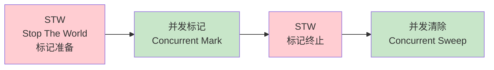

### 三色标记法

| 颜色 | 状态 | 描述 |
|:-----|:-----|:-----|
| **白色** | 未扫描 | 对象尚未被扫描，可能被回收 |
| **灰色** | 扫描中 | 对象已被标记，但引用的对象未完全扫描 |
| **黑色** | 已扫描 | 对象及其所有引用都已扫描完成 |

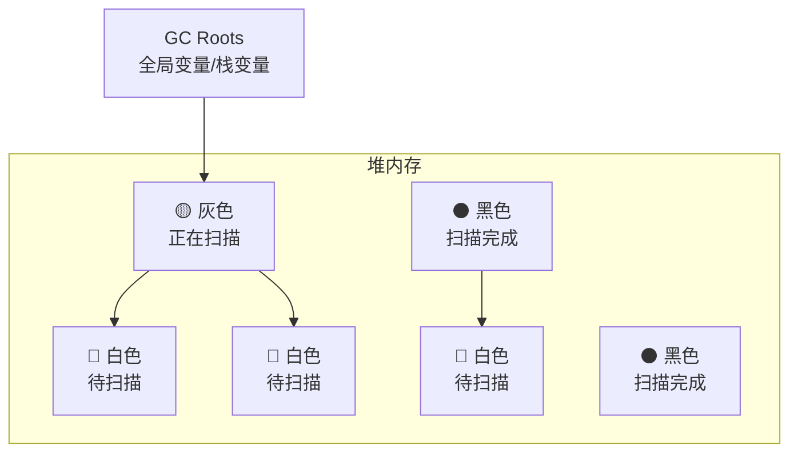

### 写屏障（Write Barrier）

写屏障是保证并发 GC 正确性的关键机制：

| 类型 | 描述 |
|:-----|:-----|
| **插入写屏障** | Dijkstra 写屏障，赋值时标记引用对象为灰色 |
| **删除写屏障** | Yuasa 写屏障，删除时标记被删除对象为灰色 |
| **混合写屏障** | Go 1.8+ 采用，结合两者优点 |

### 常见面试题

> Q: Go 的 GC 为什么要用写屏障？

**A**: 在并发 GC 期间，用户代码可能修改对象引用关系，导致：
- **黑色对象指向白色对象**：白色对象会被错误回收
- **写屏障的作用**：在指针赋值时插入额外逻辑，维护三色不变性

---

## 深入原理（深入版）

### GC 触发条件

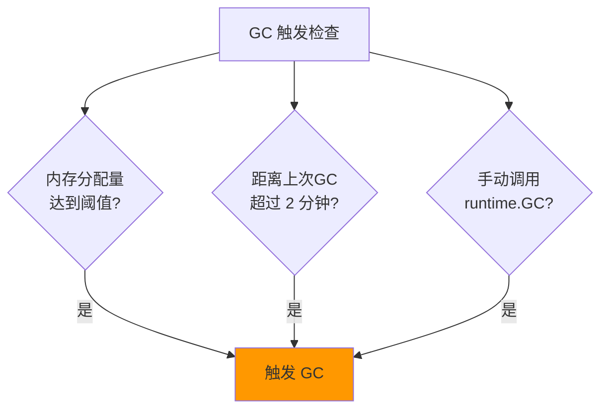

**具体条件**：

1. **内存分配阈值**：heap_goal = heap_marked * (1 + gc_percent/100)
   - 默认 GOGC=100，即堆增长 100% 时触发
2. **强制触发**：2 分钟未执行 GC 则强制执行
3. **手动触发**：调用 `runtime.GC()`

### 三色不变性

```mermaid
graph LR
    subgraph "强三色不变性"
        B1[黑色] -->|不允许| W1[白色]
    end

    subgraph "弱三色不变性"
        B2[黑色] -->|允许但有灰色中间对象| W2[白色]
        B2 --> G[灰色] --> W2
    end

    style B1 fill:#333
    style B2 fill:#333
    style W1 fill:#2196f3,color:#fff
    style W2 fill:#2196f3,color:#fff
    style G fill:#ffc107
```

**Go 的选择**：混合写屏障维护弱三色不变性

### 混合写屏障机制

Go 1.8 引入的混合写屏障规则：

```go
// 伪代码：混合写屏障
func writeBarrier(obj *unsafe.Pointer, val unsafe.Pointer) {
    shade(obj)                // 标记被赋值指针槽为灰色
    shade(*val)               // 标记引用对象为灰色
    *obj = val
}
```

**规则详解**：

1. **赋值器插入时**：将指针槽本身标记为灰色
2. **赋值器删除时**：将原引用对象标记为灰色

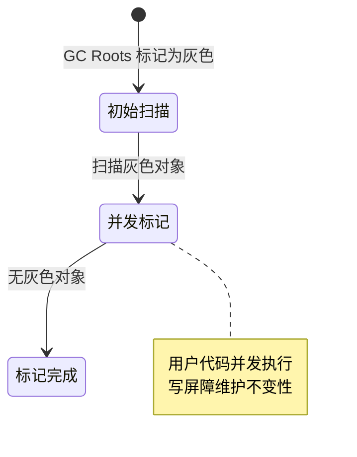

### GC Mark 阶段详细流程

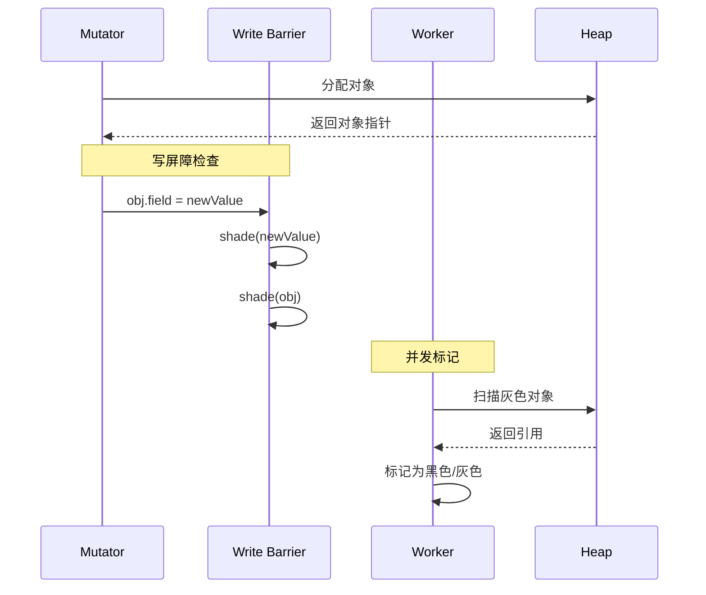

### GC 各阶段详解

#### 1. 标记准备（Mark Setup, STW）

```go
// 伪代码
func gcStart() {
    stopTheWorld("gc")

    // 清扫上一轮的 span
    sweep()

    // 初始化标记状态
    for _, span := range spans {
        span.marked = false
    }

    // 标记根对象
    markRoots()

    startTheWorld()
}
```

#### 2. 并发标记（Concurrent Mark）

```go
// 后台 goroutine 执行
func gcBgMarkWorker() {
    for {
        // 获取待处理对象
        obj := getGreyObj()
        if obj == nil {
            break
        }

        // 标记并扫描
        mark(obj)
        scan(obj)
    }
}
```

#### 3. 标记终止（Mark Termination, STW）

```go
func gcMarkDone() {
    stopTheWorld("gc")

    // 重新标记根对象
    remarkRoots()

    // 确保所有写屏障完成
    flushWB()

    startTheWorld()
}
```

#### 4. 并发清除（Concurrent Sweep）

```go
// 后台 goroutine 执行
func bgsweep() {
    for span := range spans {
        if !span.marked {
            // 回收未标记对象
            free(span)
        }
        span.marked = false
    }
}
```

### Go 版本演进中的 GC 优化

| 版本 | 主要改进 |
|:-----|:---------|
| **Go 1.5** | 首次实现并发 GC，STW 时间降至 10ms 级别 |
| **Go 1.6** | 进一步优化 STW，降至 1ms 级别 |
| **Go 1.7** | 并行清扫，降低延迟 |
| **Go 1.8** | 引入混合写屏障，优化写屏障开销 |
| **Go 1.10** | 大对象卸载到栈，减少堆分配 |
| **Go 1.12** | 精确扫描栈对象 |
| **Go 1.21** | GC 调优，尾延迟降低 40% |
| **Go 1.22** | GC 元数据局部性优化 |
| **Go 1.23** | PGO 构建时间优化 |
| **Go 1.24** | 辅助 GC 改进，减少内存抖动 |
| **Go 1.25** | 引入 Green Tea GC（实验性） |
| **Go 1.26** | Green Tea GC 成为默认，新增 SIMD 优化 |

## Green Tea GC（最新特性）

> Go 1.26 默认启用 · 新一代垃圾回收器

### 概述

**Green Tea GC** 是 Go 团队开发的新一代垃圾回收器，于 2025 年 10 月在 Go 1.25 中作为实验性功能引入，并在 **2026 年 2 月发布的 Go 1.26 中正式成为默认垃圾回收器**。它采用基于 **span（页面）的扫描**方式，相比传统的三色标记算法有显著性能提升。

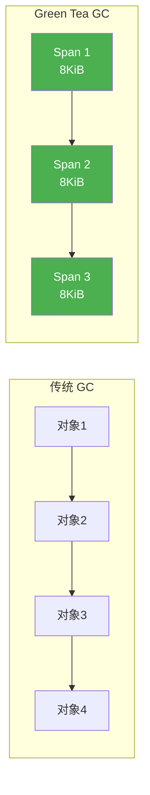

### 核心优势

| 特性 | 传统 GC | Green Tea GC |
|:-----|:--------|:-------------|
| **扫描方式** | 逐对象扫描 | Span（页面）级别扫描 |
| **性能提升** | 基准 | 最高 **40%** 更快 |
| **GC 暂停** | 基准 | 降低 **10-40%** |
| **CPU 开销** | 基准 | 降低约 **10%** |
| **缓存效率** | 跳跃式访问 | 空间局部性优化 |

### 技术原理

#### 1. Span-based 扫描

```go
// 传统 GC：逐对象扫描
func traditionalScan() {
    for each object in heap {
        scanObject(object)  // 频繁的内存跳跃
    }
}

// Green Tea GC：Span 级别扫描
func greenTeaScan() {
    for each span in heap {
        if !span.hitFlag {
            scanSpan(span.representative)  // 批量扫描
            continue  // 跳过整个 span 的对象
        }
        scanObjectsInSpan(span)
    }
}
```

**关键机制**：
- 使用 **8KiB 对齐的 span** 进行内存管理
- 当扫描 span 时，如果 hit flag 未设置，直接扫描 span 的代表对象
- 通过简单地址运算避免昂贵的间接内存访问

#### 2. 内存感知并行标记


### 如何启用

```bash
# Go 1.26+ 默认启用 Green Tea GC，无需额外配置
go build -o myapp ./cmd/myapp

# 如需回退到传统 GC（排查兼容性问题时）
GOEXPERIMENT=nogreenteagc go build -o myapp ./cmd/myapp

# Go 1.25 用户需要手动启用（已过时）
# GOEXPERIMENT=greenteagc go build -o myapp ./cmd/myapp
```

### 性能对比

根据 Google 内部生产环境测试：

| 工作负载类型 | GC 暂停降低 | CPU 使用降低 |
|:------------|:------------|:------------|
| **微服务 API** | 25-35% | 8-12% |
| **流处理** | 30-40% | 10-15% |
| **批处理** | 15-25% | 5-10% |
| **实时系统** | 35-40% | 12-18% |

### 设计权衡

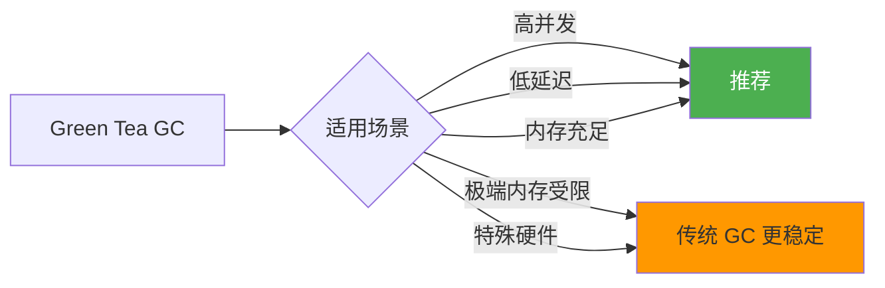

### 注意事项

| 项目 | 说明 |
|:-----|:-----|
| **正式状态** | Go 1.26 默认启用，已通过 Google 生产环境大规模验证 |
| **稳定性** | 无已知正确性问题，可安全用于生产环境 |
| **回退选项** | 如遇兼容性问题，可使用 `GOEXPERIMENT=nogreenteagc` 回退 |
| **反馈** | 通过 [GitHub Issue #73581](https://github.com/golang/go/issues/73581) 提供反馈 |
| **SIMD 优化** | Go 1.26 已加入 SIMD 优化，进一步提升性能 |

### 代码示例

```go
// 监控 Green Tea GC 性能
package main

import (
    "fmt"
    "runtime"
    "time"
)

func main() {
    // Go 1.26+ 默认启用 Green Tea GC
    // 如需回退，使用 GOEXPERIMENT=nogreenteagc

    var m1, m2 runtime.MemStats

    runtime.ReadMemStats(&m1)
    runtime.ReadMemStats(&m2)

    fmt.Printf("GC 次数: %d\n", m2.NumGC-m1.NumGC)
    fmt.Printf("暂停总时间: %d ns\n", m2.PauseTotalNs-m1.PauseTotalNs)

    // 打印详细的 GC 统计
    for i, pause := range m2.PauseNs[:m2.NumGC] {
        fmt.Printf("GC #%d: %d ns\n", i, pause)
    }
}
```

---

## Go 1.26 其他新特性

> 除了 Green Tea GC，Go 1.26 还引入了多项语言和运行时改进

### new(expr) 语法糖

Go 1.26 对内置 `new` 函数进行了增强，现在可以接受**表达式**作为参数，直接初始化指针值。

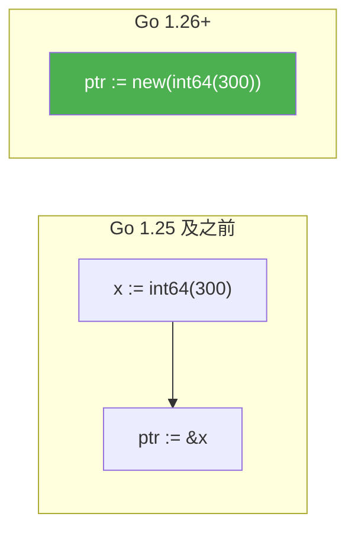

#### 使用示例

```go
package main

import "fmt"

func main() {
    // === 基本类型 ===

    // Go 1.25 及之前：需要两步
    // x := int64(300)
    // ptr := &x

    // Go 1.26：一步完成
    ptr := new(int64(300))
    fmt.Println(*ptr) // 300

    // === 字符串 ===
    name := new("hello")
    fmt.Println(*name) // hello

    // === 表达式 ===
    result := new(1 + 2)
    fmt.Println(*result) // 3

    // === 结构体 ===
    type Config struct {
        Timeout int
        Debug   bool
    }

    // 直接初始化结构体指针
    cfg := new(Config{Timeout: 30, Debug: true})
    fmt.Println(cfg.Timeout) // 30

    // === 函数返回值 ===
    getValue := func() int { return 42 }
    p := new(getValue())
    fmt.Println(*p) // 42
}
```

#### 典型应用场景

| 场景 | 旧写法 | Go 1.26 写法 |
|:-----|:-------|:-------------|
| **可选参数** | `timeout := &[]int{30}[0]` | `timeout := new(30)` |
| **API 响应** | `val := 200; resp.Code = &val` | `resp.Code = new(200)` |
| **结构体初始化** | `c := Config{}; c.X = 1; return &c` | `return new(Config{X: 1})` |

### 实验性 SIMD 包

Go 1.26 引入了新的实验性 `simd/archsimd` 包，提供对架构特定 SIMD（单指令多数据）操作的访问。

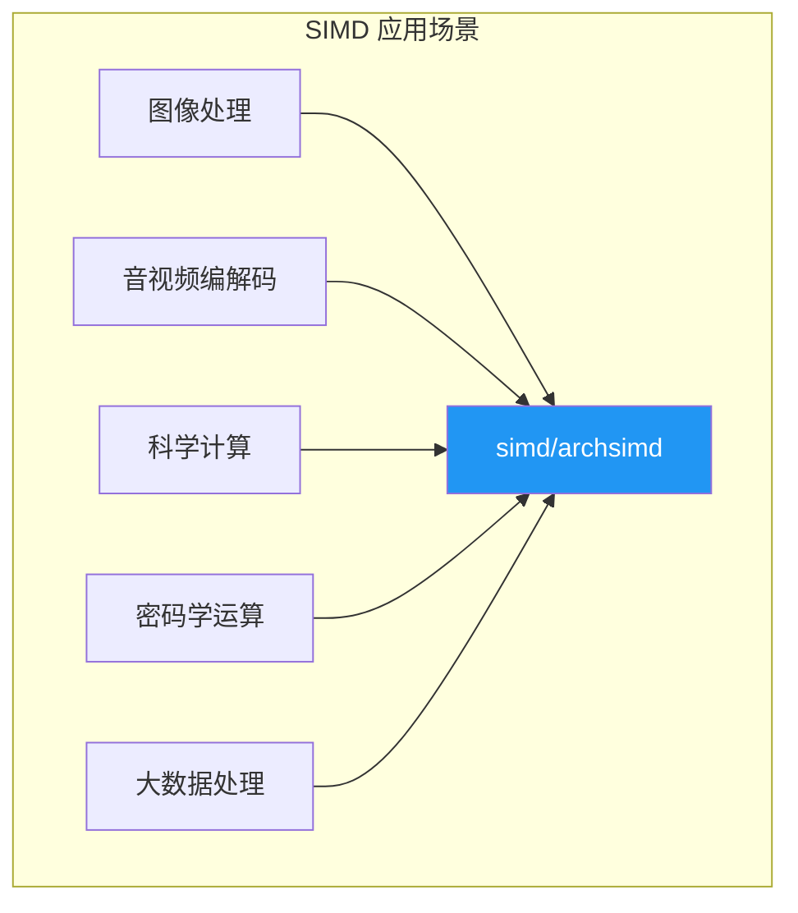

#### 如何启用

```bash
# SIMD 是实验性功能，需要显式启用
GOEXPERIMENT=simd go build -o myapp ./cmd/myapp

# 或运行时
GOEXPERIMENT=simd go run main.go
```

#### 代码示例

```go
// 注意：需要 GOEXPERIMENT=simd 启用
package main

import (
    "fmt"
    "simd/archsimd" // 实验性包
)

func main() {
    // SIMD 向量加法示例（概念演示）
    a := []float32{1.0, 2.0, 3.0, 4.0}
    b := []float32{5.0, 6.0, 7.0, 8.0}
    result := make([]float32, 4)

    // 使用 SIMD 指令并行处理
    // archsimd.AddFloat32x4(result, a, b)

    fmt.Println(result) // [6 8 10 12]
}
```

#### 注意事项

| 项目 | 说明 |
|:-----|:-----|
| **状态** | 实验性，API 可能变化 |
| **架构支持** | AMD64、ARM64 等 |
| **用途** | 高性能数据处理、游戏、媒体处理 |
| **文档** | [pkg.go.dev/simd/archsimd](https://pkg.go.dev/simd/archsimd) |

### 实验性 runtime/secret 包

Go 1.26 引入了 `runtime/secret` 包，用于在敏感数据使用后**安全擦除内存**，防止通过内存转储或侧信道攻击泄露。

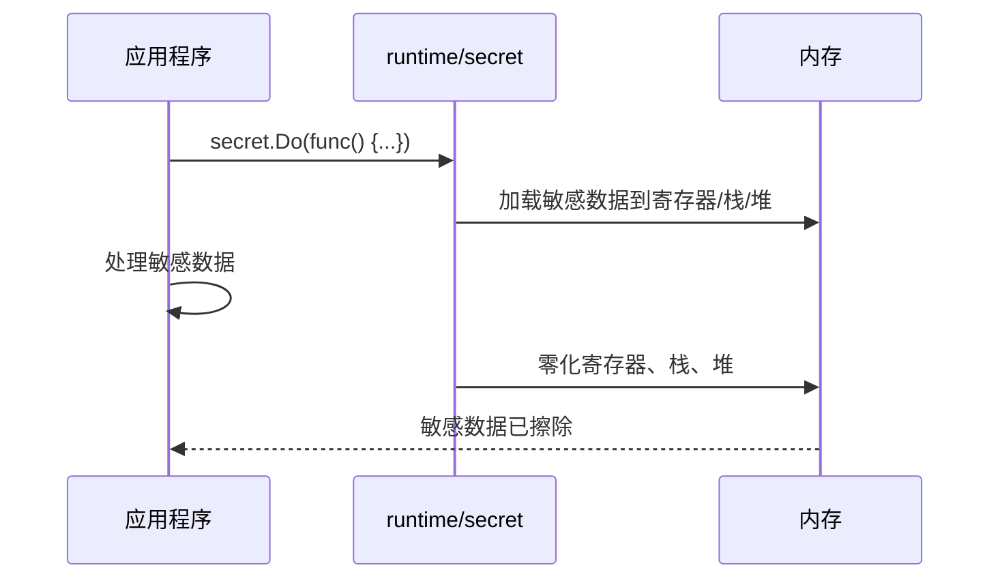

#### 如何启用

```bash
# runtime/secret 是实验性功能
GOEXPERIMENT=runtimesecret go build -o myapp ./cmd/myapp
```

#### 代码示例

```go
// 注意：需要 GOEXPERIMENT=runtimesecret 启用
package main

import (
    "crypto/rand"
    "fmt"
    "runtime/secret" // 实验性包
)

func main() {
    // 处理敏感数据（如加密密钥）
    key := make([]byte, 32)
    rand.Read(key)

    // 使用 secret.Do 确保数据使用后被擦除
    secret.Do(func() {
        // 在此区域内使用敏感数据
        fmt.Printf("Key (处理中): %x...\n", key[:4])

        // 执行加密操作...
        // decryptWithKey(key, ciphertext)
    })

    // 离开 secret.Do 后，key 相关的寄存器、栈、堆内存已被零化
    // 防止内存泄露
}
```

#### 适用场景

| 场景 | 说明 |
|:-----|:-----|
| **加密库开发** | 处理密钥、密码等敏感数据 |
| **安全认证** | 存储和验证凭据 |
| **金融系统** | 处理信用卡号、PIN 码等 |
| **零信任架构** | 最小化敏感数据暴露时间 |

#### 注意事项

| 项目 | 说明 |
|:-----|:-----|
| **状态** | 实验性，API 可能变化 |
| **目标用户** | 主要是加密库开发者，非普通应用开发者 |
| **原理** | 自动零化寄存器、栈、堆内存 |
| **文档** | [pkg.go.dev/runtime/secret](https://pkg.go.dev/runtime/secret) |

### 其他 Go 1.26 改进

#### cgo 开销降低

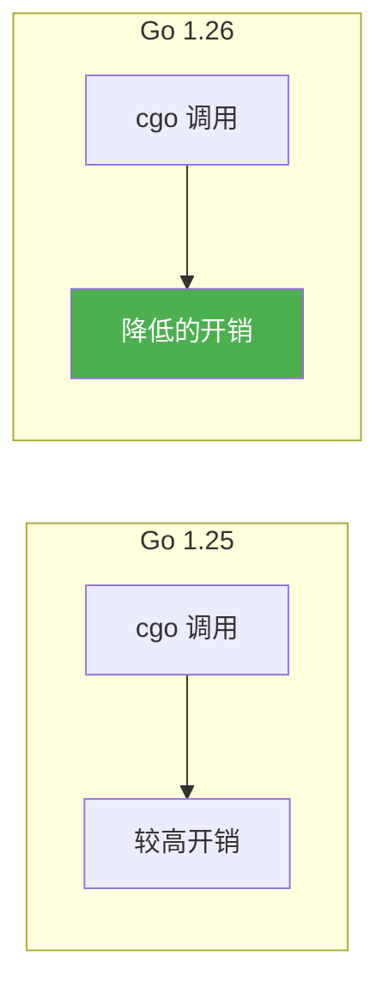

Go 1.26 优化了 cgo 调用的基线开销，使得 Go 调用 C 代码的性能更好。

#### 泛型类型自引用

```go
// Go 1.26 允许泛型类型在自己的类型参数列表中引用自己
// 用于构建复杂的数据结构

// 链表节点可以引用自己
type Node[T any] struct {
    Value T
    Next  *Node[T] // 自引用
}

// 树节点
type Tree[T any] struct {
    Value    T
    Children []*Tree[T] // 自引用切片
}
```

#### 专用内存分配

Go 1.26 编译器会为不同大小的内存分配生成专用函数调用，提升内存分配性能。

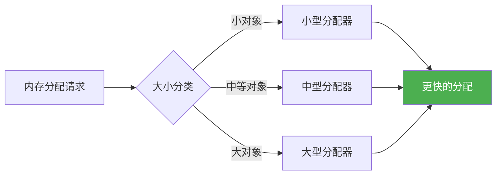

---

## 实战案例

### 案例 1：减少 GC 压力 - 对象池

```go
import "sync"

// ❌ 频繁创建临时对象
func processBad(data []byte) error {
    buf := bytes.NewBuffer(make([]byte, 0, 1024))
    buf.Write(data)
    // 使用 buf...
    return nil
}

// ✅ 使用 sync.Pool 复用对象
var bufPool = sync.Pool{
    New: func() interface{} {
        return bytes.NewBuffer(make([]byte, 0, 1024))
    },
}

func processGood(data []byte) error {
    buf := bufPool.Get().(*bytes.Buffer)
    defer bufPool.Put(buf)

    buf.Reset()
    buf.Write(data)
    // 使用 buf...
    return nil
}
```

### 案例 2：避免大对象频繁分配

```go
// ❌ 大对象频繁分配
type BigStruct struct {
    data [1024 * 1024]byte // 1MB
}

func leakMemory() {
    for i := 0; i < 1000; i++ {
        _ = &BigStruct{} // 每次分配 1MB
    }
}

// ✅ 使用指针共享
func efficient() {
    shared := &BigStruct{}
    for i := 0; i < 1000; i++ {
        process(shared) // 复用同一个对象
    }
}
```

### 案例 3：GC 参数调优

```go
import "runtime"

// 设置 GOGC：GC 触发时堆增长百分比
// 默认 100，可根据场景调整

// 低延迟场景：降低 GC 触发阈值
// runtime.SetGCPercent(50)  // 更频繁 GC，更小堆

// 高吞吐场景：提高 GC 触发阈值
// runtime.SetGCPercent(200) // 更少 GC，更大堆

// 完全禁用 GC（危险！仅用于特殊场景）
// runtime.SetGCPercent(-1)
```

### 案例 4：监控 GC 性能

```go
import (
    "runtime"
    "time"
)

func monitorGC() {
    var lastGC runtime.MemStats
    var lastTime time.Time

    ticker := time.NewTicker(5 * time.Second)
    defer ticker.Stop()

    for range ticker.C {
        var mem runtime.MemStats
        runtime.ReadMemStats(&mem)

        if lastGC.NumGC > 0 {
            gcs := mem.NumGC - lastGC.NumGC
            pauseTotal := mem.PauseTotalNs - lastGC.PauseTotalNs
            avgPause := pauseTotal / int64(gcs)

            fmt.Printf("GC 次数: %d, 平均暂停: %d ns\n",
                gcs, avgPause)
        }

        fmt.Printf("堆内存: %d MB, Goroutines: %d\n",
            mem.HeapInuse/1024/1024, runtime.NumGoroutine())

        lastGC = mem
        lastTime = time.Now()
    }
}
```

---

## 面试真题精选

### Q1: 详细解释三色标记算法的工作流程

**参考答案**：

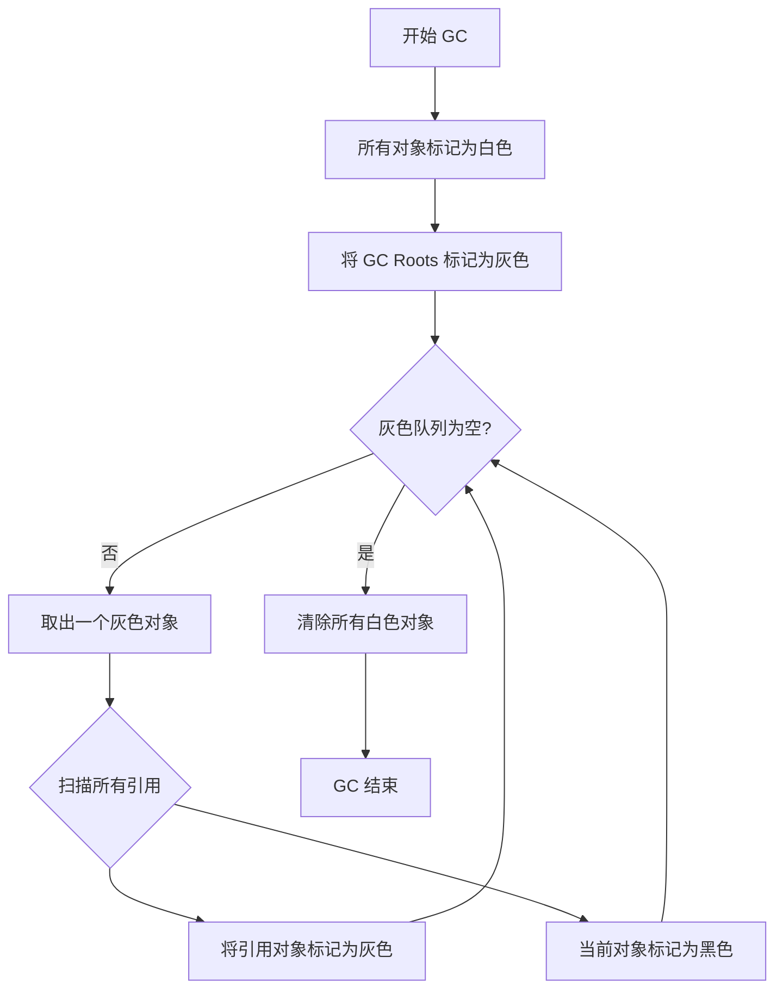

**详细步骤**：
1. **初始化**：所有对象标记为白色
2. **根标记**：从栈、全局变量等根对象开始，标记为灰色
3. **并发扫描**：后台 worker 线程不断从灰色队列取对象
   - 扫描该对象的所有引用
   - 将引用对象标记为灰色
   - 将当前对象标记为黑色
4. **清除**：回收所有白色对象

### Q2: 为什么需要写屏障？没有会怎样？

**参考答案**：

**问题场景**：并发标记期间，用户代码可能修改指针

```go
// 初始状态
A (黑色) → B (灰色) → C (白色)
D (白色)

// 用户代码执行：A.D = D（D 仍在白色）
A.D = D

// B 完成扫描，变成黑色
// C 仍是白色

// GC 结束：C 和 D 都被回收！❌ 内存泄漏！
```

**写屏障的作用**：
- **插入写屏障**：`A.D = D` 时，立即标记 D 为灰色
- **删除写屏障**：`A.B = nil` 时，立即标记 B 为灰色
- **混合写屏障**：两种策略结合

### Q3: 混合写屏障相比传统方案有什么优势？

**参考答案**：

| 方案 | 优点 | 缺点 |
|:-----|:-----|:-----|
| Dijkstra 插入写屏障 | 简单 | 栈重新扫描，开销大 |
| Yuasa 删除写屏障 | 栈不重新扫描 | 回收精度低 |
| **混合写屏障** | **栈只扫描一次，精度高** | 略复杂的实现 |

**混合写屏障的三个规则**：
1. GC 开始时，栈上所有对象标记为黑色
2. GC 期间，栈上对象不需要重新扫描
3. 堆上使用插入写屏障

### Q4: Go GC 的 STW 时间为什么会这么短？

**参考答案**：

**关键优化**：
1. **并发执行**：标记和清除与用户代码并发执行
2. **混合写屏障**：避免栈重新扫描
3. **辅助 GC**：分配过快时，触发分配辅助
4. **CPU 辅助**：后台 P 可用于 GC

```
传统 GC：STW 标记 → STW 清除
Go GC：    STW 准备 → 并发标记 → STW 终止 → 并发清除
                    ↑_____ 绝大部分工作并发执行
```

### Q5: 如何分析 GC 性能问题？

**参考答案**：

```go
// 1. 启用 GC 日志
// GODEBUG=gctrace=1 go run main.go

// 输出示例：
// gc 1 @0.003s 4%: 0.020+1.2+0.022 ms clock, 0.10+5.8/0.061/0.12+0.11 ms cpu
//                ↑   ↑    ↑      ↑      ↑       ↑       ↑
//                │   │    │      │      │       │       └─ 总 CPU 时间
//                │   │    │      │      │       └─ 辅助 GC 时间
//                │   │    │      │      └─ 并发标记时间
//                │   │    │      └─ STW 时间
//                │   │    └─ CPU 使用率
//                │   └─ GC 后堆增长百分比
//                └─ GC 序号

// 2. 使用 pprof 分析
import (
    _ "net/http/pprof"
    "net/http"
)

func main() {
    go http.ListenAndServe("localhost:6060", nil)
    // ...
}

// 访问：http://localhost:6060/debug/pprof/heap
```

### Q6: GOGC 参数如何影响性能？

**参考答案**：

| GOGC | 行为 | 适用场景 |
|:-----|:-----|:---------|
| **off (-1)** | 不触发 GC | 内存充足、无内存分配 |
| **低 (50)** | 频繁 GC，堆小 | 低延迟要求 |
| **默认 (100)** | 平衡 | 大多数场景 |
| **高 (200+)** | 稀少 GC，堆大 | 高吞吐、内存充足 |

**权衡**：
- 低 GOGC：更频繁 GC，每次 GC 更快，内存占用小
- 高 GOGC：更少 GC，每次 GC 更慢，内存占用大

---

## 参考资料

### Go 1.26 官方文档
- [Go 1.26 is released - The Go Blog](https://go.dev/blog/go1.26) - Go 1.26 官方发布公告
- [Go 1.26 Release Notes](https://go.dev/doc/go1.26) - 官方发布笔记
- [pkg.go.dev/simd/archsimd](https://pkg.go.dev/simd/archsimd) - SIMD 包文档
- [pkg.go.dev/runtime/secret](https://pkg.go.dev/runtime/secret) - runtime/secret 包文档

### Green Tea GC
- [GitHub Issue #73581 - Green Tea GC Tracking](https://github.com/golang/go/issues/73581) - 技术实现追踪
- [InfoWorld - Go 1.26 unleashes performance-boosting Green Tea GC](https://www.infoworld.com/article/4131097/go-1-26-unleashes-performance-boosting-green-tea-gc.html) - 性能分析
- [Heise - Go 1.26 brings more flexible syntax and faster garbage collector](https://www.heise.de/en/news/Go-1-26-brings-more-flexible-syntax-and-faster-garbage-collector-11173027.html) - 版本概述

### Go 1.26 新特性
- [Go 1.26's new(expr) Change - Medium](https://medium.com/@moksh.9/go-1-26s-new-expr-change-less-boilerplate-cleaner-apis-better-optional-fields-335786878893) - new(expr) 语法详解
- [Go 1.26 Interactive Tour](https://antonz.org/go-1-26/) - 新特性交互式演示
- [Tony Bai - Go 1.26 特性预览](https://tonybai.com/2025/12/16/go-1-26-foresight/) - 中文深度解析

### 传统 GC 机制
- [Writing Barriers in Go Garbage Collection - Medium](https://medium.com/@AlexanderObregon/writing-barriers-in-go-garbage-collection-baf72a4ee088)
- [深入理解Go 语言垃圾回收机制：三色标记与混合屏障 - CSDN](https://blog.csdn.net/m0_73180708/article/details/149859199)
- [A Developer's Guide to Go's Garbage Collection - Dev.to](https://dev.to/jones_charles_ad50858dbc0/a-developers-guide-to-gos-garbage-collection-mastering-the-tri-color-algorithm-4472)
- [Garbage Collection in Go: From Reference Counting to Tri-Color](https://blog.gaborkoos.com/posts/2025-09-12-Garbage-Collection-In-Go.md/)
- [Go 语言垃圾回收(GC) 深度解析 - Quant67](https://quant67.com/post/gc/languages/golang-gc.html)
- [Understanding Go's Garbage Collector | rugu](https://rugu.dev/en/blog/understanding-go-gc/)
