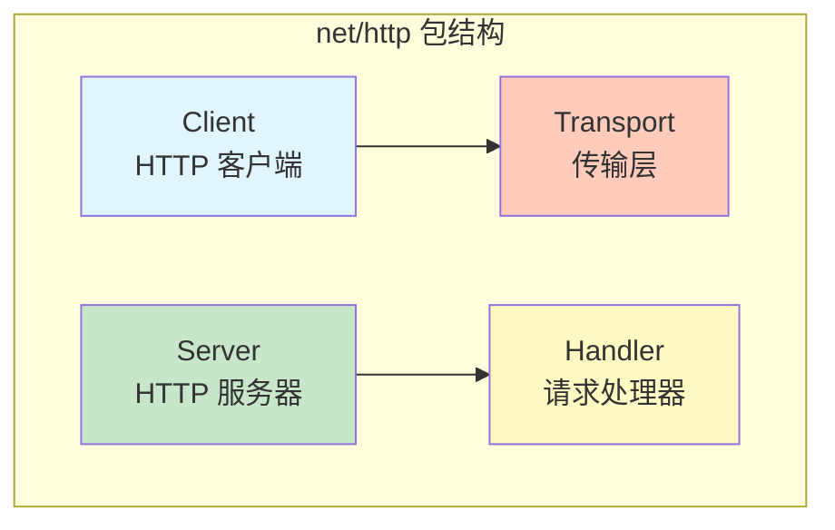
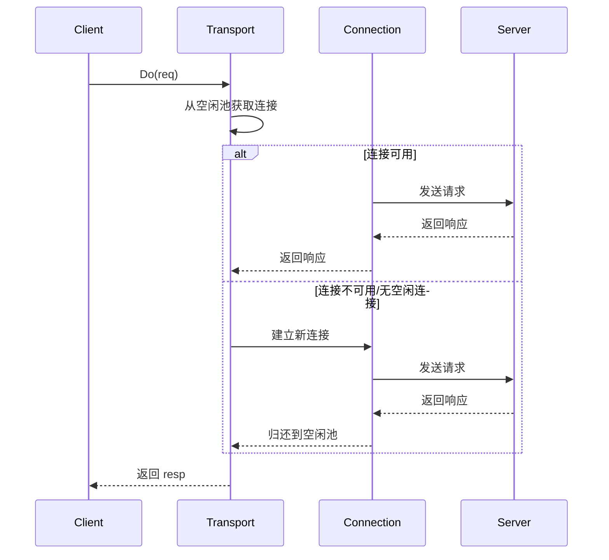
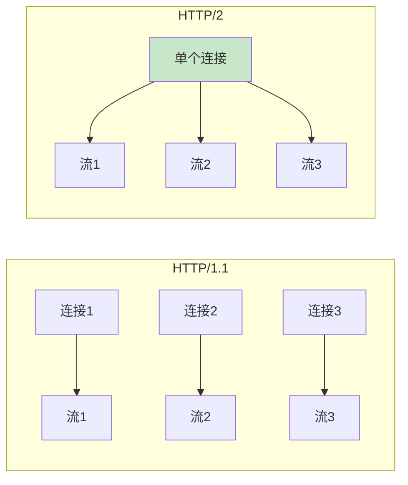
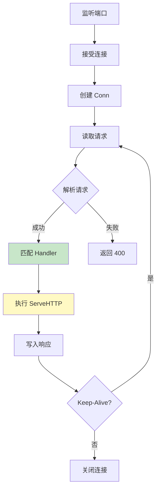
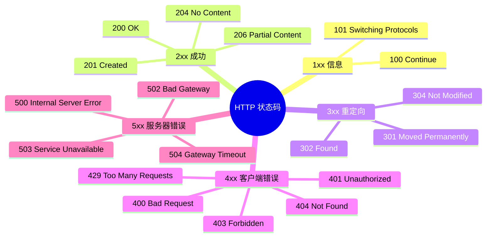
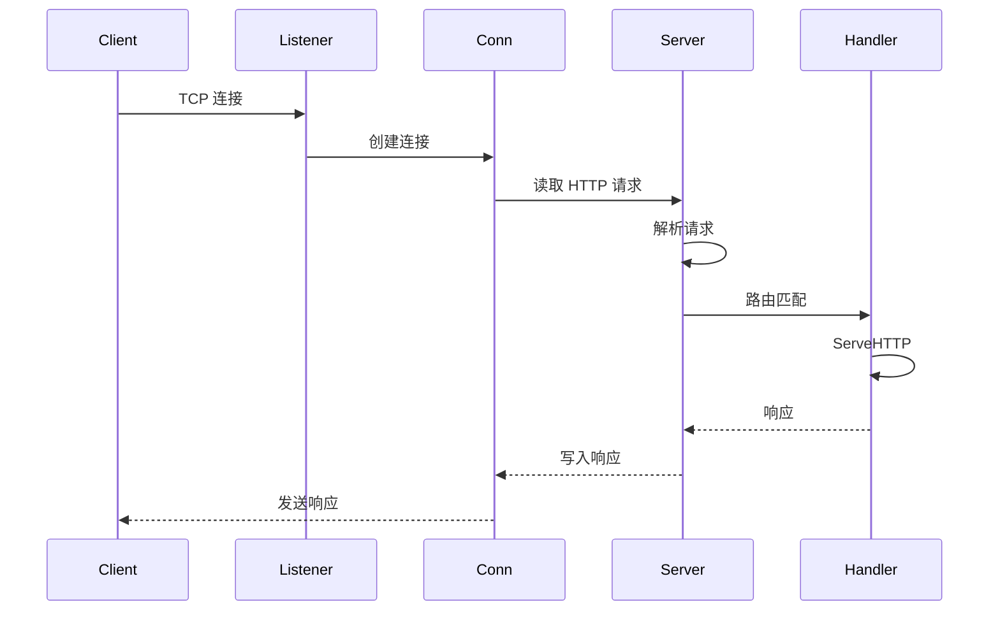

# Go 网络请求处理

> HTTP 客户端 · 服务器 · 底层原理 · 响应码详解

---

## 核心概念（精简版）

### net/http 包概述

Go 的 `net/http` 包提供了强大的 HTTP 客户端和服务器实现：



### HTTP 客户端基础

```go
import "net/http"

// 简单 GET 请求
resp, err := http.Get("https://api.example.com/data")
if err != nil {
    return err
}
defer resp.Body.Close()

// 读取响应
body, _ := io.ReadAll(resp.Body)
fmt.Println(string(body))
```

### HTTP 服务器基础

```go
// 简单 HTTP 服务器
http.HandleFunc("/", func(w http.ResponseWriter, r *http.Request) {
    fmt.Fprintf(w, "Hello, World!")
})

http.ListenAndServe(":8080", nil)
```

### Handler 接口

```go
type Handler interface {
    ServeHTTP(ResponseWriter, *Request)
}

// 自定义 Handler
type MyHandler struct{}

func (h MyHandler) ServeHTTP(w http.ResponseWriter, r *http.Request) {
    w.Write([]byte("Custom Handler"))
}

// 使用
http.Handle("/custom", MyHandler{})
```

### 常见面试题

> Q: Go 的 http.ServeMux 是如何路由请求的？

**A**: `http.ServeMux` 使用 URL 模式匹配：
1. 最长匹配原则：优先匹配更长的路径
2. 精确匹配优先：`/exact` 优先于 `/`
3. 不支持正则表达式和路径参数
4. 如需复杂路由，可使用第三方框架（如 gin、echo）

---

## 深入原理（深入版）

### HTTP 客户端架构



### Client 结构详解

```go
type Client struct {
    // Transport 用于执行单个 HTTP 请求
    Transport RoundTripper

    // CheckRedirect 指定处理重定向的策略
    CheckRedirect func(req *Request, via []*Request) error

    // Jar 指定 cookie jar
    Jar CookieJar

    // Timeout 指定请求超时时间
    Timeout time.Duration
}
```

**关键点**：
- `Transport` 管理连接池、TCP/TLS 握手
- 默认 `DefaultClient` 可复用，连接池大小无限制
- 超时控制需要同时设置多个参数

### HTTP/2 多路复用



**HTTP/2 优势**：
- 多路复用：单连接并发多个请求
- 头部压缩：HPACK 算法减少传输量
- 服务器推送：主动推送资源
- 二进制协议：解析效率更高

### 服务器请求处理流程



### ServeMux 路由匹配算法

```go
// 简化的路由匹配逻辑
func (mux *ServeMux) Handler(r *Request) Handler {
    // 1. 精确匹配
    if h := mux.map[r.URL.Path]; h != nil {
        return h
    }

    // 2. 最长路径前缀匹配
    var longest string
    for path := range mux.map {
        if strings.HasPrefix(r.URL.Path, path) && len(path) > len(longest) {
            longest = path
        }
    }

    if longest != "" {
        return mux.map[longest]
    }

    return nil // 404
}
```

### ResponseWriter 接口

```go
type ResponseWriter interface {
    // 写入响应头
    Header() http.Header

    // 写入响应体
    Write([]byte) (int, error)

    // 写入 HTTP 状态码
    WriteHeader(statusCode int)
}
```

**实现细节**：
- `WriteHeader` 只能调用一次，首次调用后生效
- 未调用 `WriteHeader` 时，默认 200 OK
- `Write` 会自动调用 `WriteHeader(200)`（如果未设置）

### 连接池管理

```go
type Transport struct {
    // 空闲连接池
    idleConn map[string][]*persistConn

    // 最大空闲连接数
    MaxIdleConns int

    // 每个主机的最大空闲连接数
    MaxIdleConnsPerHost int

    // 连接最大空闲时间
    IdleConnTimeout time.Duration

    // TLS 握手超时
    TLSHandshakeTimeout time.Duration
}
```

**默认配置**：
- `MaxIdleConns`: 100 (Go 1.19+)
- `MaxIdleConnsPerHost`: 10 (Go 1.19+)
- `IdleConnTimeout`: 90 秒
- `ResponseHeaderTimeout`: 无限制

### 超时配置完整指南

```go
client := &http.Client{
    Timeout: 30 * time.Second, // 总超时时间
    Transport: &http.Transport{
        // 连接拨号超时
        DialContext: (&net.Dialer{
            Timeout:   10 * time.Second,
            KeepAlive: 30 * time.Second,
        }).DialContext,

        // TLS 握手超时
        TLSHandshakeTimeout: 10 * time.Second,

        // 响应头超时
        ResponseHeaderTimeout: 10 * time.Second,

        // 请求持续最大时间
        ExpectContinueTimeout: 1 * time.Second,
    },
}
```

---

## HTTP 响应码详解

### 1xx 信息响应

| 状态码 | 名称 | 说明 | 使用场景 |
|:------|:-----|:-----|:---------|
| **100 Continue** | 继续 | 客户端应继续请求 | 大文件上传前确认 |
| **101 Switching Protocols** | 切换协议 | 服务器同意切换协议 | WebSocket 升级 |
| **102 Processing** | 处理中 | 服务器已收到请求正在处理 | 较长时间处理 |

```go
// 100 Continue 使用示例
func uploadLargeFile() error {
    req, _ := http.NewRequest("PUT", "https://api.example.com/upload", file)
    req.Header.Set("Expect", "100-continue")

    resp, err := client.Do(req)
    if err != nil {
        return err
    }

    if resp.StatusCode == 100 {
        // 服务器准备好接收，继续发送请求体
        return client.Do(req)
    }

    return fmt.Errorf("server rejected upload: %d", resp.StatusCode)
}
```

### 2xx 成功响应

| 状态码 | 名称 | 说明 | 使用场景 |
|:------|:-----|:-----|:---------|
| **200 OK** | 成功 | 请求成功 | 标准成功响应 |
| **201 Created** | 已创建 | 资源创建成功 | POST 创建资源 |
| **202 Accepted** | 已接受 | 请求已接受，未完成 | 异步处理任务 |
| **204 No Content** | 无内容 | 成功但无返回内容 | DELETE 请求 |
| **206 Partial Content** | 部分内容 | 部分内容请求成功 | 断点续传/分片下载 |

```go
// 201 Created 示例
func createUser(user User) (*User, error) {
    body, _ := json.Marshal(user)
    resp, err := http.Post(
        "https://api.example.com/users",
        "application/json",
        bytes.NewReader(body),
    )
    if err != nil {
        return nil, err
    }
    defer resp.Body.Close()

    if resp.StatusCode == http.StatusCreated {
        var created User
        json.NewDecoder(resp.Body).Decode(&created)
        return &created, nil
    }

    return nil, fmt.Errorf("unexpected status: %d", resp.StatusCode)
}

// 206 Partial Content 示例（断点续传）
func downloadRange(url string, start, end int64) ([]byte, error) {
    req, _ := http.NewRequest("GET", url, nil)
    req.Header.Set("Range", fmt.Sprintf("bytes=%d-%d", start, end))

    resp, err := http.DefaultClient.Do(req)
    if err != nil {
        return nil, err
    }
    defer resp.Body.Close()

    if resp.StatusCode == http.StatusPartialContent {
        return io.ReadAll(resp.Body)
    }

    return nil, fmt.Errorf("server doesn't support range requests")
}
```

### 3xx 重定向

| 状态码 | 名称 | 说明 | 使用场景 |
|:------|:-----|:-----|:---------|
| **301 Moved Permanently** | 永久移动 | 资源永久重定向 | URL 变更 |
| **302 Found** | 临时重定向 | 资源临时重定向 | 临时维护 |
| **303 See Other** | 查看其他 | 使用 GET 访问新位置 | POST 后重定向 |
| **304 Not Modified** | 未修改 | 资源未修改 | 条件请求 |
| **307 Temporary Redirect** | 临时重定向 | 保持请求方法重定向 | 临时重定向（保持方法） |
| **308 Permanent Redirect** | 永久重定向 | 保持请求方法重定向 | 永久重定向（保持方法） |

```go
// 处理重定向
func handleRedirect() error {
    client := &http.Client{
        CheckRedirect: func(req *http.Request, via []*http.Request) error {
            // 限制重定向次数
            if len(via) >= 10 {
                return errors.New("stopped after 10 redirects")
            }

            // 记录重定向
            fmt.Printf("Redirecting to: %s\n", req.URL)

            // 返回 nil 会自动跟随重定向
            // 返回 http.ErrUseLastResponse 不会跟随
            return nil
        },
    }

    resp, err := client.Get("https://api.example.com/redirect")
    if err != nil {
        return err
    }
    defer resp.Body.Close()

    return nil
}

// 304 Not Modified（条件请求）
func fetchWithCache(url string, etag string) (*http.Response, error) {
    req, _ := http.NewRequest("GET", url, nil)
    req.Header.Set("If-None-Match", etag)

    resp, err := http.DefaultClient.Do(req)
    if err != nil {
        return nil, err
    }

    if resp.StatusCode == http.StatusNotModified {
        // 使用缓存
        return nil, ErrUseCache
    }

    return resp, nil
}
```

### 4xx 客户端错误

| 状态码 | 名称 | 说明 | 使用场景 |
|:------|:-----|:-----|:---------|
| **400 Bad Request** | 错误请求 | 请求格式错误 | 参数错误、JSON 格式错误 |
| **401 Unauthorized** | 未授权 | 需要认证 | 缺少 Token/认证信息 |
| **403 Forbidden** | 禁止访问 | 服务器拒绝请求 | 权限不足 |
| **404 Not Found** | 未找到 | 资源不存在 | URL 错误 |
| **405 Method Not Allowed** | 方法不允许 | 请求方法不支持 | GET 用成 POST |
| **409 Conflict** | 冲突 | 请求冲突 | 资源已存在 |
| **410 Gone** | 已删除 | 资源已永久删除 | 资源不再可用 |
| **422 Unprocessable Entity** | 无法处理 | 语义错误 | 业务规则验证失败 |
| **429 Too Many Requests** | 请求过多 | 超过速率限制 | API 限流 |

```go
// 处理 401 认证
func authenticatedRequest(url, token string) ([]byte, error) {
    req, _ := http.NewRequest("GET", url, nil)
    req.Header.Set("Authorization", "Bearer "+token)

    resp, err := http.DefaultClient.Do(req)
    if err != nil {
        return nil, err
    }
    defer resp.Body.Close()

    switch resp.StatusCode {
    case http.StatusOK:
        return io.ReadAll(resp.Body)
    case http.StatusUnauthorized:
        // Token 过期，刷新或重新登录
        return nil, ErrTokenExpired
    case http.StatusForbidden:
        return nil, ErrInsufficientPermission
    default:
        return nil, fmt.Errorf("unexpected status: %d", resp.StatusCode)
    }
}

// 处理 429 限流
func requestWithRetry(url string) ([]byte, error) {
    maxRetries := 3

    for i := 0; i < maxRetries; i++ {
        resp, err := http.Get(url)
        if err != nil {
            return nil, err
        }

        if resp.StatusCode == http.StatusTooManyRequests {
            // 解析 Retry-After 头
            retryAfter := resp.Header.Get("Retry-After")
            if retryAfter != "" {
                if seconds, _ := strconv.Atoi(retryAfter); seconds > 0 {
                    time.Sleep(time.Duration(seconds) * time.Second)
                }
            } else {
                // 默认退避策略
                time.Sleep(time.Duration(1<<i) * time.Second)
            }
            resp.Body.Close()
            continue
        }

        defer resp.Body.Close()
        return io.ReadAll(resp.Body)
    }

    return nil, ErrMaxRetriesExceeded
}
```

### 5xx 服务器错误

| 状态码 | 名称 | 说明 | 使用场景 |
|:------|:-----|:-----|:---------|
| **500 Internal Server Error** | 内部错误 | 服务器错误 | 未捕获的异常 |
| **501 Not Implemented** | 未实现 | 功能未实现 | 不支持的功能 |
| **502 Bad Gateway** | 网关错误 | 上游服务器错误 | 反向代理问题 |
| **503 Service Unavailable** | 服务不可用 | 服务过载/维护 | 服务器过载 |
| **504 Gateway Timeout** | 网关超时 | 上游超时 | 上游服务器响应慢 |

```go
// 处理 503 服务不可用
func requestWithBackoff(url string) ([]byte, error) {
    var lastErr error

    for attempt := 0; attempt < 5; attempt++ {
        resp, err := http.Get(url)
        if err != nil {
            lastErr = err
            time.Sleep(time.Second * time.Duration(1<<attempt))
            continue
        }

        if resp.StatusCode == http.StatusServiceUnavailable {
            // 解析 Retry-After
            if retryAfter := resp.Header.Get("Retry-After"); retryAfter != "" {
                if seconds, _ := strconv.Atoi(retryAfter); seconds > 0 {
                    time.Sleep(time.Duration(seconds) * time.Second)
                }
            } else {
                // 指数退避
                time.Sleep(time.Second * time.Duration(1<<attempt))
            }
            resp.Body.Close()
            continue
        }

        defer resp.Body.Close()
        return io.ReadAll(resp.Body)
    }

    return nil, fmt.Errorf("max retries exceeded: %w", lastErr)
}
```

### 状态码速查表



---

## 高级应用

### 1. 中间件模式

```go
// 中间件类型
type Middleware func(http.Handler) http.Handler

// 日志中间件
func Logger(next http.Handler) http.Handler {
    return http.HandlerFunc(func(w http.ResponseWriter, r *http.Request) {
        start := time.Now()

        // 包装 ResponseWriter 捕获状态码
        wrapped := &responseWrapper{ResponseWriter: w, status: 200}

        next.ServeHTTP(wrapped, r)

        log.Printf("%s %s %d %v",
            r.Method,
            r.URL.Path,
            wrapped.status,
            time.Since(start),
        )
    })
}

// 恢复中间件
func Recovery(next http.Handler) http.Handler {
    return http.HandlerFunc(func(w http.ResponseWriter, r *http.Request) {
        defer func() {
            if err := recover(); err != nil {
                http.Error(w, "Internal Server Error", 500)
                log.Printf("panic recovered: %v", err)
            }
        }()

        next.ServeHTTP(w, r)
    })
}

// 链式中间件
func Chain(middlewares ...Middleware) Middleware {
    return func(next http.Handler) http.Handler {
        for i := len(middlewares) - 1; i >= 0; i-- {
            next = middlewares[i](next)
        }
        return next
    }
}

// 使用
func main() {
    handler := http.HandlerFunc(func(w http.ResponseWriter, r *http.Request) {
        w.Write([]byte("Hello, World!"))
    })

    http.ListenAndServe(":8080", Chain(Logger, Recovery)(handler))
}

type responseWrapper struct {
    http.ResponseWriter
    status int
}

func (w *responseWrapper) WriteHeader(status int) {
    w.status = status
    w.ResponseWriter.WriteHeader(status)
}
```

### 2. 优雅关闭

```go
func main() {
    server := &http.Server{
        Addr:    ":8080",
        Handler: myHandler,
    }

    // 启动服务器
    go func() {
        if err := server.ListenAndServe(); err != nil && err != http.ErrServerClosed {
            log.Fatalf("Server error: %v", err)
        }
    }()

    // 等待中断信号
    quit := make(chan os.Signal, 1)
    signal.Notify(quit, syscall.SIGINT, syscall.SIGTERM)
    <-quit

    // 优雅关闭
    ctx, cancel := context.WithTimeout(context.Background(), 30*time.Second)
    defer cancel()

    if err := server.Shutdown(ctx); err != nil {
        log.Printf("Server shutdown error: %v", err)
    }

    log.Println("Server gracefully stopped")
}
```

### 3. 限流实现

```go
import "golang.org/x/time/rate"

// 基于 IP 的限流中间件
func RateLimiter(r rate.Limit, b int) Middleware {
    limiter := rate.NewLimiter(r, b)
    ips := make(map[string]*rate.Limiter)
    var mu sync.Mutex

    return func(next http.Handler) http.Handler {
        return http.HandlerFunc(func(w http.ResponseWriter, r *http.Request) {
            ip := r.RemoteAddr

            mu.Lock()
            if _, exists := ips[ip]; !exists {
                ips[ip] = rate.NewLimiter(r, b)
            }
            mu.Unlock()

            if !ips[ip].Allow() {
                http.Error(w, "Too Many Requests", 429)
                return
            }

            next.ServeHTTP(w, r)
        })
    }
}
```

### 4. 请求上下文传递

```go
// 自定义 Context Key
type contextKey string

const userIDKey contextKey = "userID"

// 认证中间件
func AuthMiddleware(next http.Handler) http.Handler {
    return http.HandlerFunc(func(w http.ResponseWriter, r *http.Request) {
        token := r.Header.Get("Authorization")

        // 验证 token，获取 userID
        userID := validateToken(token)

        // 将 userID 存入 context
        ctx := context.WithValue(r.Context(), userIDKey, userID)

        next.ServeHTTP(w, r.WithContext(ctx))
    })
}

// 在 Handler 中使用
func ProfileHandler(w http.ResponseWriter, r *http.Request) {
    userID := r.Context().Value(userIDKey).(string)

    // 使用 userID 处理请求
    fmt.Fprintf(w, "User ID: %s", userID)
}
```

### 5. 文件上传

```go
// 文件上传处理器
func UploadHandler(w http.ResponseWriter, r *http.Request) {
    if r.Method != http.MethodPost {
        http.Error(w, "Method not allowed", 405)
        return
    }

    // 解析 multipart form（最大 32MB）
    if err := r.ParseMultipartForm(32 << 20); err != nil {
        http.Error(w, "Parse error", 400)
        return
    }

    file, handler, err := r.FormFile("file")
    if err != nil {
        http.Error(w, "Retrieve file error", 400)
        return
    }
    defer file.Close()

    // 创建目标文件
    dst, err := os.Create("./uploads/" + handler.Filename)
    if err != nil {
        http.Error(w, "Create file error", 500)
        return
    }
    defer dst.Close()

    // 复制文件
    if _, err := io.Copy(dst, file); err != nil {
        http.Error(w, "Save file error", 500)
        return
    }

    fmt.Fprintf(w, "File uploaded: %s", handler.Filename)
}

// 大文件上传（流式）
func StreamUploadHandler(w http.ResponseWriter, r *http.Request) {
    reader, err := r.MultipartReader()
    if err != nil {
        http.Error(w, "Parse error", 400)
        return
    }

    for {
        part, err := reader.NextPart()
        if err == io.EOF {
            break
        }

        if part.FileName() != "" {
            dst, _ := os.Create("./uploads/" + part.FileName())
            defer dst.Close()

            io.Copy(dst, part)
        }
    }

    fmt.Fprintf(w, "Files uploaded successfully")
}
```

### 6. SSE（服务器推送事件）

```go
// SSE 处理器
func SSEHandler(w http.ResponseWriter, r *http.Request) {
    // 设置 SSE 响应头
    w.Header().Set("Content-Type", "text/event-stream")
    w.Header().Set("Cache-Control", "no-cache")
    w.Header().Set("Connection", "keep-alive")
    w.Header().Set("Access-Control-Allow-Origin", "*")

    // 获取 Flush
    flusher, ok := w.(http.Flusher)
    if !ok {
        http.Error(w, "SSE not supported", 500)
        return
    }

    // 每秒推送数据
    ticker := time.NewTicker(1 * time.Second)
    defer ticker.Stop()

    for {
        select {
        case <-r.Context().Done():
            // 客户端断开连接
            return
        case t := <-ticker.C:
            // 发送事件
            fmt.Fprintf(w, "data: %s\n\n", t.Format(time.RFC3339))
            flusher.Flush()
        }
    }
}

// 使用 JavaScript 接收 SSE
/*
const eventSource = new EventSource('/events');

eventSource.onmessage = function(event) {
    console.log('Received:', event.data);
};

eventSource.onerror = function(error) {
    console.error('Error:', error);
    eventSource.close();
};
*/
```

### 7. WebSocket

```go
import "github.com/gorilla/websocket"

var upgrader = websocket.Upgrader{
    CheckOrigin: func(r *http.Request) bool {
        return true // 生产环境需验证 origin
    },
}

func WebSocketHandler(w http.ResponseWriter, r *http.Request) {
    // 升级 HTTP 连接为 WebSocket
    conn, err := upgrader.Upgrade(w, r, nil)
    if err != nil {
        log.Printf("WebSocket upgrade error: %v", err)
        return
    }
    defer conn.Close()

    // 处理消息
    for {
        messageType, message, err := conn.ReadMessage()
        if err != nil {
            if websocket.IsUnexpectedCloseError(err, websocket.CloseGoingAway, websocket.CloseAbnormalClosure) {
                log.Printf("WebSocket error: %v", err)
            }
            break
        }

        log.Printf("Received: %s", message)

        // 回显消息
        if err := conn.WriteMessage(messageType, message); err != nil {
            log.Printf("Write error: %v", err)
            break
        }
    }
}
```

### 8. 健康检查端点

```go
type HealthChecker interface {
    Check(ctx context.Context) error
}

// 数据库健康检查
type DBHealthChecker struct {
    db *sql.DB
}

func (c *DBHealthChecker) Check(ctx context.Context) error {
    return c.db.PingContext(ctx)
}

// Redis 健康检查
type RedisHealthChecker struct {
    client *redis.Client
}

func (c *RedisHealthChecker) Check(ctx context.Context) error {
    return c.client.Ping(ctx).Err()
}

// 综合健康检查
func HealthHandler(checkers map[string]HealthChecker) http.HandlerFunc {
    return func(w http.ResponseWriter, r *http.Request) {
        ctx, cancel := context.WithTimeout(r.Context(), 5*time.Second)
        defer cancel()

        status := make(map[string]string)
        healthy := true

        for name, checker := range checkers {
            if err := checker.Check(ctx); err != nil {
                status[name] = "unhealthy: " + err.Error()
                healthy = false
            } else {
                status[name] = "healthy"
            }
        }

        if healthy {
            w.WriteHeader(http.StatusOK)
            json.NewEncoder(w).Encode(map[string]interface{}{
                "status":  "healthy",
                "checks":  status,
            })
        } else {
            w.WriteHeader(http.StatusServiceUnavailable)
            json.NewEncoder(w).Encode(map[string]interface{}{
                "status":  "unhealthy",
                "checks":  status,
            })
        }
    }
}
```

### 9. 请求签名验证

```go
// HMAC SHA256 签名验证
func SignatureMiddleware(secret string) Middleware {
    return func(next http.Handler) http.Handler {
        return http.HandlerFunc(func(w http.ResponseWriter, r *http.Request) {
            // 获取签名
            signature := r.Header.Get("X-Signature")
            if signature == "" {
                http.Error(w, "Missing signature", 401)
                return
            }

            // 读取请求体
            body, err := io.ReadAll(r.Body)
            if err != nil {
                http.Error(w, "Read error", 400)
                return
            }

            // 计算预期签名
            h := hmac.New(sha256.New, []byte(secret))
            h.Write(body)
            expectedSignature := hex.EncodeToString(h.Sum(nil))

            // 验证签名
            if !hmac.Equal([]byte(signature), []byte(expectedSignature)) {
                http.Error(w, "Invalid signature", 401)
                return
            }

            // 恢复请求体
            r.Body = io.NopCloser(bytes.NewReader(body))

            next.ServeHTTP(w, r)
        })
    }
}
```

### 10. 优雅的 JSON 响应

```go
// 响应结构
type Response struct {
    Success bool        `json:"success"`
    Data    interface{} `json:"data,omitempty"`
    Error   *ErrorInfo  `json:"error,omitempty"`
}

type ErrorInfo struct {
    Code    string `json:"code"`
    Message string `json:"message"`
}

// 成功响应
func SendJSON(w http.ResponseWriter, data interface{}, status int) {
    w.Header().Set("Content-Type", "application/json")
    w.WriteHeader(status)
    json.NewEncoder(w).Encode(Response{
        Success: true,
        Data:    data,
    })
}

// 错误响应
func SendError(w http.ResponseWriter, code, message string, status int) {
    w.Header().Set("Content-Type", "application/json")
    w.WriteHeader(status)
    json.NewEncoder(w).Encode(Response{
        Success: false,
        Error: &ErrorInfo{
            Code:    code,
            Message: message,
        },
    })
}

// 使用示例
func UserHandler(w http.ResponseWriter, r *http.Request) {
    user, err := getUser(r.Context())
    if err != nil {
        SendError(w, "USER_NOT_FOUND", err.Error(), 404)
        return
    }

    SendJSON(w, user, 200)
}
```

### 11. 高级客户端配置

```go
// 自定义 Transport
transport := &http.Transport{
    // 代理配置
    Proxy: http.ProxyFromEnvironment,

    // 连接池配置
    MaxIdleConns:          100,
    MaxIdleConnsPerHost:   10,
    MaxConnsPerHost:       50,
    IdleConnTimeout:       90 * time.Second,

    // TLS 配置
    TLSClientConfig: &tls.Config{
        InsecureSkipVerify: false, // 生产环境应为 false
        MinVersion:         tls.VersionTLS12,
    },

    // 拨号配置
    DialContext: (&net.Dialer{
        Timeout:   30 * time.Second,
        KeepAlive: 30 * time.Second,
        DualStack: true,
    }).DialContext,

    // 超时配置
    TLSHandshakeTimeout:   10 * time.Second,
    ResponseHeaderTimeout: 10 * time.Second,
    ExpectContinueTimeout: 1 * time.Second,

    // HTTP/2 配置
    ForceAttemptHTTP2: true,
}

// 创建自定义客户端
client := &http.Client{
    Transport: transport,
    Timeout:   60 * time.Second,
}

// 使用客户端
resp, err := client.Get("https://api.example.com/data")
```

---

## 实战案例

### 案例 1：RESTful API 服务器

```go
package main

import (
    "encoding/json"
    "log"
    "net/http"
    "sync"
)

type User struct {
    ID    string `json:"id"`
    Name  string `json:"name"`
    Email string `json:"email"`
}

type UserStore struct {
    mu    sync.RWMutex
    users map[string]*User
}

func NewUserStore() *UserStore {
    return &UserStore{
        users: make(map[string]*User),
    }
}

func (s *UserStore) Create(user *User) error {
    s.mu.Lock()
    defer s.mu.Unlock()

    if _, exists := s.users[user.ID]; exists {
        return errors.New("user already exists")
    }

    s.users[user.ID] = user
    return nil
}

func (s *UserStore) Get(id string) (*User, error) {
    s.mu.RLock()
    defer s.mu.RUnlock()

    user, exists := s.users[id]
    if !exists {
        return nil, errors.New("user not found")
    }

    return user, nil
}

func (s *UserStore) Update(user *User) error {
    s.mu.Lock()
    defer s.mu.Unlock()

    if _, exists := s.users[user.ID]; !exists {
        return errors.New("user not found")
    }

    s.users[user.ID] = user
    return nil
}

func (s *UserStore) Delete(id string) error {
    s.mu.Lock()
    defer s.mu.Unlock()

    if _, exists := s.users[id]; !exists {
        return errors.New("user not found")
    }

    delete(s.users, id)
    return nil
}

func (s *UserStore) List() []*User {
    s.mu.RLock()
    defer s.mu.RUnlock()

    users := make([]*User, 0, len(s.users))
    for _, user := range s.users {
        users = append(users, user)
    }

    return users
}

// API Handlers
func CreateUserHandler(store *UserStore) http.HandlerFunc {
    return func(w http.ResponseWriter, r *http.Request) {
        var user User
        if err := json.NewDecoder(r.Body).Decode(&user); err != nil {
            http.Error(w, "Invalid request body", 400)
            return
        }

        if err := store.Create(&user); err != nil {
            http.Error(w, err.Error(), 409)
            return
        }

        w.Header().Set("Content-Type", "application/json")
        w.WriteHeader(201)
        json.NewEncoder(w).Encode(user)
    }
}

func GetUserHandler(store *UserStore) http.HandlerFunc {
    return func(w http.ResponseWriter, r *http.Request) {
        id := r.URL.Query().Get("id")
        if id == "" {
            http.Error(w, "Missing id parameter", 400)
            return
        }

        user, err := store.Get(id)
        if err != nil {
            http.Error(w, err.Error(), 404)
            return
        }

        w.Header().Set("Content-Type", "application/json")
        json.NewEncoder(w).Encode(user)
    }
}

func main() {
    store := NewUserStore()

    mux := http.NewServeMux()

    // 路由
    mux.HandleFunc("POST /users", CreateUserHandler(store))
    mux.HandleFunc("GET /users", func(w http.ResponseWriter, r *http.Request) {
        users := store.List()
        json.NewEncoder(w).Encode(users)
    })
    mux.HandleFunc("GET /users/", GetUserHandler(store))

    log.Println("Server listening on :8080")
    http.ListenAndServe(":8080", mux)
}
```

### 案例 2：反向代理

```go
package main

import (
    "fmt"
    "log"
    "net/http"
    "net/http/httputil"
    "net/url"
    "strings"
)

func NewProxy(target *url.URL) *httputil.ReverseProxy {
    proxy := httputil.NewSingleHostReverseProxy(target)

    // 自定义错误处理
    proxy.ErrorHandler = func(w http.ResponseWriter, r *http.Request, err error) {
        log.Printf("Proxy error: %v", err)
        http.Error(w, "Service unavailable", 503)
    }

    // 修改请求
    originalDirector := proxy.Director
    proxy.Director = func(req *http.Request) {
        originalDirector(req)

        // 修改请求头
        req.Header.Set("X-Forwarded-Host", req.Host)
        req.Header.Set("X-Forwarded-Proto", "https")

        // 重写路径
        req.URL.Path = strings.TrimPrefix(req.URL.Path, "/api")
    }

    // 修改响应
    proxy.ModifyResponse = func(resp *http.Response) error {
        // 添加自定义响应头
        resp.Header.Set("X-Proxy", "go-proxy")
        return nil
    }

    return proxy
}

func main() {
    // 目标服务
    target, _ := url.Parse("http://localhost:3000")
    proxy := NewProxy(target)

    mux := http.NewServeMux()

    // 代理路由
    mux.Handle("/api/", proxy)

    // 健康检查
    mux.HandleFunc("/health", func(w http.ResponseWriter, r *http.Request) {
        fmt.Fprintln(w, "OK")
    })

    log.Println("Proxy server listening on :8080")
    http.ListenAndServe(":8080", mux)
}
```

### 案例 3：请求重试机制

```go
package main

import (
    "context"
    "fmt"
    "io"
    "log"
    "net/http"
    "time"
)

type RetryConfig struct {
    MaxAttempts  int
    WaitMin      time.Duration
    WaitMax      time.Duration
    Retryable    func(resp *http.Response, err error) bool
    OnRetry      func(attempt int, resp *http.Response, err error)
}

func DefaultRetryable(resp *http.Response, err error) bool {
    return err != nil ||
        resp.StatusCode == 429 ||
        resp.StatusCode >= 500
}

func DoWithRetry(client *http.Client, req *http.Request, config RetryConfig) (*http.Response, error) {
    var resp *http.Response
    var err error

    for attempt := 1; attempt <= config.MaxAttempts; attempt++ {
        resp, err = client.Do(req)

        if !config.Retryable(resp, err) {
            return resp, err
        }

        if config.OnRetry != nil {
            config.OnRetry(attempt, resp, err)
        }

        if resp != nil {
            io.Copy(io.Discard, resp.Body)
            resp.Body.Close()
        }

        if attempt < config.MaxAttempts {
            // 指数退避
            wait := time.Duration(1<<uint(attempt-1)) * config.WaitMin
            if wait > config.WaitMax {
                wait = config.WaitMax
            }
            time.Sleep(wait)
        }
    }

    return resp, fmt.Errorf("max retries exceeded: %w", err)
}

// 使用示例
func main() {
    client := &http.Client{Timeout: 10 * time.Second}

    req, _ := http.NewRequest("GET", "https://api.example.com/data", nil)

    config := RetryConfig{
        MaxAttempts: 3,
        WaitMin:     100 * time.Millisecond,
        WaitMax:     5 * time.Second,
        Retryable:   DefaultRetryable,
        OnRetry: func(attempt int, resp *http.Response, err error) {
            log.Printf("Attempt %d failed: %v", attempt, err)
        },
    }

    resp, err := DoWithRetry(client, req, config)
    if err != nil {
        log.Fatalf("Request failed: %v", err)
    }
    defer resp.Body.Close()

    // 处理响应...
}
```

---

## 面试真题精选

### Q1: 解释 Go HTTP 服务器的请求处理流程

**参考答案**：



**关键步骤**：
1. 监听端口，接受连接
2. 为每个连接创建 goroutine
3. 解析 HTTP 请求
4. 通过 ServeMux 匹配 Handler
5. 调用 Handler.ServeHTTP
6. 写入响应并关闭连接（或保持 Keep-Alive）

### Q2: http.Client 的连接池是如何工作的？

**参考答案**：

```go
// Transport 维护连接池
type Transport struct {
    idleConn     map[string][]*persistConn  // 空闲连接
    idleConnLock sync.Mutex

    // 连接池配置
    MaxIdleConns        int  // 总最大空闲连接数
    MaxIdleConnsPerHost int  // 每个主机的最大空闲连接数
}
```

**工作流程**：
1. 请求时先从空闲池获取连接
2. 空闲池无连接时建立新连接
3. 请求完成后连接归还到空闲池
4. 空闲超时后关闭连接
5. 按 host:port 分组管理连接

### Q3: 如何实现优雅的超时控制？

**参考答案**：

```go
// 完整的超时配置
client := &http.Client{
    Timeout: 30 * time.Second, // 总超时
    Transport: &http.Transport{
        DialContext: (&net.Dialer{
            Timeout:   10 * time.Second,  // TCP 连接超时
            KeepAlive: 30 * time.Second,
        }).DialContext,

        TLSHandshakeTimeout:   5 * time.Second,  // TLS 握手超时
        ResponseHeaderTimeout: 5 * time.Second,  // 响应头超时
        ExpectContinueTimeout: 1 * time.Second,  // 100 Continue 超时
    },
}

// 请求级别超时
ctx, cancel := context.WithTimeout(context.Background(), 10*time.Second)
defer cancel()

req, _ := http.NewRequestWithContext(ctx, "GET", url, nil)
resp, err := client.Do(req)
```

**超时层级**：
1. 总超时（Client.Timeout）：整个请求的最大时间
2. 连接超时（DialContext）：建立 TCP 连接的时间
3. TLS 握手超时：TLS 握手的时间
4. 响应头超时：等待响应头的时间
5. 请求级超时（Request Context）：可取消整个请求

### Q4: HTTP/2 与 HTTP/1.1 的主要区别是什么？

**参考答案**：

| 特性 | HTTP/1.1 | HTTP/2 |
|:-----|:---------|:--------|
| **传输格式** | 文本 | 二进制 |
| **多路复用** | 不支持 | 支持 |
| **头部压缩** | 无 | HPACK |
| **服务器推送** | 不支持 | 支持 |
| **连接数** | 每个域名 6 个 | 单连接多流 |

```go
// Go 默认启用 HTTP/2
client := &http.Client{
    Transport: &http.Transport{
        ForceAttemptHTTP2: true,  // 强制尝试 HTTP/2
    },
}
```

### Q5: 如何处理 HTTP 请求的上下文取消？

**参考答案**：

```go
// 使用 Request.Context()
func handler(w http.ResponseWriter, r *http.Request) {
    ctx := r.Context()

    // 在长时间操作中检查取消
    result := make(chan string)

    go func() {
        // 模拟长时间操作
        time.Sleep(5 * time.Second)
        result <- "done"
    }()

    select {
    case res := <-result:
        fmt.Fprintf(w, "Result: %s", res)
    case <-ctx.Done():
        // 客户端断开连接
        fmt.Fprintf(w, "Request cancelled")
        return
    }
}
```

**关键点**：
- Request 包含可取消的 Context
- 客户端断开时 Context 被取消
- 长时间操作应定期检查 ctx.Done()
- 使用 select 同时等待结果和取消

---

## 参考资料

- [net/http package documentation](https://pkg.go.dev/net/http)
- [The Go Blog: Servemux](https://go.dev/blog/servemux)
- [HTTP/2 in Go](https://go.dev/blog/http2)
- [HTTP Made Really Easy](https://www.jmarshall.com/easy/http/)
- [MDN Web Docs: HTTP response status codes](https://developer.mozilla.org/en-US/docs/Web/HTTP/Status)
- [RFC 9110: HTTP Semantics](https://httpwg.org/specs/rfc9110.html)
