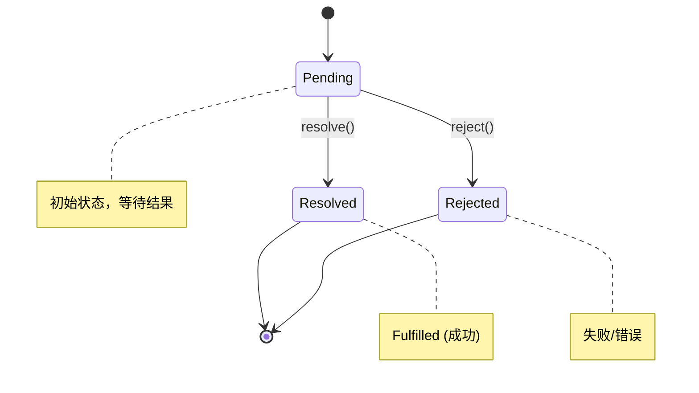
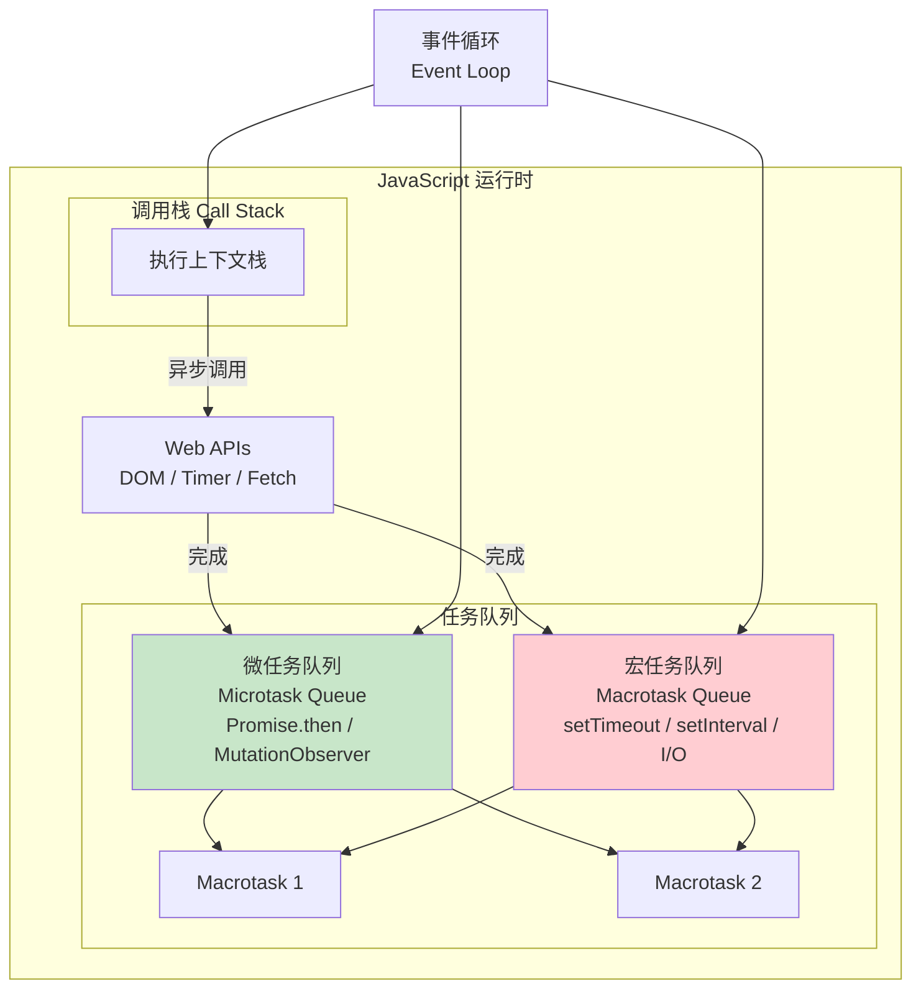
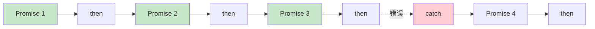
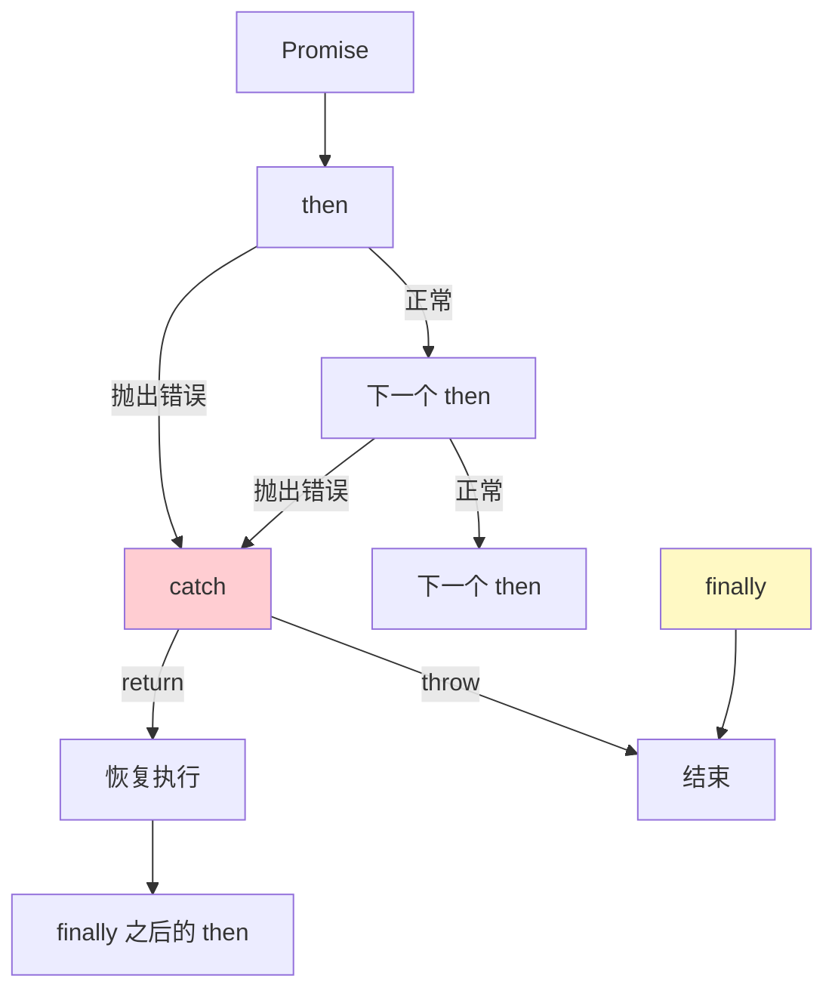
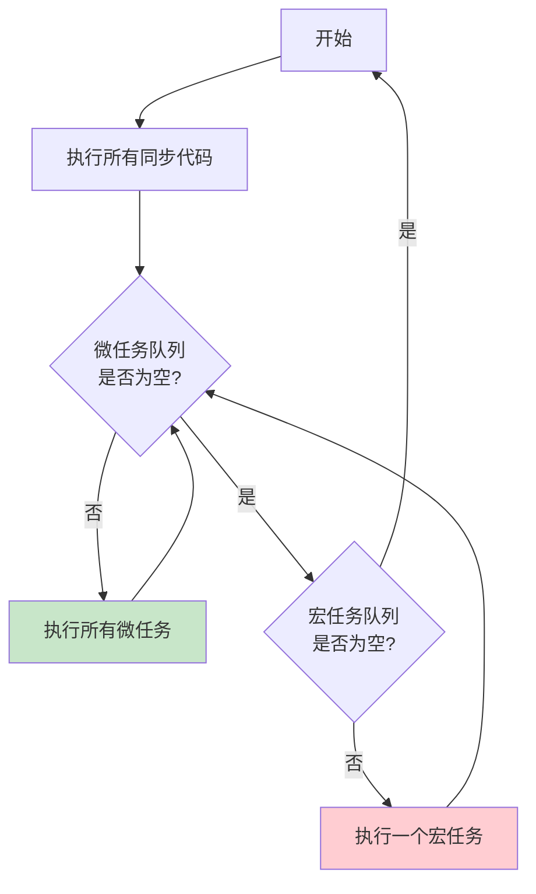

# JavaScript Promise 与异步编程

> Promise · async/await · 事件循环 · 异步模式

---

## 核心概念（精简版）

### Promise 状态



| 状态 | 说明 | 是否可变 |
|:-----|:-----|::--------:|
| **pending** | 初始状态，等待结果 | → resolved/rejected |
| **fulfilled** | 操作成功完成 | 不可变 |
| **rejected** | 操作失败 | 不可变 |

### Promise 基本用法

```javascript
// 创建 Promise
const promise = new Promise((resolve, reject) => {
  // 异步操作
  setTimeout(() => {
    const success = true;
    if (success) {
      resolve('操作成功');
    } else {
      reject(new Error('操作失败'));
    }
  }, 1000);
});

// 使用 Promise
promise
  .then(result => console.log(result))
  .catch(error => console.error(error))
  .finally(() => console.log('清理资源'));
```

### async/await 语法

```javascript
// async 函数返回 Promise
async function fetchData() {
  try {
    const response = await fetch('/api/data');
    const data = await response.json();
    return data;
  } catch (error) {
    console.error('请求失败:', error);
    throw error;
  }
}

// 等价于
function fetchData() {
  return fetch('/api/data')
    .then(response => response.json())
    .then(data => data)
    .catch(error => {
      console.error('请求失败:', error);
      throw error;
    });
}
```

---

## 深入原理（深入版）

### 事件循环 (Event Loop)



**执行顺序**：
1. 执行同步代码（调用栈）
2. 调栈为空时，处理微任务队列
3. 微任务队列清空后，处理一个宏任务
4. 重复步骤 2-3

```javascript
// 示例：执行顺序分析
console.log('1. 开始');  // 同步

setTimeout(() => {
  console.log('2. setTimeout');  // 宏任务
}, 0);

Promise.resolve().then(() => {
  console.log('3. Promise.then');  // 微任务
});

console.log('4. 结束');  // 同步

// 输出顺序：1 → 4 → 3 → 2
```

### Promise 链式调用原理

```javascript
// then 返回新 Promise，形成链式
Promise.resolve(1)
  .then(x => {
    console.log(x);  // 1
    return x + 1;
  })
  .then(x => {
    console.log(x);  // 2
    return Promise.resolve(x + 1);
  })
  .then(x => {
    console.log(x);  // 3
    throw new Error('出错了');
  })
  .catch(err => {
    console.error(err.message);  // "出错了"
    return '恢复';
  })
  .then(x => {
    console.log(x);  // "恢复" - catch 后继续执行
  });
```



### Promise 静态方法

| 方法 | 说明 | 示例 |
|:-----|:-----|:-----|
| **Promise.resolve()** | 返回 resolved 状态的 Promise | `Promise.resolve(value)` |
| **Promise.reject()** | 返回 rejected 状态的 Promise | `Promise.reject(error)` |
| **Promise.all()** | 全部成功才成功 | `Promise.all([p1, p2])` |
| **Promise.race()** | 第一个完成的结果 | `Promise.race([p1, p2])` |
| **Promise.allSettled()** | 等待全部完成（无论成功失败） | `Promise.allSettled([p1, p2])` |
| **Promise.any()** | 任一成功即成功 | `Promise.any([p1, p2])` |

**对比示例**：
```javascript
const p1 = Promise.resolve(3);
const p2 = Promise.resolve(5);
const p3 = new Promise(resolve => setTimeout(() => resolve(1), 1000));
const p4 = Promise.reject(new Error('失败'));

// Promise.all: 全部成功才成功，任一失败则失败
Promise.all([p1, p2, p3])
  .then(values => console.log(values));  // [3, 5, 1]

Promise.all([p1, p2, p3, p4])
  .catch(err => console.error(err));  // Error: 失败

// Promise.race: 第一个完成的结果
Promise.race([p3, p1])
  .then(value => console.log(value));  // 3 (p1 先完成)

// Promise.allSettled: 等待全部完成
Promise.allSettled([p1, p4])
  .then(results => console.log(results));
  // [
  //   { status: 'fulfilled', value: 3 },
  //   { status: 'rejected', reason: Error: 失败 }
  // ]

// Promise.any: 任一成功即成功
Promise.any([p4, Promise.reject(2), p1])
  .then(value => console.log(value));  // 3
```

### 错误处理机制



**错误冒泡规则**：
1. 错误会沿着链向下传递，直到遇到 catch
2. catch 返回值会传递给后续 then
3. finally 不影响传递值

```javascript
Promise.resolve()
  .then(() => {
    throw new Error('错误1');
  })
  .then(() => {
    console.log('不会执行');
  })
  .catch(err => {
    console.error(err.message);  // "错误1"
    return '从错误恢复';
  })
  .then(value => {
    console.log(value);  // "从错误恢复"
  })
  .finally(() => {
    console.log('总是执行');
  });
```

---

## 实战案例

### 案例 1：串行与并行请求

```javascript
// ❌ 串行请求 (慢)
async function getUserData(userId) {
  const user = await fetch(`/api/users/${userId}`).then(r => r.json());
  const posts = await fetch(`/api/users/${userId}/posts`).then(r => r.json());
  const comments = await fetch(`/api/posts/${posts[0].id}/comments`).then(r => r.json());

  return { user, posts, comments };
}

// ✅ 并行请求 (快)
async function getUserData(userId) {
  const [user, posts, comments] = await Promise.all([
    fetch(`/api/users/${userId}`).then(r => r.json()),
    fetch(`/api/users/${userId}/posts`).then(r => r.json()),
    fetch(`/api/comments?userId=${userId}`).then(r => r.json())
  ]);

  return { user, posts, comments };
}
```

### 案例 2：请求重试机制

```javascript
class RetryablePromise {
  static async retry(fn, options = {}) {
    const {
      maxAttempts = 3,
      delay = 1000,
      backoff = 2,
      shouldRetry = () => true
    } = options;

    let lastError;

    for (let attempt = 1; attempt <= maxAttempts; attempt++) {
      try {
        return await fn(attempt);
      } catch (error) {
        lastError = error;

        if (attempt === maxAttempts || !shouldRetry(error, attempt)) {
          throw error;
        }

        // 指数退避延迟
        const waitTime = delay * Math.pow(backoff, attempt - 1);
        console.log(`第 ${attempt} 次失败，${waitTime}ms 后重试...`);
        await new Promise(resolve => setTimeout(resolve, waitTime));
      }
    }

    throw lastError;
  }
}

// 使用示例
const fetchDataWithRetry = () => RetryablePromise.retry(
  async () => {
    const response = await fetch('/api/unstable');
    if (!response.ok) throw new Error('请求失败');
    return response.json();
  },
  {
    maxAttempts: 5,
    delay: 1000,
    shouldRetry: (error, attempt) => {
      return attempt < 5;  // 根据错误类型判断
    }
  }
);
```

### 案例 3：超时控制

```javascript
function withTimeout(promise, timeout) {
  return Promise.race([
    promise,
    new Promise((_, reject) =>
      setTimeout(() => reject(new Error('请求超时')), timeout)
    )
  ]);
}

// 使用
async function fetchData() {
  try {
    const data = await withTimeout(
      fetch('/api/data').then(r => r.json()),
      5000  // 5 秒超时
    );
    return data;
  } catch (error) {
    if (error.message === '请求超时') {
      // 处理超时
      return { error: 'timeout' };
    }
    throw error;
  }
}
```

### 案例 4：并发控制

```javascript
class AsyncPool {
  constructor(maxConcurrency = 5) {
    this.maxConcurrency = maxConcurrency;
    this.running = 0;
    this.queue = [];
  }

  async run(fn) {
    while (this.running >= this.maxConcurrency) {
      await new Promise(resolve => this.queue.push(resolve));
    }

    this.running++;
    try {
      return await fn();
    } finally {
      this.running--;
      const next = this.queue.shift();
      if (next) next();
    }
  }
}

// 使用示例：控制并发请求数
const pool = new AsyncPool(3);  // 最多 3 个并发

const urls = ['/api/1', '/api/2', '/api/3', '/api/4', '/api/5'];
const results = await Promise.all(
  urls.map(url => pool.run(() => fetch(url).then(r => r.json())))
);
```

### 案例 5：取消请求

```javascript
class CancellablePromise {
  constructor(executor) {
    this._cancelled = false;
    this._cancelHandlers = [];

    this.promise = new Promise((resolve, reject) => {
      const resolveWrapper = value => {
        if (!this._cancelled) resolve(value);
      };

      const rejectWrapper = reason => {
        if (!this._cancelled) reject(reason);
      };

      executor(
        value => resolveWrapper(value),
        reason => rejectWrapper(reason)
      );
    });
  }

  cancel() {
    this._cancelled = true;
    this._cancelHandlers.forEach(handler => handler());
  }

  then(...args) { return this.promise.then(...args); }
  catch(...args) { return this.promise.catch(...args); }
  finally(...args) { return this.promise.finally(...args); }

  onCancel(handler) {
    this._cancelHandlers.push(handler);
  }
}

// 使用示例
const cancellable = new CancellablePromise(async (resolve, reject) => {
  cancellable.onCancel(() => {
    console.log('请求被取消');
  });

  // 模拟异步操作
  const result = await fetch('/api/data');
  resolve(result);
});

// 取消
setTimeout(() => cancellable.cancel(), 100);
```

---

## 面试真题精选

### Q1: 解释事件循环的执行机制

**参考答案**：



**关键点**：
1. 同步代码先执行
2. 微任务优先级高于宏任务
3. 每个宏任务执行后，清空所有微任务
4. 微任务包括：`Promise.then`、`MutationObserver`、`queueMicrotask`
5. 宏任务包括：`setTimeout`、`setInterval`、I/O、UI 渲染

### Q2: Promise.all 和 Promise.race 的区别？

**参考答案**：

| 特性 | Promise.all | Promise.race |
|:-----|:-----------|:-------------|
| **完成条件** | 所有 Promise 都完成 | 第一个 Promise 完成 |
| **失败条件** | 任一 Promise 失败 | 第一个 Promise 失败 |
| **返回值** | 所有 Promise 的值数组 | 第一个完成的 Promise 值 |
| **短路特性** | 失败时立即拒绝 | 完成时立即解决 |
| **使用场景** | 并行请求，需要所有结果 | 超时控制，竞速请求 |

### Q3: async/await 相比 Promise 有什么优势？

**参考答案**：

```javascript
// Promise 链式 - 回调地狱
function fetchUser() {
  return fetch('/api/user')
    .then(r => r.json())
    .then(user => {
      return fetch(`/api/posts?userId=${user.id}`)
        .then(r => r.json())
        .then(posts => ({ user, posts }));
    });
}

// async/await - 同步写法
async function fetchUser() {
  const user = await fetch('/api/user').then(r => r.json());
  const posts = await fetch(`/api/posts?userId=${user.id}`).then(r => r.json());
  return { user, posts };
}
```

**优势**：
1. **代码可读性**：同步写法，易于理解
2. **错误处理**：可使用 try/catch
3. **调试友好**：调用栈更清晰
4. **中间值传递**：无需在 then 链中手动传递

### Q4: 如何实现 Promise 并发控制？

**参考答案**：

参见案例 4 `AsyncPool` 实现

**核心思路**：
1. 维护运行计数和等待队列
2. 发起任务前检查是否超过并发限制
3. 超过限制则加入等待队列
4. 任务完成后唤醒队列中的下一个任务

---

## 参考资料

- [JavaScript Promise - MDN](https://developer.mozilla.org/en-US/docs/Web/JavaScript/Guide/Using_promises)
- [async/await - MDN](https://developer.mozilla.org/en-US/docs/Web/JavaScript/Reference/Statements/async_function)
- [JavaScript Event Loop - JavaScript.info](https://javascript.info/event-loop)
- [Promise 实现原理 - 掘金](https://juejin.cn/post/6845116696252974094)
