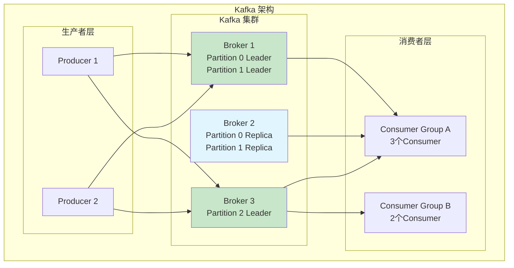
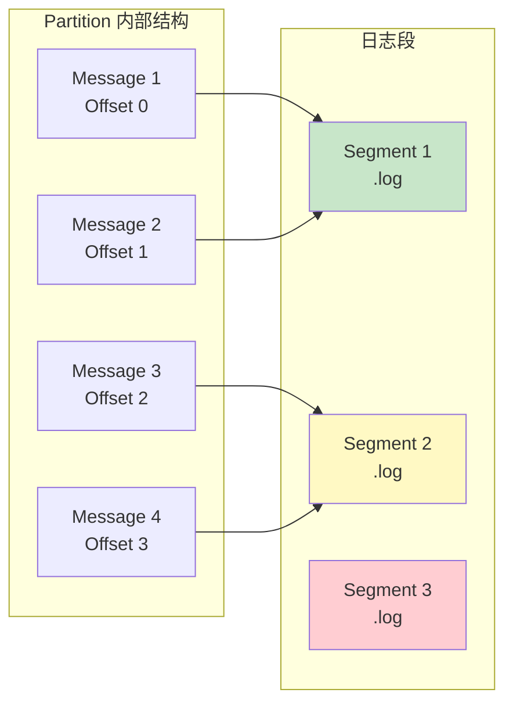
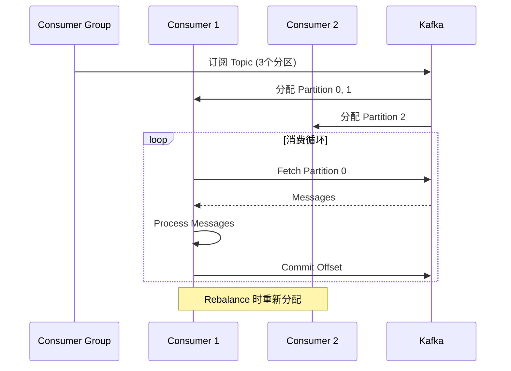
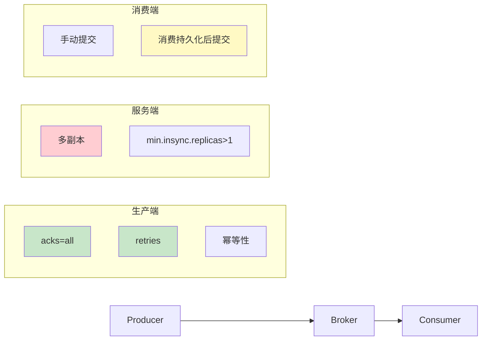

# Kafka 消息队列

> 分区副本 · 消费组 · 消息保证 · 架构设计

---

## 核心概念（精简版）

### Kafka 架构组件



### 核心概念

| 概念 | 说明 |
|:-----|:-----|
| **Broker** | Kafka 服务器节点 |
| **Topic** | 消息分类/主题 |
| **Partition** | Topic 的分区，实现并行处理 |
| **Replica** | 分区的副本，保证高可用 |
| **Producer** | 消息生产者 |
| **Consumer** | 消息消费者 |
| **Consumer Group** | 消费者组，组内每个分区只被一个消费者消费 |

### Topic 与 Partition

```
Topic: user-events
├── Partition 0 (Leader: Broker 1)
│   ├── Replica 1 (Broker 2)
│   └── Replica 2 (Broker 3)
├── Partition 1 (Leader: Broker 2)
│   ├── Replica 1 (Broker 1)
│   └── Replica 2 (Broker 3)
└── Partition 2 (Leader: Broker 3)
    ├── Replica 1 (Broker 1)
    └── Replica 2 (Broker 2)
```

### 常见面试题

> Q: Kafka 为什么快？

**A**:
1. **顺序写磁盘**：充分利用磁盘特性
2. **零拷贝**：sendfile 系统调用
3. **批量处理**：批量发送和接收
4. **分区并发**：多分区并行处理

---

## 深入原理（深入版）

### 分区 (Partition) 原理



**分区存储机制**：
- **日志分段 (Segment)**：按大小或时间切分
- **索引文件 (.index)**：记录 offset 与位置映射
- **时间索引 (.timeindex)**：按时间查找消息

### 副本 (Replica) 机制

```mermaid
stateDiagram-v2
    [*] --> Leader
    Leader --> Follower: ISR 同步
    Follower --> Leader: ACK 确认

    Leader --> 故障检测: Leader 宕机
    故障检测 --> 选举: Controller 选举新 Leader

    选举 --> 新Leader: ISR 中同步最完整的
    新Leader --> [*]

    note right of ISR
        ISR: In-Sync Replicas
        与 Leader 保持同步的副本集
    end note
```

**ISR (In-Sync Replicas)**：
- 动态维护与 Leader 同步的副本集合
- `min.insync.replicas` 控制最小 ISR 数量
- 副本拉取滞后超过阈值会被踢出 ISR

### 生产者消息发送

```go
// Go 示例：使用 sarama 库
import "github.com/IBM/sarama"

func produceMessage(producer sarama.SyncProducer) {
    message := &sarama.ProducerMessage{
        Topic: "user-events",
        Key:   sarama.StringEncoder("user-123"),  // 分区键
        Value: sarama.ByteEncoder([]byte(`{"event": "login"}`)),
    }

    // 同步发送
    partition, offset, err := producer.SendMessage(message)
    if err != nil {
        log.Printf("发送失败: %v", err)
        return
    }

    log.Printf("发送成功: partition=%d, offset=%d", partition, offset)
}
```

**发送可靠性配置**：

| 配置 | 说明 |
|:-----|:-----|
| `acks=0` | 不等待确认，可能丢数据 |
| `acks=1` | 等待 Leader 确认（默认） |
| `acks=all/-1` | 等待所有 ISR 确认 |
| `retries` | 重试次数 |
| `enable.idempotence` | 启用幂等性 |

### 消费者消费模式



**消费提交策略**：

| 策略 | 说明 | 问题 |
|:-----|:-----|:-----|
| **自动提交** | 定期自动提交 | 可能重复消费 |
| **手动同步提交** | 处理完手动提交 | 性能较低 |
| **手动异步提交** | 异步提交，失败重试 | 可能丢失未确认提交 |

---

## 实战案例

### 案例 1：高可用生产者配置

```go
config := sarama.NewConfig()

// 可靠性配置
config.Net.DialTimeout = 30 * time.Second
config.Net.ReadTimeout = 30 * time.Second
config.Net.WriteTimeout = 30 * time.Second
config.Producer.RequiredAcks = sarama.WaitForAll  // 等待所有副本
config.Producer.Retry.Max = 5                       // 重试5次
config.Producer.Retry.Backoff = 100 * time.Millisecond
config.Producer.Idempotent = true  // 启用幂等性

// 性能配置
config.Producer.Flush.Messages = 100      // 批量发送
config.Producer.Flush.Frequency = 100 * time.Millisecond
config.Producer.Return.Successes = true

producer, err := sarama.NewSyncProducer([]string{"localhost:9092"}, config)
```

### 案例 2：消费者组精确一次处理

```go
// 使用 sarama-cluster 库
import "github.com/bsm/sarama-cluster"

func consumeMessages() {
    config := cluster.NewConfig()
    config.Group.Mode = cluster.ConsumerModeMultiplex
    config.Consumer.Offsets.Initial = sarama.OffsetOldest

    consumer, err := cluster.NewConsumer(
        []string{"localhost:9092"},
        "my-group",
        []string{"user-events"},
        config,
    )
    if err != nil {
        panic(err)
    }
    defer consumer.Close()

    for msg := range consumer.Messages() {
        // 处理消息
        if err := processMessage(msg); err != nil {
            log.Printf("处理失败: %v", err)
            continue
        }

        // 标记消息已处理
        consumer.MarkOffset(msg)
    }
}

func processMessage(msg *sarama.ConsumerMessage) error {
    var event UserEvent
    if err := json.Unmarshal(msg.Value, &event); err != nil {
        return err
    }

    // 业务处理（幂等设计）
    return handleEvent(event)
}
```

### 案例 3：Kafka Connect 数据同步

```json
// Source Connector：MySQL → Kafka
{
  "name": "mysql-source-connector",
  "config": {
    "connector.class": "io.debezium.connector.mysql.MySqlConnector",
    "database.hostname": "mysql",
    "database.port": "3306",
    "database.user": "debezium",
    "database.password": "dbz",
    "database.server.id": "184054",
    "database.server.name": "dbserver1",
    "database.include.list": "users",
    "database.history.kafka.bootstrap.servers": "kafka:9092",
    "topic.prefix": "mysql-"
  }
}

// Sink Connector：Kafka → Elasticsearch
{
  "name": "elastic-sink-connector",
  "config": {
    "connector.class": "io.confluent.connect.elasticsearch.ElasticsearchSinkConnector",
    "tasks.max": "1",
    "topics": "mysql-users",
    "connection.url": "http://elasticsearch:9200",
    "type.name": "_doc",
    "key.ignore": "true",
    "schema.ignore": "true"
  }
}
```

---

## 面试真题精选

### Q1: Kafka 如何保证消息不丢失？

**参考答案**：



**生产端**：`acks=all` + `retries` + `enable.idempotence=true`
**服务端**：`replication.factor=3` + `min.insync.replicas=2`
**消费端**：手动提交 + 业务处理成功后才提交

### Q2: Kafka 如何保证消息顺序？

**参考答案**：

**单个 Partition 内有序**：
- Producer 发送时指定 Key（如 user_id）
- 相同 Key 的消息发送到同一 Partition
- Consumer 单线程消费 Partition

```go
message := &sarama.ProducerMessage{
    Topic: "events",
    Key:   sarama.StringEncoder(userID),  // 相同用户进入同一分区
    Value: sarama.ByteEncoder(data),
}
```

**注意事项**：
- 跨 Partition 无全局顺序
- Consumer Group 内各 Partition 并行消费
- 需要全局顺序时：单分区 + 单消费者

### Q3: 什么是 Rebalance？何时发生？

**参考答案**：

**Rebalance**：消费组成员变化时重新分区分配

**触发条件**：
1. Consumer Group 有新成员加入
2. Consumer Group 有成员退出/宕机
3. Topic 分区数变化
4. Consumer 订阅 Topic 变化

**Rebalance 过程**：
1. **Join Group**：所有 Consumer 向 Coordinator 发送 JoinGroup 请求
2. **Select Leader**：选举 Consumer Leader
3. **Sync Group**：Leader 计算分配方案
4. **Assign**：分配方案同步给所有 Consumer
5. **Commit Offset**：新 Consumer 从 committed offset 开始消费

### Q4: Kafka 的高可用是如何实现的？

**参考答案**：

| 层级 | 高可用机制 |
|:-----|:-----------|
| **Broker 层** | 多副本 + ISR 机制 |
| **Controller 层** | Controller 故障自动选举 |
| **Producer 层** | 重试 + 幂等 + 事务 |
| **Consumer 层** | Consumer Group Rebalance |

### Q5: Kafka 与 RabbitMQ/RocketMQ 的区别？

**参考答案**：

| 特性 | Kafka | RabbitMQ | RocketMQ |
|:-----|:-------|:----------|:----------|
| **吞吐量** | 极高 | 中等 | 高 |
| **延迟** | 毫秒级 | 微秒级 | 毫秒级 |
| **消息保留** | 基于时间/大小 | 消费即删除 | 支持延迟 |
| **顺序保证** | 分区有序 | 队列有序 | 队列有序 |
| **事务支持** | ✓ | ✓ | ✓ |
| **适用场景** | 日志收集、流处理 | 传统业务 | 电商/金融 |

---

## 参考资料

- [Apache Kafka Architecture: A Complete Guide 2025 - Instaclustr](https://www.instaclustr.com/education/apache-kafka/apache-kafka-architecture-a-complete-guide-2025/)
- [Kafka Architecture - 2025 Edition - Cloudurable](https://cloudurable.com/blog/kafka-architecture-2025/)
- [Under the Hood of Apache Kafka: Architecture, Logs, and Replication - Medium](https://medium.com/codetodeploy/under-the-hood-of-apache-kafka-architecture-logs-and-replication-ac3bcb671977)
- [Advanced Apache Kafka: KRaft, Partitions and Examples - Damavis Blog](https://blog.damavis.com/en/advanced-apache-kafka-kraft-partitions-and-examples/)
- [Kafka Partition: All You Need to Know & Best Practices - AutoMQ GitHub](https://github.com/AutoMQ/automq/wiki/Kafka-Partition:-All-You-Need-to-Know-&-Best-Practices)
- [Creating Resilient Systems with Kafka Partitions & Replicas - iCertGlobal](https://www.icertglobal.com/blog/creating-resilient-systems-with-kafka-partitions-and-replicas-blog)
