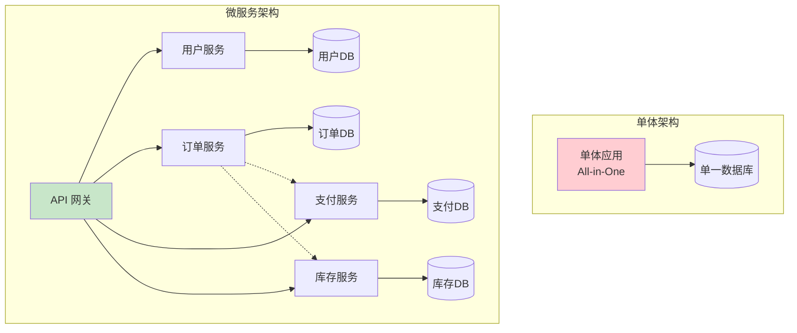
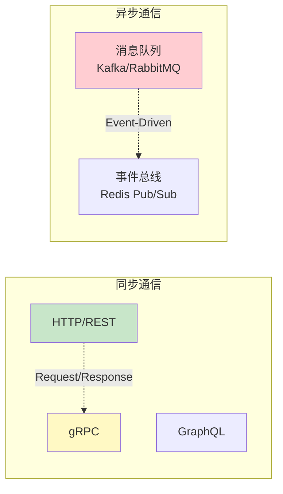
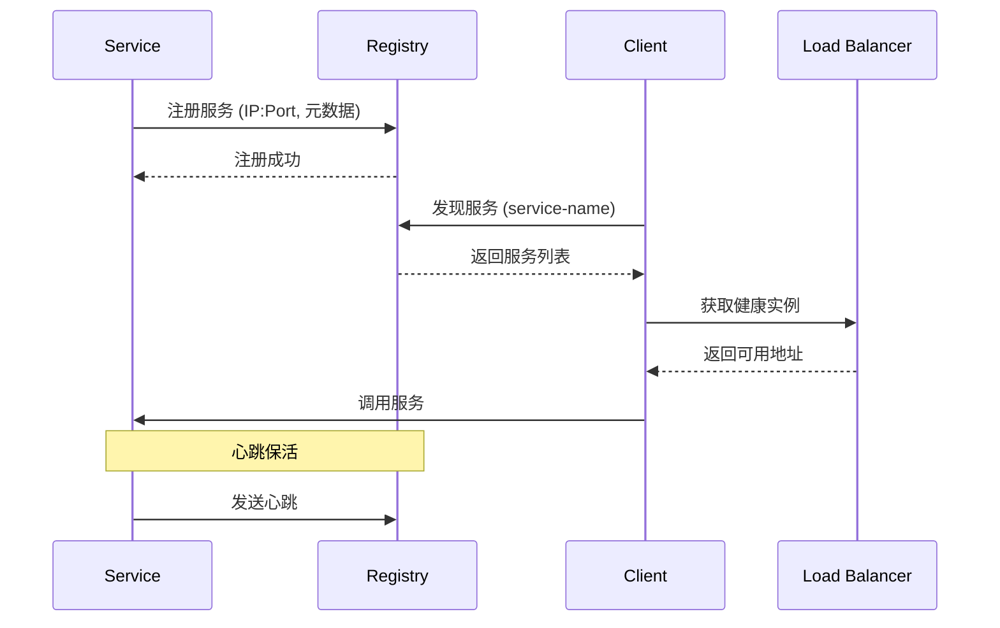
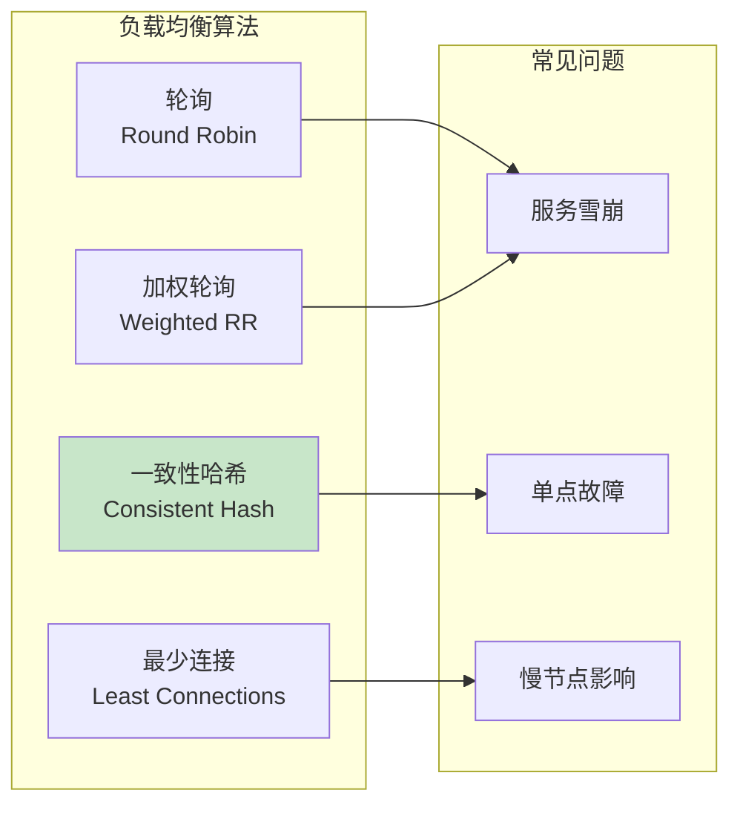
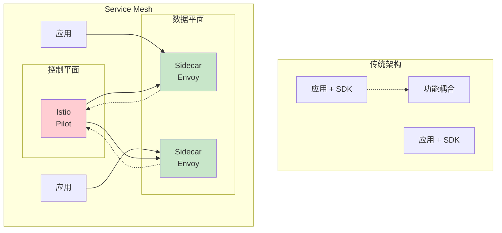
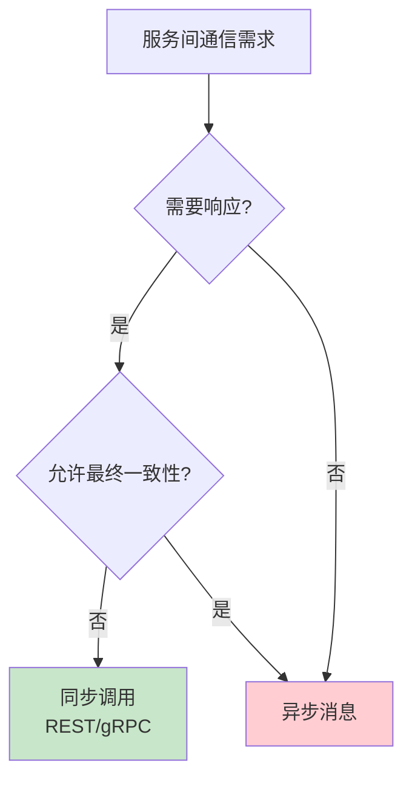
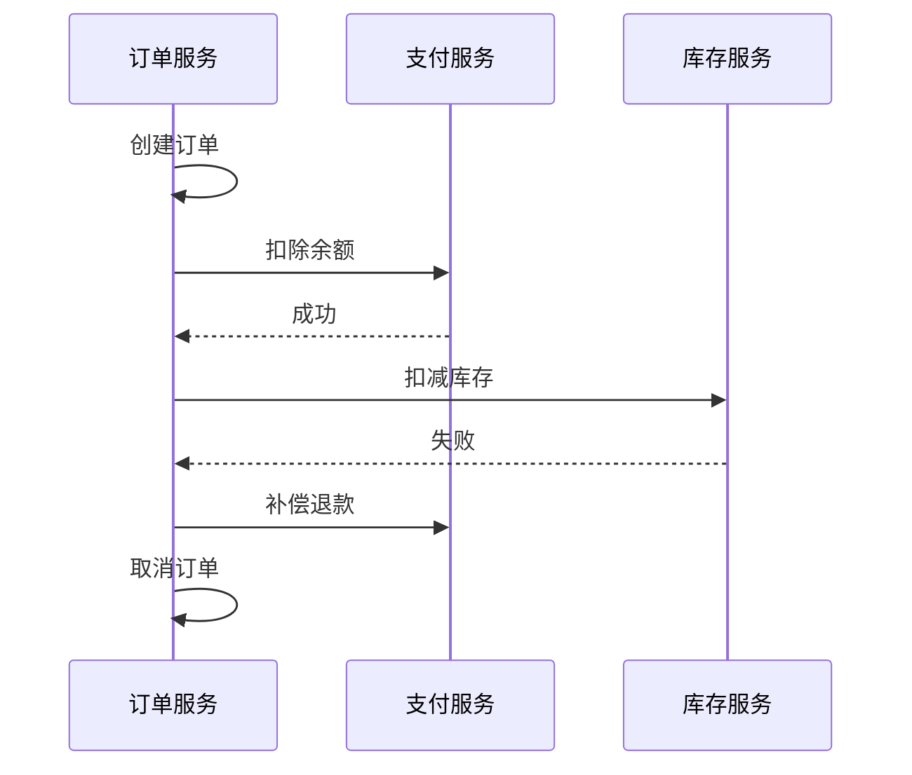

# 微服务架构

> 服务通信 · 服务发现 · API 网关 · 负载均衡 · Service Mesh

---

## 核心概念（精简版）

### 单体应用 vs 微服务



### 核心组件

| 组件 | 功能 | 常用工具 |
|:-----|:-----|:---------|
| **API 网关** | 统一入口、路由、鉴权 | Kong, APISIX, Nginx |
| **服务发现** | 服务注册与查找 | Consul, Etcd, Eureka |
| **负载均衡** | 请求分发 | Nginx, HAProxy, Envoy |
| **配置中心** | 集中配置管理 | Consul, Nacos, Apollo |
| **消息队列** | 异步通信 | Kafka, RabbitMQ |
| **链路追踪** | 分布式追踪 | Jaeger, Zipkin |
| **Service Mesh** | 服务间通信管理 | Istio, Linkerd |

### 通信模式



---

## 深入原理（深入版）

### 服务注册与发现



**服务发现模式**：

| 模式 | 说明 | 工具 |
|:-----|:-----|:-----|
| **客户端发现** | 客户端从注册中心获取服务列表，自己负载均衡 | Eureka, Consul |
| **服务端发现** | 客户端通过负载均衡器访问 | AWS ALB, Nginx |

### API 网关架构

```mermaid
graph TB
    subgraph "API 网关功能"
        Req[请求] --> Auth[身份认证]
        Auth --> Rate[限流]
        Rate --> Route[路由转发]
        Route -> LB[负载均衡]
        LB --> Svc[后端服务]

        Auth -.-> Log[日志记录]
        Rate -.-> Log
        Route -.-> Monitor[监控指标]
    end

    style Auth fill:#ffcdd2
    style Rate fill:#fff9c4
    style LB fill:#c8e6c9
```

**API 网关核心能力**：

| 功能 | 说明 | 实现方式 |
|:-----|:-----|:---------|
| **路由转发** | 根据 URL 路由到不同服务 | 路由规则配置 |
| **认证授权** | JWT 验证、OAuth2 | 中间件 |
| **限流熔断** | 保护后端服务 | 令牌桶、熔断器 |
| **协议转换** | HTTP/gRPC/GraphQL 转换 | 协议适配器 |
| **聚合编排** | 聚合多个服务响应 | Orchestration Engine |

### 负载均衡策略



| 算法 | 适用场景 | 优缺点 |
|:-----|:---------|:-------|
| **随机** | 简单场景 | 实现简单，分布可能不均 |
| **轮询** | 服务能力相当 | 简单公平，但无视负载 |
| **加权轮询** | 服务能力不同 | 考虑能力差异 |
| **最少连接** | 长连接场景 | 避免过载 |
| **一致性哈希** | 有状态服务 | 减少缓存失效 |

### Service Mesh 架构



**Service Mesh 核心能力**：
1. **流量管理**：路由规则、熔断、重试
2. **安全**：mTLS、身份认证
3. **可观测性**：分布式追踪、指标、日志

---

## 实战案例

### 案例 1：Consul 服务注册与发现

```go
package main

import (
    "github.com/hashicorp/consul/api"
)

// 服务注册
func registerService() {
    config := api.DefaultConfig()
    config.Address = "localhost:8500"
    client, _ := api.NewClient(config)

    registration := &api.AgentServiceRegistration{
        ID:      "user-service-1",
        Name:     "user-service",
        Tags:     []string{"api", "users"},
        Port:     8080,
        Address:  "192.168.1.100",
        Check: &api.AgentServiceCheck{
            HTTP:                           "http://192.168.1.100:8080/health",
            Interval:                        "10s",
            Timeout:                        "5s",
            DeregisterCriticalServiceAfter: "30s",
        },
    }

    client.Agent().ServiceRegister(registration)
}

// 服务发现
func discoverService(serviceName string) ([]string, error) {
    config := api.DefaultConfig()
    client, _ := api.NewClient(config)

    services, _, err := client.Health().Service(serviceName, "", true, nil)
    if err != nil {
        return nil, err
    }

    var endpoints []string
    for _, service := range services {
        endpoint := fmt.Sprintf("http://%s:%d",
            service.Service.Address,
            service.Service.Port,
        )
        endpoints = append(endpoints, endpoint)
    }

    return endpoints, nil
}
```

### 案例 2：Nginx 负载均衡配置

```nginx
# nginx.conf
upstream backend_services {
    # 一致性哈希（基于 user_id）
    hash $http_x_user_id consistent;

    server backend1:8080 weight=3;
    server backend2:8080 weight=2;
    server backend3:8080 weight=1;

    # 备用服务器
    server backup:8080 backup;

    # 健康检查
    check interval=3000 rise=2 fall=3 timeout=1000;
}

server {
    listen 80;

    # 限流配置
    limit_req_zone $binary_remote_addr zone=api:10m rate=10r/s;
    limit_req zone=api burst=20 nodelay;

    location /api/ {
        proxy_pass http://backend_services;
        proxy_set_header Host $host;
        proxy_set_header X-Real-IP $remote_addr;

        # 超时配置
        proxy_connect_timeout 5s;
        proxy_send_timeout 10s;
        proxy_read_timeout 10s;
    }
}
```

### 案例 3：熔断器实现 (Go)

```go
package circuitbreaker

import (
    "errors"
    "sync"
    "time"
)

type CircuitBreaker struct {
    maxFailures     int
    resetTimeout    time.Duration
    failureCount   int
    lastFailTime   time.Time
    state          State
    mu             sync.Mutex
}

type State int

const (
    StateClosed State = iota
    StateOpen
    StateHalfOpen
)

func (cb *CircuitBreaker) Execute(fn func() error) error {
    cb.mu.Lock()
    defer cb.mu.Unlock()

    // 检查是否应该重置
    if cb.state == StateOpen && time.Since(cb.lastFailTime) > cb.resetTimeout {
        cb.state = StateHalfOpen
        cb.failureCount = 0
    }

    // 熔断开启，拒绝请求
    if cb.state == StateOpen {
        return errors.New("circuit breaker is open")
    }

    // 执行函数
    err := fn()

    if err != nil {
        cb.failureCount++
        cb.lastFailTime = time.Now()

        // 达到失败阈值，开启熔断
        if cb.failureCount >= cb.maxFailures {
            cb.state = StateOpen
        }
        return err
    }

    // 半开状态成功后关闭熔断
    if cb.state == StateHalfOpen {
        cb.state = StateClosed
    }

    cb.failureCount = 0
    return nil
}
```

---

## 面试真题精选

### Q1: 如何选择微服务拆分策略？

**参考答案**：

| 拆分维度 | 说明 | 示例 |
|:---------|:-----|:-----|
| **业务领域** | 按 DDD 领域划分 | 订单、支付、库存 |
| **数据所有权** | 独立数据库 | 用户、商品 |
| **扩展需求** | 按扩展瓶颈拆分 | 高并发服务独立 |

### Q2: 服务间通信如何选择同步/异步？

**参考答案**：



**选择原则**：
- **需要实时响应**：同步（如支付确认）
- **可异步处理**：异步（如发送通知）
- **服务解耦**：异步（如订单→库存）

### Q3: 分布式事务如何实现？

**参考答案**：

| 方案 | 说明 | 适用场景 |
|:-----|:-----|:---------|
| **2PC/3PC** | 两/三阶段提交 | 强一致性要求 |
| **Saga** | 补偿事务模式 | 长事务、跨服务 |
| **TCC** | Try-Confirm-Cancel | 金融场景 |
| **本地消息表** | 消息表确保投递 | 最终一致性 |

**Saga 模式示例**：


### Q4: Service Mesh 的优缺点？

**参考答案**：

**优点**：
- 业务代码无侵入
- 集中管理流量
- 统一可观测性
- 多语言支持

**缺点**：
- 架构复杂度高
- 增加延迟（Sidecar）
- 运维成本增加

---

## 参考资料

- [7 Essential Microservices Architecture Patterns for 2025 - DocuWriter](https://www.docuwriter.ai/posts/microservices-architecture-patterns)
- [API Gateway Microservices: Optimizing Architecture - Gravitee](https://www.gravitee.io/blog/api-gateway-microservices-optimizing-architecture)
- [API Gateway vs. Load Balancer: The Ultimate Architectural Guide - Medium](https://medium.com/@kashishpl2000/api-gateway-vs-load-balancer-the-ultimate-architectural-guide-328407921224)
- [How to Choose Service Mesh in 2025 - SparkFabrik](https://blog.sparkfabrik.com/en/service-mesh)
- [Best Service Mesh Solutions: Top 8 Tools in 2025 - Tigera](https://www.tigera.io/learn/guides/service-mesh/service-mesh-solutions/)
- [API Gateway vs Service Mesh - Akamai](https://www.akamai.com/glossary/api-gateway-vs-service-mesh)
