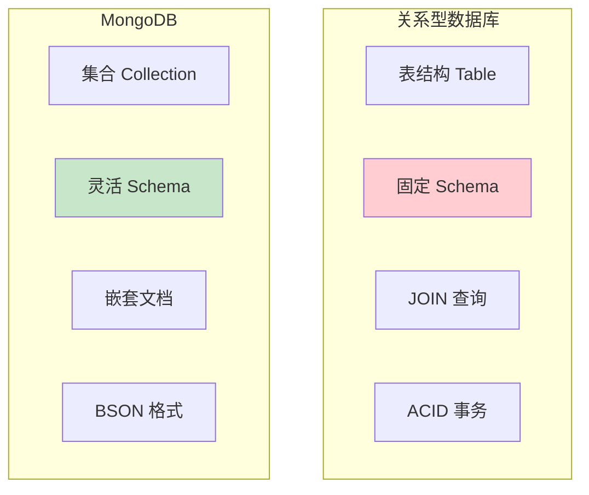
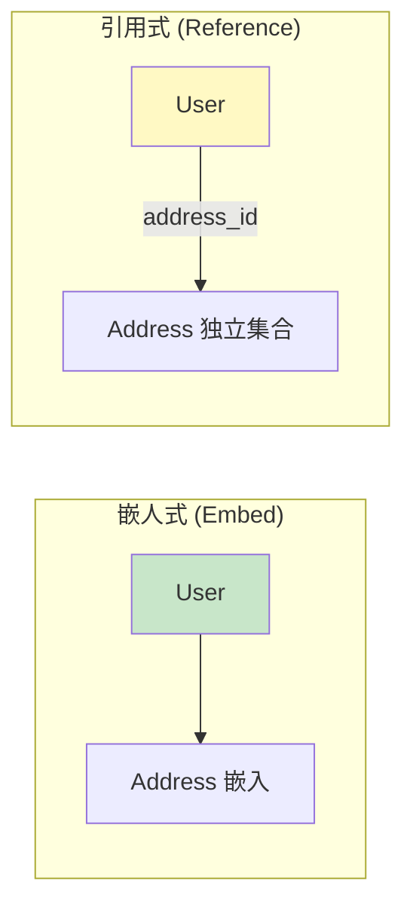
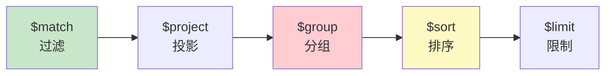
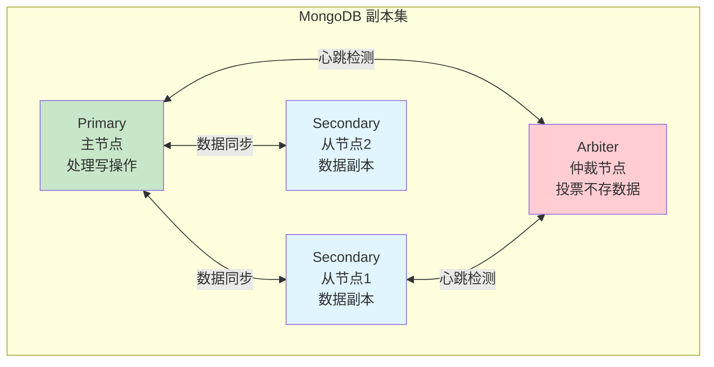
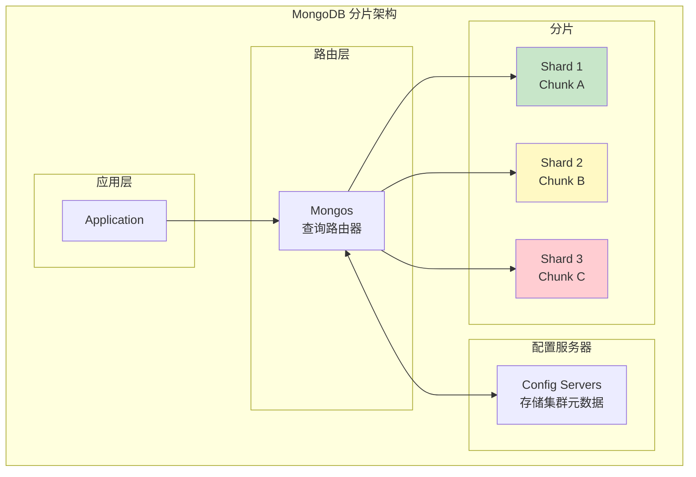
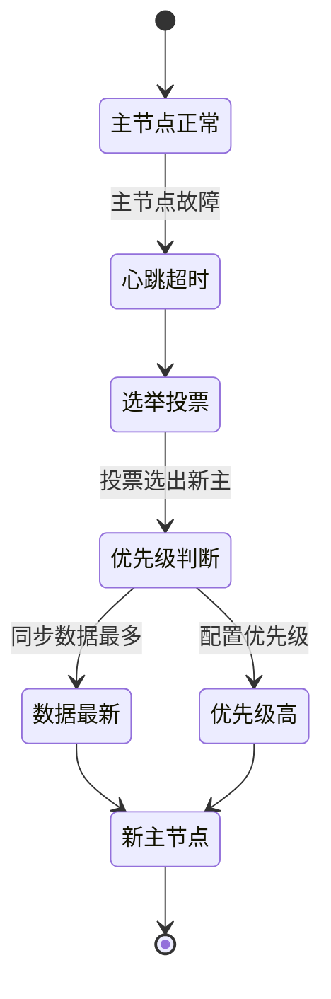

# MongoDB 基础

> 文档模型 · 聚合管道 · 索引 · 副本集

---

## 核心概念（精简版）

### MongoDB vs 关系型数据库



| 特性 | MongoDB | MySQL |
|:-----|:---------|:-------|
| **数据模型** | 文档型 | 表格型 |
| **Schema** | 灵活 | 固定 |
| **扩展性** | 水平扩展（分片） | 垂直扩展为主 |
| **事务** | 4.0+ 支持 | 完整支持 |
| **查询语言** | MQL | SQL |

### BSON 数据类型

```javascript
// MongoDB 文档示例
{
  "_id": ObjectId("507f1f77bcf86cd799439011"),
  "name": "张三",
  "age": 28,
  "tags": ["developer", "golang"],
  "address": {
    "city": "北京",
    "street": "朝阳路"
  },
  "createdAt": ISODate("2025-01-15T08:00:00Z")
}
```

**常用 BSON 类型**：

| 类型 | 说明 | 示例 |
|:-----|:-----|:-----|
| String | 字符串 | `"hello"` |
| Int32/64 | 整数 | `123` |
| Double | 浮点数 | `3.14` |
| Boolean | 布尔值 | `true` |
| Array | 数组 | `[1, 2, 3]` |
| Object | 嵌套文档 | `{"x": 1}` |
| ObjectId | 文档 ID | `ObjectId()` |
| Date | 日期 | `ISODate()` |

### 常用操作

```javascript
// 插入文档
db.users.insertOne({
  name: "李四",
  age: 30,
  email: "lisi@example.com"
})

// 查询文档
db.users.find({ age: { $gte: 25 } })

// 更新文档
db.users.updateOne(
  { name: "李四" },
  { $set: { age: 31 } }
)

// 删除文档
db.users.deleteOne({ name: "李四" })
```

---

## 深入原理（深入版）

### 文档模型设计

#### 嵌入式 vs 引用式



**选择原则**：

| 场景 | 推荐方式 | 原因 |
|:-----|:---------|:-----|
| 一对一，子文档小 | 嵌入式 | 减少查询次数 |
| 一对多，子文档多 | 引用式 | 避免文档过大（16MB 限制） |
| 频繁一起查询 | 嵌入式 | 性能更好 |
| 独立访问子文档 | 引用式 | 灵活性更高 |

### 聚合管道 (Aggregation Pipeline)



**常用聚合操作符**：

```javascript
// 示例：统计每个城市的用户数
db.users.aggregate([
  // 阶段1：匹配条件
  { $match: { age: { $gte: 18 } } },

  // 阶段2：按城市分组
  {
    $group: {
      _id: "$address.city",
      count: { $sum: 1 },
      avgAge: { $avg: "$age" }
    }
  },

  // 阶段3：排序
  { $sort: { count: -1 } },

  // 阶段4：限制结果
  { $limit: 10 }
])
```

**常用管道操作符**：

| 操作符 | 功能 | 示例 |
|:-------|:-----|:-----|
| `$match` | 过滤文档 | `{ $match: { status: "active" } }` |
| `$group` | 分组统计 | `{ $group: { _id: "$category", count: { $sum: 1 } } }` |
| `$project` | 字段投影 | `{ $project: { name: 1, age: 1 } }` |
| `$sort` | 排序 | `{ $sort: { createdAt: -1 } }` |
| `$limit` | 限制数量 | `{ $limit: 10 }` |
| `$skip` | 跳过数量 | `{ $skip: 10 }` |
| `$lookup` | 左连接 | `{ $lookup: { from: "orders", localField: "userId", foreignField: "userId", as: "orders" } }` |
| `$unwind` | 展开数组 | `{ $unwind: "$tags" }` |

### 索引机制

```javascript
// 创建索引
db.users.createIndex({ name: 1 })           // 单字段索引
db.users.createIndex({ age: 1, name: 1 })  // 复合索引
db.users.createIndex({ email: 1 }, { unique: true })  // 唯一索引

// 文本索引
db.articles.createIndex({ content: "text" })

// 地理位置索引
db.places.createIndex({ location: "2dsphere" })
```

**索引类型**：

| 类型 | 说明 | 使用场景 |
|:-----|:-----|:---------|
| **单字段索引** | 单个字段上建立 | 精确查询、排序 |
| **复合索引** | 多个字段组合 | 多字段查询 |
| **多键索引** | 数组字段索引 | 数组元素查询 |
| **文本索引** | 全文搜索 | 内容搜索 |
| **地理索引** | 位置数据 | 附近查询 |
| **哈希索引** | 哈希索引 | 等值查询 |
| **通配符索引** | 通配符字段 | 动态 Schema |

### 副本集 (Replica Set)



**副本集特点**：
- **自动故障转移**：主节点故障，自动选举新主节点
- **数据冗余**：多副本保证数据安全
- **读扩展**：可从从节点读取

**写入关注级别 (Write Concern)**：

| 级别 | 说明 |
|:-----|:-----|
| `{w: 1}` | 等待主节点确认 |
| `{w: "majority"}` | 等待大多数节点确认 |
| `{w: 0}` | 不等待确认（可能丢失） |
| `{j: true}` | 等待写入日记 |

### 分片集群 (Sharded Cluster)



**分片键选择原则**：
1. **基数高**：足够多的不同值
2. **分布均匀**：数据均匀分布到各分片
3. **查询友好**：常用查询条件包含分片键

---

## 实战案例

### 案例 1：电商订单模型

```javascript
// 用户集合
db.users.insertOne({
  _id: ObjectId(),
  name: "张三",
  email: "zhangsan@example.com",
  addresses: [  // 嵌入地址（一人多地址）
    {
      type: "home",
      province: "北京",
      city: "北京市",
      detail: "朝阳区xxx"
    }
  ]
})

// 订单集合
db.orders.insertOne({
  _id: ObjectId(),
  userId: ObjectId("..."),  // 引用用户
  orderNo: "ORD202501150001",
  items: [  // 嵌入商品
    { productId: ObjectId(), name: "商品A", price: 100, quantity: 2 }
  ],
  totalAmount: 200,
  status: "pending",
  createdAt: new Date()
})

// 创建索引
db.users.createIndex({ email: 1 }, { unique: true })
db.orders.createIndex({ userId: 1 })
db.orders.createIndex({ orderNo: 1 }, { unique: true })
db.orders.createIndex({ createdAt: -1 })
```

### 案例 2：聚合统计销售报表

```javascript
// 月度销售统计
db.orders.aggregate([
  // 1. 匹配条件
  {
    $match: {
      status: "completed",
      createdAt: {
        $gte: ISODate("2025-01-01"),
        $lt: ISODate("2025-02-01")
      }
    }
  },

  // 2. 按日期分组
  {
    $group: {
      _id: {
        year: { $year: "$createdAt" },
        month: { $month: "$createdAt" },
        day: { $dayOfMonth: "$createdAt" }
      },
      totalSales: { $sum: "$totalAmount" },
      orderCount: { $sum: 1 },
      avgOrderValue: { $avg: "$totalAmount" }
    }
  },

  // 3. 排序
  { $sort: { "_id.year": 1, "_id.month": 1, "_id.day": 1 } },

  // 4. 投影输出
  {
    $project: {
      date: {
        $dateToString: {
          format: "%Y-%m-%d",
          date: {
            $dateFromParts: {
              year: "$_id.year",
              month: "$_id.month",
              day: "$_id.day"
            }
          }
        }
      },
      totalSales: 1,
      orderCount: 1,
      avgOrderValue: 1
    }
  }
])
```

### 案例 3：变更流 (Change Streams)

```go
package main

import (
    "context"
    "fmt"
    "go.mongodb.org/mongo-driver/bson"
    "go.mongodb.org/mongo-driver/mongo"
)

func watchCollection(client *mongo.Client) {
    ctx := context.Background()
    collection := client.Database("test").Collection("users")

    // 创建变更流
    stream, err := collection.Watch(ctx, mongo.Pipeline{})
    if err != nil {
        panic(err)
    }
    defer stream.Close(ctx)

    for stream.Next(ctx) {
        var event bson.M
        if err := stream.Decode(&event); err != nil {
            continue
        }

        // 处理变更事件
        operationType := event["operationType"]
        fullDocument := event["fullDocument"]

        switch operationType {
        case "insert":
            fmt.Printf("新文档: %v\n", fullDocument)
        case "update":
            fmt.Printf("更新文档: %v\n", fullDocument)
        case "delete":
            fmt.Printf("删除文档: %v\n", event["documentKey"])
        }
    }
}
```

---

## 面试真题精选

### Q1: MongoDB 的 ACID 支持情况？

**参考答案**：

| 版本 | ACID 支持 | 说明 |
|:-----|:----------|:-----|
| **4.0 前** | 单文档 ACID | 仅支持单文档事务 |
| **4.0+** | 多文档 ACID | 副本集内多文档事务 |
| **4.2+** | 分片事务 | 支持跨分片事务 |

**使用事务的注意点**：
- 事务有 16MB 大小限制
- 事务执行时间建议 < 60 秒
- 避免长时间占用锁

### Q2: 何时使用嵌入式，何时使用引用式？

**参考答案**：

| 因素 | 嵌入式 | 引用式 |
|:-----|:---------|:--------|
| **关系类型** | 一对一 | 一对多、多对多 |
| **数据量** | 子文档 < 100 个 | 子文档 > 100 个 |
| **访问模式** | 总是一起获取 | 独立访问 |
| **更新频率** | 整体更新 | 独立更新 |

### Q3: MongoDB 的聚合管道如何优化？

**参考答案**：

1. **尽早过滤**：`$match` 放在最前面
2. **限制字段**：使用 `$project` 减少数据传输
3. **利用索引**：`$match`、`$sort` 使用索引字段
4. **分批处理**：使用 `$limit` 限制处理量
5. **避免 `$unwind` 后大文档**：谨慎使用数组展开

### Q4: 副本集选举机制是什么？

**参考答案**：



**选举因素**：
1. **优先级 (priority)**：配置值高的优先
2. **复制进度 (optime)**：数据最新的优先
3. **网络连接**：网络好的优先

---

## 参考资料

- [MongoDB Official Documentation - Aggregation Pipeline](https://www.mongodb.com/docs/manual/core/aggregation-pipeline/)
- [MongoDB Aggregation Pipeline Tutorial - DB Schema](https://dbschema.com/blog/mongodb/mongodb-aggregation-pipelines/)
- [MongoDB Aggregation Pipeline: A Beginner's Guide - Medium](https://medium.com/dev-simplified/mongodb-aggregation-pipeline-a-beginners-guide-5cedce36cd35)
- [MongoDB Aggregation Framework: A Beginner's Guide - Foojay](https://foojay.io/today/mongodb-aggregation-framework-a-beginners-guide/)
