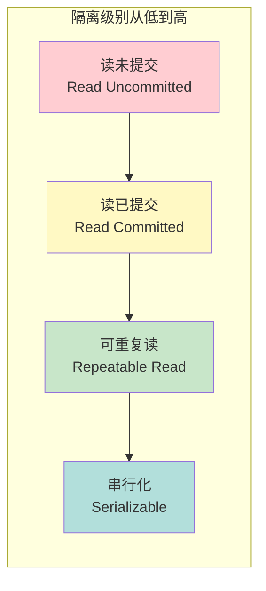
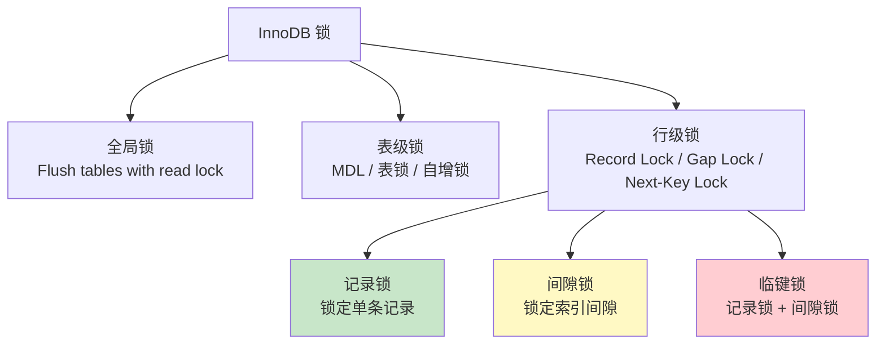
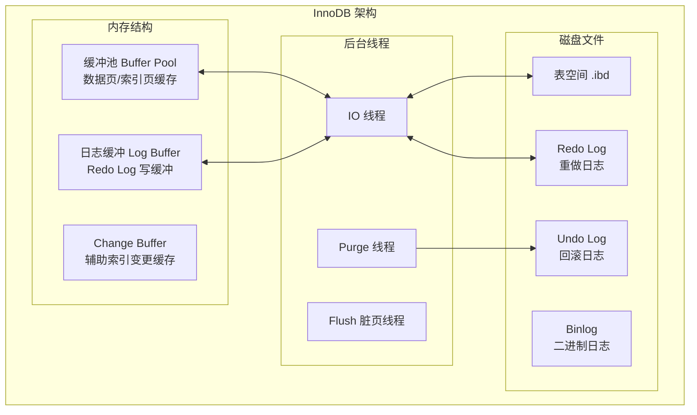
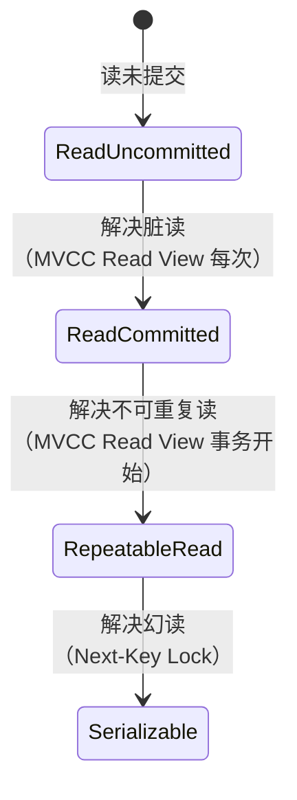
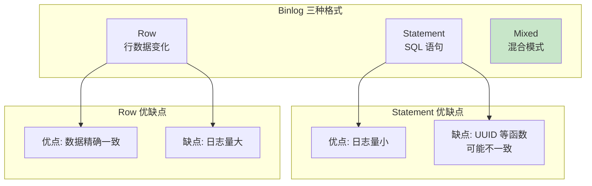
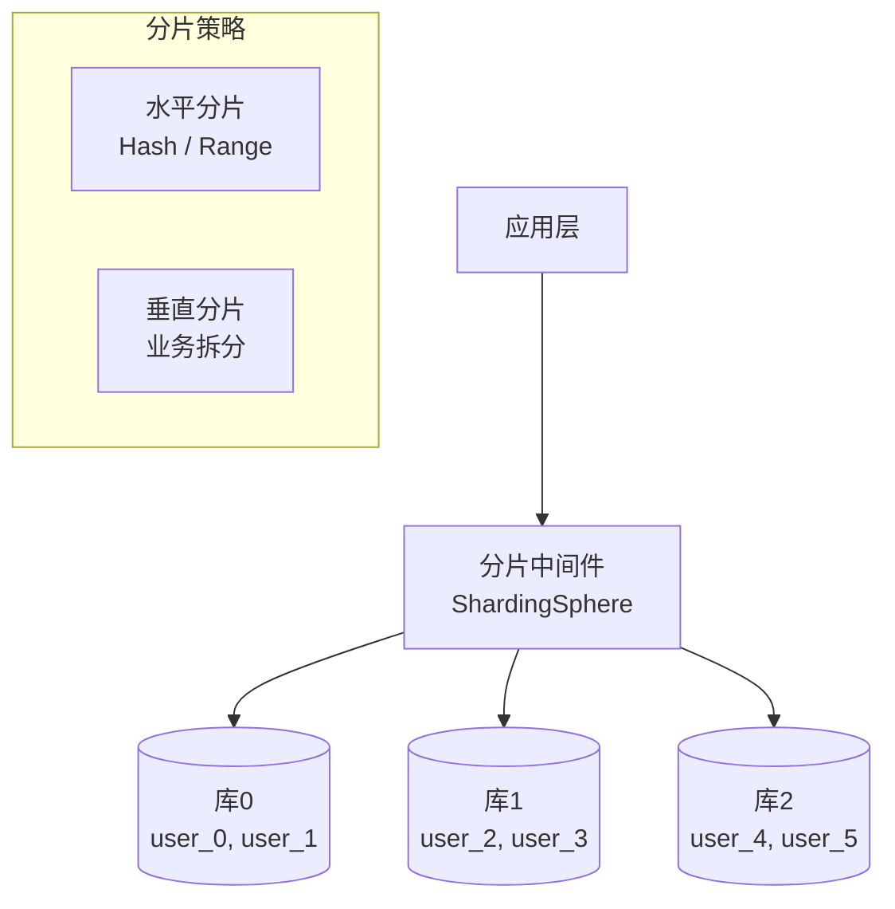

# MySQL 深度解析

> InnoDB · 锁机制 · 事务隔离 · 索引优化 · 主从复制 · 分库分表

---

## 核心概念（精简版）

### MySQL 存储引擎

| 引擎 | 特点 | 适用场景 |
|:-----|:-----|:---------|
| **InnoDB** | 支持事务、外键、行锁 | 高并发、事务完整性要求 |
| **MyISAM** | 表锁、不支持事务 | 只读、全表扫描多 |
| **Memory** | 数据存储在内存 | 临时表、缓存表 |
| **Archive** | 压缩存储、只追加 | 日志、历史数据归档 |

### 事务隔离级别



| 隔离级别 | 脏读 | 不可重复读 | 幻读 | MySQL 默认 |
|:---------|:----:|:---------:|:----:|:---------:|
| Read Uncommitted | ✓ | ✓ | ✓ | ✗ |
| Read Committed | ✗ | ✓ | ✓ | ✗ |
| **Repeatable Read** | ✗ | ✗ | ✗ | ✓ |
| Serializable | ✗ | ✗ | ✗ | ✗ |

### InnoDB 锁类型



### 常见面试题

> Q: 什么是幻读？RR 级别如何解决幻读？

**A**:
- **幻读**：同一事务内，相同条件查询结果集不一致（新增/删除行）
- **RR 级别解决方案**：
  1. **快照读**：MVCC 多版本并发控制
  2. **当前读**：Next-Key Lock 锁定范围，防止插入

---

## 深入原理（深入版）

### InnoDB 存储引擎架构



### Buffer Pool 详解

**组成结构**：
```
Buffer Pool
├── Free List (空闲页链表)
├── Flush List (脏页链表)
└── LRU List (最近最少使用链表)
    ├── Young Region (热数据)
    └── Old Region (冷数据)
```

**LRU 算法优化**：
- 预读页进入 Old 区域
- Young 区域访问才真正提升热度
- 避免全表扫描污染缓存

### MVCC 多版本并发控制

```mermaid
sequenceDiagram
    participant T1 as 事务1
    participant T2 as 事务2
    participant DB as InnoDB
    participant Undo as Undo Log

    Note over DB: 初始数据 age=20

    T1->>DB: BEGIN; SELECT age
    DB-->>T1: 返回 age=20<br/>Read View: [20]

    T2->>DB: BEGIN; UPDATE age SET 30
    T2->>Undo: 记录旧版本 age=20
    DB->>DB: 当前记录 age=30

    T1->>DB: SELECT age
    DB->>Undo: 读取 Undo 日志
    Undo-->>T1: 返回 age=20<br/>（快照读）
```

**Read View 结构**：
```go
type ReadView struct {
    low_limit_id  uint64 // 未提交事务最小 ID（已删除）
    up_limit_id   uint64 // 已提交事务最大 ID（活跃）
    ids          []uint64 // 活跃事务 ID 列表
}
```

### 锁机制详解

#### Next-Key Lock 工作原理

```mermaid
graph LR
    subgraph "表数据 id: 1, 5, 10"
        A[(-∞, 1)] --> B[(1, 5)]
        B --> C[(5, 10)]
        C --> D[(10, +∞)]
    end

    E[SELECT * FROM t<br/>WHERE id > 3<br/>FOR UPDATE] --> Lock

    Lock --> L1[Next-Key Lock (5, 10]]
    Lock --> L2[Gap Lock (10, +∞)]

    style L1 fill:#ffcdd2
    style L2 fill:#fff9c4
```

**锁定规则**：
1. 精确匹配唯一索引 → Record Lock
2. 等值查询（未命中）→ Gap Lock
3. 范围查询 → Next-Key Lock
4. 非唯一索引 → Always Next-Key Lock

#### 锁兼容矩阵

| 请求类型 \ 持有类型 | IS | IX | S | X |
|:------------------|:--:|:--:|:-:|:-:|
| **IS** (意向共享) | ✓ | ✓ | ✓ | ✗ |
| **IX** (意向排他) | ✓ | ✓ | ✗ | ✗ |
| **S** (共享) | ✓ | ✗ | ✓ | ✗ |
| **X** (排他) | ✗ | ✗ | ✗ | ✗ |

### 事务隔离级别实现



**实现方式对比**：

| 隔离级别 | 快照读策略 | 当前读策略 |
|:---------|:-----------|:-----------|
| **RC** | 每次 SELECT 生成新 Read View | Record Lock |
| **RR** | 事务开始生成 Read View | Next-Key Lock |

### Binlog 格式



**推荐配置**：
- 主从复制要求强一致：`binlog_format=ROW`
- 日志量敏感：`binlog_format=MIXED`

---

## 实战案例

### 案例 1：慢查询分析

```sql
-- 1. 开启慢查询日志
SET GLOBAL slow_query_log = 'ON';
SET GLOBAL long_query_time = 1;  -- 超过1秒记录

-- 2. 查看 slow_query_log 位置
SHOW VARIABLES LIKE 'slow_query_log_file';

-- 3. 分析慢查询日志
-- mysqldumpslow -s t -t 5 /var/log/mysql/slow-query.log

-- 4. 使用 EXPLAIN 分析执行计划
EXPLAIN SELECT * FROM orders WHERE user_id = 123;
```

**EXPLAIN 关键字段**：

| 字段 | 说明 |
|:-----|:-----|
| **type** | 访问类型（ALL < index < range < ref < eq_ref < const） |
| **key** | 实际使用的索引 |
| **rows** | 预估扫描行数 |
| **Extra** | 额外信息（Using index / Using filesort / Using temporary） |

### 案例 2：索引优化

```sql
-- ❌ 索引失效场景
SELECT * FROM users WHERE YEAR(birthday) = 1990;
SELECT * FROM users WHERE name LIKE '%张%';
SELECT * FROM users WHERE name != '张三';

-- ✅ 索引优化写法
SELECT * FROM users WHERE birthday >= '1990-01-01' AND birthday < '1991-01-01';
SELECT * FROM users WHERE name LIKE '张%';
SELECT * FROM users WHERE id IN (1, 2, 3);

-- ✅ 覆盖索引（不回表）
ALTER TABLE users ADD INDEX idx_name_age (name, age);
SELECT name, age FROM users WHERE name = '张三';
```

**最左前缀原则**：
```sql
-- 索引: idx_a_b_c (a, b, c)
-- ✅ 可用索引
WHERE a = 1
WHERE a = 1 AND b = 2
WHERE a = 1 AND b = 2 AND c = 3
WHERE a = 1 AND c = 3  -- b 用不到，但 a 可以

-- ✗ 不可用索引
WHERE b = 2
WHERE c = 3
WHERE b = 2 AND c = 3
```

### 案例 3：主从复制配置


**GTID (Global Transaction ID)** 概念：
```sql
-- GTID 格式
source_id:transaction_id
-- 示例
3E11FA47-31CA-11E1-9E33-C80AA9429562:23

-- source_id: 服务器的唯一标识符 (UUID)
-- transaction_id: 已执行事务的全局递增序号
```

**一、主库配置 (Master)**

1. 编辑配置文件 `/etc/my.cnf`：
```ini
[mysqld]
# 服务器唯一标识
server-id = 1

# 二进制日志配置
log-bin = mysql-bin
binlog_format = ROW
binlog_row_image = FULL
sync_binlog = 1
expire_logs_days = 7

# GTID 配置
gtid_mode = ON
enforce_gtid_consistency = ON

# 复制过滤 (可选)
binlog_do_db = myapp         # 只复制指定数据库
# binlog_ignore_db = mysql   # 忽略系统库
```

2. 重启 MySQL：
```bash
systemctl restart mysqld
```

3. 创建复制用户：
```sql
-- 创建复制用户
CREATE USER 'repl_user'@'%' IDENTIFIED BY 'StrongPassword123!';

-- 授予复制权限
GRANT REPLICATION SLAVE ON *.* TO 'repl_user'@'%';

-- 刷新权限
FLUSH PRIVILEGES;

-- 查看主库 GTID 状态
SHOW MASTER STATUS;
SHOW GLOBAL VARIABLES LIKE 'gtid%';
```

**二、从库配置 (Slave)**

1. 编辑配置文件 `/etc/my.cnf`：
```ini
[mysqld]
# 服务器唯一标识 (必须不同于主库)
server-id = 2

# 中继日志配置
relay-log = relay-bin
relay_log_purge = 1
read_only = ON
super_read_only = ON

# GTID 配置 (必须与主库一致)
gtid_mode = ON
enforce_gtid_consistency = ON

# 并行复制配置 (MySQL 5.7+)
slave_parallel_workers = 4
slave_parallel_type = LOGICAL_CLOCK

# 跳过错误 (可选，生产环境慎用)
# slave_skip_errors = 1062,1032
```

2. 重启 MySQL：
```bash
systemctl restart mysqld
```

**三、数据同步 (可选，主库已有数据时)**

```bash
# 1. 主库全量备份
mysqldump -u root -p \
  --single-transaction \
  --master-data=2 \
  --databases myapp > master_backup.sql

# 2. 传输备份到从库
scp master_backup.sql slave_server:/tmp/

# 3. 从库导入备份
mysql -u root -p < /tmp/master_backup.sql
```

**四、建立复制关系**

```sql
-- 在从库执行
CHANGE REPLICATION SOURCE TO
  SOURCE_HOST='192.168.1.100',      -- 主库 IP
  SOURCE_PORT=3306,                   -- 主库端口
  SOURCE_USER='repl_user',             -- 复制用户
  SOURCE_PASSWORD='StrongPassword123!',   -- 密码
  SOURCE_AUTO_POSITION=1;              -- GTID 自动定位

-- MySQL 8.0 之前语法
-- CHANGE MASTER TO
--   MASTER_HOST='192.168.1.100',
--   MASTER_USER='repl_user',
--   MASTER_PASSWORD='StrongPassword123!',
--   MASTER_AUTO_POSITION=1;

-- 启动复制
START REPLICA;
-- MySQL 8.0 之前: START SLAVE;

-- 查看复制状态
SHOW REPLICA STATUS\G
-- MySQL 8.0 之前: SHOW SLAVE STATUS\G
```

**五、验证复制状态**

```sql
-- 关键字段检查
SHOW REPLICA STATUS\G

-- 关键指标说明：
-- Replica_IO_Running: Yes     (IO 线程正常)
-- Replica_SQL_Running: Yes    (SQL 线程正常)
-- Seconds_Behind_Source: 0     (延迟秒数，0 表示无延迟)
-- Last_IO_Error: (无错误)
-- Last_SQL_Error: (无错误)
-- Retrieved_Gtid_Set: (已接收的 GTID)
-- Executed_Gtid_Set: (已执行的 GTID)
```

**六、主从复制监控**

```sql
-- 主库查看 Binlog 信息
SHOW BINARY LOGS;
SHOW MASTER STATUS;

-- 从库查看复制的 GTID
SELECT * FROM performance_schema.replication_connection_status;
SELECT * FROM performance_schema.replication_applier_status;

-- 手动跳过复制错误 (仅紧急情况)
-- STOP REPLICA;
-- SET GLOBAL sql_slave_skip_counter = 1;
-- START REPLICA;
```

**七、故障切换演练**

```bash
# 1. 停止主库
systemctl stop mysqld@primary

# 2. 将从库提升为主库
mysql -u root -p -e "STOP REPLICA; RESET REPLICA ALL;"
mysql -u root -p -e "SET GLOBAL read_only = OFF; SET GLOBAL super_read_only = OFF;"

# 3. 应用切换连接到新主库
# 更新应用配置的主库地址

# 4. 修复原主库后，将其配置为新从库
```

### 案例 4：分库分表策略



**分片策略选择**：

| 策略 | 优点 | 缺点 | 适用场景 |
|:-----|:-----|:-----|:---------|
| **Hash 分片** | 数据均匀分布 | 扩容需迁移 | 数据量大，无范围查询 |
| **Range 分片** | 范围查询高效 | 可能数据倾斜 | 时间序列、日志数据 |
| **垂直分片** | 业务清晰 | 跨库关联复杂 | 微服务架构 |

**ShardingSphere 配置示例**：
```yaml
sharding:
  tables:
    t_user:
      actualDataNodes: db${0..2}.t_user_${0..1}
      databaseStrategy:
        standard:
          shardingColumn: user_id
          shardingAlgorithmName: db_mod
      tableStrategy:
        standard:
          shardingColumn: user_id
          shardingAlgorithmName: table_mod

  shardingAlgorithms:
    db_mod:
      type: MOD
      props:
        sharding-count: 3
    table_mod:
      type: MOD
      props:
        sharding-count: 2
```

---

## 面试真题精选

### Q1: 详细解释 InnoDB 的 MVCC 实现原理

**参考答案**：

MVCC 通过以下机制实现：

1. **隐藏字段**：
   - `DB_TRX_ID`：最近修改事务 ID
   - `DB_ROLL_PTR`：Undo Log 指针
   - `DB_ROW_ID`：隐藏主键（无主键时）

2. **Undo Log 版本链**：
   ```
   Record(age=30, trx_id=100) → Undo(age=20, trx_id=90) → Undo(age=10, trx_id=80)
   ```

3. **Read View 可见性判断**：
   - `trx_id < min_id`：可见（已提交）
   - `trx_id > max_id`：不可见（未来事务）
   - `trx_id in ids`：不可见（活跃事务）
   - `min_id <= trx_id <= max_id`：判断是否在 ids 中

### Q2: 什么是回表？如何避免？

**参考答案**：

**回表（Table Lookup）**：
- 通过二级索引找到主键
- 再通过主键回聚簇索引查询完整数据

**避免回表 - 覆盖索引**：
```sql
-- 索引: idx_name_age (name, age)

-- ✗ 回表
SELECT * FROM user WHERE name = 'Tom';

-- ✓ 覆盖索引
SELECT name, age FROM user WHERE name = 'Tom';
```

**联合索引顺序**：
- 最常查询的字段放前面
- 覆盖更多查询场景
- 遵循最左前缀原则

### Q3: 什么情况下索引会失效？

**参考答案**：

| 场景 | 示例 | 解决方案 |
|:-----|:-----|:---------|
| 函数计算 | `WHERE YEAR(birthday) = 1990` | 改为范围查询 |
| 隐式转换 | `WHERE phone = 13800138000` | 字段类型一致 |
| 模糊查询 | `WHERE name LIKE '%abc'` | 前缀匹配或全文索引 |
| OR 条件 | `WHERE indexed_col = 1 OR non_indexed = 2` | 改为 UNION |
| != / <> | `WHERE status != 1` | 改为 IN 或多个 = |
| IS NULL | `WHERE col IS NULL` | 设置默认值 |

### Q4: 主从复制延迟如何解决？

**参考答案**：

**原因分析**：
1. 主库并发写入，从库单线程回放
2. 大事务导致延迟
3. 网络带宽限制
4. 从库配置低

**解决方案**：

```sql
-- 1. 并行复制 (MySQL 5.7+)
SET GLOBAL slave_parallel_workers = 4;
SET GLOBAL slave_parallel_type = 'LOGICAL_CLOCK';

-- 2. 半同步复制
-- 主库
SET GLOBAL rpl_semi_sync_master_enabled = 1;
-- 从库
SET GLOBAL rpl_semi_sync_slave_enabled = 1;

-- 3. 读写分离
-- 读操作走从库，写操作走主库

-- 4. GTID 模式确保一致性
SET GLOBAL enforce_gtid_consistency = ON;
```

### Q5: 如何进行数据库备份与恢复？

**参考答案**：

**全量备份**：
```bash
# mysqldump 全量备份
mysqldump -u root -p --single-transaction \
  --master-data=2 --databases db1 db2 > backup.sql

# --single-transaction: InnoDB 一致性快照
# --master-data=2: 记录 binlog 位置
```

**增量备份（Binlog）**：
```bash
# 刷新 binlog
mysqladmin -u root -p flush-logs

# 备份 binlog 文件
cp /var/lib/mysql/mysql-bin.000001 /backup/
```

**恢复流程**：
```bash
# 1. 恢复全量备份
mysql -u root -p < backup.sql

# 2. 恢复增量 binlog
mysqlbinlog /backup/mysql-bin.000001 | mysql -u root -p
```

### Q6: 大表如何优化？

**参考答案**：

**大表定义**：千万级以上记录或表大小超过 10GB

**优化策略**：

1. **历史数据归档**：
```sql
-- 创建归档表结构与原表一致
CREATE TABLE orders_archive LIKE orders;

-- 迁移旧数据
INSERT INTO orders_archive SELECT * FROM orders WHERE create_time < '2023-01-01';

-- 删除已归档数据
DELETE FROM orders WHERE create_time < '2023-01-01';
```

2. **分库分表**：参考案例 4

3. **冷热分离**：
   - 热数据：近 3 个月，主库
   - 温数据：3-12 个月，从库
   - 冷数据：1 年以上，归档库

4. **表结构优化**：
   - 字段类型最小化（INT vs BIGINT）
   - 合理使用 NULL（NULL 需要额外位）
   - 垂直拆分大字段（TEXT/BLOB）

### Q7: 如何优化数据库连接数？

**参考答案**：

```sql
-- 1. 查看当前连接
SHOW PROCESSLIST;
SHOW STATUS LIKE 'Threads_connected';
SHOW STATUS LIKE 'Max_used_connections';

-- 2. 调整连接池参数
SET GLOBAL max_connections = 500;
SET GLOBAL wait_timeout = 300;  -- 空闲连接超时
SET GLOBAL interactive_timeout = 300;

-- 3. 应用层连接池配置
-- Go 示例
db.SetMaxOpenConns(100)     // 最大打开连接
db.SetMaxIdleConns(10)      // 最大空闲连接
db.SetConnMaxLifetime(time.Hour)  // 连接最大生命周期
```

**连接数计算公式**：
```
max_connections = (可用内存 - Global Buffers) / Thread Buffers

Thread Buffers ≈ read_buffer_size + read_rnd_buffer_size + sort_buffer_size + tmp_table_size
```

---

## 参考资料

- [MySQL Transaction Isolation Levels - Medium](https://medium.com/@jonackerland/mysql-transaction-isolation-levels-2876b0d8302d)
- [解析MySQL事务隔离级别 - 小武](https://fivezh.github.io/2019/02/01/MySQL-Transaction-Isolation-Level/)
- [InnoDB Isolation Levels Explained - Percona](https://www.percona.com/blog/various-types-of-innodb-transaction-isolation-levels-explained-using-terminal/)
- [Database Query Optimization: The Complete DBA Guide - Medium](https://medium.com/@jholt1055/database-query-optimization-the-complete-dba-guide-to-identifying-and-fixing-slow-queries-in-2025-80cf25c1c7bb)
- [How to Optimize MySQL Query Performance - OneUptime](https://oneuptime.com/blog/post/2026-01-26-mysql-query-optimization/view)
- [Top 10 MySQL Optimization Tips for 2025 - Informatix Systems](https://informatix.systems/techops-and-optimization/top-10-mysql-optimization-tips-for-2025-en/)
- [MySQL Replication Master/Slave - Medium](https://medium.com/@singh04angad/mysql-replication-master-slave-replication-679daa4eafe3)
- [How to Set Up MySQL Replication: Master-Replica Configuration - TechnoRoots](https://technoroots.org/insights/how-to-set-up-mysql-replication-master-replica-configuration-U3V1R)
- [A Beginners Guide to MySQL Replication Part 4: Using GTID-based Replication - Red Gate](https://www.red-gate.com/simple-talk/blogs/a-beginners-guide-to-mysql-replication-part-4-using-gtid-based-replication/)
