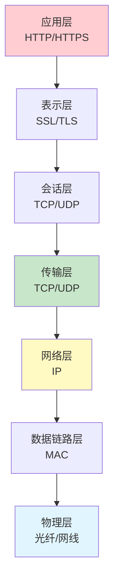
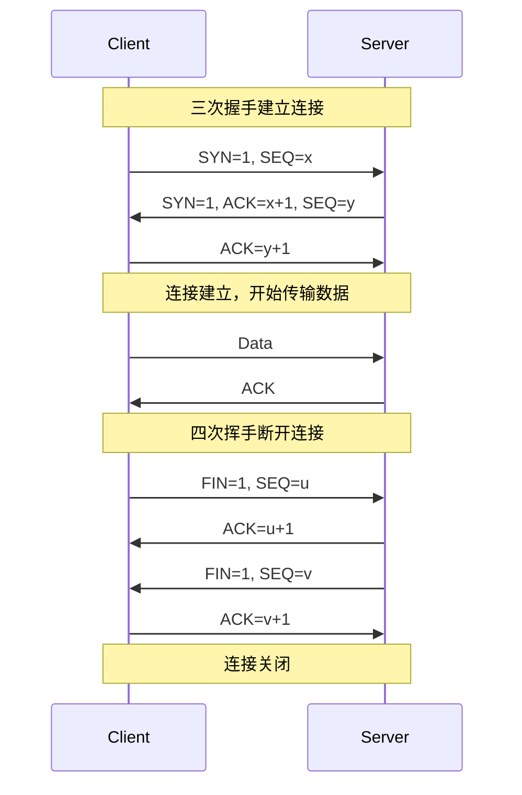
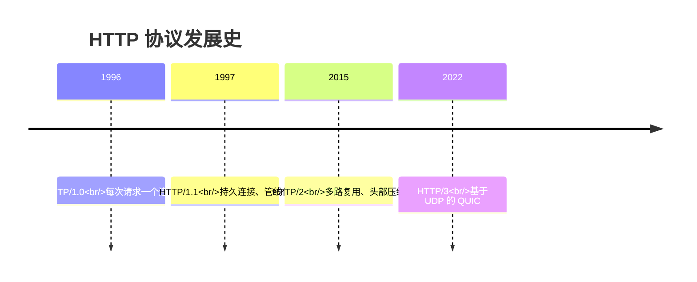
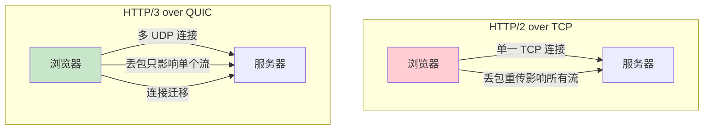
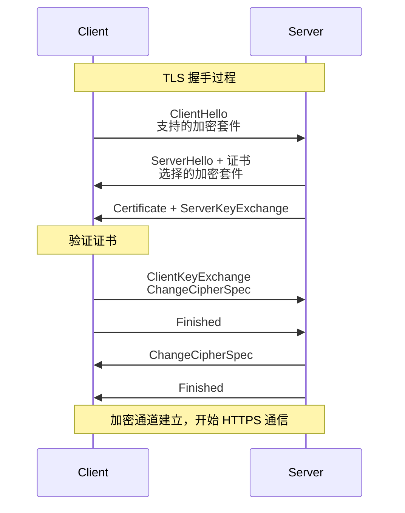
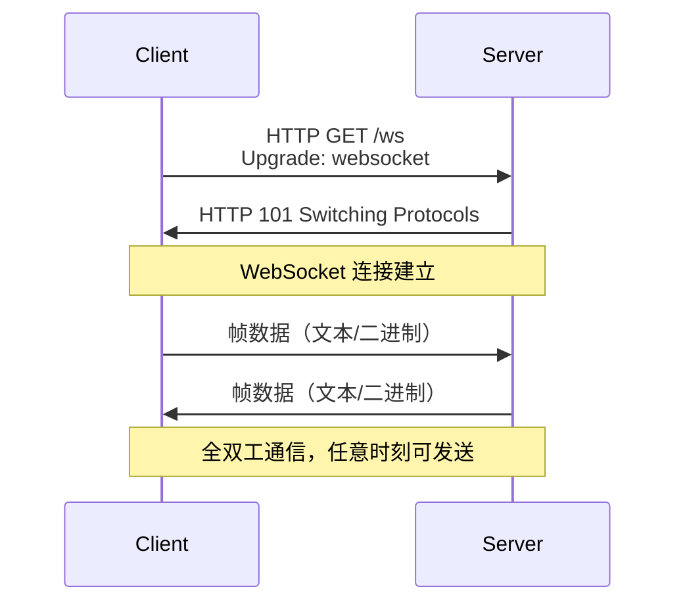

# 网络协议

> HTTP/HTTPS 发展 · TCP/IP · WebSocket · 网络安全

---

## 核心概念（精简版）

### OSI 七层模型



### TCP vs UDP

| 特性 | TCP | UDP |
|:-----|:-----|:-----|
| **连接** | 面向连接 | 无连接 |
| **可靠性** | 可靠传输（ACK、重传） | 不可靠 |
| **顺序** | 有序 | 可能乱序 |
| **速度** | 较慢 | 快 |
| **应用** | HTTP、FTP、SSH | DNS、视频流、游戏 |

### 三次握手与四次挥手



---

## 深入原理（深入版）

### HTTP 协议演进



| 版本 | 核心特性 | 问题解决 |
|:-----|:---------|:---------|
| **HTTP/1.0** | 基础请求响应 | 每次请求建立连接 |
| **HTTP/1.1** | Keep-Alive、Pipeline | 连接复用但线头阻塞 |
| **HTTP/2** | 二进制分帧、多路复用 | 解决线头阻塞 |
| **HTTP/3** | QUIC 传输、0-RTT | 连接迁移、队头消除 |

### HTTP/2 vs HTTP/3



**HTTP/2 核心特性**：
1. **二进制分帧**：替代文本格式
2. **多路复用**：单连接并发请求
3. **头部压缩 (HPACK)**：减少传输量
4. **服务端推送**：主动推送资源

**HTTP/3 核心改进**：
1. **基于 QUIC**：UDP 传输，0-RTT
2. **连接迁移**：网络切换无影响
3. **独立流**：单个丢包不影响其他流

### TLS/HTTPS 握手



**HTTPS = HTTP + TLS/SSL**
- **对称加密**：数据传输（AES）
- **非对称加密**：密钥交换（RSA）
- **哈希算法**：完整性校验（SHA256）

### WebSocket 通信



**WebSocket vs HTTP**：

| 特性 | HTTP | WebSocket |
|:-----|:------|:-----------|
| **通信模式** | 半双工（请求-响应） | 全双工 |
| **连接保持** | 短连接 | 长连接 |
| **开销** | 每次携带 Header | 帧头小（2-14 字节） |
| **适用** | 传统 API | 实时通信 |

---

## 实战案例

### 案例 1：HTTP/2 服务端推送 (Go)

```go
package main

import (
    "fmt"
    "net/http"
)

func main() {
    http.HandleFunc("/push", func(w http.ResponseWriter, r *http.Request) {
        // 检查是否支持 HTTP/2
        if r.ProtoMajor != 2 {
            http.Error(w, "HTTP/2 required", http.StatusHTTPVersionNotSupported)
            return
        }

        pusher, ok := w.(http.Pusher)
        if !ok {
            fmt.Println("Pusher not supported")
            return
        }

        // 主动推送资源
        pusher.Push("/style.css", nil)
        pusher.Push("/script.js", nil)

        fmt.Fprint(w, "Hello, HTTP/2!")
    })

    http.ListenAndServeTLS(":443", "cert.pem", "key.pem", nil)
}
```

### 案例 2：WebSocket 服务端 (Go)

```go
package main

import (
    "github.com/gorilla/websocket"
    "net/http"
)

var upgrader = websocket.Upgrader{
    CheckOrigin: func(r *http.Request) bool {
        return true // 生产环境需验证
    },
}

func wsHandler(w http.ResponseWriter, r *http.Request) {
    conn, err := upgrader.Upgrade(w, r, nil)
    if err != nil {
        http.Error(w, "Could not open websocket", http.StatusBadRequest)
        return
    }
    defer conn.Close()

    for {
        // 读取消息
        messageType, p, err := conn.ReadMessage()
        if err != nil {
            break
        }

        // 回显消息
        if err := conn.WriteMessage(messageType, p); err != nil {
            break
        }
    }
}

func main() {
    http.HandleFunc("/ws", wsHandler)
    http.ListenAndServe(":8080", nil)
}
```

### 案例 3：HTTPS 配置 (Nginx)

```nginx
server {
    listen 443 ssl http2;
    server_name example.com;

    # 证书配置
    ssl_certificate /etc/nginx/ssl/cert.pem;
    ssl_certificate_key /etc/nginx/ssl/key.pem;

    # SSL 优化
    ssl_protocols TLSv1.2 TLSv1.3;
    ssl_ciphers ECDHE-ECDSA-AES128-GCM-SHA256:ECDHE-RSA-AES128-GCM-SHA256;
    ssl_prefer_server_ciphers on;
    ssl_session_cache shared:SSL:10m;
    ssl_session_timeout 10m;

    # HSTS
    add_header Strict-Transport-Security "max-age=31536000" always;

    # OCSP Stapling
    ssl_stapling on;
    ssl_stapling_verify on;

    location / {
        proxy_pass http://backend;
        proxy_set_header X-Forwarded-For $proxy_add_x_forwarded_for;
    }
}

# HTTP 自动跳转 HTTPS
server {
    listen 80;
    server_name example.com;
    return 301 https://$server_name$request_uri;
}
```

---

## 面试真题精选

### Q1: HTTP 和 HTTPS 的区别？

**参考答案**：

| 特性 | HTTP | HTTPS |
|:-----|:------|:-------|
| **协议** | 明文传输 | TLS/SSL 加密 |
| **端口** | 80 | 443 |
| **证书** | 无 | 需要 SSL 证书 |
| **性能** | 更快 | 加密开销 |
| **SEO** | - | 搜索引擎优先 |

### Q2: TCP 粘包/拆包如何解决？

**参考答案**：

**问题原因**：
- TCP 是字节流，无消息边界
- Nagle 算法合并小包
- 接收缓冲区大小限制

**解决方案**：

```go
// 方案 1：固定长度
type FixedHeader struct {
    Length uint32 // 4字节长度
    Data   []byte
}

// 方案 2：分隔符
const Delimiter = '\n'

// 方案 3：长度前缀
func readMessage(conn net.Conn) ([]byte, error) {
    // 读取长度
    lenBuf := make([]byte, 4)
    _, err := io.ReadFull(conn, lenBuf)
    if err != nil {
        return nil, err
    }
    length := binary.BigEndian.Uint32(lenBuf)

    // 读取数据
    data := make([]byte, length)
    _, err = io.ReadFull(conn, data)
    return data, err
}
```

### Q3: HTTP/1.1 的管线化为何没普及？

**参考答案**：

**管线化 (Pipeline)**：
- 客户端发送多个请求不等待响应
- 服务端按顺序返回

**问题**：
1. **线头阻塞 (HOL)**：第一个请求慢，阻塞后续
2. **无优先级**：先发先处理
3. **兼容性问题**：代理和服务器支持不一

**HTTP/2 的多路复用彻底解决了此问题**。

---

## 参考资料

- [MDN Web Docs - HTTP](https://developer.mozilla.org/en-US/docs/Web/HTTP)
- [HTTP/3 Explained - Cloudflare](https://developers.cloudflare.com/http3-explained/)
- [WebSocket Protocol RFC 6455](https://datatracker.ietf.org/doc/html/rfc6455)
