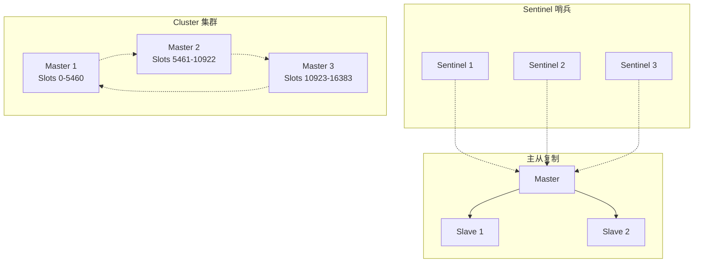
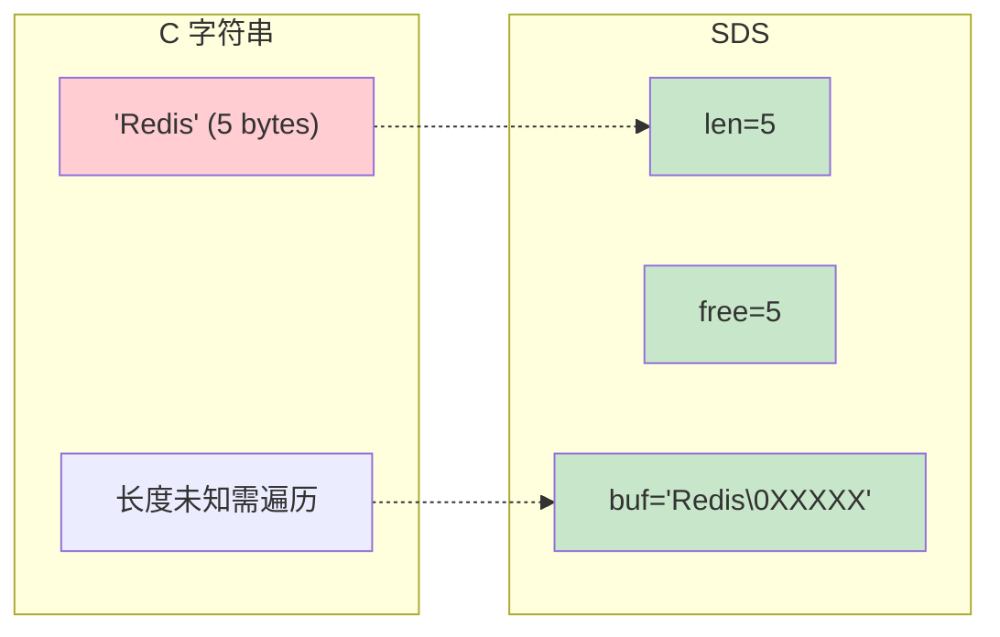
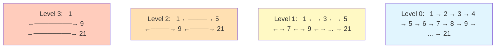
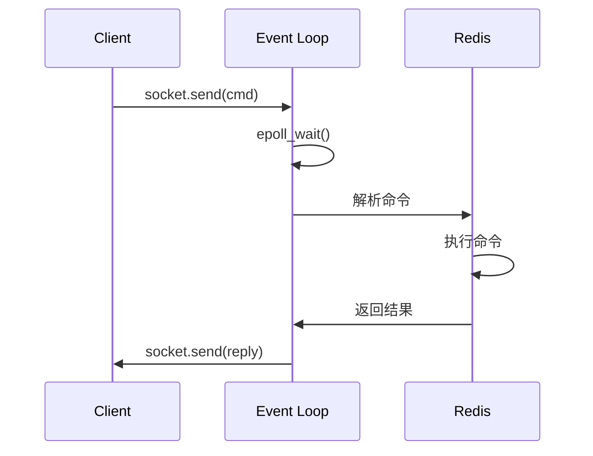
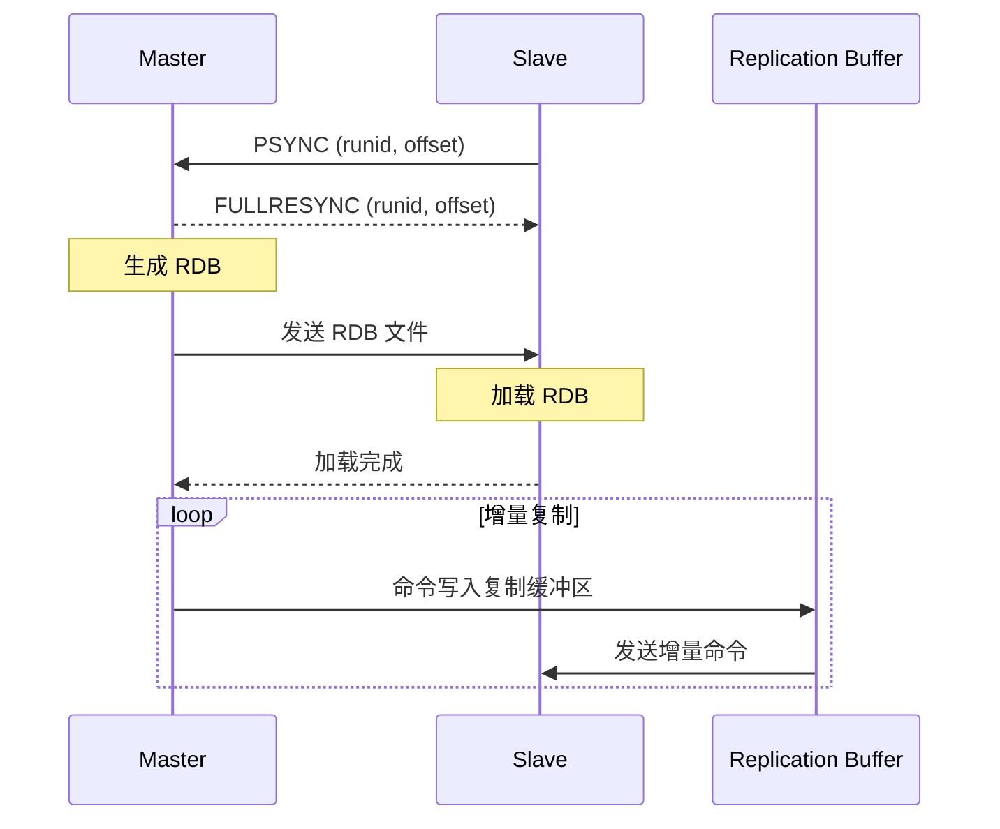
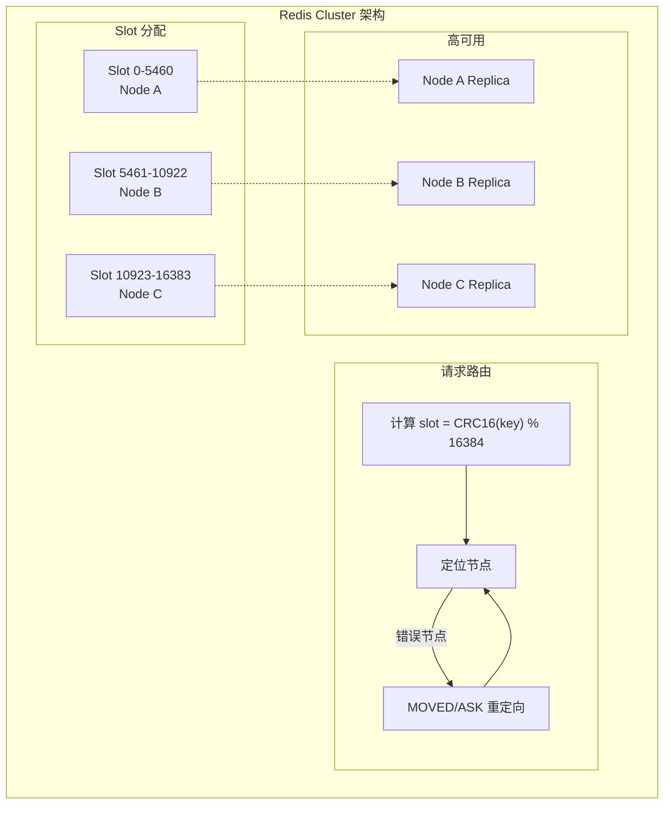
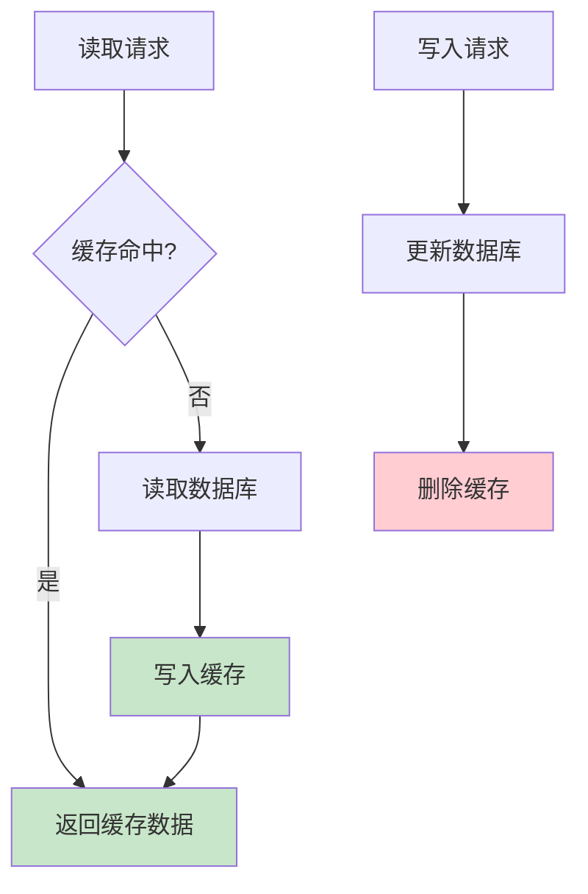
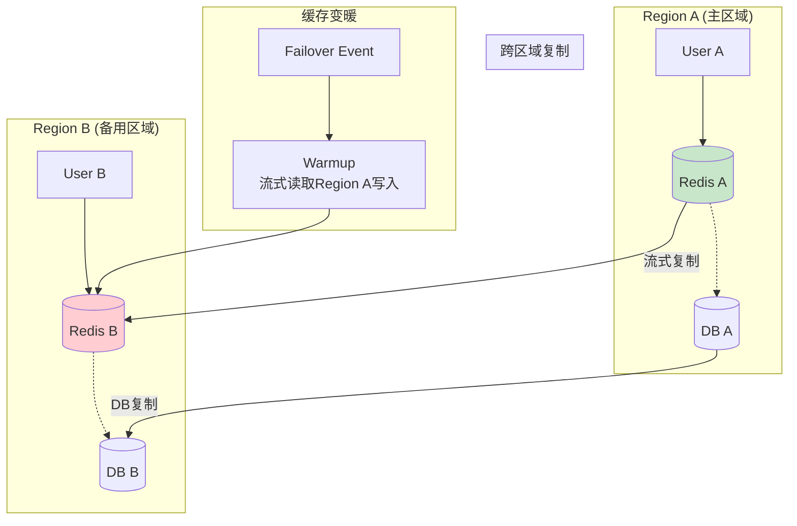
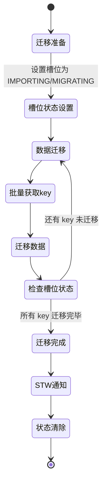

# Redis 高级应用

> 底层数据结构 · 集群模式 · 缓存架构 · 多区域变暖

---

## 核心概念（精简版）

### Redis 五种基础数据类型

| 类型 | 底层实现 | 应用场景 |
|:-----|:---------|:---------|
| **String** | SDS | 缓存、计数器、分布式锁 |
| **Hash** | ziplist + hashtable | 对象存储、购物车 |
| **List** | quicklist (双向链表) | 消息队列、最新列表 |
| **Set** | hashtable + intset | 标签、共同好友 |
| **ZSet** | ziplist + skiplist + hashtable | 排行榜、延时队列 |

### SDS (Simple Dynamic String)

```c
struct sdshdr {
    int len;        // 已使用长度
    int free;       // 剩余空闲长度
    char buf[];     // 实际存储数据
};
```

**优势**：
- O(1) 获取字符串长度
- 杜绝缓冲区溢出
- 减少内存分配次数
- 二进制安全

### 集群模式对比



| 模式 | 特点 | 适用场景 |
|:-----|:-----|:---------|
| **主从复制** | 读写分离，故障需手动切换 | 简单读写分离 |
| **Sentinel** | 自动故障转移，高可用 | 生产环境 HA |
| **Cluster** | 数据分片，自动扩容 | 大数据量高并发 |

### 常见面试题

> Q: Redis 为什么快？

**A**:
1. **纯内存操作**：内存访问速度快
2. **单线程模型**：无锁竞争，避免上下文切换
3. **IO 多路复用**：epoll 高效处理网络连接
4. **高效数据结构**：跳表、压缩表等优化

---

## 深入原理（深入版）

### 底层数据结构详解

#### SDS vs C 字符串



**SDS 优化策略**：
- 空间预分配：增长时预留额外空间
- 惰性释放：删除数据不立即回收内存

#### 跳表 (Skip List)



**跳表特点**：
- 时间复杂度：O(log n) 查找、插入、删除
- 空间复杂度：O(n) 平均
- 与平衡树对比：实现简单，无需旋转

#### ZSet 编码转换

```
ZSet 底层实现：
├── ziplist (元素 < 128 且 value < 64 字节)
└── skiplist + hashtable (超过阈值)
    ├── skiplist: 按分数排序，支持范围查询
    └── hashtable: member → score 映射，O(1) 查找
```

### Redis 单线程模型



**文件事件处理器**：
- **AE_API_BARRIER()**：IO 多路复用封装
- **acceptTcpHandler()**：处理新连接
- **readQueryFromClient()**：读取客户端命令
- **sendReplyToClient()**：返回结果

### 主从复制原理



**复制类型**：
1. **全量同步**：首次连接或 offset 丢失
2. **部分同步**：offset 在复制缓冲区中
3. **无盘复制**：Master 创建子进程直接发送 RDB

### Cluster 集群原理



**Cluster 关键概念**：
- **16384 个槽位**：均匀分布到各节点
- **CRC16 算法**：`slot = CRC16(key) % 16384`
- **MOVED 重定向**：槽位迁移时的正确节点提示
- **ASK 重定向**：槽位迁移中的临时提示

### 缓存更新策略

| 策略 | 描述 | 优缺点 |
|:-----|:-----|:-------|
| **Cache Aside** | 读：先读缓存，miss 读库并写缓存<br/>写：先更库，再删缓存 | 业界标准 |
| **Read Through** | 缓存层负责加载 | 实现复杂 |
| **Write Through** | 写缓存和数据库同步 | 性能较低 |
| **Write Behind** | 异步批量写入数据库 | 高性能但可能丢数据 |



---

## 实战案例

### 案例 1：分布式锁

```go
import (
    "context"
    "time"
    "github.com/redis/go-redis/v9"
)

// 简单分布式锁 (有隐患)
func SimpleLock(rdb *redis.Client, key string, expiration time.Duration) error {
    ctx := context.Background()
    ok, err := rdb.SetNX(ctx, key, "1", expiration).Result()
    if err != nil {
        return err
    }
    if !ok {
        return errors.New("lock failed")
    }
    return nil
}

// ✅ RedLock 算法实现
type RedLock struct {
    clients []*redis.Client
    quorum  int
}

func (rl *RedLock) Lock(ctx context.Context, key string, ttl time.Duration) error {
    // 1. 获取当前时间戳
    start := time.Now()

    // 2. 依次在所有节点上尝试加锁
    var successCount int
    for _, client := range rl.clients {
        ok, _ := client.SetNX(ctx, key, "locked", ttl).Result()
        if ok {
            successCount++
        }
    }

    // 3. 计算消耗时间
    elapsed := time.Since(start)
    remainingTTL := ttl - elapsed

    // 4. 判断是否获得多数节点锁
    if successCount >= rl.quorum && remainingTTL > 0 {
        return nil
    }

    // 5. 未获得锁，释放已获得的锁
    rl.Unlock(ctx, key)
    return errors.New("failed to acquire lock")
}

func (rl *RedLock) Unlock(ctx context.Context, key string) {
    for _, client := range rl.clients {
        client.Del(ctx, key)
    }
}
```

### 案例 2：缓存穿透解决方案

```go
import (
    "context"
    "github.com/redis/go-redis/v9"
)

// 方案1：布隆过滤器
import "github.com/bits-and-blooms/bloom/v3"

var filter = bloom.NewWithEstimates(1000000, 0.001)

func CacheWithBloom(ctx context.Context, key string) (string, error) {
    // 1. 布隆过滤器判断
    if !filter.Test([]byte(key)) {
        return "", errors.New("key does not exist")
    }

    // 2. 查询缓存
    val, err := rdb.Get(ctx, key).Result()
    if err == redis.Nil {
        // 3. 查询数据库
        val, err = queryDB(ctx, key)
        if err != nil {
            return "", err
        }
        // 4. 写入缓存
        rdb.Set(ctx, key, val, time.Hour)
    }
    return val, nil
}

// 方案2：缓存空对象 (注意过期时间)
func CacheWithNull(ctx context.Context, key string) (string, error) {
    val, err := rdb.Get(ctx, key).Result()
    if err == redis.Nil {
        data, err := queryDB(ctx, key)
        if errors.Is(err, sql.ErrNoRows) {
            // 缓存空对象，短过期时间
            rdb.Set(ctx, key, "NULL", 5*time.Minute)
            return "", nil
        }
        rdb.Set(ctx, key, data, time.Hour)
    }
    return val, nil
}
```

### 案例 3：缓存击穿解决方案

```go
import (
    "sync"
    "github.com/allegro/bigcache/v3"
)

// 方案1：互斥锁 (singleflight)
import "golang.org/x/sync/singleflight"

var sf singleflight.Group

func GetWithSingleFlight(ctx context.Context, key string) (string, error) {
    // 1. 查询缓存
    val, err := rdb.Get(ctx, key).Result()
    if err != redis.Nil {
        return val, err
    }

    // 2. 使用 singleflight 合并请求
    result, err, _ := sf.Do(key, func() (interface{}, error) {
        // 3. 双重检查
        val, err := rdb.Get(ctx, key).Result()
        if err != redis.Nil {
            return val, nil
        }
        // 4. 查询数据库
        data, err := queryDB(ctx, key)
        if err != nil {
            return nil, err
        }
        // 5. 设置缓存
        rdb.Set(ctx, key, data, time.Hour)
        return data, nil
    })

    return result.(string), err
}

// 方案2：热点数据永不过期
func GetWithLogicalExpire(ctx context.Context, key string) (string, error) {
    // 1. 查询缓存
    val, err := rdb.Get(ctx, key).Result()
    if err == redis.Nil {
        // 2. 缓存不存在，查询数据库
        data, err := queryDB(ctx, key)
        if err != nil {
            return "", err
        }
        // 3. 永不过期 + 逻辑过期时间
        rdb.Set(ctx, key, data, 0) // 永不过期
        rdb.Set(ctx, key+":expire", time.Now().Add(time.Hour), time.Hour)
        return data, nil
    }

    // 4. 检查逻辑过期
    expireTime, _ := rdb.Get(ctx, key+":expire").Time()
    if time.Now().After(expireTime) {
        // 异步刷新
        go refreshCache(ctx, key)
    }

    return val, nil
}
```

### 案例 4：多区域缓存变暖（Uber 架构）



**Uber CacheFront 实现要点**：

1. **流式复制**：Tail Redis 写入流，复制到备用区域
2. **Just-in-Time Fetching**：按需获取，无需全量复制
3. **Failover 处理**：
```go
// 伪代码
type CacheFront struct {
    localRegion  string
    primary     *redis.Client
    secondary   *redis.Client
    streamCh    chan string
}

func (cf *CacheFront) Get(ctx context.Context, key string) (string, error) {
    // 1. 优先从本地区域获取
    val, err := cf.local.Get(ctx, key).Result()
    if err == redis.Nil {
        // 2. 从主区域获取
        val, err = cf.primary.Get(ctx, key).Result()
        if err == nil {
            // 3. 写入本地缓存
            cf.local.Set(ctx, key, val, time.Hour)
        }
    }
    return val, err
}

func (cf *CacheFront) WatchStream() {
    // 监听主区域写入流
    stream := cf.primary.Stream(ctx, "__redis_write_log")
    for msg := range stream {
        // 异步写入本地区域
        cf.local.Set(ctx, msg.Key, msg.Value, msg.TTL)
    }
}
```

---

## 面试真题精选

### Q1: Redis 如何实现分布式锁？有什么问题？

**参考答案**：

**基础实现**：
```bash
SET key value NX PX 30000
```

**存在的问题**：
1. **锁超时释放**：业务执行时间超过锁过期时间
2. **主从切换**：主节点宕机，从节点未同步锁
3. **时钟跳跃**：服务器时间调整影响锁过期

**RedLock 算法**：
- 向 N/2+1 个 Redis 节点申请锁
- 计算获取锁消耗时间，检查锁有效期
- 释放锁时通知所有节点

**更优方案**：使用 Redisson 实现看门狗机制

### Q2: 什么是缓存穿透、击穿、雪崩？如何解决？

**参考答案**：

| 问题 | 定义 | 解决方案 |
|:-----|:-----|:---------|
| **缓存穿透** | 查询不存在的数据，绕过缓存 | 布隆过滤器 / 缓存空对象 |
| **缓存击穿** | 热点 key 过期，大量请求打向 DB | 互斥锁 / 热点永不过期 |
| **缓存雪崩** | 大量 key 同时过期 | 过期时间加随机值 |

### Q3: Redis 持久化机制对比？

**参考答案**：

| 特性 | RDB | AOF |
|:-----|:----|:-----|
| **存储方式** | 内存快照 | 命令日志 |
| **文件大小** | 小 | 大 |
| **恢复速度** | 快 | 慢 |
| **数据完整性** | 可能丢失最后一次快照后数据 | 更好（根据刷盘策略） |
| **性能影响** | fork 子进程有阻塞 | 每秒刷盘影响小 |
| **适用场景** | 备份 / 恢复 | 数据完整性要求高 |

**RDB + AOF 混合模式（4.0+）**：RDB 做基础，AOF 做增量

### Q4: Cluster 集群中如何进行数据迁移？

**参考答案**：



**迁移命令**：
```bash
# 源节点
CLUSTER SETSLOT <slot> MIGRATING <target_id>

# 目标节点
CLUSTER SETSLOT <slot> IMPORTING <source_id>

# 迁移 key
MIGRATE <target_ip> <target_port> <key> 0 <timeout>
```

### Q5: Redis 如何处理 bigkey？

**参考答案**：

**危害**：
- 内存占用高
- 删除/序列化阻塞主线程
- 主从同步延迟

**发现方式**：
```bash
# redis-cli --bigkeys
# redis-cli --memkeys

# 使用 scan 分析
redis-cli --scan --pattern "user:*" | xargs redis-cli memory usage
```

**解决方案**：
1. **拆分**：大 Hash 拆分为多个小 Hash
2. **压缩**：使用压缩列表或 MessagePack
3. **删除优化**：使用 UNLINK 异步删除
4. **监控预警**：设置 bigkey 监控

### Q6: 延时队列如何实现？

**参考答案**：

**方案 1：ZSet 实现**
```go
// 添加任务
func AddDelayTask(ctx context.Context, taskID string, delay time.Duration) {
    executeTime := time.Now().Add(delay).Unix()
    rdb.ZAdd(ctx, "delay_queue", redis.Z{
        Score:  float64(executeTime),
        Member: taskID,
    })
}

// 消费任务
func ConsumeDelayTask(ctx context.Context) {
    ticker := time.NewTicker(time.Second)
    for range ticker.C {
        now := float64(time.Now().Unix())
        // 查询到期的任务
        result, _ := rdb.ZRangeByScore(ctx, "delay_queue",
            &redis.ZRangeBy{Min: "0", Max: fmt.Sprintf("%f", now)}).Result()

        for _, taskID := range result {
            // 处理任务
            processTask(taskID)
            // 删除已处理任务
            rdb.ZRem(ctx, "delay_queue", taskID)
        }
    }
}
```

---

## 参考资料

- [Redis 核心技术点详解 - CSDN](https://blog.csdn.net/2501_91139003/article/details/149715822)
- [Redis系列之底层数据结构跳表SkipList - 腾讯云](https://cloud.tencent.com/developer/article/2491883)
- [Internals of Redis - Medium](https://ssudan16.medium.com/internals-of-redis-018512c295ee)
- [Redis数据结构及底层实现 - 面试鸭](https://www.mianshiyafanli.com/doc/20251214-redis-shu-ju-jie-gou-ji-di-ceng-shi-xian)
- [How Uber Serves over 150 Million Reads per Second - Uber Blog](https://www.uber.com/blog/how-uber-serves-over-150-million-reads/)
- [How Uber Scaled from 40M to 150M Database Reads/Second - Medium](https://balevdev.medium.com/how-uber-scaled-from-40m-to-150m-database-reads-second-without-adding-more-databases-28b07688d230)
- [Uber's CacheFront Explained - Blog](https://blog.logichook.in/2025/05/29/ubers-cachefront-explained/)
- [Multi-Region Cache Warming with Redis Streaming - ByteByteGo](https://blog.bytebytego.com/p/ep131-how-uber-served-40-million)
- [System Design of Uber's CacheFront - Engineering at Scale](https://engineeringatscale.substack.com/p/system-design-of-ubers-cachefront)
