# 系统设计：常见业务场景

> 短链接系统 · 秒杀系统 · 推送系统 · IM系统 · 支付系统

---

## 核心 CAP 定理

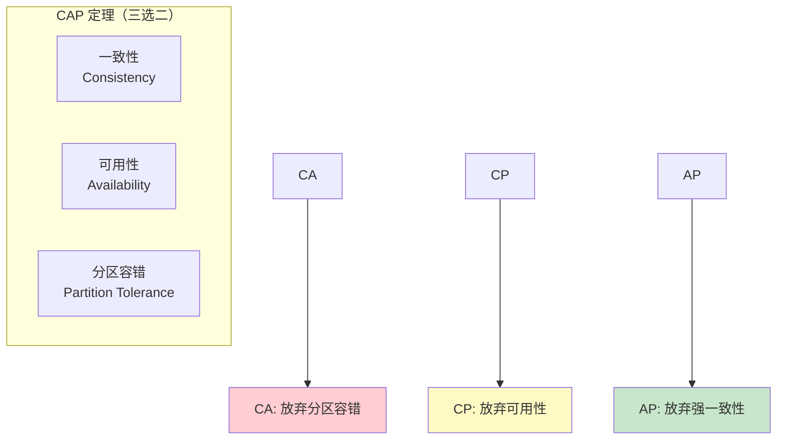

| 系统类型 | 选择 | 典型代表 |
|:---------|:-----|:---------|
| **CA** | 放弃 P | 传统单机数据库 |
| **CP** | 放弃 A | Redis、HBase、MongoDB |
| **AP** | 放弃 C | Cassandra、DynamoDB、CouchDB |

---

## 场景 1：短链接系统

### 需求分析

| 需求 | 说明 |
|:-----|:-----|
| **高并发** | 瞬间大量请求 |
| **短生命周期** | 一次使用后失效 |
| **防重复** | 同一短链不能重复 |
| **高可用** | 服务不能宕机 |

### 架构设计

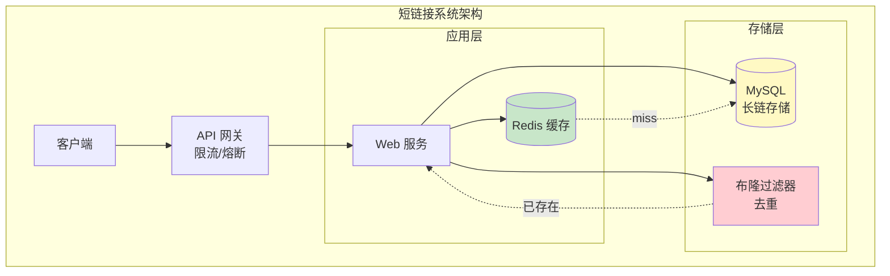

### 核心流程

**1. 生成短链**
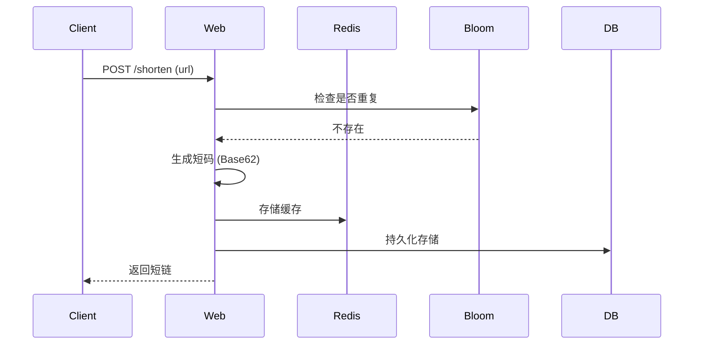

**2. 访问重定向**
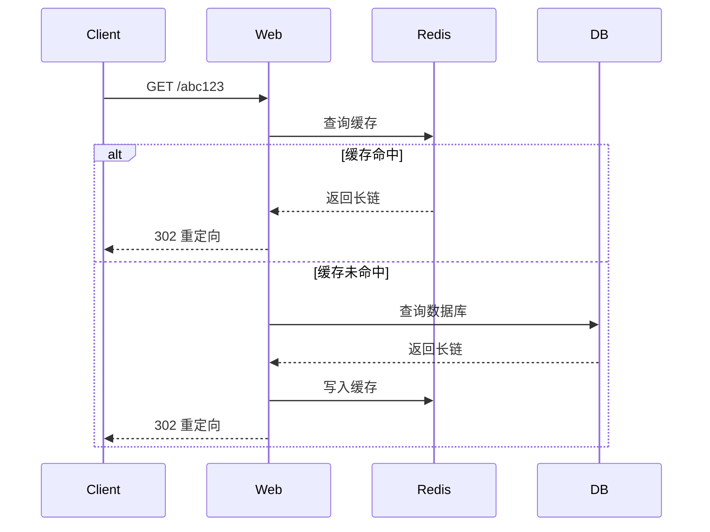

### 技术选型

| 组件 | 方案 | 说明 |
|:-----|:-----|:-----|
| **短码生成** | Base62 编码 | 0-9a-zA-Z，62 进制 |
| **去重** | 布隆过滤器 | 内存友好，有误判 |
| **缓存** | Redis String | 热点数据缓存 |
| **存储** | MySQL 分表 | 按时间/字符分表 |

### 代码示例

```go
// 短码生成（Base62）
const base62Chars = "0123456789abcdefghijklmnopqrstuvwxyzABCDEFGHIJKLMNOPQRSTUVWXYZ"

func ToBase62(id uint64) string {
    var result []byte
    for id > 0 {
        result = append(result, base62Chars[id%62])
        id /= 62
    }
    // 反转
    for i, j := 0, len(result)-1; i < j; i, j = i+1, j-1 {
        result[i], result[j] = result[j], result[i]
    }
    return string(result)
}

// 布隆过滤器去重
var bloomFilter = bloom.NewWithEstimates(10000000, 0.001)

func CheckDuplicate(url string) (bool, error) {
    // 布隆过滤器判断（可能有误判）
    if bloomFilter.Test([]byte(url)) {
        // 二次确认
        exists, err := db.CheckURLExists(url)
        if err != nil {
            return false, err
        }
        return exists, nil
    }
    return false, nil
}

// 缓存预热
func WarmupCache() error {
    // 从数据库加载热点短链
    urls, err := db.GetHotURLs(10000)
    if err != nil {
        return err
    }

    pipe := redis.Pipeline()
    for _, url := range urls {
        pipe.Set(ctx, url.ShortCode, url.OriginalURL, time.Hour*24)
    }
    _, err = pipe.Exec(ctx)
    return err
}
```

---

## 场景 2：秒杀系统

### 需求分析

| 需求 | 说明 |
|:-----|:-----|
| **超卖不卖** | 库存准确性 |
| **高并发** | 瞬间流量峰值 |
| **防刷** | 限制单用户购买 |
| **一致性** | 订单与库存一致 |

### 架构设计

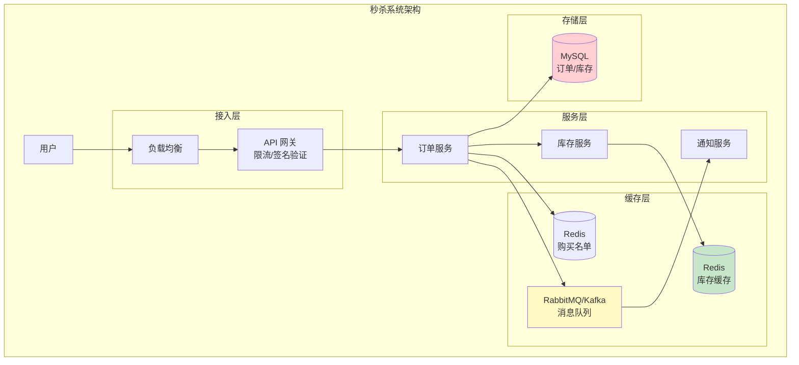

### 核心流程

**1. 秒杀流程**
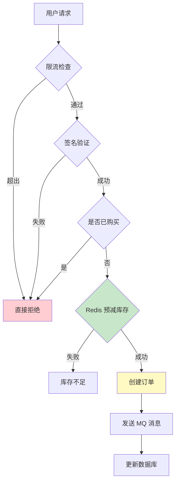

**2. 库存扣减方案对比**

| 方案 | 优点 | 缺点 |
|:-----|:-----|:-----|
| **数据库直接扣减** | 数据一致 | 性能瓶颈，可能超卖 |
| **Redis 缓存 + 异步落库** | 高性能 | 可能丢失，需补偿 |
| **Redis Lua 原子操作** | 原子性，高性能 | Redis 宕机需恢复 |

### 代码示例

```go
// Redis Lua 原子扣减库存
const stockLuaScript = `
    local key = KEYS[1]
    local userKey = KEYS[2]
    local buyNum = tonumber(ARGV[1])

    -- 检查是否已购买
    if redis.call("HEXISTS", userKey, userKey) == 1 then
        return -1
    end

    -- 检查库存
    local stock = tonumber(redis.call("GET", key))
    if stock < buyNum then
        return 0
    end

    -- 扣减库存
    redis.call("DECRBY", key, buyNum)

    -- 标记已购买
    redis.call("HSET", userKey, userKey, "1")

    return 1
`

func Seckill(ctx context.Context, userID, productID string) error {
    // 1. 限流检查
    if !limiter.Allow() {
        return errors.New("请求过于频繁")
    }

    // 2. Redis 原子操作
    stockKey := fmt.Sprintf("stock:%s", productID)
    userKey := fmt.Sprintf("purchased:%s:%s", productID, userID)

    result, err := rdb.Eval(ctx, stockLuaScript, []string{stockKey, userKey}, []string{1}).Result()
    if err != nil {
        return err
    }

    switch result.(int64) {
    case -1:
        return errors.New("已购买，不能重复购买")
    case 0:
        return errors.New("库存不足")
    case 1:
        // 3. 创建订单（异步）
        go createOrder(userID, productID)
        return nil
    }

    return nil
}

// 创建订单
func createOrder(userID, productID string) {
    order := &Order{
        UserID:    userID,
        ProductID: productID,
        Status:    "pending",
        CreatedAt: time.Now(),
    }

    if err := db.Create(order); err != nil {
        // 发送到延迟队列重试
        mq.Publish("retry_order", order)
        return
    }

    // 更新数据库库存
    db.UpdateStock(productID, -1)
}
```

---

## 场景 3：推送系统

### 需求分析

| 需求 | 说明 |
|:-----|:-----|
| **实时性** | 消息及时送达 |
| **高吞吐** | 支持千万级用户 |
| **可靠性** | 消息不丢失 |
| **多端推送** | iOS / Android / Web |

### 架构设计

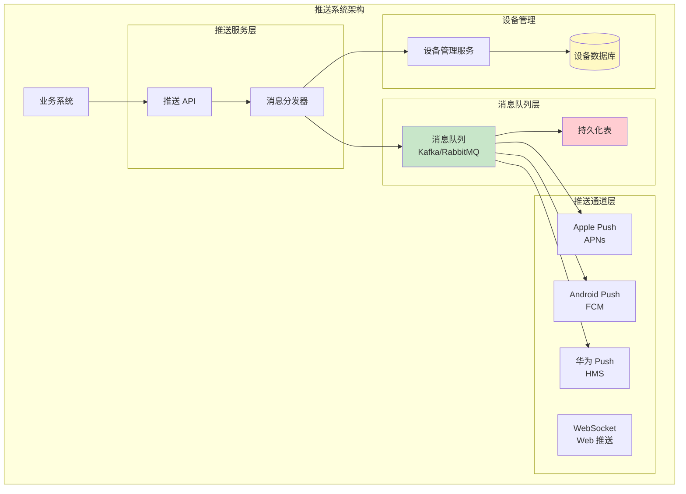

### 核心流程

**推送处理流程**
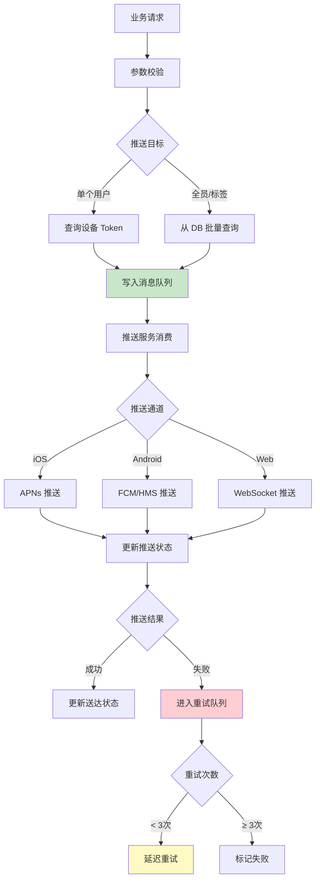

### 推送可靠性设计

| 策略 | 实现方式 |
|:-----|:---------|
| **持久化** | 推送前先落库 |
| **重试机制** | 指数退避重试 |
| **去重** | 设备级别去重窗口 |
| **限速** | 防止推送厂商限流 |
| **多通道** | APNs + FCM + 备用通道 |

---

## 场景 4：IM 即时通讯系统

### 需求分析

| 需求 | 说明 |
|:-----|:-----|
| **低延迟** | 消息秒级送达 |
| **高并发** | 支持群聊、大量在线 |
| **消息可靠** | 不丢消息、有序 |
| **离线消息** | 上线后推送 |

### 架构设计

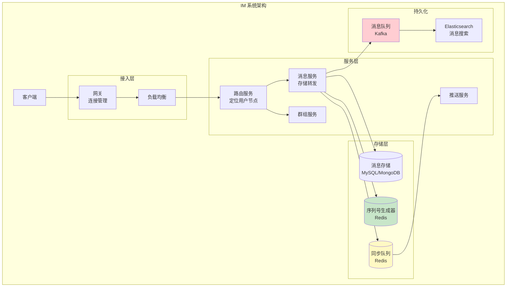

### 消息投递模型

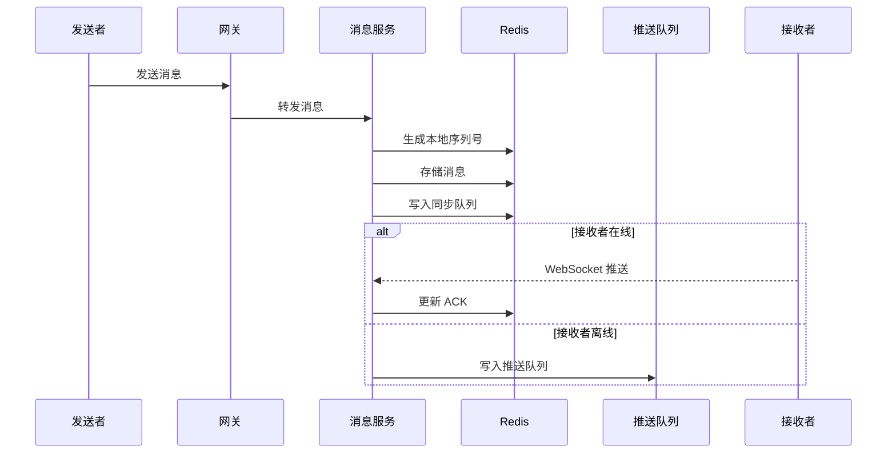

### 关键技术点

| 问题 | 解决方案 |
|:-----|:---------|
| **消息有序** | 单线程写入 + ACK 机制 |
| **消息去重** | 消息 ID + 本地已读表 |
| **离线消息** | 推送服务 + 离线存储 |
| **群聊优化** | 批量推送 + 只推一次 |
| **扩容** | 一致性哈希定位用户节点 |

---

## 场景 5：支付系统

### 需求分析

| 需求 | 优先级 |
|:-----|:-------|
| **资金安全** | 最高 |
| **数据一致性** | 最高 |
| **高可用** | 高 |
| **性能** | 中 |

### 架构设计

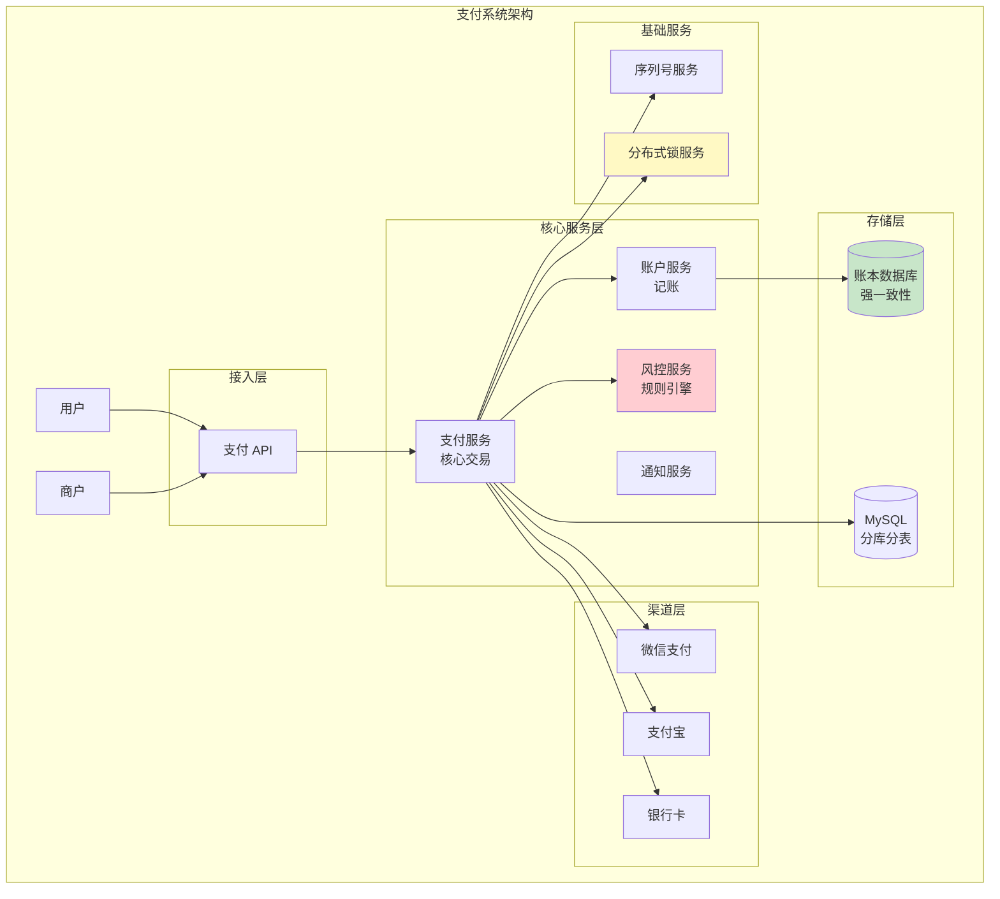

### 核心流程

**支付流程**
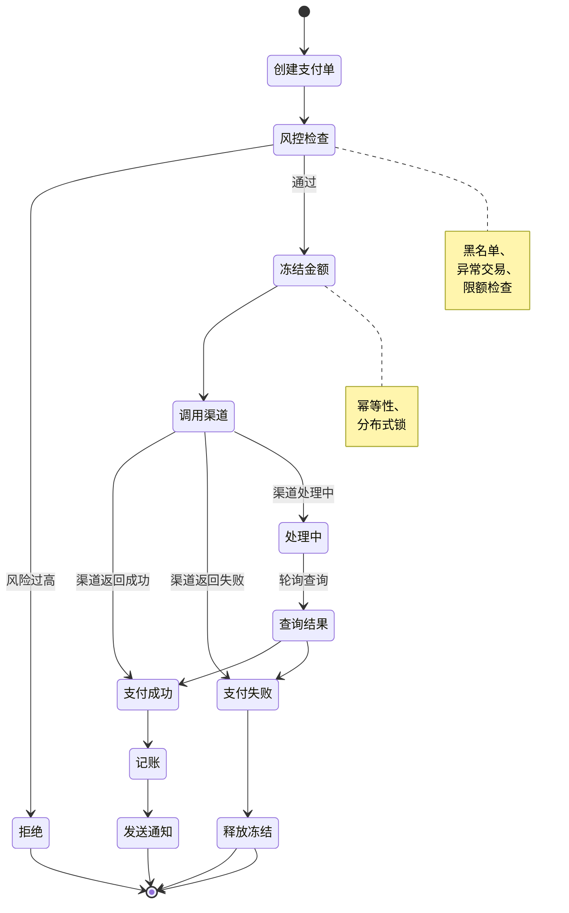

### 资金安全设计

| 措施 | 说明 |
|:-----|:-----|
| **幂等性** | 支付单号唯一，重复调用不重复扣款 |
| **分布式锁** | 冻结金额时加锁，防止并发 |
| **对账系统** | T+1 对账，发现异常交易 |
| **流水记录** | 每笔操作记录详细流水 |
| **熔断降级** | 渠道异常时快速失败 |
| **加密验签** | 所有接口加签验签 |

---

## 系统设计面试题精选

### Q1：如何设计一个分布式唯一 ID 生成器？

**参考答案**：

| 方案 | 优点 | 缺点 |
|:-----|:-----|:-----|
| **UUID** | 简单、无中心化 | 无序、长度长 |
| **数据库自增** | 严格递增 | 单点、性能瓶颈 |
| **Redis INCR** | 高性能 | 单点 |
| **Snowflake** | 有序、高性能 | 时钟回拨问题 |
| **号段模式** | 高性能、本地生成 | 需要协调 |

**Snowflake 算法结构**：
```
0 | 0000000000 0000000000 0000000000 0000000000 0 | 0000000000 | 0000000000 00000000
↑   ↑                    ↑              ↑
符号位   时间戳(41位)      工作机器ID(10位)  序列号(12位)
```

### Q2：如何保证消息不丢失、不重复消费？

**参考答案**：

| 问题 | 解决方案 |
|:-----|:---------|
| **生产者丢失** | ACK 机制 + 重试 |
| **MQ 丢失 | 持久化 + 集群 |
| **消费者丢失 | 手动 ACK + 幂等处理 |
| **重复消费 | 业务幂等 + 去重表 |

### Q3：如何设计一个限流系统？

**参考答案**：

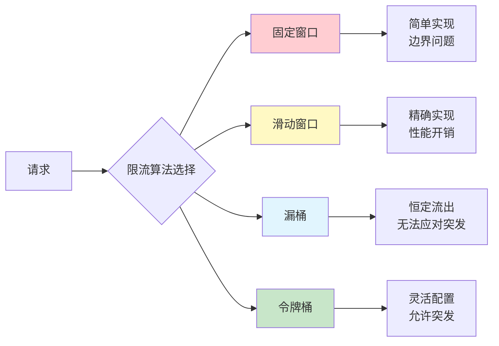

**Redis 实现令牌桶**：
```go
func AllowRequest(ctx context.Context, key string, capacity, rate int) (bool, error) {
    now := time.Now().Unix()

    // Lua 脚本保证原子性
    script := `
        local key = KEYS[1]
        local now = tonumber(ARGV[1])
        local capacity = tonumber(ARGV[2])
        local rate = tonumber(ARGV[3])

        local info = redis.call("HMGET", key, "tokens", "last")
        local tokens = tonumber(info[1]) or capacity
        local last = tonumber(info[2]) or now

        -- 计算需要补充的令牌
        local delta = math.max(0, now - last)
        local filled = math.min(capacity, tokens + delta * rate)

        -- 消耗一个令牌
        if filled < 1 then
            return 0
        end

        redis.call("HMSET", key, "tokens", filled - 1, "last", now)
        redis.call("EXPIRE", key, math.ceil(capacity / rate))
        return 1
    `

    result, err := rdb.Eval(ctx, script, []string{key}, []any{now, capacity, rate}).Result()
    return result.(int64) == 1, err
}
```

---

## 参考资料

- [System Design - Grokking the System Design Interview](https://www.systemdesign.one/)
- [Designing Data-Intensive Applications - Martin Kleppmann](https://dataintensive.net/)
- [短链系统设计 - 掘金](https://juejin.cn/post/68449039037726921252)
- [秒杀系统设计 - 知乎](https://zhuanlan.zhihu.com/p/354649742398488608)
- [IM 系统设计 - 极客时间](https://time.geekbang.org/column/intro/100036801)
